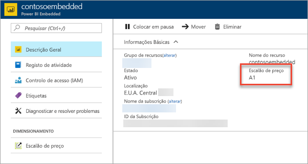

# Dimensionar a sua capacidade do Power BI Embedded no portal do Azure

Este artigo explica como dimensionar uma capacidade do Power BI Embedded no Microsoft Azure. O dimensionamento permite-lhe aumentar ou diminuir o tamanho da sua capacidade.

Isto pressupõe que criou uma capacidade do Power BI Embedded. Se ainda não o fez, veja [Create Power BI Embedded capacity in the Azure portal](azure-pbie-create-capacity.md) (Criar capacidade do Power BI Embedded no portal do Azure) para começar.

> [!NOTE]
> Uma operação de dimensionamento pode demorar cerca de um minuto. Durante este período de tempo, a capacidade não estará disponível. Os conteúdos incorporados poderão não ser carregados.

## Dimensionar uma capacidade

1. Inicie sessão no [portal do Azure](https://portal.azure.com/).

2. Selecione **Todos os serviços** > **Power BI Embedded** para ver as suas capacidades.

    

3. Selecione a capacidade que pretende dimensionar.

    

4. Selecione **Escalão de preço** em **Dimensionar** na sua capacidade.

    

    O seu escalão de preço atual está destacado a azul.

    

5. Para aumentar ou diminuir o dimensionamento, selecione o novo escalão que pretende utilizar. Selecionar um novo escalão coloca um contorno azul à volta da seleção. Clique em **Selecionar** para dimensionar para o novo escalão.

    

    O dimensionamento da sua capacidade poderá demorar um ou dois minutos até estar concluído.

6. Confirme o seu escalão ao verificar o separador da Descrição Geral. Estará apresentado o escalão de preço atual.

    

## Próximos passos

Para colocar em pausa ou iniciar a sua capacidade, veja [Colocar em pausa e iniciar a sua capacidade do Power BI Embedded no portal do Azure](azure-pbie-pause-start.md).

Para começar a incorporar conteúdos do Power BI na sua aplicação, veja [Como incorporar os seus dashboards, relatórios e mosaicos do Power BI](https://powerbi.microsoft.com/documentation/powerbi-developer-embedding-content/).

Mais perguntas? [Experimente perguntar à Comunidade do Power BI](https://community.powerbi.com/)
