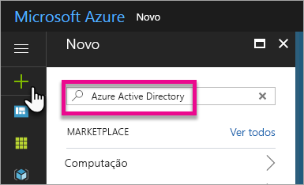
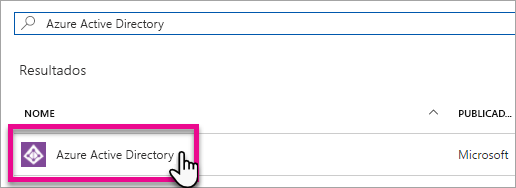
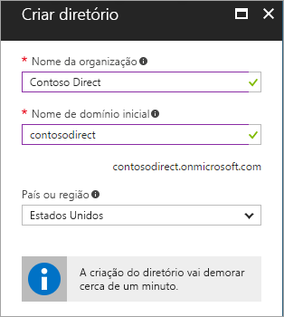
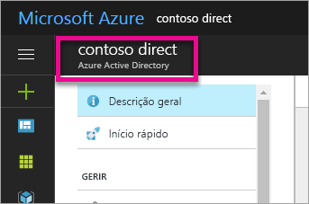
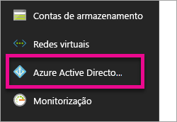
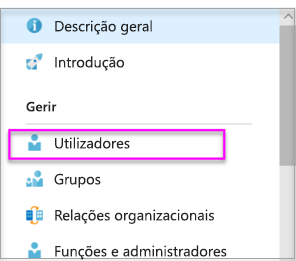
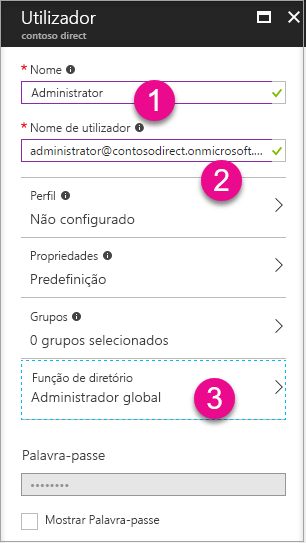
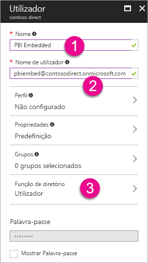
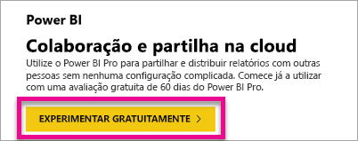

# Criar um inquilino do Azure Active Directory para utilizar com o Power BI

Saiba como criar um novo inquilino do Azure Active Directory (Azure AD) para uma aplicação personalizada que chama as [APIs REST do Power BI](../automation/rest-api-reference.md).

Um inquilino representa uma organização no Azure Active Directory. Trata-se de uma instância dedicada do serviço Azure AD que uma organização recebe e detém quando se inscreve num serviço cloud da Microsoft, como o Azure, o Microsoft Intune ou o Office 365. Cada inquilino do Azure AD é diferente e separado de outros inquilinos do Azure AD.

Quando tiver um inquilino do Azure AD, poderá definir uma aplicação e atribuir-lhe permissões, para que esta possa chamar [APIs REST do Power BI](../automation/rest-api-reference.md).

A sua organização poderá já ter um inquilino do Azure AD que possa utilizar para a sua aplicação. Também pode criar um novo inquilino especificamente para a sua aplicação. Este artigo explica como criar um novo inquilino.

## Criar um inquilino do Azure Active Directory

Para integrar o Power BI na sua aplicação personalizada, precisa de definir uma aplicação no Azure AD, o que exige um diretório do Azure AD. Este diretório é o seu *inquilino*. Se a sua organização ainda não tiver um inquilino por não estar a utilizar o Power BI ou o Office 365, [terá de configurar um ambiente de desenvolvimento](https://docs.microsoft.com/azure/active-directory/develop/active-directory-howto-tenant). Também terá de criar um inquilino se não pretender que a sua aplicação se misture com o inquilino da sua organização, o que lhe permite manter tudo isolado. Pode também criar um inquilino apenas para fins de teste.

Para criar um novo inquilino do Azure AD:

1. Navegue para o [portal do Azure](https://portal.azure.com) e inicie sessão com uma conta que tenha uma subscrição do Azure.

2. Selecione o **ícone de adição (+)** e pesquise **Azure Active Directory**.

    

3. Selecione **Azure Active Directory** nos resultados de pesquisa.

    

4. Selecione **Criar**.

5. Forneça um **Nome da organização** e um **Nome de domínio inicial**. Em seguida, selecione **Criar**. O seu diretório foi criado.

    

   > [!NOTE]
   > O domínio inicial faz parte de onmicrosoft.com. Pode adicionar outros nomes de domínio posteriormente. Um diretório de inquilino pode ter múltiplos domínios atribuídos.

6. Após concluir a criação do diretório, selecione a caixa de informações para gerir o seu novo diretório.

A seguir, irá adicionar utilizadores de inquilinos.

## Criar utilizadores de inquilinos do Azure Active Directory

Agora que tem um diretório, irá criar pelo menos dois utilizadores. Um deles é um Administrador Global de inquilinos, e outro é um utilizador principal para incorporação. O último pode ser considerado uma conta de serviço.

1. No portal do Azure, certifique-se de que está na lista de opções do Azure Active Directory.

    

    Se não estiver, selecione o ícone do Azure Active Directory na barra de navegação de serviços à esquerda.

    

2. Em **Gerir**, selecione **Utilizadores**.

    

3. Selecione **Todos os utilizadores** e, em seguida, selecione **+ Novo utilizador**.

4. Forneça um **Nome** e **Nome de utilizador** para o seu Administrador Global de inquilinos. Altere a **Função de diretório** para **Administrador global**. Pode também mostrar a palavra-passe temporária. Quando concluir, selecione **Criar**.

    

5. Faça o mesmo para um utilizador de inquilinos normal. Pode utilizar esta conta como a sua conta principal de incorporação. Desta vez, deixe a **Função de diretório** como **Utilizador**. Anote a palavra-passe e, em seguida, selecione **Criar**.

    

6. Inscreva-se no Power BI com a conta de utilizador que criou no passo 5. Aceda a [powerbi.com](https://powerbi.microsoft.com/get-started/) e selecione **Experimentar gratuitamente** em **Power BI – Colaboração e partilha na cloud**.

    

    Quando se inscrever, ser-lhe á perguntado se quer experimentar o Power BI Pro gratuitamente durante 60 dias. Pode aceitar e tornar-se um utilizador Pro, o que lhe dá a opção de [começar a desenvolver uma solução incorporada](embed-sample-for-customers.md).

   > [!NOTE]
   > Certifique-se de que se inscreve com o endereço de e-mail da sua conta de utilizador.

## Próximos passos

Agora que já tem um inquilino do Azure AD, pode utilizá-lo para testar itens no Power BI. Também pode incorporar dashboards e relatórios do Power BI na sua aplicação. Para obter mais informações, veja [Como incorporar os seus dashboards, relatórios e mosaicos do Power BI](embed-sample-for-customers.md).

[O que é um diretório do Azure Active Directory?](https://docs.microsoft.com/azure/active-directory/active-directory-whatis) 
 
[Início Rápido: configurar um ambiente de desenvolvimento](https://docs.microsoft.com/azure/active-directory/develop/active-directory-howto-tenant)  

Mais perguntas? [Experimente perguntar à Comunidade do Power BI](https://community.powerbi.com/)
