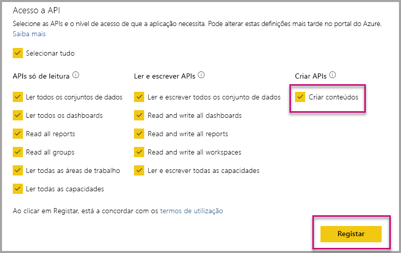

# Instalar automaticamente as aplicações do Power BI ao incorporar para a sua organização

Para incorporar conteúdos de uma aplicação, o utilizador que o vai fazer tem de ter [acesso à mesma](../../collaborate-share/service-create-distribute-apps.md). Se a aplicação já estiver instalada para o utilizador, a incorporação será fácil. Para obter mais informações, veja [Incorporar relatórios ou dashboards a partir de aplicações](embed-from-apps.md). Pode definir que todas as aplicações sejam [instaladas automaticamente](https://powerbi.microsoft.com/blog/automatically-install-apps/) no PowerBI.com. No entanto, esta ação é efetuada ao nível do inquilino e tem efeito em todas as aplicações.

## Instalar aplicações automaticamente na incorporação

Se um utilizador tiver acesso a uma aplicação que não está instalada, a incorporação irá falhar. Para evitar estas falhas ao incorporar a partir de uma aplicação, pode permitir a instalação automática da mesma no momento da incorporação. Com esta ação, se o utilizador tentar incorporar uma aplicação que não está instalada, esta será automaticamente instalada. Assim, os conteúdos pretendidos são imediatamente incorporados, o que resulta numa melhor experiência para o utilizador.

## Incorporação para os utilizadores do Power BI (o utilizador detém os dados)

Para permitir a instalação automática de aplicações para os seus utilizadores, terá de dar a permissão "Criação de Conteúdos" à sua aplicação quando [a registar](register-app.md#register-an-azure-ad-app), ou adicionar a permissão, se já tiver registado a sua aplicação.

A seguir, tem de fornecer o ID da aplicação no URL de incorporação. Para fornecer o ID da aplicação, o criador da aplicação tem de instalar a aplicação e, em seguida, utilizar uma das chamadas de [APIs Rest do Power BI](/rest/api/power-bi/) suportadas – [Obter Relatórios](/rest/api/power-bi/reports/getreports) ou [Obter Dashboards](/rest/api/power-bi/dashboards/getdashboards). Em seguida, o criador da aplicação tem de tirar o URL de incorporação da resposta da API REST. O ID da aplicação irá aparecer no URL se os conteúdos forem de uma aplicação.  Após ter o URL de incorporação, poderá utilizá-lo para incorporar regularmente.

## Incorporação Segura

Para utilizar a instalação automática de aplicações, o criador da aplicação tem de instalar a aplicação e, em seguida, aceder à aplicação no PowerBI.com, navegar para o relatório e obter a ligação da forma habitual. Todos os outros utilizadores com acesso à aplicação que podem utilizar a ligação também podem incorporar o relatório.

## Considerações e limitações

* Só pode incorporar relatórios e dashboards neste cenário.

* Atualmente, esta funcionalidade não é suportada em cenários de incorporação do SharePoint e cenários em que a aplicação detém os dados.