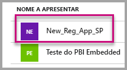
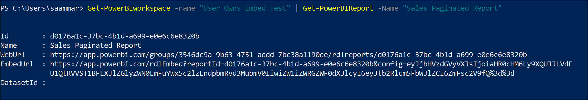
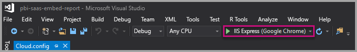
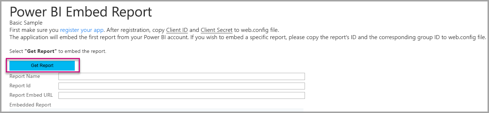

# <a name="tutorial-embed-power-bi-paginated-reports-into-an-application-for-your-organization"></a>Tutorial: Incorporar relatórios paginados do Power BI numa aplicação para a sua organização

No **Power BI**, pode incorporar relatórios paginados numa aplicação para a sua organização com o cenário *os dados pertencem ao utilizador*.

Os relatórios paginados são relatórios concebidos para uma impressão de alta qualidade. Normalmente, estes relatórios contêm muitos dados, compostos de uma forma que os ajusta às páginas impressas.
Para compreender como o Power BI suporta os relatórios paginados, veja [O que são relatórios paginados no Power BI Premium?](../../paginated-reports/paginated-reports-report-builder-power-bi.md)

O esquema **User Owns Data** (Dados Pertencem ao Utilizador) permite que a sua aplicação expanda o serviço Power BI para que possa utilizar a análise incorporada. Este tutorial demonstra como integrar um relatório paginado numa aplicação.

Utilize o SDK de .NET do Power BI com a API JavaScript do Power BI para incorporar o Power BI numa aplicação para a sua organização.


Neste tutorial, irá aprender as seguintes tarefas:
> [!div class="checklist"]
> * Registe uma aplicação no Azure.
> * Incorporar um relatório paginado do Power BI numa aplicação com o inquilino do Power BI.

## <a name="prerequisites"></a>Pré-requisitos
Para começar, precisa de:

* Uma [conta do Power BI Pro](../../admin/service-admin-purchasing-power-bi-pro.md).

* Tem de ter a sua própria configuração de [inquilino do Azure Active Directory](create-an-azure-active-directory-tenant.md).

* Pelo menos uma capacidade P1. Veja [Preciso de que tamanho de capacidade Premium para os relatórios paginados?](../../paginated-reports/paginated-reports-faq.md#what-size-premium-capacity-do-i-need-for-paginated-reports)

Se não estiver inscrito no **Power BI Pro**, [inscreva-se para uma avaliação gratuita](https://powerbi.microsoft.com/pricing/) antes de começar.

## <a name="set-up-your-power-bi-environment"></a>Configurar o ambiente do Power BI

Siga as instruções nesta secção para configurar o Power BI para incorporar os relatórios paginados.

### <a name="register-a-server-side-web-application-app"></a>Registar uma aplicação Web no lado do servidor

Siga as instruções em [Registar uma aplicação do Azure Active Directory para utilizar com o Power BI](register-app.md) para registar uma aplicação Web no lado do servidor.

>[!NOTE]
>Ao registar a aplicação, confirme que faz o seguinte:
>* Obter o segredo da aplicação
>* Aplicar as permissões **Report.ReadAll** (âmbito) na aplicação.

### <a name="create-a-dedicated-capacity"></a>Criar uma capacidade dedicada

Ao criar uma capacidade dedicada, pode tirar partido da vantagem de ter um recurso dedicado ao conteúdo na área de trabalho da sua aplicação. Para relatórios paginados, deve proteger a área de trabalho da aplicação com, no mínimo, uma capacidade P1. Pode criar uma capacidade dedicada com o [Power BI Premium](../../admin/service-premium-what-is.md).

A tabela seguinte lista os SKUs do Power BI Premium que podem ser utilizados para criar uma capacidade dedicada para relatórios paginados no [Microsoft Office 365](../../admin/service-admin-premium-purchase.md):

| Nó de capacidade | Total de vCores<br/>(back-end + front-end) | vCores de back-end | vCores de front-end | Limites do DirectQuery/ligação em direto |
| --- | --- | --- | --- | --- | --- |
| P1 |8 vCores |4 vCores, 25 GB de RAM |4 vCores |30 por segundo |
| P2 |16 vCores |8 vCores, 50 GB de RAM |8 vCores |60 por segundo |
| P3 |32 vCores |16 vCores, 100 GB de RAM |16 vCores |120 por segundo |
| P4 |64 vCores |32 vCores, 200 GB de RAM |32 vCores |240 por segundo |
| P5 |128 vCores |64 vCores, 400 GB de RAM |64 vCores |480 por segundo |
|||||

### <a name="enable-paginated-reports-workload"></a>Ativar a carga de trabalho dos relatórios paginados

Tem de ativar a carga de trabalho dos relatórios paginados na capacidade dedicada.

1. Inicie sessão em [Power BI > Portal de administração > Definições de capacidade](https://app.powerbi.com/admin-portal/capacities).

2. Selecione a capacidade que tem a área de trabalho para onde quer carregar o relatório paginado.

    

3. Expanda as **Cargas de trabalho**.

    

4. Ative a carga de trabalho dos relatórios paginados.

    

### <a name="assign-an-app-workspace-to-a-dedicated-capacity"></a>Atribuir uma área de trabalho da aplicação a uma capacidade dedicada

Após criar a capacidade dedicada, pode atribuir a área de trabalho da sua aplicação a essa capacidade dedicada. Para concluir este processo, siga estes passos:

1. No serviço Power BI, expanda as áreas de trabalho e selecione **Mais** para a área de trabalho que está a utilizar para incorporar o conteúdo. Em seguida, selecione **Definições da área de trabalho**.

    

2. Selecione **Premium**  e ative **Capacidade dedicada**. Selecione a capacidade dedicada que criou. Em seguida, selecione **Guardar**.

    

3. Após selecionar **Guardar**, deverá ver um diamante junto ao nome da área de trabalho da aplicação.

    

### <a name="create-and-publish-your-power-bi-paginated-reports"></a>Criar e publicar os relatórios paginados do Power BI

Pode criar os relatórios paginados com o [Power BI Report Builder](../../paginated-reports/paginated-reports-report-builder-power-bi.md#create-reports-in-power-bi-report-builder). Em seguida, pode [carregar o relatório](../../paginated-reports/paginated-reports-quickstart-aw.md#upload-the-report-to-the-service) para uma área de trabalho da aplicação atribuída a, pelo menos, uma capacidade P1 e ligar a [carga de trabalho dos relatórios paginados](#enable-paginated-reports-workload). O utilizador final que carrega o relatório tem de ter uma licença do Power BI Pro para poder publicar numa área de trabalho da aplicação.
   
## <a name="embed-your-content-by-using-the-sample-application"></a>Incorporar os seus conteúdos com a aplicação de exemplo

Este exemplo foi simplificado de forma deliberada para fins de demonstração.

Siga os passos abaixo para começar a incorporar os seus conteúdos através da aplicação de exemplo.

1. Transfira o [Visual Studio](https://www.visualstudio.com/) (versão 2013 ou posterior). Certifique-se de que transfere o [pacote NuGet](https://www.nuget.org/profiles/powerbi) mais recente.

2. Transfira [PowerBI-Programador-Amostras](https://github.com/Microsoft/PowerBI-Developer-Samples) e abra .NET Framework > Incorporar para a sua organização > integrar-aplicação-Web > **PBIWebApp**.

    

3. Abra o ficheiro **Cloud.config** na aplicação de exemplo e preencha os seguintes campos para executar a aplicação:
    * [ID da Aplicação](#application-id)
    * [ID da Área de Trabalho](#workspace-id)
    * [ID do Relatório](#report-id)
    * [AADAuthorityUrl](#aadauthorityurl)

    

### <a name="application-id"></a>ID da Aplicação

Preencha as informações de **applicationId** com o **ID da Aplicação** do **Azure**. O **applicationId** serve para a aplicação se identificar junto dos utilizadores aos quais está a pedir permissões.

Para obter o **applicationId**, siga estes passos:

1. Inicie sessão no [portal do Azure](https://portal.azure.com).

2. No painel de navegação à esquerda, selecione **Todos os serviços** e **Registos de aplicações**.

3. Selecione a aplicação que precisa do **applicationId**.

    

4. Existe um **ID da Aplicação** listado como um GUID. Utilize este **ID da Aplicação** como o **applicationId** da aplicação.

    

### <a name="workspace-id"></a>ID da área de trabalho

Preencha as informações do **workspaceId** com o GUID da área de trabalho de aplicação (grupo) do Power BI. Pode obter estas informações no URL (quando tiver sessão iniciada no serviço Power BI) ou com o PowerShell.

URL <br>


PowerShell <br>

```powershell
Get-PowerBIworkspace -name "User Owns Embed Test"
```

   

### <a name="report-id"></a>ID do Relatório

Preencha as informações do **reportId** com o GUID de relatório do Power BI. Pode obter estas informações no URL (quando tiver sessão iniciada no serviço Power BI) ou com o PowerShell.


PowerShell <br>

```powershell
Get-PowerBIworkspace -name "User Owns Embed Test" | Get-PowerBIReport -Name "Sales Paginated Report"
```



### <a name="aadauthorityurl"></a>AADAuthorityUrl

Preencha as informações **AADAuthorityUrl** com o URL que lhe permite incorporar dentro do seu inquilino organizacional ou incorporar com um utilizador convidado.

Para incorporar com o seu inquilino organizacional, utilize o URL: *https://login.microsoftonline.com/common/oauth2/authorize* .

Para incorporar com um utilizador convidado, utilize o URL: *`https://login.microsoftonline.com/report-owner-tenant-id`* . Substitua *report-owner-tenant-id* pelo ID do inquilino do proprietário do relatório.

### <a name="run-the-application"></a>Executar a aplicação

1. Selecione **Executar** no **Visual Studio**.

    

2. Em seguida, selecione **Incorporar Relatório**. Consoante os conteúdos que selecionar para efetuar os testes (relatórios, dashboards ou mosaicos), selecione essa opção na aplicação.

    

3. Agora pode visualizar o relatório na aplicação de exemplo.

    

## <a name="next-steps"></a>Próximos passos

Neste tutorial, aprendeu a incorporar relatórios paginados do Power BI numa aplicação com a sua conta de organização do Power BI. 

> [!div class="nextstepaction"]
> [Incorporar a partir de aplicações](embed-from-apps.md)

> [!div class="nextstepaction"]
>[Incorporar conteúdo do Power BI para os seus clientes](embed-sample-for-customers.md)

> [!div class="nextstepaction"]
>[Incorporar relatórios paginados do Power BI para os seus clientes](embed-paginated-reports-customers.md)

Se tiver mais perguntas, [experimente perguntar à Comunidade do Power BI](http://community.powerbi.com/).