# <a name="tutorial-embed-power-bi-content-into-an-application-for-your-organization"></a>Tutorial: Incorporar conteúdos do Power BI numa aplicação para a sua organização

No **Power BI**, pode incorporar relatórios (do Power BI ou Paginados), dashboards ou mosaicos numa aplicação através do esquema Dados Pertencem ao Utilizador. O esquema **User Owns Data** (Dados Pertencem ao Utilizador) permite que a sua aplicação expanda o serviço Power BI para que possa utilizar a análise incorporada. Este tutorial demonstra como integrar um relatório (do Power BI ou Paginado) numa aplicação. Utilize o SDK de .NET do Power BI com a API JavaScript do Power BI para incorporar o Power BI numa aplicação para a sua organização.

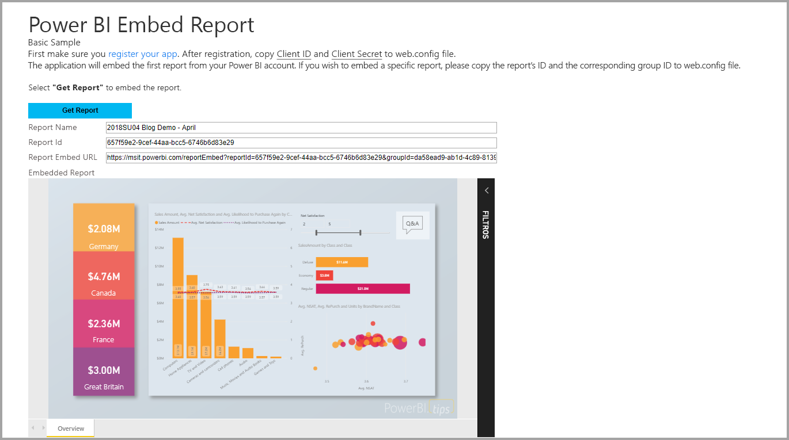

Neste tutorial, irá aprender as seguintes tarefas:
> [!div class="checklist"]
> * Registe uma aplicação no Azure.
> * Incorporar um relatório do Power BI ou um relatório Paginado numa aplicação com o seu inquilino do Power BI.

## <a name="prerequisites"></a>Pré-requisitos

Para começar, precisa de:

* Uma [conta do Power BI Pro](../../fundamentals/service-self-service-signup-for-power-bi.md).
* Uma [subscrição do Microsoft Azure](https://azure.microsoft.com/).
* Tem de ter a sua própria configuração de [inquilino do Azure Active Directory](create-an-azure-active-directory-tenant.md).
* Para incorporar relatórios paginados, tem de dispor de uma capacidade mínima de P1. Veja [Preciso de que tamanho de capacidade Premium para os relatórios paginados?](../../paginated-reports/paginated-reports-faq.md#what-size-premium-capacity-do-i-need-for-paginated-reports)

Se não estiver inscrito no **Power BI Pro**, [inscreva-se para uma avaliação gratuita](https://powerbi.microsoft.com/pricing/) antes de começar.

Se não tiver uma subscrição do Azure, crie uma [conta gratuita](https://azure.microsoft.com/free/?WT.mc_id=A261C142F) antes de começar.

## <a name="set-up-your-embedded-analytics-development-environment"></a>Configurar o ambiente de desenvolvimento de análise incorporada

Antes de começar a incorporar relatórios, dashboards ou mosaicos na sua aplicação, tem de certificar-se de que o seu ambiente permite a incorporação com o Power BI.

Pode utilizar a [Ferramenta de configuração de incorporação](https://aka.ms/embedsetup/UserOwnsData) para começar e transferir rapidamente uma aplicação de exemplo que o ajuda a orientar-se durante a criação de um ambiente e a incorporação de um relatório. No caso de incorporar um relatório paginado, tem de atribuir, no mínimo, uma capacidade P1 para a área de trabalho criada.

Se optar por configurar o ambiente manualmente, pode continuar abaixo.

### <a name="register-an-application-in-azure-active-directory"></a>Registar uma aplicação no Azure Active Directory

[Registe a sua aplicação](register-app.md) com o Azure Active Directory para permitir que a aplicação aceda às [APIs REST do Power BI](https://docs.microsoft.com/rest/api/power-bi/). O registo da aplicação permite-lhe estabelecer uma identidade para a sua aplicação e especificar permissões para recursos REST do Power BI.

Tem de continuar com o registo de uma **aplicação Web do lado do servidor**. Registe uma aplicação Web do lado do servidor para criar um segredo da aplicação.

Depois de criar a sua aplicação no Azure, abra a mesma no Azure, navegue para *Autenticação* e em *URIs de Redirecionamento* adicione **/Redirect** ao *URI de Redirecionamento*.

## <a name="set-up-your-power-bi-environment"></a>Configurar o ambiente do Power BI

### <a name="create-a-workspace"></a>Criar uma área de trabalho

Se estiver a incorporar relatórios, dashboards ou mosaicos para os seus clientes, coloque os conteúdos numa área de trabalho. Existem diferentes tipos de áreas de trabalho que pode configurar: [áreas de trabalho tradicionais](../../collaborate-share/service-create-workspaces.md) ou as [novas áreas de trabalho](../../collaborate-share/service-create-the-new-workspaces.md).

### <a name="create-and-publish-your-power-bi-reports"></a>Criar e publicar relatórios do Power BI

Pode criar os seus relatórios e conjuntos de dados com o Power BI Desktop. Em seguida, pode publicar esses relatórios numa área de trabalho. O utilizador final que publica os relatórios tem de ter uma licença do Power BI Pro para poder publicar numa área de trabalho.

1. Transfira o exemplo de [Demonstração](https://github.com/Microsoft/powerbi-desktop-samples) a partir do GitHub.

    

2. Abra o relatório .pbix de exemplo no Power BI Desktop.

   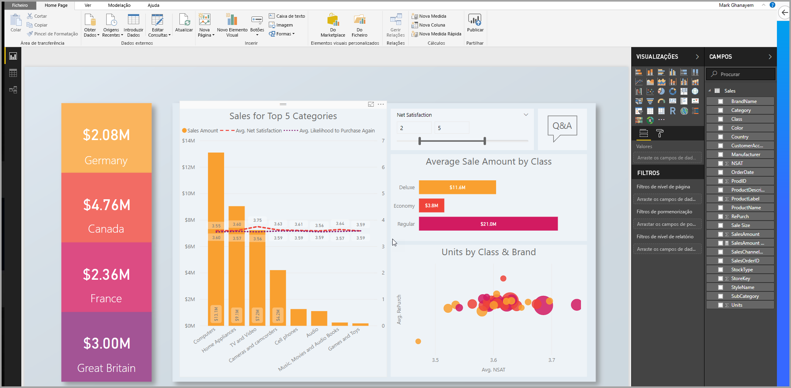

3. Publique na área de trabalho.

   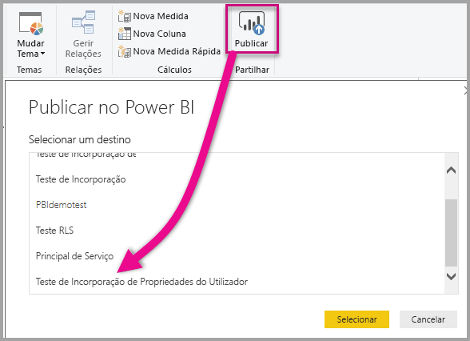

    Agora pode ver o relatório no serviço Power BI online.

   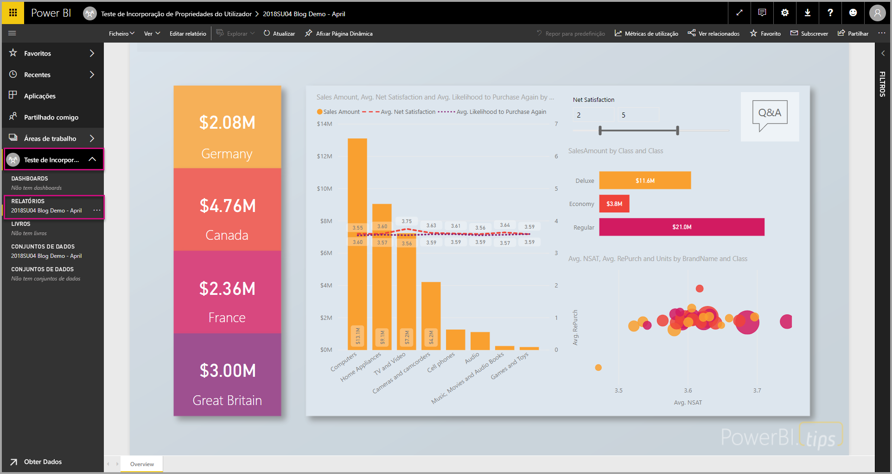
   
### <a name="create-and-publish-your-paginated-reports"></a>Criar e publicar relatórios paginados

Pode criar os seus relatórios paginados com o [Power BI Report Builder](../../paginated-reports/paginated-reports-report-builder-power-bi.md#create-reports-in-power-bi-report-builder). Depois, poderá [carregar o relatório](../../paginated-reports/paginated-reports-quickstart-aw.md#upload-the-report-to-the-service) para uma área de trabalho atribuída a, no mínimo, uma capacidade P1. O utilizador final que carrega o relatório tem de ter uma licença do Power BI Pro para poder publicar numa área de trabalho.
   
## <a name="embed-your-content-by-using-the-sample-application"></a>Incorporar os seus conteúdos com a aplicação de exemplo

Este exemplo foi simplificado de forma deliberada para fins de demonstração.

Siga os passos abaixo para começar a incorporar os seus conteúdos através da aplicação de exemplo.

1. Transfira o [Visual Studio](https://www.visualstudio.com/) (versão 2013 ou posterior). Certifique-se de que transfere o [pacote NuGet](https://www.nuget.org/profiles/powerbi) mais recente.

2. Transfira o [User Owns Data sample](https://github.com/Microsoft/PowerBI-Developer-Samples) (exemplo da estrutura Os Dados Pertencem ao Utilizador) a partir do GitHub para começar.

    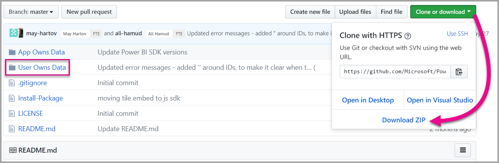

3. Abra o ficheiro **Cloud.config** na aplicação de exemplo.

    Existem campos que tem de preencher para executar a aplicação.

    | Campo |
    |--------------------|
    | **[ID da Aplicação](#application-id)** |
    | **[ID da Área de Trabalho](#workspace-id)** |
    | **[ID do Relatório](#report-id)** |
    | **[AADAuthorityUrl](#aadauthorityurl)** |

    

### <a name="application-id"></a>ID da Aplicação

Preencha as informações de **applicationId** com o **ID da Aplicação** do **Azure**. O **applicationId** serve para a aplicação se identificar junto dos utilizadores aos quais está a pedir permissões.

Para obter o **applicationId**, siga estes passos:

1. Inicie sessão no [portal do Azure](https://portal.azure.com).

2. No painel de navegação esquerdo, selecione **Todos os Serviços** e **Registos de Aplicações**.

3. Selecione a aplicação que precisa do **applicationId**.

    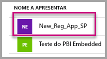

4. Existe um **ID da Aplicação** listado como um GUID. Utilize este **ID da Aplicação** como o **applicationId** da aplicação.

    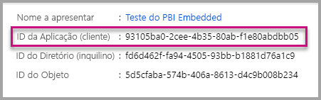

### <a name="workspace-id"></a>ID da área de trabalho

Preencha as informações do **workspaceId** com o GUID da área de trabalho (grupo) do Power BI. Pode obter estas informações no URL (quando tiver sessão iniciada no serviço Power BI) ou com o PowerShell.

URL <br>


PowerShell <br>

```powershell
Get-PowerBIworkspace -name "User Owns Embed Test"
```

   

### <a name="report-id"></a>ID do Relatório

Preencha as informações do **reportId** com o GUID de relatório do Power BI. Pode obter estas informações no URL (quando tiver sessão iniciada no serviço Power BI) ou com o PowerShell.

URL do Relatório do Power BI <br>


URL do Relatório Paginado<br>


PowerShell <br>

```powershell
Get-PowerBIworkspace -name "User Owns Embed Test" | Get-PowerBIReport
```


### <a name="aadauthorityurl"></a>AADAuthorityUrl

Preencha as informações **AADAuthorityUrl** com o URL que lhe permite incorporar dentro do seu inquilino organizacional ou incorporar com um utilizador convidado.

Para incorporar com o seu inquilino organizacional, utilize o URL: *https://login.microsoftonline.com/common/oauth2/authorize* .

Para incorporar com um convidado, utilize o URL: `https://login.microsoftonline.com/report-owner-tenant-id`. Substitua *report-owner-tenant-id* pelo ID do inquilino do proprietário do relatório.

### <a name="run-the-application"></a>Executar a aplicação

1. Selecione **Executar** no **Visual Studio**.

    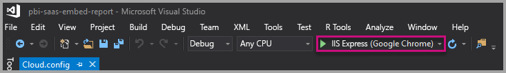

2. Em seguida, selecione **Incorporar Relatório**. Consoante os conteúdos que selecionar para efetuar os testes (relatórios, dashboards ou mosaicos), selecione essa opção na aplicação.

    

3. Agora pode visualizar o relatório na aplicação de exemplo.

    

## <a name="embed-your-content-within-your-application"></a>Incorporar os seus conteúdos na aplicação

Embora os passos para incorporar os seus conteúdos possam ser efetuados com as [APIs REST do Power BI](https://docs.microsoft.com/rest/api/power-bi/), os códigos de exemplo descritos neste artigo são efetuados com o .NET SDK.

Para integrar um relatório numa aplicação Web, utilize a API REST do Power BI ou o SDK C# do Power BI. Também utilize um token de acesso de autorização do Azure Active Directory para obter um relatório. Em seguida, carregue o relatório com o mesmo token de acesso. A API REST do Power BI proporciona acesso programático a recursos específicos do Power BI. Para obter mais informações, veja [APIs REST do Power BI](https://docs.microsoft.com/rest/api/power-bi/) e [API JavaScript do Power BI](https://github.com/Microsoft/PowerBI-JavaScript).

### <a name="get-an-access-token-from-azure-ad"></a>Obter um token de acesso do Azure AD

Na sua aplicação, terá de obter um token de acesso do Azure AD antes de poder fazer chamadas para a API REST do Power BI. Para obter mais informações, veja [Authenticate users and get an Azure AD access token for your Power BI app (Autenticar utilizadores e obter um token de acesso do Azure AD para a sua aplicação do Power BI)](get-azuread-access-token.md).

### <a name="get-a-report"></a>Obter um relatório

Para obter um relatório do Power BI ou um relatório paginado, utilize a operação [Obter Relatórios](https://docs.microsoft.com/rest/api/power-bi/reports/getreports), que obtém uma lista de relatórios do Power BI e relatórios paginados. Da lista de relatórios, pode obter um ID de relatório.

### <a name="get-reports-by-using-an-access-token"></a>Obter relatórios com um token de acesso

A operação [Obter Relatórios](https://docs.microsoft.com/rest/api/power-bi/reports/getreports) devolve uma lista de relatórios. Pode obter um único relatório a partir da lista de relatórios.

Para efetuar a chamada à API REST, tem de incluir um cabeçalho de *Autorização* no formato de *Portador {token de acesso}* .

#### <a name="get-reports-with-the-rest-api"></a>Obter relatórios com a API REST

O seguinte exemplo de código mostra-lhe como obter relatórios com a API REST:

> [!Note]
> Está disponível um exemplo de como obter um item de conteúdo que pretende incorporar no ficheiro Default.aspx.cs na [aplicação de exemplo](https://github.com/Microsoft/PowerBI-Developer-Samples). Os exemplos são um relatório, um dashboard ou um mosaico.

```csharp
using Newtonsoft.Json;

//Get a Report. In this sample, you get the first Report.
protected void GetReport(int index)
{
    //Configure Reports request
    System.Net.WebRequest request = System.Net.WebRequest.Create(
        String.Format("{0}/Reports",
        baseUri)) as System.Net.HttpWebRequest;

    request.Method = "GET";
    request.ContentLength = 0;
    request.Headers.Add("Authorization", String.Format("Bearer {0}", accessToken.Value));

    //Get Reports response from request.GetResponse()
    using (var response = request.GetResponse() as System.Net.HttpWebResponse)
    {
        //Get reader from response stream
        using (var reader = new System.IO.StreamReader(response.GetResponseStream()))
        {
            //Deserialize JSON string
            PBIReports Reports = JsonConvert.DeserializeObject<PBIReports>(reader.ReadToEnd());

            //Sample assumes at least one Report.
            //You could write an app that lists all Reports
            if (Reports.value.Length > 0)
            {
                var report = Reports.value[index];

                txtEmbedUrl.Text = report.embedUrl;
                txtReportId.Text = report.id;
                txtReportName.Text = report.name;
            }
        }
    }
}

//Power BI Reports used to deserialize the Get Reports response.
public class PBIReports
{
    public PBIReport[] value { get; set; }
}
public class PBIReport
{
    public string id { get; set; }
    public string reportType { get; set }
    public string name { get; set; }
    public string webUrl { get; set; }
    public string embedUrl { get; set; }
}
```

#### <a name="get-reports-by-using-the-net-sdk"></a>Obter relatórios com o SDK .NET

Pode utilizar o SDK .NET para obter uma lista de relatórios em vez de chamar a API REST diretamente. O seguinte exemplo de código mostra-lhe como listar relatórios:

```csharp
using Microsoft.IdentityModel.Clients.ActiveDirectory;
using Microsoft.PowerBI.Api.V2;
using Microsoft.PowerBI.Api.V2.Models;

var tokenCredentials = new TokenCredentials(<ACCESS TOKEN>, "Bearer");

// Create a Power BI Client object. It is used to call Power BI APIs.
using (var client = new PowerBIClient(new Uri(ApiUrl), tokenCredentials))
{
    // Get the first report all reports in that workspace
    ODataResponseListReport reports = client.Reports.GetReports();

    Report report = reports.Value.FirstOrDefault();

    var embedUrl = report.EmbedUrl;
}
```

### <a name="load-a-report-by-using-javascript"></a>Carregar um relatório com JavaScript

Pode utilizar JavaScript para carregar um relatório para um elemento div na sua página Web. O seguinte exemplo de código mostra-lhe como obter um relatório a partir de uma determinada área de trabalho:

> [!NOTE]  
> Está disponível um exemplo de como obter um item de conteúdo que pretende incorporar no ficheiro **Default.aspx** na [aplicação de exemplo](https://github.com/Microsoft/PowerBI-Developer-Samples).

```javascript
<!-- Embed Report-->
<div> 
    <asp:Panel ID="PanelEmbed" runat="server" Visible="true">
        <div>
            <div><b class="step">Step 3</b>: Embed a report</div>

            <div>Enter an embed url for a report from Step 2 (starts with https://):</div>
            <input type="text" id="tb_EmbedURL" style="width: 1024px;" />
            <br />
            <input type="button" id="bEmbedReportAction" value="Embed Report" />
        </div>

        <div id="reportContainer"></div>
    </asp:Panel>
</div>
```

#### <a name="sitemaster"></a>Site.master

```javascript
window.onload = function () {
    // client side click to embed a selected report.
    var el = document.getElementById("bEmbedReportAction");
    if (el.addEventListener) {
        el.addEventListener("click", updateEmbedReport, false);
    } else {
        el.attachEvent('onclick', updateEmbedReport);
    }

    // handle server side post backs, optimize for reload scenarios
    // show embedded report if all fields were filled in.
    var accessTokenElement = document.getElementById('MainContent_accessTokenTextbox');
    if (accessTokenElement !== null) {
        var accessToken = accessTokenElement.value;
        if (accessToken !== "")
            updateEmbedReport();
    }
};

// update embed report
function updateEmbedReport() {

    // check if the embed url was selected
    var embedUrl = document.getElementById('tb_EmbedURL').value;
    if (embedUrl === "")
        return;

    // get the access token.
    accessToken = document.getElementById('MainContent_accessTokenTextbox').value;

    // Embed configuration used to describe the what and how to embed.
    // This object is used when calling powerbi.embed.
    // You can find more information at https://github.com/Microsoft/PowerBI-JavaScript/wiki/Embed-Configuration-Details.
    var config = {
        type: 'report',
        accessToken: accessToken,
        embedUrl: embedUrl
    };

    // Grab the reference to the div HTML element that will host the report.
    var reportContainer = document.getElementById('reportContainer');

    // Embed the report and display it within the div container.
    var report = powerbi.embed(reportContainer, config);

    // report.on will add an event handler which prints to Log window.
    report.on("error", function (event) {
        var logView = document.getElementById('logView');
        logView.innerHTML = logView.innerHTML + "Error<br/>";
        logView.innerHTML = logView.innerHTML + JSON.stringify(event.detail, null, "  ") + "<br/>";
        logView.innerHTML = logView.innerHTML + "---------<br/>";
    }
  );
}
```

## <a name="using-a-power-bi-premium-dedicated-capacity"></a>Utilizar uma capacidade dedicada do Power BI Premium

Agora que concluiu o desenvolvimento da sua aplicação, está na altura de atribuir uma capacidade dedicada à sua área de trabalho.

### <a name="create-a-dedicated-capacity"></a>Criar uma capacidade dedicada

Ao criar uma capacidade dedicada, pode tirar partido da vantagem de ter um recurso dedicado ao conteúdo na área de trabalho. Para relatórios paginados, a sua área de trabalho tem de ter, no mínimo, uma capacidade P1. Pode criar uma capacidade dedicada com o [Power BI Premium](../../admin/service-premium-what-is.md).

A tabela seguinte lista as SKUs do Power BI Premium disponíveis no [Microsoft Office 365](../../admin/service-admin-premium-purchase.md):

| Nó de capacidade | Total de vCores<br/>(back-end + front-end) | vCores de back-end | vCores de front-end | Limites do DirectQuery/ligação em direto |
| --- | --- | --- | --- | --- | --- |
| EM1 |1 vCore |0,5 vCore, 10 GB de RAM |0,5 vCore |3,75 por segundo |
| EM2 |2 vCores |1 vCore, 10 GB de RAM |1 vCores |7,5 por segundo |
| EM3 |4 vCores |2 vCores, 10 GB de RAM |2 vCores |15 por segundo |
| P1 |8 vCores |4 vCores, 25 GB de RAM |4 vCores |30 por segundo |
| P2 |16 vCores |8 vCores, 50 GB de RAM |8 vCores |60 por segundo |
| P3 |32 vCores |16 vCores, 100 GB de RAM |16 vCores |120 por segundo |
| P4 |64 vCores |32 vCores, 200 GB de RAM |32 vCores |240 por segundo |
| P5 |128 vCores |64 vCores, 400 GB de RAM |64 vCores |480 por segundo |

> [!NOTE]
> - Quando estiver a tentar incorporar com aplicações do Microsoft Office, pode utilizar SKUs EM para aceder ao conteúdo com uma licença gratuita do Power BI. Mas não pode aceder a conteúdo com uma licença gratuita do Power BI quando estiver a utilizar o Powerbi.com ou o Power BI Mobile.
> - Ao tentar incorporar com aplicações do Microsoft Office, ao utilizar o Powerbi.com ou o Power BI Mobile, pode aceder aos conteúdos com uma licença gratuita do Power BI.

### <a name="assign-a-workspace-to-a-dedicated-capacity"></a>Atribuir uma área de trabalho a uma capacidade dedicada

Depois de criar uma capacidade dedicada, pode atribuir a área de trabalho a essa capacidade dedicada. Para concluir este processo, siga estes passos:

1. No serviço Power BI, expanda as áreas de trabalho e selecione as reticências da área de trabalho que está a utilizar para incorporar os seus conteúdos. Em seguida, selecione **Editar área de trabalho**.

    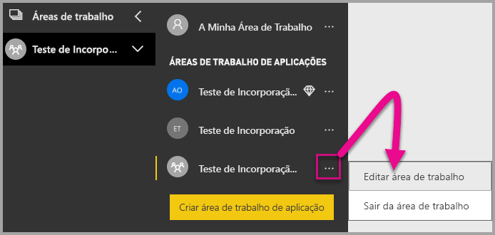

2. Expanda **Avançado** e ative **Capacidade dedicada**. Selecione a capacidade dedicada que criou. Em seguida, selecione **Guardar**.

    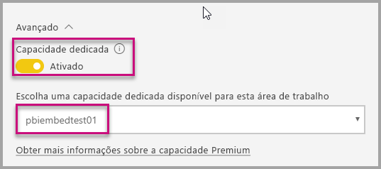

3. Depois de selecionar **Guardar**, deverá ver um losango junto ao nome da área de trabalho.

    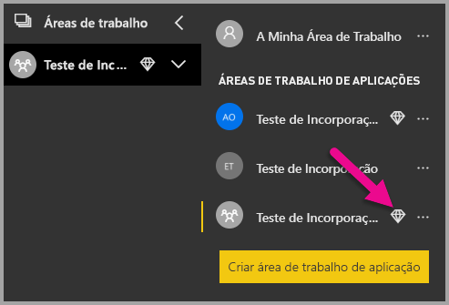

## <a name="admin-settings"></a>Definições de administração

Os administradores globais ou os administradores de serviço Power BI podem permitir a capacidade de utilizar as APIs REST, ou ativar ou desativar um inquilino. Os administradores do Power BI podem configurar esta definição para toda a organização ou para grupos de segurança individuais. Está ativada para toda a organização por predefinição. Pode efetuar estas alterações no [portal de administração do Power BI](../../admin/service-admin-portal.md).

## <a name="next-steps"></a>Próximos passos

Neste tutorial, aprendeu a incorporar conteúdos do Power BI numa aplicação com a sua conta de organização do Power BI. Agora pode tentar incorporar conteúdos do Power BI numa aplicação ao utilizar outras aplicações. Também pode tentar incorporar conteúdos do Power BI para os seus clientes (ainda não é suportada a incorporação de relatórios paginados):

> [!div class="nextstepaction"]
> [Incorporar a partir de aplicações](embed-from-apps.md)

> [!div class="nextstepaction"]
>[Incorporar para os seus clientes](embed-sample-for-customers.md)

Se tiver mais perguntas, [experimente perguntar à Comunidade do Power BI](https://community.powerbi.com/).
