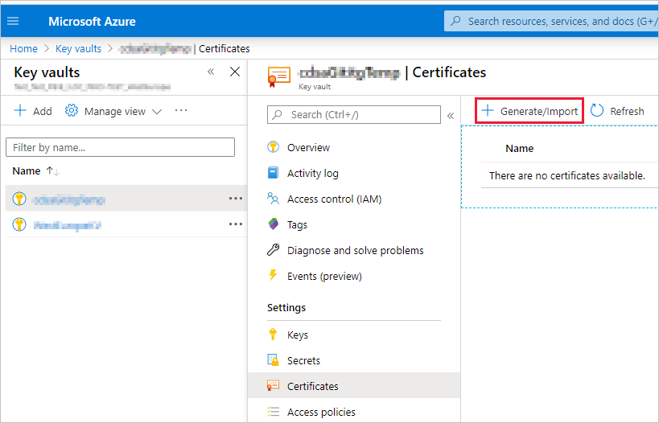

# <a name="embed-power-bi-content-with-service-principal-and-a-certificate"></a>Incorporar conteúdos do Power BI com o principal de serviço e um certificado

A autenticação baseada em certificados permite-lhe ser autenticado pelo Azure Active Directory (Azure AD) com um certificado de cliente num dispositivo Windows, Android ou iOS ou guardado num [Azure Key Vault](/azure/key-vault/basic-concepts).

Utilizar este método de autenticação permite-lhe gerir certificados a partir de um local central, ao utilizar a AC para obter rotação ou revogação.

Pode saber mais sobre certificados no Azure AD na página do GitHub [Client credential flows](https://github.com/AzureAD/microsoft-authentication-library-for-dotnet/wiki/Client-credential-flows) (Fluxos de credencial de cliente).

## <a name="method"></a>Método

1. [Incorporar o conteúdo com o principal de serviço](embed-service-principal.md).

2. [Criar um certificado](embed-service-principal-certificate.md#step-2---create-a-certificate).

3. [Configurar a autenticação de certificados](embed-service-principal-certificate.md#step-3---set-up-certificate-authentication).

4. [Obter o certificado do Azure Key Vault](embed-service-principal-certificate.md#step-4---get-the-certificate-from-azure-key-vault).

5. [Autenticar-se com o principal do serviço e um certificado](embed-service-principal-certificate.md#step-5---authenticate-using-service-principal-and-a-certificate).

## <a name="step-1---embed-your-content-with-service-principal"></a>Passo 1 – Incorporar o conteúdo com o principal de serviço

Para incorporar o conteúdo com o principal de serviço, siga as instruções em [Incorporar os conteúdos do Power BI com o principal de serviço e um segredo da aplicação](embed-service-principal.md).

>[!NOTE]
>Se já tiver conteúdos incorporados com um principal de serviço, ignore este passo e avance para o [passo 2](embed-service-principal-certificate.md#step-2---create-a-certificate).

## <a name="step-2---create-a-certificate"></a>Passo 2 – Criar um certificado

Pode obter um certificado de uma *Autoridade de Certificação* fidedigna ou gerar o seu próprio certificado.

Esta secção descreve a criação de um certificado com o [Azure Key Vault](/azure/key-vault/create-certificate) e a transferência do ficheiro *.cer* que contém a chave pública.

1. Inicie sessão no [Microsoft Azure](https://ms.portal.azure.com/#allservices).

2. Procure **Cofres de Chaves** e clique na ligação **Cofres de Chaves**.

    

3. Clique no cofre de chaves ao qual pretende adicionar um certificado.

    

4. Clique em **Certificados**.

    

5. Clique em **Gerar/Importar**.

    

6. Configure os campos **Criar um certificado** da seguinte forma:

    * **Método de Criação do Certificado**: geral

    * **Nome do Certificado**: introduza um nome para o certificado

    * **Tipo de Autoridade de Certificado (AC)** : certificado autoassinado

    * **Assunto**: um nome único [X.500](https://wikipedia.org/wiki/X.500)

    * **Nomes DNS**: 0 nomes DNS

    * **Período de Validade (em meses)** : introduza a duração da validade do certificado

    * **Tipo de Conteúdo**: PKCS #12

    * **Tipo de Ação de Duração**: renovar automaticamente numa determinada duração de percentagem

    * **Duração de Percentagem**: 80

    * **Configuração Avançada de Política**: não configurada

7. Clique em **Criar**. O certificado acabado de criar está desativado por predefinição. Pode levar até cinco minutos para ser ativado.

8. Selecione o certificado que criou.

9. Clique em **Transferir no formato CER**. O ficheiro transferido contém a chave pública.

    

## <a name="step-3---set-up-certificate-authentication"></a>Passo 3 – Configurar a autenticação de certificados

1. Na sua aplicação do Azure AD, clique no separador **Certificados e segredos**.

     

2. Clique em **Carregar certificado** e carregue o ficheiro *.cer* que criou e transferiu no [passo 2](#step-2---create-a-certificate) deste tutorial. O ficheiro *.cer* contém a chave pública.

## <a name="step-4---get-the-certificate-from-azure-key-vault"></a>Passo 4 – Obter o certificado a partir do Azure Key Vault

Utilize o Managed Service Identity (MSI) para obter o certificado a partir do Azure Key Vault. Este processo envolve obter o certificado *.pfx* que contém as chaves privada e pública.

Consulte o exemplo de código para ler o certificado a partir do Azure Key Vault. Se quiser utilizar o Visual Studio, consulte [Configurar o Visual Studio para utilizar o MSI](#configure-visual-studio-to-use-msi).

```csharp
private X509Certificate2 ReadCertificateFromVault(string certName)
{
    var serviceTokenProvider = new AzureServiceTokenProvider();
    var keyVaultClient = new KeyVaultClient(new KeyVaultClient.AuthenticationCallback(serviceTokenProvider.KeyVaultTokenCallback));
    CertificateBundle certificate = null;
    SecretBundle secret = null;
    try
    {
        certificate = keyVaultClient.GetCertificateAsync($"https://{KeyVaultName}.vault.azure.net/", certName).Result;
        secret = keyVaultClient.GetSecretAsync(certificate.SecretIdentifier.Identifier).Result;
    }
    catch (Exception)
    {
        return null;
    }

    return new X509Certificate2(Convert.FromBase64String(secret.Value));
}
```

## <a name="step-5---authenticate-using-service-principal-and-a-certificate"></a>Passo 5 – Autenticar com o principal do serviço e um certificado

Pode autenticar a sua aplicação com o principal do serviço e um certificado armazenado no Azure Key Vault, ao ligar-se ao Azure Key Vault.

Para se ligar e ler o certificado a partir do Azure Key Vault, consulte o código abaixo.

>[!NOTE]
>Se já tiver um certificado criado pela sua organização, carregue o ficheiro *.pfx* para o Azure Key Vault.

```csharp
// Preparing needed variables
var Scope = "https://analysis.windows.net/powerbi/api/.default"
var ApplicationId = "{YourApplicationId}"
var tenantSpecificURL = "https://login.microsoftonline.com/{YourTenantId}/"
X509Certificate2 certificate = ReadCertificateFromVault(CertificateName);

// Authenticating with a SP and a certificate
public async Task<AuthenticationResult> DoAuthentication(){
    IConfidentialClientApplication clientApp = null;
    clientApp = ConfidentialClientApplicationBuilder.Create(ApplicationId)
                                                    .WithCertificate(certificate)
                                                    .WithAuthority(tenantSpecificURL)
                                                    .Build();
    try
    {
        authenticationResult = await clientApp.AcquireTokenForClient(Scope).ExecuteAsync();
    }
    catch (MsalException)
    {
        throw;
    }
    return authenticationResult
}
```

## <a name="configure-visual-studio-to-use-msi"></a>Configurar o Visual Studio para utilizar o MSI

Ao criar a sua solução incorporada, poderá ser útil configurar o Visual Studio para utilizar o Managed Service Identity (MSI). O [MSI](/azure/active-directory/managed-identities-azure-resources/overview) é uma funcionalidade que lhe permite gerir a sua identidade do Azure AD. Após configurado, permitirá que o Visual Studio seja autenticado no seu Azure Key Vault.

1. Abra o projeto no Visual Studio.

2. Clique em **Tools** (Ferramentas)  > **Options** (Opções).

     

3. Procure **Account Selection** (Seleção de Contas) e clique em **Account Selection** (Seleção de Contas).

    

4. Adicione a conta que tem acesso ao seu Azure Key Vault.

## <a name="next-steps"></a>Próximos passos

>[!div class="nextstepaction"]
>[Registar uma aplicação](register-app.md)

> [!div class="nextstepaction"]
>[Power BI Embedded para clientes](embed-sample-for-customers.md)

>[!div class="nextstepaction"]
>[Objetos do principal de serviço e aplicação no Azure Active Directory](/azure/active-directory/develop/app-objects-and-service-principals)

>[!div class="nextstepaction"]
>[Segurança ao nível da linha com o gateway de dados no local com o principal de serviço](embedded-row-level-security.md#on-premises-data-gateway-with-service-principal)