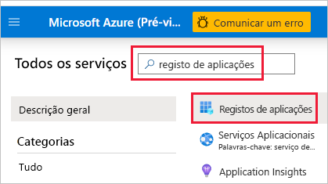
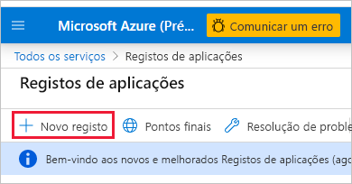
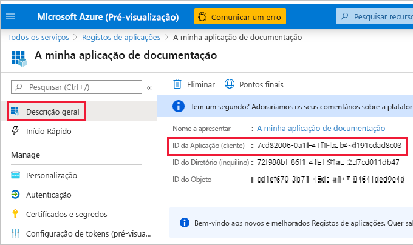
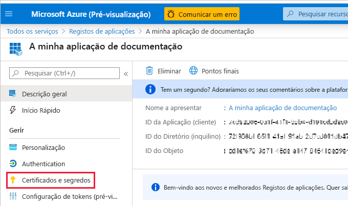
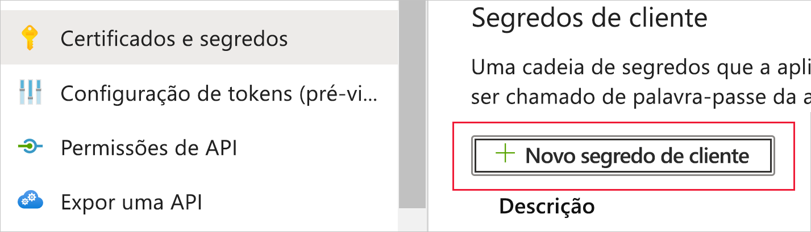
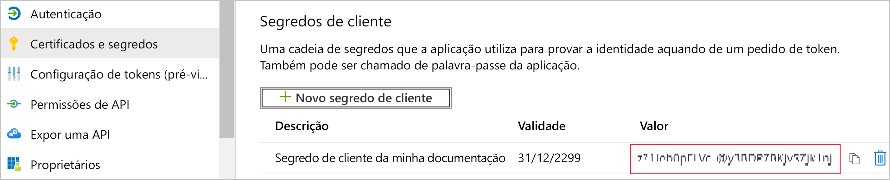

# <a name="embed-power-bi-content-with-service-principal-and-an-application-secret"></a>Incorporar conteúdos do Power BI com o principal de serviço e um segredo da aplicação

O principal de serviço é um método de autenticação que pode ser utilizado para permitir que uma aplicação do Azure Active Directory aceda aos conteúdos e às APIs do serviço Power BI.

Quando cria uma aplicação do Azure Ative Directory (AAD), é criado um [objeto do principal de serviço](/azure/active-directory/develop/app-objects-and-service-principals#service-principal-object). O objeto do principal de serviço, também conhecido como *principal de serviço*, permite que o AAD autentifique a aplicação. Uma vez autenticada, a aplicação pode aceder aos recursos do inquilino do AAD.

Para autenticar, o principal de serviço utiliza o *ID da Aplicação* do AAD e um dos seguintes:

* Certificado
* Segredo da aplicação

Este artigo descreve a autenticação do principal de serviço com o *ID da Aplicação* e o *Segredo da aplicação*.

>[!NOTE]
>O Azure Active Directory recomenda que proteja os serviços de back-end com certificados, em vez de chaves secretas.
>* [Saiba mais sobre como obter tokens de acesso do Azure AD com chaves secretas ou certificados](/azure/architecture/multitenant-identity/client-assertion).
>* Para proteger a solução com um certificado, conclua as instruções neste artigo e siga os passos descritos em [Incorporar conteúdos do Power BI com o principal de serviço e um certificado](embed-service-principal-certificate.md).

## <a name="method"></a>Método

Para utilizar o principal de serviço e um ID da aplicação com análise incorporada, siga estes passos:

1. Crie uma [aplicação do Azure Active Directory](/azure/active-directory/manage-apps/what-is-application-management).

    1. Crie o segredo da aplicação do AAD.
    
    2. Obtenha o *ID da Aplicação* e o *Segredo da aplicação*.

    >[!NOTE]
    >Estes passos são descritos no **passo 1**. Para obter mais informações sobre a criação de uma aplicação do AAD, veja o artigo [Criar uma aplicação do Azure Active Directory](/azure/active-directory/develop/howto-create-service-principal-portal).

2. Crie um grupo de segurança do AAD.

3. Ative as definições de administração do serviço Power BI.

4. Adicione o principal de serviço à área de trabalho.

5. Incorpore os conteúdos.

> [!IMPORTANT]
> Assim que ativar o principal de serviço a ser utilizado com o Power BI, as permissões do AD da aplicação deixarão de estar em vigor. Em seguida, as permissões da aplicação serão geridas através do portal de administração do Power BI.

## <a name="step-1---create-an-azure-ad-app"></a>Passo 1 – Criar uma aplicação do Azure Active Directory

Crie uma aplicação do AAD através de um destes métodos:

* [Criar a aplicação no portal do Microsoft Azure](embed-service-principal.md#creating-an-azure-ad-app-in-the-microsoft-azure-portal)

* [Criar a aplicação com o PowerShell](embed-service-principal.md#creating-an-azure-ad-app-using-powershell)

### <a name="creating-an-azure-ad-app-in-the-microsoft-azure-portal"></a>Criar uma aplicação do AAD no portal do Microsoft Azure

1. Inicie sessão no [Microsoft Azure](https://ms.portal.azure.com/#allservices).

2. Procure **Registos de aplicações** e clique na ligação **Registos de aplicações**.

    

3. Clique em **Novo registo**.

    

4. Preencha as informações necessárias:
    * **Nome** – introduza um nome para a aplicação
    * **Tipos de conta suportados** – selecione os tipos de conta suportados
    * (Opcional) **URI de Redirecionamento** – introduza um URI, se necessário

5. Clique em **Registar**.

6. Após o registo, o *ID da Aplicação* está disponível no separador **Descrição geral**. Copie e guarde o *ID da Aplicação* para utilizar mais tarde.

    

7. Clique no separador **Certificados e segredos**.

     

8. Clique em **Novo segredo do cliente**

    

9. Na janela *Adicionar um segredo do cliente*, introduza uma descrição, especifique quando quer que o segredo do cliente expire e clique em **Adicionar**.

10. Copie e guarde o valor do *Segredo do cliente*.

    

    >[!NOTE]
    >Quando fechar esta janela, o valor do segredo do cliente será ocultado e não poderá vê-lo nem copiá-lo novamente.

### <a name="creating-an-azure-ad-app-using-powershell"></a>Criar uma aplicação do Azure Active Directory com o PowerShell

Esta secção inclui um script de exemplo para criar uma nova aplicação do AAD com o [PowerShell](/powershell/azure/create-azure-service-principal-azureps).

```powershell
# The app ID - $app.appid
# The service principal object ID - $sp.objectId
# The app key - $key.value

# Sign in as a user that's allowed to create an app
Connect-AzureAD

# Create a new Azure AD web application
$app = New-AzureADApplication -DisplayName "testApp1" -Homepage "https://localhost:44322" -ReplyUrls "https://localhost:44322"

# Creates a service principal
$sp = New-AzureADServicePrincipal -AppId $app.AppId

# Get the service principal key
$key = New-AzureADServicePrincipalPasswordCredential -ObjectId $sp.ObjectId
```

## <a name="step-2---create-an-azure-ad-security-group"></a>Passo 2 – Criar um grupo de segurança do AAD

O principal de serviço não tem acesso a nenhum dos conteúdos e APIs do Power BI. Para dar acesso ao principal de serviço, crie um grupo de segurança no AAD e adicione o principal de serviço que criou a esse grupo de segurança.

Há duas formas para criar um grupo de segurança do AAD:
* [Manualmente (no Azure)](embed-service-principal.md#create-a-security-group-manually)
* [Utilizar o PowerShell](embed-service-principal.md#create-a-security-group-using-powershell)

### <a name="create-a-security-group-manually"></a>Criar um grupo de segurança manualmente

Para criar manualmente um grupo de segurança do Azure, siga as instruções no artigo [Criar um grupo básico e adicionar membros com o Azure Ative Directory](/azure/active-directory/fundamentals/active-directory-groups-create-azure-portal). 

### <a name="create-a-security-group-using-powershell"></a>Criar um grupo de segurança com o PowerShell

Abaixo encontra-se um script de exemplo para criar um novo grupo de segurança e adicionar uma aplicação ao mesmo.

>[!NOTE]
>Se quiser ativar o acesso do principal de serviço para toda a organização, ignore este passo.

```powershell
# Required to sign in as admin
Connect-AzureAD

# Create an Azure AD security group
$group = New-AzureADGroup -DisplayName <Group display name> -SecurityEnabled $true -MailEnabled $false -MailNickName notSet

# Add the service principal to the group
Add-AzureADGroupMember -ObjectId $($group.ObjectId) -RefObjectId $($sp.ObjectId)
```

## <a name="step-3---enable-the-power-bi-service-admin-settings"></a>Passo 3 – Ativar as definições de administração do serviço Power BI

Para que uma aplicação do AAD possa aceder aos conteúdos e APIs do Power BI, o administrador do Power BI tem de permitir o acesso do principal de serviço no portal de administração do Power BI.

Adicione o grupo de segurança que criou no AAD à secção específica de grupos de segurança nas **Definições de programador**.

>[!IMPORTANT]
>Os principais de serviço têm acesso a todas as configurações de inquilino para os quais são ativados. Dependendo das suas definições de administração, tal pode incluir grupos de segurança específicos ou toda a organização.
>
>Para restringir o acesso do principal de serviço a configurações específicas de inquilino, permita o acesso apenas a grupos de segurança específicos. Em alternativa, pode criar um grupo de segurança dedicado para os principais de serviço e excluí-lo das configurações de inquilino pretendidas.

>[!div class="mx-imgBorder"]
>:::image type="content" source="media/embed-service-principal/admin-portal.png" alt-text="Captura de ecrã a mostrar as definições do programador nas opções de administrador no serviço Power BI.":::

## <a name="step-4---add-the-service-principal-to-your-workspace"></a>Passo 4 – Adicionar o principal de serviço à área de trabalho

Para permitir que a aplicação do Azure Active Directory aceda a artefactos como relatórios, dashboards e conjuntos de dados no serviço Power BI, adicione a entidade do principal de serviço ou o grupo de segurança que inclui o principal de serviço como membro ou administrador à área de trabalho.

>[!NOTE]
>Esta secção apresenta as instruções da IU. Também pode adicionar um principal de serviço ou um grupo de segurança a uma área de trabalho com a [API Grupos – adicionar utilizador de grupo](/rest/api/power-bi/groups/addgroupuser).

1. Navegue para a área de trabalho à qual quer permitir o acesso e, no menu **Mais**, selecione **Acesso à área de trabalho**.

    :::image type="content" source="media/embed-service-principal/workspace-access.png" alt-text="Captura de ecrã a mostrar o botão de acesso da área de trabalho no menu mais de uma área de trabalho do Power BI.":::

2. Na caixa de texto do painel **Acesso**, adicione um dos seguintes:

    * O **principal de serviço**. O nome do principal de serviço é o *Nome a apresentar* da aplicação do Azure Active Directory, tal como aparece no separador de descrição geral da aplicação do Azure Active Directory.

    * O **grupo de segurança** que inclui o principal de serviço.

3. No menu pendente, selecione **Membro** ou **Administrador**.

4. Selecione **Adicionar**.

## <a name="step-5---embed-your-content"></a>Passo 5 – Incorporar os conteúdos

Pode [incorporar os conteúdos numa aplicação de exemplo](embed-sample-for-customers.md) ou na sua própria aplicação.

Uma vez incorporados os conteúdos, está pronto para [avançar para a produção](move-to-production.md).

>[!NOTE]
>Para proteger o conteúdo com um certificado, siga os passos descritos em [Incorporar conteúdos do Power BI com o principal de serviço e um certificado](embed-service-principal-certificate.md).

## <a name="considerations-and-limitations"></a>Considerações e limitações

* O principal de serviço só funciona com as [novas áreas de trabalho](../../collaborate-share/service-create-the-new-workspaces.md).
* **A Minha Área de Trabalho** não é suportada quando utilizar o principal de serviço.
* É necessária capacidade quando avançar para a produção.
* Não pode iniciar sessão no portal do Power BI com o principal de serviço.
* São necessários direitos de administrador do Power BI para ativar o principal de serviço nas definições de programador no portal de administração do Power BI.
* As aplicações [Incorporar para a sua organização](embed-sample-for-your-organization.md) não podem utilizar o principal de serviço.
* A gestão de [fluxos de dados](../../transform-model/dataflows/dataflows-introduction-self-service.md) não é suportada.
* O principal de serviço atualmente não suporta APIs de administração.
* Quando utilizar o principal de serviço com uma origem de dados do [Azure Analysis Services](/azure/analysis-services/analysis-services-overview), o principal de serviço tem de ter permissões de instância do Azure Analysis Services. Não é possível utilizar um grupo de segurança que contém o principal de serviço para este efeito.

## <a name="next-steps"></a>Próximos passos

>[!div class="nextstepaction"]
>[Registar uma aplicação](register-app.md)

> [!div class="nextstepaction"]
>[Power BI Embedded para clientes](embed-sample-for-customers.md)

>[!div class="nextstepaction"]
>[Incorporar com um principal de serviço e um certificado](embed-service-principal-certificate.md)

>[!div class="nextstepaction"]
>[Objetos do principal de serviço e aplicação no Azure Active Directory](/azure/active-directory/develop/app-objects-and-service-principals)

>[!div class="nextstepaction"]
>[Segurança ao nível da linha com o gateway de dados no local com o principal de serviço](embedded-row-level-security.md#on-premises-data-gateway-with-service-principal)