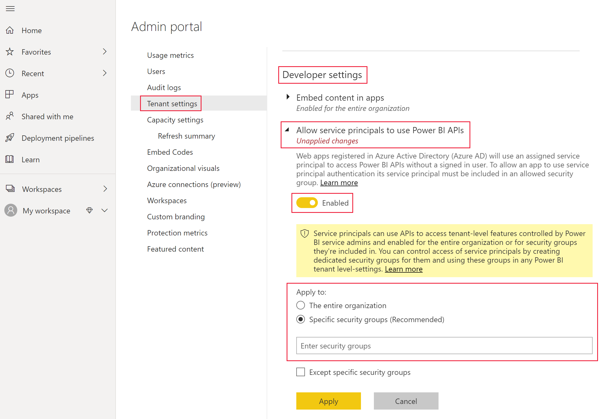

# <a name="embed-power-bi-content-with-service-principal-and-an-application-secret"></a>Incorporar conteúdos do Power BI com o principal de serviço e um segredo da aplicação

[!INCLUDE[service principal overview](../../includes/service-principal-overview.md)]

Este artigo descreve a autenticação do principal de serviço com o *ID da Aplicação* e o *Segredo da aplicação*.

>[!NOTE]
>Recomendamos que proteja os seus serviços de back-end com certificados, em vez de chaves secretas.
>* [Saiba mais sobre como obter tokens de acesso do Azure AD com chaves secretas ou certificados](/azure/architecture/multitenant-identity/client-assertion).
>* [Incorporar conteúdos do Power BI com o principal de serviço e um certificado](embed-service-principal-certificate.md).

## <a name="method"></a>Método

Para utilizar o principal de serviço e um ID da aplicação com a análise incorporada, siga estes passos:

1. Crie uma [aplicação do Azure Active Directory](/azure/active-directory/manage-apps/what-is-application-management).

    1. Crie o segredo da aplicação do AAD.
    
    2. Obtenha o *ID da Aplicação* e o *Segredo da aplicação*.

    >[!NOTE]
    >Estes passos são descritos no **passo 1**. Para obter mais informações sobre a criação de uma aplicação do AAD, veja o artigo [Criar uma aplicação do Azure Active Directory](/azure/active-directory/develop/howto-create-service-principal-portal).

2. Crie um grupo de segurança do AAD.

3. Ative as definições de administração do serviço Power BI.

4. Adicione o principal de serviço à área de trabalho.

5. Incorpore os conteúdos.

> [!IMPORTANT]
> Assim que ativar o principal de serviço a ser utilizado com o Power BI, as permissões do AD da aplicação deixarão de estar em vigor. Em seguida, as permissões da aplicação serão geridas através do portal de administração do Power BI.

## <a name="step-1---create-an-azure-ad-app"></a>Passo 1 – Criar uma aplicação do Azure Active Directory

Crie uma aplicação do AAD através de um destes métodos:
* Crie a aplicação no portal do [Microsoft Azure](https://portal.azure.com/#allservices)
* Crie a aplicação com o [PowerShell](/powershell/azure/create-azure-service-principal-azureps?view=azps-3.6.1).

### <a name="creating-an-azure-ad-app-in-the-microsoft-azure-portal"></a>Criar uma aplicação do AAD no portal do Microsoft Azure

[!INCLUDE[service create app](../../includes/service-principal-create-app.md)]

7. Clique no separador **Certificados e segredos**.

     


8. Clique em **Novo segredo do cliente**

    

9. Na janela *Adicionar um segredo do cliente*, introduza uma descrição, especifique quando quer que o segredo do cliente expire e clique em **Adicionar**.

10. Copie e guarde o valor do *Segredo do cliente*.

    

    >[!NOTE]
    >Quando fechar esta janela, o valor do segredo do cliente será ocultado e não poderá vê-lo nem copiá-lo novamente.

### <a name="creating-an-azure-ad-app-using-powershell"></a>Criar uma aplicação do Azure Active Directory com o PowerShell

Esta secção inclui um script de exemplo para criar uma nova aplicação do AAD com o [PowerShell](/powershell/azure/create-azure-service-principal-azureps?view=azps-1.1.0).

```powershell
# The app ID - $app.appid
# The service principal object ID - $sp.objectId
# The app key - $key.value

# Sign in as a user that's allowed to create an app
Connect-AzureAD

# Create a new Azure AD web application
$app = New-AzureADApplication -DisplayName "testApp1" -Homepage "https://localhost:44322" -ReplyUrls "https://localhost:44322"

# Creates a service principal
$sp = New-AzureADServicePrincipal -AppId $app.AppId

# Get the service principal key
$key = New-AzureADServicePrincipalPasswordCredential -ObjectId $sp.ObjectId
```

## <a name="step-2---create-an-azure-ad-security-group"></a>Passo 2 – Criar um grupo de segurança do AAD

O principal de serviço não tem acesso a nenhum dos conteúdos e APIs do Power BI. Para dar acesso ao principal de serviço, crie um grupo de segurança no AAD e adicione o principal de serviço que criou a esse grupo de segurança.

Há duas formas para criar um grupo de segurança do AAD:
* Manualmente (no Azure)
* Utilizar o PowerShell

### <a name="create-a-security-group-manually"></a>Criar um grupo de segurança manualmente

Para criar manualmente um grupo de segurança do Azure, siga as instruções no artigo [Criar um grupo básico e adicionar membros com o Azure Ative Directory](/azure/active-directory/fundamentals/active-directory-groups-create-azure-portal). 

### <a name="create-a-security-group-using-powershell"></a>Criar um grupo de segurança com o PowerShell

Abaixo encontra-se um script de exemplo para criar um novo grupo de segurança e adicionar uma aplicação ao mesmo.

>[!NOTE]
>Se quiser ativar o acesso do principal de serviço para toda a organização, ignore este passo.

```powershell
# Required to sign in as admin
Connect-AzureAD

# Create an Azure AD security group
$group = New-AzureADGroup -DisplayName <Group display name> -SecurityEnabled $true -MailEnabled $false -MailNickName notSet

# Add the service principal to the group
Add-AzureADGroupMember -ObjectId $($group.ObjectId) -RefObjectId $($sp.ObjectId)
```

## <a name="step-3---enable-the-power-bi-service-admin-settings"></a>Passo 3 – Ativar as definições de administração do serviço Power BI

Para que uma aplicação do AAD possa aceder aos conteúdos e APIs do Power BI, o administrador do Power BI tem de permitir o acesso do principal de serviço no portal de administração do Power BI.

Adicione o grupo de segurança que criou no AAD à secção específica de grupos de segurança nas **Definições de programador**.

>[!IMPORTANT]
>Os principais de serviço têm acesso a todas as configurações de inquilino para os quais são ativados. Dependendo das suas definições de administração, tal pode incluir grupos de segurança específicos ou toda a organização.
>
>Para restringir o acesso do principal de serviço a configurações específicas de inquilino, permita o acesso apenas a grupos de segurança específicos. Em alternativa, pode criar um grupo de segurança dedicado para os principais de serviço e excluí-lo das configurações de inquilino pretendidas.



## <a name="step-4---add-the-service-principal-to-your-workspace"></a>Passo 4 – Adicionar o principal de serviço à área de trabalho

Para permitir que a aplicação do AAD aceda a artefactos como relatórios, dashboards e conjuntos de dados no serviço Power BI, adicione a entidade do principal de serviço como membro ou administrador à área de trabalho.

>[!NOTE]
>Esta secção apresenta as instruções da IU. Também pode adicionar um principal de serviço a uma área de trabalho com a [API Groups – add group user](/rest/api/power-bi/groups/addgroupuser) (Grupos – adicionar utilizador de grupo).

1. Navegue para a área de trabalho à qual quer permitir o acesso e, no menu **Mais**, selecione **Acesso à área de trabalho**.

    

2. Adicione o principal de serviço como **Administrador** ou **Membro** à área de trabalho.

    

## <a name="step-5---embed-your-content"></a>Passo 5 – Incorporar os conteúdos

Pode incorporar os conteúdos numa aplicação de exemplo ou na sua própria aplicação.

* [Incorporar conteúdos com a aplicação de exemplo](embed-sample-for-customers.md#embed-content-using-the-sample-application)
* [Incorporar conteúdos na sua aplicação](embed-sample-for-customers.md#embed-content-within-your-application)

Uma vez incorporados os conteúdos, está pronto para [avançar para a produção](embed-sample-for-customers.md#move-to-production).

[!INCLUDE[service principal limitations](../../includes/service-principal-limitations.md)]

## <a name="next-steps"></a>Próximos passos

>[!div class="nextstepaction"]
>[Registar uma aplicação](register-app.md)

> [!div class="nextstepaction"]
>[Power BI Embedded para clientes](embed-sample-for-customers.md)

>[!div class="nextstepaction"]
>[Objetos do principal de serviço e aplicação no Azure Active Directory](/azure/active-directory/develop/app-objects-and-service-principals)

>[!div class="nextstepaction"]
>[Segurança ao nível da linha com o gateway de dados no local com o principal de serviço](embedded-row-level-security.md#on-premises-data-gateway-with-service-principal)

>[!div class="nextstepaction"]
>[Incorporar conteúdos do Power BI com o principal de serviço e um certificado](embed-service-principal-certificate.md)