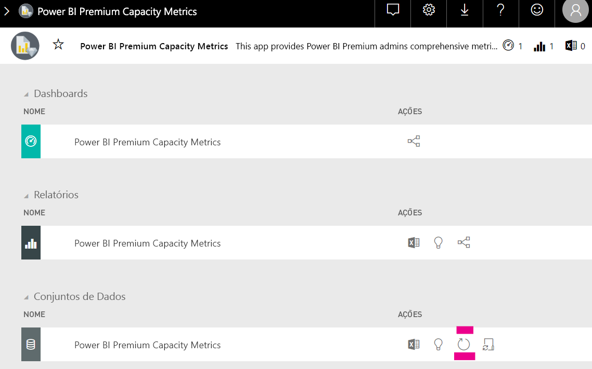

# Capacidade de planeamento na análise incorporada do Power BI

O cálculo de que tipo de capacidade é necessária para uma implementação de análise incorporada do Power BI pode ser complicado. Tal deve-se ao facto de este cálculo se basear em vários parâmetros, alguns dos quais são difíceis de prever.

Algumas das coisas a ter em conta quando estiver a planear a capacidade são:

* Os modelos de dados que está a utilizar
* O número e a complexidade das consultas necessárias
* A distribuição por hora da utilização da aplicação
* As taxas de atualização dos dados
* Os padrões de utilização adicionais que são difíceis de prever.

Este artigo foi concebido para facilitar o planeamento de capacidade da análise incorporada do Power BI, ao introduzir a [Power BI Dedicated Capacity Load Assessment Tool](https://github.com/microsoft/PowerBI-Tools-For-Capacities/tree/master/LoadTestingPowerShellTool/) (Ferramenta de Avaliação de Carga de Capacidade Dedicada do Power BI), criada para a automatização de testes de carga das capacidades de análise incorporada do Power BI (SKUs *A*, *EM* ou *P*).

## Ferramenta de planeamento

 A [Power BI Dedicated Capacity Load Assessment Tool](https://github.com/microsoft/PowerBI-Tools-For-Capacities/tree/master/LoadTestingPowerShellTool/) (Ferramenta de Avaliação de Carga de Capacidade Dedicada do Power BI) pode ajudá-lo a compreender qual a quantidade de carga de utilizador tolerada pela capacidade. Utiliza o PowerShell para criar testes de carga automatizados relativos às suas capacidades e permite-lhe escolher que relatórios quer testar e quantos utilizadores simultâneos pode simular.

A ferramenta gera carga numa capacidade ao compor continuamente cada relatório com novos valores de filtro (para evitar o bom desempenho não realista devido à colocação em cache dos relatórios), até que o token necessário para autenticar a ferramenta relativamente ao serviço expire.

### Utilizar a ferramenta de planeamento

Quando estiver a executar a ferramenta, lembre-se da carga existente nas suas capacidades e confirme que não executa testes de carga durante os períodos de mais utilização.

Seguem-se alguns exemplos de como pode utilizar a ferramenta de planeamento.

* Os administradores de capacidade podem compreender melhor qual o número de utilizadores máximo a ser processado pela capacidade num determinado período de tempo.
* Os autores de relatórios podem compreender o efeito da carga do utilizador, conforme medido pelo [Analisador de Desempenho](https://docs.microsoft.com/power-bi/desktop-performance-analyzer) do Power BI Desktop.
* Pode ver as composições a acontecer em tempo real no browser.
* Ao utilizar o SQL Server Profiler, pode [ligar aos pontos finais XMLA](https://powerbi.microsoft.com/blog/power-bi-open-platform-connectivity-with-xmla-endpoints-public-preview/) das capacidades a serem medidas para ver as consultas em execução.
* Os efeitos do teste de carga são visíveis na página Conjuntos de dados da aplicação de métricas de capacidade Premium. Os administradores de capacidade podem utilizar esta ferramenta para gerar carga e para ver como essa carga é apresentada.

### Rever os resultados do teste

Para ver os efeitos do teste de carga na aplicação de métricas após a execução do teste, siga as instruções abaixo. Conte com um atraso de até 15 minutos, a partir do momento em que o teste começa a gerar a carga até ao momento em que a carga ficará visível nas métricas.

1. Expanda o separador **Conjuntos de dados** da página de destino da [aplicação de métricas](../../admin/service-admin-premium-monitor-capacity.md).
2. Inicie uma atualização a pedido ao clicar em **atualizar agora**. Os administradores devem.

    

## Repositório do GitHub das ferramentas de capacidade do Power BI

O [repositório do GitHub das ferramentas de capacidade do Power BI](https://github.com/microsoft/PowerBI-Tools-For-Capacities) foi criado para alojar a ferramenta de planeamento de capacidade e os futuros utilitários e ferramentas.

O repositório é open source e os utilizadores são convidados a contribuir, a adicionar ferramentas adicionais relacionadas com as capacidades Premium e Incorporadas do Power BI e a melhorar as já existentes.

## Próximas etapas

> [!div class="nextstepaction"]
>[Capacidade e SKUs na análise incorporada do Power BI](embedded-capacity.md)

> [!div class="nextstepaction"]
>[Práticas recomendadas de desempenho do Power BI Embedded](embedded-performance-best-practices.md)