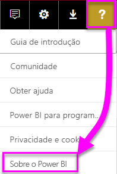
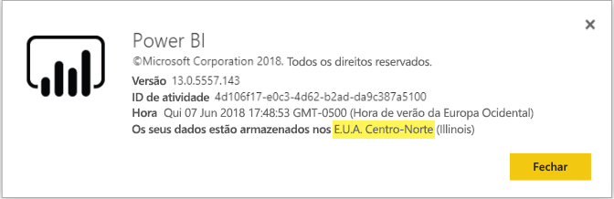

# <a name="frequently-asked-questions-about-power-bi-embedded"></a>Perguntas frequentes sobre o Power BI Embedded

* Se tiver outras perguntas, [experimente perguntar à Comunidade do Power BI](https://community.powerbi.com/).
* Ainda tem problemas? Visite a [Página de suporte do Power BI](https://powerbi.microsoft.com/support/).

## <a name="general"></a>Geral

### <a name="what-is-power-bi-embedded"></a>O que é o Power BI Embedded?

O [Microsoft Power BI Embedded (PBIE)](azure-pbie-what-is-power-bi-embedded.md) permite aos programadores de aplicações incorporarem fantásticos relatórios totalmente interativos nas suas aplicações, sem terem de criar as suas próprias visualizações e controlos de dados do zero.

### <a name="who-is-the-target-audience-for-power-bi-embedded"></a>Qual é o público alvo do Power BI Embedded?

Programadores e empresas de software, conhecidos como fabricantes independentes de software (ISVs), que codificam aplicações.

### <a name="how-is-power-bi-embedded-different-from-power-bi-the-service"></a>Qual a diferença entre o serviço do Power BI Embedded e do Power BI?

O Power BI é uma solução de análise de software como um serviço que dá às organizações uma vista única dos seus dados empresariais mais críticos.

A Microsoft desenvolveu o Power BI Embedded para ISVs que pretendem incorporar elementos visuais nas suas aplicações, para ajudar os respetivos clientes a tomarem decisões de análise. Desta forma, os ISVs não têm de criar a sua própria solução de análise. As [análises incorporadas](embedding.md) permitem aos utilizadores empresariais acederem a dados de negócio e executarem consultas relativamente aos mesmos para gerar informações na aplicação.


### <a name="what-is-the-difference-between-power-bi-premium-and-power-bi-embedded"></a>Qual é a diferença entre o Power BI Premium e o Power BI Embedded?

A capacidade do Power BI Premium destina-se às empresas que pretendem uma solução completa de BI que forneça uma vista única da respetiva organização, parceiros, clientes e fornecedores. O Power BI Premium ajuda a organização a tomar decisões. O Power BI Premium é um produto SaaS que permite aos utilizadores consumirem conteúdos através de aplicações móveis e aplicações desenvolvidas internamente ou no portal do Power BI.

O Power BI Embedded destina-se a ISVs que pretendem incorporar elementos visuais nas suas aplicações. O Power BI Embedded ajuda os clientes a tomarem decisões porque é para programadores de aplicações, clientes dessa aplicação podem consumir conteúdo armazenado na capacidade do Power BI Embedded, incluindo qualquer pessoa no interior ou exterior da organização. Não pode partilhar conteúdos da capacidade do Power BI Embedded através da publicação com um único clique na Web ou no SharePoint.

### <a name="what-is-the-microsoft-recommendation-for-when-a-customer-should-buy-power-bi-premium-vs-power-bi-embedded"></a>Quais as recomendações da Microsoft aos clientes em relação à compra do Power BI Premium vs. o Power BI Embedded?

A Microsoft recomenda que as empresas comprem o Power BI Premium, uma solução de BI de gestão personalizada na cloud e de nível empresarial. Recomendamos que os ISVs comprem o Power BI Embedded para os seus componentes de análise incorporada com tecnologia da cloud. No entanto, um cliente não tem restrições relativamente ao produto a comprar.

Podem ocorrer situações em que, além da incorporação de aplicações, um ISV (geralmente de grande dimensão) quer utilizar um P SKU para obter os benefícios adicionais do serviço pré-embalado do Power BI na sua organização. Algumas empresas poderão decidir utilizar SKUs A no Azure se só estiverem interessadas na criação de aplicações de linha de negócio e na incorporação das análises nas aplicações e não pretenderem utilizar o serviço Power BI pré-embalado.

### <a name="how-many-embed-tokens-can-i-create"></a>Quantos tokens de incorporação posso criar?

Os tokens de incorporação com a licença PRO destinam-se a testes de desenvolvimento, pelo que uma conta principal do Power BI ou um [principal de serviço](embed-service-principal.md) só podem gerar um número limitado de tokens. [Compre uma capacidade](#technical) para incorporar num ambiente de produção. Não existe limite para o número de tokens de incorporação que pode gerar ao adquirir uma capacidade. Aceda a [Funcionalidades Disponíveis](/rest/api/power-bi/availablefeatures) para verificar o valor de utilização que indica a utilização atual incorporada em valores percentuais.

## <a name="technical"></a>Parte Técnica

### <a name="where-can-i-learn-more-about-capacity-and-skus-in-power-bi-embedded-analytics"></a>Onde posso saber mais sobre a capacidade e os SKUs das análises incorporadas do Power BI?

Consulte o artigo [Capacity and SKUs in Power BI embedded analytics](embedded-capacity.md) (Capacidade e SKUs na análise incorporada do Power BI).

### <a name="what-are-the-prerequisites-for-creating-a-pbie-capacity-in-azure"></a>Quais são os pré-requisitos para criar uma capacidade PBIE no Azure?

* Inicie sessão no seu diretório organizacional (as contas Microsoft não são suportadas).
* Tem de ter um inquilino do Power BI, ou seja, pelo menos um utilizador no seu diretório tem de estar inscrito no Power BI. 
* Tem de ter uma subscrição do Azure no seu diretório organizacional.

### <a name="how-can-i-monitor-power-bi-embedded-capacity-consumption"></a>Como posso monitorizar o consumo da capacidade do Power BI Embedded?

* Ao utilizar o [portal de Administração do Power BI](../../admin/service-admin-portal.md#power-bi-embedded).

* Ao transferir a [aplicação de métrica](../../admin/service-admin-premium-monitor-capacity.md) no Power BI.

* Ao utilizar o [registo de diagnósticos do Azure](azure-pbie-diag-logs.md).

### <a name="can-my-capacity-scale-automatically-to-adjust-to-my-app-consumption"></a>A minha capacidade pode ser dimensionada automaticamente para se ajustar ao consumo da minha aplicação?

Apesar de atualmente não existir uma opção de dimensionamento automático, todas as APIs estão disponíveis para serem dimensionadas em qualquer altura.

### <a name="why-creatingscalingresuming-a-capacity-results-in-putting-the-capacity-into-a-suspended-state"></a>Porque é que criar/dimensionar/retomar uma capacidade faz com que esta seja colocada num estado de suspensão?

O aprovisionamento de capacidade (dimensionar/retomar/criar) pode falhar. Pode utilizar a API Obter Detalhes para verificar a propriedade ProvisioningState de uma capacidade: [Capacidades – Obter Detalhe](/rest/api/power-bi-embedded/capacities/getdetails).

### <a name="can-i-only-create-power-bi-embedded-capacities-in-a-specific-region"></a>Só posso criar capacidades do Power BI Embedded numa região específica?

Com a funcionalidade [Multi-geo (Pré-visualização)](embedded-multi-geo.md), pode comprar uma [capacidade do Power BI Embedded](azure-pbie-create-capacity.md) numa região diferente da localização principal do inquilino

### <a name="why-cant-i-see-a-workspace-although-i-have-permissions"></a>Porque é que não consigo ver uma área de trabalho, embora tenha permissões?

Quando são concedidas permissões a um utilizador para uma área de trabalho, uma aplicação ou um artefacto, as mesmas poderão não estar imediatamente disponíveis através de chamadas à API.
O resultado pode ser um artefacto em falta numa resposta de API "GET" ou um erro ao tentar utilizar o artefacto.
O utilizador pode resolver este problema ao chamar a [API refreshUserPermissions](/rest/api/power-bi/users/refreshuserpermissions), que atualiza as permissões de utilizador.


### <a name="how-can-i-find-my-pbi-tenant-region"></a>Como posso encontrar a minha região de inquilino do PBI?

Pode utilizar o portal do Power BI para encontrar a sua região de Inquilino do PBI.

`https://app.powerbi.com/` > ? > Sobre o Power BI




### <a name="what-does-the-cloud-solution-provider-csp-channel-support"></a>O que é que o Fornecedor de Soluções Cloud (CSP) suporta?

* Pode criar uma capacidade PBIE para o seu inquilino com o tipo de subscrição CSP
* A conta de parceiro pode iniciar sessão no inquilino de cliente e adquirir o PBIE para o mesmo, bem como especificar um utilizador do inquilino de cliente como administrador de capacidades do Power BI

### <a name="why-do-i-get-an-unsupported-account-message"></a>Porque é que estou a receber uma mensagem de conta não suportada?

O Power BI exige que se inscreva com uma conta escolar ou profissional. Não é suportada a inscrição no Power BI com uma conta Microsoft.

### <a name="can-i-use-apis-to-create-and-manage-azure-capacities"></a>Posso utilizar APIs para criar e gerir capacidades do Azure?

Sim, existem cmdlets do PowerShell e APIs REST do Azure Resource Manager que pode utilizar para criar e gerir recursos do PBIE.

* [APIs REST](/rest/api/power-bi-embedded/) 
* [Cmdlets do PowerShell](/powershell/module/azurerm.powerbiembedded/)

### <a name="what-is-the-pbi-embedded-capacity-role-in-a-pbi-embedded-solution"></a>Qual é a função de capacidade do Power BI Embedded numa solução do Power BI Embedded?

Para [promover a sua solução para produção](move-to-production.md), tem de atribuir os conteúdos do Power BI (a área de trabalho) que a sua aplicação utiliza a uma capacidade (SKU A) do Power BI Embedded.

### <a name="in-what-azure-regions-is-pbi-embedded-available"></a>Em que regiões do Azure é que o PBI Embedded está disponível?

[PAM](https://ecosystemmanager.azurewebsites.net/home) (EcoManager) – veja Gestor de disponibilidade do produto

Regiões disponíveis (16 – o mesmo número de regiões do Power BI)

* E.U.A. (6) – E.U.A Leste, E.U.A. Leste 2, E.U.A. Centro-Norte, E.U.A. Centro-Sul, E.U.A. Oeste, E.U.A. Oeste 2
* Europa (2) – Europa do Norte, Europa Ocidental
* Ásia-Pacífico (2) – Ásia Sudeste, Ásia Leste
* Brasil (1) – Sul do Brasil
* Japão (1) – Leste do Japão
* Austrália (1) – Austrália Sudeste
* Índia (1) – Oeste da Índia
* Canadá (1) – Canadá Central
* Reino Unido (1) – Sul do Reino Unido

### <a name="what-is-power-bi-embeddeds-authentication-model"></a>O que é o modelo de autenticação do Power BI Embedded?

O Power BI Embedded continua a utilizar o Azure AD para a autenticação do utilizador principal (um utilizador com uma licença do Power BI Pro designado) ou o [principal de serviço](embed-service-principal.md) para autenticar a aplicação no Power BI.  

 Um ISV pode implementar a sua própria autenticação e autorização para as respetivas aplicações.

Pode utilizar o seu diretório existente se já tiver um inquilino do Azure AD. Também pode criar um novo inquilino do Azure AD para a segurança dos conteúdos da sua aplicação incorporada.

Para obter um token do AAD, pode utilizar uma das [Bibliotecas de Autenticação do Azure Active Directory](/azure/active-directory/develop/active-directory-authentication-libraries). Existem bibliotecas cliente disponíveis para múltiplas plataformas.

### <a name="my-application-already-uses-aad-for-user-authentication-how-can-we-use-this-identity-when-authenticating-to-power-bi-in-a-user-owns-data-scenario"></a>A minha Aplicação já utiliza o AAD para a Autenticação de Utilizadores. Como podemos utilizar esta Identidade ao efetuar a autenticação no Power BI num cenário "Os Dados Pertencem ao Utilizador"?

Trata-se de um fluxo em-nome-de padrão do OAuth (<https://docs.microsoft.com/azure/active-directory/develop/web-api>). Tem de configurar a sua aplicação para pedir permissões para aceder ao serviço Power BI (com os âmbitos necessários). Assim que tiver um token de utilizador para a sua aplicação, basta efetuar uma chamada à API de ADAL AcquireTokenAsync com o token de acesso do utilizador e especificar o URL do recurso do Power BI como o ID do recurso:

```csharp
var context = new AD.AuthenticationContext(authorityUrl);
var userAssertion = new AD.UserAssertion(userAccessToken);
var clientAssertion = new AD.ClientAssertionCertificate(MyAppId, MyAppCertificate)
var authenticationResult = await context.AcquireTokenAsync(resourceId, clientAssertion, userAssertion);
```

### <a name="what-object-id-is-the-service-principal-object-id"></a>Qual é o ID de objeto do principal de serviço?

O *ID de Objeto* apresentado no ecrã principal de uma aplicação registada é o ID de objeto da mesma.

O ID de objeto que se encontra na secção *Aplicação gerida no diretório local > Propriedades* é o ID de objeto do principal de serviço que tem de utilizar. Este ID de objeto é utilizado para referenciar um principal de serviço para operações ou para fazer alterações ao ID de objeto do principal de serviço. Isto pode ser, por exemplo, aplicar um principal de serviço como administrador a uma área de trabalho.

### <a name="how-is-power-bi-embedded-different-from-other-azure-services"></a>Qual a diferença entre o Power BI Embedded e os outros serviços do Azure?

Tem de ter uma conta do Power BI antes de comprar o Power BI Embedded no Azure. A sua região do Power BI Embedded implementada determina a sua conta do Power BI. Faça a gestão dos recursos do Power BI Embedded no Azure para:

* Aumentar/reduzir verticalmente
* Adicionar administradores de capacidade
* Colocar em pausa/retomar o serviço

Utilize o PowerBI.com para atribuir/anular a atribuição de áreas de trabalho para a capacidade do Power BI Embedded.

### <a name="what-content-pack-data-types-can-you-embed"></a>Que tipos de dados do pacote de conteúdos é possível incorporar?

*Não é possível* incorporar **Dashboards** e **mosaicos** criados a partir de conjuntos de dados do pacote de conteúdos. No entanto, *pode* incorporar **relatórios** criados a partir de um conjunto de dados do pacote de conteúdos.

### <a name="what-is-the-difference-between-using-row-level-security-rls-vs-javascript-filters"></a>Qual é a diferença entre utilizar a segurança ao nível da linha (RLS) e os filtros de JavaScript?

É frequente a confusão relativamente a quando é que o RLS ou os filtros de JavaScript devem ser utilizados, uma vez que um método consiste no controlo daquilo que um utilizador específico pode ver e o outro consiste na otimização da vista do utilizador.

Na RLS, o programador de ISV controla a filtragem de dados como parte da criação de modelos e da geração de tokens de incorporação. O utilizador final vê apenas aquilo que o ISV permite. Neste caso, o utilizador pode optar por ver menos do que está a ser filtrado, mas não pode ignorar a configuração da RLS e ver mais do que está autorizado.

Na filtragem do lado do cliente (JavaScript), o ISV pode decidir aquilo que o utilizador final vê na vista inicial, mas não consegue controlar as alterações que o utilizador final possa aplicar à própria vista. Uma vez que o código de cliente JavaScript do utilizador pode acionar a filtragem de dados no back-end, não pode ser considerado seguro.

Consulte [RLS vs. filtros de JavaScript](embedded-row-level-security.md#using-rls-vs-javascript-filters) para obter mais detalhes.

### <a name="how-do-i-manage-permissions-for-service-principals-with-power-bi"></a>Como posso gerir as permissões dos principais de serviço com o Power BI?

Assim que ativar o [principal de serviço](embed-service-principal.md) a utilizar com o Power BI, as permissões do AD da aplicação deixarão de estar em vigor. Em seguida, as permissões da aplicação serão geridas através do portal de administração do Power BI.

Os principais de serviço herdam as permissões de todas as definições do inquilino do Power BI do respetivo grupo de segurança. Para restringir as permissões, crie um grupo de segurança dedicado para os principais de serviço e adicione-o à lista **Exceto grupos de segurança específicos** para as definições do Power BI relevantes ativadas.

Esta situação é importante quando adicionar o principal de serviço como um **administrador** à nova área de trabalho. Pode gerir esta tarefa através das [APIs](/rest/api/power-bi/groups/addgroupuser) ou com o serviço Power BI.

### <a name="when-to-use-an-application-id-vs-a-service-principal-object-id"></a>Quando devo utilizar um ID da aplicação vs. um ID do objeto do principal de serviço?

O **[ID da aplicação](embed-sample-for-customers.md#client-id)** , também conhecido como *ID de cliente*, é utilizado para criar o token de acesso ao transmitir o ID da aplicação para autenticação.

Para fazer referência a um principal de serviço para operações ou fazer alterações, é utilizado o **[ID do objeto do principal de serviço](embed-service-principal.md)** – por exemplo, para aplicar um principal de serviço como um administrador a uma área de trabalho.

### <a name="can-you-manage-an-on-premises-data-gateway-with-service-principal"></a>É possível gerir um gateway de dados no local com o principal de serviço?

Não é possível gerir um gateway de dados no local (gateway de dados) com um [principal de serviço](embed-service-principal.md) como pode fazê-lo com uma conta principal.

Com uma conta principal, pode instalar um gateway de dados, adicionar utilizadores ao gateway, ligar a origens de dados e realizar outras tarefas administrativas.

Com um principal de serviço, pode configurar a [segurança ao nível da linha (RLS)](embedded-row-level-security.md#on-premises-data-gateway-with-service-principal) através de uma origem de dados de ligação em direto no local do SQL Server Analysis Services (SSAS). Desta forma, pode gerir utilizadores e o respetivo acesso aos dados no SSAS durante a integração com o **Power BI Embedded** através de um principal de serviço.

### <a name="can-you-sign-into-the-power-bi-service-with-service-principal"></a>É possível iniciar sessão no serviço Power BI com o principal de serviço?

Não é possível iniciar sessão no Power BI com o principal de serviço.

Além disso, não é possível consumir conteúdos como um utilizador em aplicações externas (incorporação do SaaS). Só é possível fazê-lo quando gerar um token de incorporação.

### <a name="what-are-the-best-practices-to-improve-performance"></a>Quais são as melhores práticas para melhorar o desempenho?

[Desempenho do Power BI Embedded](embedded-performance-best-practices.md)

## <a name="licensing"></a>Licensing

### <a name="how-do-i-purchase-power-bi-embedded"></a>Como posso adquirir o Power BI Embedded?

O Power BI Embedded está disponível através do Azure.

### <a name="what-happens-if-i-already-purchased-power-bi-premium-and-now-i-want-some-power-bi-embedded-in-azure-benefits"></a>O que acontece se já tiver comprado o Power BI Premium e agora quiser usufruir de alguns dos benefícios do Power BI Embedded no Azure?

Os clientes continuam a pagar quaisquer compras existentes do Power BI Premium até ao fim do respetivo termo atual do contrato e, nessa altura, podem mudar as compras do Power BI Premium, conforme necessário.

### <a name="do-i-still-have-to-buy-power-bi-premium-to-get-access-to-power-bi-embedded"></a>Ainda é necessário comprar o Power BI Premium para ter acesso ao Power BI Embedded?

Não, o Power BI Embedded inclui a capacidade baseada no Azure que vai precisar para implementar e distribuir a sua solução aos clientes.

### <a name="whats-the-purchase-commitment-for-power-bi-embedded"></a>Qual é o compromisso de compra do Power BI Embedded?

Os clientes podem mudar a respetiva utilização numa base horária. Não existe um compromisso mensal nem anual para o serviço do Power BI Embedded.

### <a name="how-does-the-usage-of-power-bi-embedded-show-up-on-my-bill"></a>Como é que a utilização do Power BI Embedded aparece detalhada na minha fatura?

O Power BI Embedded é faturado numa taxa por hora previsível, com base no tipo de nós implementados. O recurso é faturado enquanto estiver ativo, mesmo que não esteja a ser utilizado. É necessário colocar o recurso em pausa para suspender a faturação.

### <a name="who-needs-a-power-bi-pro-license-for-power-bi-embedded-and-why"></a>Quem necessita de uma licença do Power BI Pro para o Power BI Embedded e por que motivo?

Necessita de uma licença do Power BI Pro ou de um [principal de serviço](embed-service-principal.md) para utilizar APIs REST. Para adicionar relatórios a uma área de trabalho do Power BI, um analista necessita de uma licença do Power BI Pro ou de um principal de serviço. Para gerir o inquilino e a capacidade do Power BI, um administrador necessita de uma licença do Power BI Pro.

Como o Power BI Embedded permite a utilização do portal do Power BI para gerir e validar o conteúdo integrado, é necessária uma licença do Power BI Pro para autenticar a aplicação no PowerBI.com, para ter acesso aos relatórios nos repositórios corretos.

No entanto, para [criar/editar relatórios incorporados](https://github.com/Microsoft/PowerBI-JavaScript/wiki/Create-Report-in-Embed-View) na sua aplicação, o utilizador final não precisa de uma licença Pro, uma vez que não é obrigatório que seja um utilizador do Power BI.

### <a name="can-i-get-started-for-free"></a>Pode começar a utilizar gratuitamente?

Sim, pode utilizar os seus [créditos do Azure](https://azure.microsoft.com/free/) para o Power BI Embedded.

### <a name="can-i-get-a-trial-experience-for-power-bi-embedded-in-azure"></a>Posso obter uma experiência de avaliação para o Power BI Embedded no Azure?

Uma vez que o Power BI Embedded faz parte do Azure, é possível utilizar o serviço com o [crédito de 200 € recebido ao inscrever-se no Azure](https://azure.microsoft.com/free/).

### <a name="is-power-bi-embedded-available-for-national-clouds-us-government-germany-china"></a>O Power BI Embedded está disponível para clouds nacionais (US Government, Alemanha, China)?

O Power BI Embedded também está disponível para [clouds nacionais](embed-sample-for-customers-national-clouds.md).

### <a name="is-power-bi-embedded-available-for-non-profits-and-educational"></a>O Power BI Embedded está disponível para entidades educacionais e sem fins lucrativos?

Não existem preços especiais do Azure para entidades educacionais e sem fins lucrativos.

## <a name="power-bi-workspace-collection"></a>Coleção de Áreas de Trabalho do Power BI

### <a name="what-is-power-bi-workspace-collection"></a>O que é a Coleção de Áreas de Trabalho do Power BI?

A **Coleção de Áreas de Trabalho do Power BI** (Versão 1 do **Power BI Embedded**) é uma solução baseada no recurso **Coleção de Áreas de Trabalho do Power BI** do Azure. Esta solução permite-lhe criar aplicações **Power BI Embedded** para os seus clientes com conteúdo do Power BI por meio da solução **Coleção de Áreas de Trabalho do Power BI**, APIs dedicadas e chaves de área de trabalho para autenticar a aplicação para o Power BI.

### <a name="can-i-migrate-from-power-bi-workspace-collection-to-power-bi-embedded"></a>Posso migrar conteúdos da Coleção de Áreas de Trabalho do Power BI para o Power BI Embedded?

1. Pode utilizar a ferramenta de migração para clonar conteúdo da **Coleção de Áreas de Trabalho do Power BI** para o Power BI – https://docs.microsoft.com/power-bi/developer/migrate-from-powerbi-embedded#content-migration.

2. Comece pelas POC da aplicação **Power BI Embedded** que utilizam o conteúdo do Power BI.

3. Assim que estiver pronto para a produção, compre uma capacidade do **Power BI Embedded** e atribua o seu conteúdo do Power BI (área de trabalho) a essa capacidade.

    > [!Note]
    > Pode continuar a utilizar a **Coleção de Áreas de Trabalho do Power BI** durante a criação em paralelo com uma solução **Power BI Embedded**. Assim que tudo estiver pronto, pode mover o seu cliente para a nova solução **Power BI Embedded** e descontinuar a solução **Coleção de Áreas de Trabalho do Power BI**.

Para obter mais informações, veja [Como migrar conteúdos da Coleção de Áreas de Trabalho do Power BI para o Power BI Embedded](./migrate-from-powerbi-embedded.md)

### <a name="is-power-bi-workspace-collection-on-a-deprecation-path"></a>A Coleção de Áreas de Trabalho do Power BI está em vias de ser preterida?

Sim, mas os clientes que já estão a utilizar a solução **Coleção de Áreas de Trabalho do Power BI** podem continuar a utilizá-la até à preterição. Os clientes também podem criar novas coleções de áreas de trabalho, bem como quaisquer aplicações do **Power BI Embedded** que ainda utilizem a solução **Coleção de Áreas de Trabalho do Power BI**.

No entanto, isto também significa que não são adicionadas novas funcionalidades a soluções **Coleção de Áreas de Trabalho do Power BI**. Recomendamos que os clientes planeiem a sua migração para a nova solução **Power BI Embedded**.

### <a name="when-is-power-bi-workspace-collection-support-discontinued"></a>Quando é que o suporte da Coleção de Áreas de Trabalho do Power BI será descontinuado?

Os clientes que já estejam a utilizar a solução **Coleção de Áreas de Trabalho do Power BI** podem continuar a utilizá-la até ao fim de junho de 2018 ou até ao fim do contrato de suporte.

### <a name="in-what-regions-can-i-create-a-pbi-workspace-collection"></a>Em que regiões posso criar uma Coleção de Áreas de Trabalho do PBI?

As regiões disponíveis são o Austrália Sudeste, Sul do Brasil, Canadá Central, EUA Leste 2, Índia Oeste, Leste do Japão, EUA Centro-Norte, Europa do Norte, EUA Centro-Sul, Ásia Sudeste, Sul do Reino Unido, Europa Ocidental e EUA Oeste.

### <a name="why-should-i-migrate-from-pbi-workspace-collection-to-power-bi-embedded"></a>Porque devo migrar conteúdos da Coleção de Áreas de Trabalho do PBI para o Power BI Embedded?

Existem algumas funcionalidades e capacidades novas na solução **Power BI Embedded** de que não pode usufruir na **Coleção de Áreas de Trabalho do Power BI**.

Algumas das funcionalidades são:
* Todas as origens de dados do PBI são suportadas. Apenas duas origens de dados da **Coleção de Áreas de Trabalho do Power BI** são suportadas. 
* As novas funcionalidades, como Perguntas e Respostas, atualizar, marcadores, incorporação de dashboards e mosaicos e menus personalizados só são suportadas na solução **Power BI Embedded**.
* Modelo de faturação de capacidade.

## <a name="embedding-setup-tool"></a>Ferramenta de configuração de incorporação

### <a name="what-is-the-embedding-setup-tool"></a>O que é a Ferramenta de configuração de incorporação?

A [Ferramenta de configuração de incorporação](https://app.powerbi.com/embedsetup) permite-lhe começar e transferir rapidamente uma aplicação de exemplo para começar a incorporar com o Power BI.

### <a name="which-solution-should-i-choose"></a>Que solução devo escolher?

* A solução [Incorporar para os seus clientes](embedding.md#embedding-for-your-customers) permite-lhe incorporar dashboards e relatórios para utilizadores que não têm uma conta para o Power BI. Na [Ferramenta de configuração de incorporação](https://app.powerbi.com/embedsetup), execute a solução *Incorporar para os seus clientes*.
* A solução [Incorporar para a sua organização](embedding.md#embedding-for-your-organization) permite-lhe alargar o serviço Power BI. Na [Ferramenta de configuração de incorporação](https://app.powerbi.com/embedsetup), execute a solução *Incorporar para a sua organização*.

### <a name="ive-downloaded-the-sample-app-which-solution-do-i-choose"></a>Transferi a aplicação de exemplo. Que solução devo escolher?

Se estiver a trabalhar com a experiência **Incorporar para os seus clientes**, guarde e descomprima o ficheiro *PowerBI-Developer-Samples.zip*. Em seguida, abra a pasta *PowerBI-Developer-Samples-master\App Owns Data* e execute o ficheiro *PowerBIEmbedded_AppOwnsData.sln*.

Se estiver a trabalhar com a experiência **Incorporar para a sua organização**, guarde e descomprima o ficheiro *PowerBI-Developer-Samples.zip*. Em seguida, abra a pasta *PowerBI-Developer-Samples-master\User Owns Data\integrate-report-web-ap* e execute o ficheiro *pbi-saas-embed-report.sln*.

### <a name="how-can-i-edit-my-registered-application"></a>Como posso editar a minha aplicação registada?

Para saber como editar aplicações registadas no Azure AD, veja [Guia de Início Rápido: atualizar uma aplicação no Azure Active Directory](/azure/active-directory/develop/quickstart-v1-update-azure-ad-app).

### <a name="how-can-i-edit-my-power-bi-user-profile-or-data"></a>Como posso editar os meus dados ou o meu perfil de utilizador do Power BI?

Pode saber como editar os seus dados do Power BI [aqui](../../fundamentals/service-basic-concepts.md).

Para obter mais informações, veja [Resolver problemas da sua aplicação incorporada](embedded-troubleshoot.md).

Mais perguntas? [Pergunte à Comunidade do Power BI](https://community.powerbi.com/)