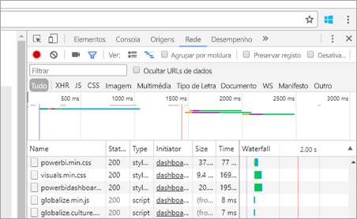
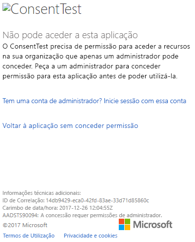
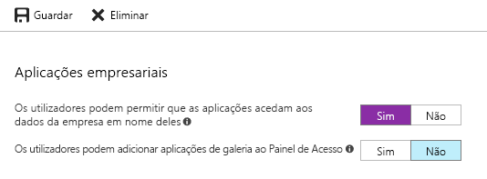

# <a name="troubleshoot-your-embedded-application"></a>Resolver problemas da sua aplicação incorporada

Este artigo aborda alguns problemas comuns que poderá encontrar ao incorporar conteúdo do Power BI.

## <a name="tools-to-troubleshoot"></a>Ferramentas para resolver problemas

### <a name="fiddler-trace"></a>Rastreio do Fiddler

O [Fiddler](https://www.telerik.com/fiddler) é uma ferramenta gratuita da Telerik que monitoriza o tráfego HTTP.  Pode ver o tráfego com as APIs do Power BI no computador cliente. Esta ferramenta pode mostrar erros e outras informações relacionadas.


### <a name="f12-in-browser-for-front-end-debugging"></a>F12 no Browser para depuração em front-end

A tecla F12 abre a janela de programador no browser. Esta ferramenta permite-lhe ver o tráfego de rede e outras informações.



### <a name="extract-error-details-from-power-bi-response"></a>Extrair os detalhes do erro da resposta do Power BI

Este fragmento de código mostra como extrair os detalhes do erro de exceção de HTTP:

```csharp
public static string GetExceptionText(this HttpOperationException exc)
{
    var errorText = string.Format("Request: {0}\r\nStatus: {1} ({2})\r\nResponse: {3}",
    exc.Request.Content, exc.Response.StatusCode, (int)exc.Response.StatusCode, exc.Response.Content);
    if (exc.Response.Headers.ContainsKey("RequestId"))
    {
        var requestId = exc.Response.Headers["RequestId"].FirstOrDefault();
        errorText += string.Format("\r\nRequestId: {0}", requestId);
    }

    return errorText;
}
```

Recomendamos que registe o ID do Pedido (e os detalhes do erro na resolução de problemas).
Indique o ID do Pedido quando falar com o suporte da Microsoft.

## <a name="app-registration"></a>Registo de aplicações

### <a name="app-registration-failure"></a>Falha do registo da aplicação

As mensagens de erro no portal do Azure ou na página de registo da aplicação Power BI mencionam privilégios insuficientes. Para registar uma aplicação, tem de ser um administrador no inquilino do Azure AD ou os registos de aplicações têm de estar ativados para os utilizadores que não são utilizadores.

### <a name="power-bi-service-doesnt-appear-in-the-azure-portal-when-registering-a-new-app"></a>O Serviço Power BI não aparece no portal do Azure ao registar uma nova Aplicação

Pelo menos um utilizador tem de estar inscrito no Power BI. Se não vir o **Serviço Power BI** na lista de APIs, não existem utilizadores inscritos no Power BI.

## <a name="rest-api"></a>API REST

### <a name="api-call-returning-401"></a>A chamada à API devolve o erro 401

Poderá ser necessária uma captura de fiddler para se investigar mais aprofundadamente. O âmbito de permissão necessário poderá estar em falta para a aplicação registada no Azure AD. Certifique-se de que o âmbito necessário está presente no registo de aplicações para o Azure AD no portal do Azure.

### <a name="api-call-returning-403"></a>A chamada à API devolve o erro 403

Poderá ser necessária uma captura de fiddler para se investigar mais aprofundadamente. Poderão existir vários motivos para um erro 403.

* O utilizador excedeu a quantidade de tokens de incorporação que podem ser gerados numa capacidade partilhada. Compre capacidades do Azure para gerar tokens de incorporação e atribuir a área de trabalho a essa capacidade. Veja [Create Power BI Embedded capacity in the Azure portal](https://docs.microsoft.com/azure/power-bi-embedded/create-capacity) (Criar capacidade do Power BI Embedded no portal do Azure).
* O token de autenticação do Azure AD expirou.
* O utilizador autenticado não é um membro do grupo (área de trabalho).
* O utilizador autenticado não é um administrador do grupo (área de trabalho).
* O utilizador autenticado não tem permissões. As permissões podem ser atualizadas através da [API refreshUserPermissions](https://docs.microsoft.com/rest/api/power-bi/users/refreshuserpermissions).
* O cabeçalho de autorização poderá não estar corretamente listado. Certifique-se de que não existem gralhas.

O back-end da aplicação poderá ter de atualizar o token de autenticação antes de chamar o GenerateToken.

    ```
    GET https://wabi-us-north-central-redirect.analysis.windows.net/metadata/cluster HTTP/1.1
    Host: wabi-us-north-central-redirect.analysis.windows.net
    ...
    Authorization: Bearer eyJ0eXAiOi...
    ...

    HTTP/1.1 403 Forbidden
    ...

    {"error":{"code":"TokenExpired","message":"Access token has expired, resubmit with a new access token"}}
    ```

## <a name="authentication"></a>Autenticação

### <a name="authentication-failed-with-aadsts90002-tenant-authorize-not-found"></a>A autenticação falhou com o erro AADSTS90002: Inquilino "autorizar" não encontrado

 Se estiver a receber mensagens como ***error: invalid_request, error_description: AADSTS90002: Inquilino "autorizar" não encontrado*** ao iniciar sessão, isto é porque a ADAL 4.x não suporta "https://login.microsoftonline.com/{Tenant}/oauth2/authorize/" como um URL de autoridade.
 
Para resolver este problema, deve retirar "oauth2/authorize/" do final do seu URL de autoridade. Para obter mais informações, veja [Power BI Developer Samples](https://github.com/Microsoft/PowerBI-Developer-Samples) (Exemplos para Programadores do Power BI).

 Veja ainda a secção [Better Authority validation](https://github.com/AzureAD/azure-activedirectory-library-for-dotnet/wiki/Changes-adalnet-4.0#better-authority-validation) (Melhor validação de autoridades) das notas de versão da ADAL 4.x.

### <a name="authentication-failed-with-aadsts70002-or-aadsts50053"></a>A autenticação falhou com o erro AADSTS70002 ou AADSTS50053

**_(AADSTS70002: Erro ao validar as credenciais. AADSTS50053: Tentou iniciar sessão demasiadas vezes com um ID de Utilizador ou palavra-passe incorreta)_**

Se estiver a utilizar o Power BI Embedded e a Autenticação Direta do Azure AD e estiver a receber mensagens ao iniciar sessão, tal como ***error:unauthorized_client, error_description:AADSTS70002: Erro ao validar as credenciais. AADSTS50053: Tentou iniciar sessão demasiadas vezes com um ID de Utilizador ou palavra-passe incorreta***, porque a autenticação direta já não está em utilização desde 14 de junho de 2018 por predefinição.

Existe uma forma de ativar esta opção novamente com uma [Política do Azure AD](https://docs.microsoft.com/azure/active-directory/manage-apps/configure-authentication-for-federated-users-portal#enable-direct-authentication-for-legacy-applications) definida para a organização ou para um [principal de serviço](https://docs.microsoft.com/azure/active-directory/develop/active-directory-application-objects#service-principal-object).

Recomendamos que ative esta política apenas com base em cada aplicação.

Para criar esta política, tem de ser um **Administrador Global** do diretório para o qual está a criar e atribuir a política. Eis um script de exemplo para criar a política e atribuí-la ao SP para esta aplicação:

1. Instale o [Módulo PowerShell do Azure AD Preview](https://docs.microsoft.com/powershell/azure/active-directory/install-adv2?view=azureadps-2.0).

2. Execute os seguintes comandos do PowerShell linha a linha (garantindo que a variável $sp não tem mais do que uma aplicação como resultado).

```powershell
Connect-AzureAD
```

```powershell
$sp = Get-AzureADServicePrincipal -SearchString "Name_Of_Application"
```

```powershell
$policy = New-AzureADPolicy -Definition @("{`"HomeRealmDiscoveryPolicy`":{`"AllowCloudPasswordValidation`":true}}") -DisplayName EnableDirectAuth -Type HomeRealmDiscoveryPolicy -IsOrganizationDefault $false
```

```powershell
Add-AzureADServicePrincipalPolicy -Id $sp.ObjectId -RefObjectId $policy.Id 
```

Após atribuir a política, aguarde aproximadamente 15 a 20 segundos para permitir a propagação antes de testar.

### <a name="generate-token-fails-when-providing-effective-identity"></a>A geração de token falha ao fornecer identidade em vigor

O GenerateToken pode falhar, com identidade eficaz fornecida, por vários motivos diferentes.

* O conjunto de dados não suporta a identidade em vigor
* O nome de utilizador não foi fornecido
* A função não foi fornecida
* O DatasetId não foi fornecido
* O utilizador não tem as permissões corretas

Para verificar qual é o motivo, experimente os passos abaixo.

* Execute a operação [obter conjunto de dados](https://docs.microsoft.com/rest/api/power-bi/datasets). A propriedade IsEffectiveIdentityRequired é verdadeira?
* O nome de utilizador é obrigatório para qualquer EffectiveIdentity.
* Se IsEffectiveIdentityRolesRequired for verdadeiro, é necessária uma Função.
* DatasetId é obrigatório para qualquer EffectiveIdentity.
* No Analysis Services, o utilizador principal tem de ser um administrador de gateway.

### <a name="aadsts90094-the-grant-requires-admin-permission"></a>AADSTS90094: A concessão requer permissões de administrador

**_Sintomas:_**<br>
Quando um utilizador que não é administrador tenta iniciar sessão numa aplicação pela primeira vez ao dar consentimento, obtém um dos seguintes erros:

* O ConsentTest precisa de permissão para aceder a recursos na sua organização que apenas um administrador pode conceder. Peça permissão a um administrador para aceder a esta aplicação antes de a utilizar.
* AADSTS90094: A concessão requer permissões de administrador.

    

Um utilizador administrador pode iniciar sessão e dar consentimento com êxito.

**_Causa raiz:_**<br>
O consentimento do utilizador está desativado no inquilino.

**_São possíveis várias correções:_**

*Ativar o consentimento do utilizador para todo o inquilino (todos os utilizadores, aplicações)*

1. No portal do Azure, navegue para "Azure Active Directory" => "Utilizadores e grupos" => "Definições do utilizador"
2. Ative a definição "Os utilizadores podem permitir que as aplicações acedam aos dados da empresa em nome deles" e guarde as alterações

    

*Conceder permissões* para a aplicação por um administrador: para todo o inquilino ou para um utilizador específico.

### <a name="cs1061-error"></a>Erro CS1061

Transfira o [Microsoft.IdentityModel.Clients.ActiveDirectory](https://www.nuget.org/packages/Microsoft.IdentityModel.Clients.ActiveDirectory/2.22.302111727) caso lhe seja apresentada a mensagem de erro "'AuthenticationContext' não contém uma definição para 'AcquireToken' e não foi possível localizar nenhum método de extensão 'AcquireToken' que aceitasse um primeiro argumento do tipo 'AuthenticationContext' (falta-lhe uma directiva de utilização ou uma referência de assemblagem?)".

## <a name="data-sources"></a>Origens de dados

### <a name="isv-wants-to-have-different-credentials-for-the-same-data-source"></a>O ISV pretende ter credenciais diferentes para a mesma origem de dados

Uma origem de dados pode ter um único conjunto de credenciais para um utilizador principal. Se precisar de utilizar credenciais diferentes, crie utilizadores principais adicionais. Em seguida, atribua as diferentes credenciais em cada contexto do utilizador principal e incorpore através do token do Azure AD do utilizador.

## <a name="troubleshoot-your-embedded-application-with-the-ierror-object"></a>Resolver problemas da sua aplicação incorporada com o objeto IError

Utilize o [**objeto IError** devolvido pelo evento de *erro* no **JavaScript SDK**](https://github.com/Microsoft/PowerBI-JavaScript/wiki/Troubleshooting-and-debugging-of-embedded-parts) para depurar a aplicação e compreender melhor a causa dos erros.

Depois de adquirir o objeto IError, deve examinar a tabela de erros comuns mais adequada para o tipo de incorporação que está a utilizar. Compare as **propriedades de IError** com aquelas na tabela e localize os possíveis motivos da falha.

### <a name="typical-errors-when-embedding-for-power-bi-users"></a>Erros comuns ao incorporar utilizadores do Power BI

| Mensagem | Mensagem Detalhada | Código de Erro | Motivos possíveis |
|-------------------------------------------------------|-----------------------------------------------------------------------------------------------------------------------------|-----------|--------------------------------------------------------|
| TokenExpired | O token de acesso expirou. Submeta novamente com um novo token de acesso | 403 | Token expirado  |
| PowerBIEntityNotFound | Falha ao obter o relatório | 404 | <li> ID de Relatório incorreto <li> O relatório não existe  |
| Parâmetros inválidos | Parâmetro powerbiToken não especificado | N/D | <li> Nenhum token de acesso fornecido <li> Nenhum ID de relatório fornecido |
| LoadReportFailed | Falha ao inicializar – não foi possível resolver o cluster | 403 | * Token de acesso incorreto * O tipo de incorporação não corresponde ao tipo de token |
| PowerBINotAuthorizedException | Falha ao obter o relatório | 401 | <li> ID do grupo incorreto <li> Grupo não autorizado |
| TokenExpired | O token de acesso expirou. Submeta novamente com um novo token de acesso. Não foi possível compor um elemento visual do relatório com o nome: <visual title> | N/D | Token de dados de consulta expirado |
| OpenConnectionError | Não é possível apresentar o elemento visual. Não foi possível compor um elemento visual do relatório com o nome: <visual title> | N/D | Capacidade em pausa ou eliminada enquanto um relatório relacionado com a capacidade estava aberto numa sessão |
| ExplorationContainer_FailedToLoadModel_DefaultDetails | Não foi possível carregar o esquema do modelo associado a este relatório. Verifique se está ligado ao servidor e tente novamente. | N/D | <li> Capacidade em pausa <li> Capacidade eliminada |

### <a name="typical-errors-when-embedding-for-non-power-bi-users-using-an-embed-token"></a>Erros comuns ao incorporar utilizadores não pertencentes ao Power BI (com um Token de Incorporação)

| Mensagem | Mensagem Detalhada | Código de Erro | Razão(s) |
|-------------------------------------------------------|-------------------------------------------------------------------------------------------------------------------------------|------------|-------------------------------------------------|
| TokenExpired | O token de acesso expirou. Submeta novamente com um novo token de acesso | 403 | Token expirado  |
| LoadReportFailed | Falha ao obter o relatório | 404 | <li> ID de Relatório incorreto <li> O relatório não existe  |
| LoadReportFailed | Falha ao obter o relatório | 403 | O ID do relatório não corresponde ao token |
| LoadReportFailed | Falha ao obter o relatório | 500 | O ID fornecido para o relatório não é um GUID |
| Parâmetros inválidos | Parâmetro powerbiToken não especificado | N/D | <li> Nenhum token de acesso fornecido <li> Nenhum ID de relatório fornecido |
| LoadReportFailed | Falha ao inicializar – não foi possível resolver o cluster | 403 | Tipo de token incorreto, Token Incorreto |
| PowerBINotAuthorizedException | Falha ao obter o relatório | 401 | ID do grupo incorreto/não autorizado |
| TokenExpired | O token de acesso expirou. Submeta novamente com um novo token de acesso. Não foi possível compor um elemento visual do relatório com o nome: <visual title> | N/D | Token de dados de consulta expirado |
| OpenConnectionError | Não é possível apresentar o elemento visual. Não foi possível compor um elemento visual do relatório com o nome: <visual title> | N/D | Capacidade em pausa ou eliminada enquanto um relatório relacionado com a capacidade estava aberto numa sessão |
| ExplorationContainer_FailedToLoadModel_DefaultDetails | Não foi possível carregar o esquema do modelo associado a este relatório. Verifique se está ligado ao servidor e tente novamente. | N/D | <li> Capacidade em pausa <li> Capacidade eliminada |

## <a name="content-rendering"></a>Composição de conteúdos

### <a name="performance"></a>Desempenho

[Desempenho do Power BI Embedded](embedded-performance-best-practices.md)

### <a name="rendering-or-consumption-of-embedded-content-fails-or-times-out"></a>A composição ou o consumo de conteúdos incorporados falha ou excede o limite de tempo

Certifique-se de que o token de incorporação não expirou. Certifique-se de que está a verificar a expiração do token de incorporação e a atualizá-lo. Para obter mais informações, consulte [Refresh token using JavaScript SDK (Atualizar o token através do JavaScript SDK - em inglês)](https://github.com/Microsoft/PowerBI-JavaScript/wiki/Refresh-token-using-JavaScript-SDK-example).

### <a name="report-or-dashboard-doesnt-load"></a>O relatório ou o dashboard não carrega

Se o utilizador não conseguir ver o relatório ou dashboard, certifique-se de que o relatório ou dashboard é devidamente carregado em powerbi.com. O relatório ou dashboard não funcionará na aplicação se não for carregado no powerbi.com.

### <a name="report-or-dashboard-is-performing-slowly"></a>O relatório ou dashboard tem um desempenho lento

Abra o ficheiro no Power BI Desktop ou no powerbi.com e confirme que o desempenho é aceitável para excluir problemas na aplicação ou nas APIs de incorporação.

## <a name="embed-setup-tool"></a>Ferramenta de configuração de incorporação

Pode utilizar a [Ferramenta de configuração de incorporação](https://aka.ms/embedsetup) para transferir rapidamente uma aplicação de exemplo. Em seguida, pode comparar a sua aplicação com a de exemplo.

### <a name="prerequisites"></a>Pré-requisitos

Verifique se tem todos os pré-requisitos adequados antes de utilizar a Ferramenta de configuração de incorporação. Precisa de uma conta do **Power BI Pro** e de uma subscrição do **Microsoft Azure**.

* Se não estiver inscrito no **Power BI Pro**, [inscreva-se para uma avaliação gratuita](https://powerbi.microsoft.com/pricing/) antes de começar.
* Se não tiver uma subscrição do Azure, crie uma [conta gratuita](https://azure.microsoft.com/free/?WT.mc_id=A261C142F) antes de começar.
* Tem de ter a sua própria configuração de [inquilino do Azure Active Directory](create-an-azure-active-directory-tenant.md).
* Precisa do [Visual Studio](https://www.visualstudio.com/) instalado (versão 2013 ou posterior).

### <a name="common-issues"></a>Problemas Comuns

Veja a seguir alguns problemas comuns com que se poderá deparar ao realizar testes com a ferramenta de configuração de incorporação:

#### <a name="using-the-embed-for-your-customers-sample-application"></a>Utilização da aplicação de exemplo Incorporar para os seus clientes

Se estiver a trabalhar com a experiência **Incorporar para os seus clientes**, guarde e descomprima o ficheiro *PowerBI-Developer-Samples.zip*. Em seguida, abra a pasta *PowerBI-Developer-Samples-master\App Owns Data* e execute o ficheiro *PowerBIEmbedded_AppOwnsData.sln*.

Quando seleciona **Conceder permissões** (o passo Conceder permissões), obtém o seguinte erro:

    AADSTS70001: Application with identifier <client ID> wasn't found in the directory <directory ID>

A solução passa por fechar o pop-up, aguardar alguns segundos e tentar novamente. Poderá ter de repetir esta ação algumas vezes. O intervalo de tempo origina o problema desde a conclusão do processo de registo da aplicação até ao momento em que está disponível para APIs externas.

A seguinte mensagem de erro é apresentada quando a aplicação de exemplo é executada:

    Password is empty. Please fill password of Power BI username in web.config.

Este erro ocorre porque o único valor que não está a ser injetado na aplicação de exemplo é a sua palavra-passe de utilizador. Abra o ficheiro Web.config na solução e preencha o campo pbiPassword com a sua palavra-passe de utilizador.

Se obtiver o erro – AADSTS50079: O utilizador tem de utilizar a autenticação multifator.

    Need to use an AAD account that doesn't have MFA enabled.

#### <a name="using-the-embed-for-your-organization-sample-application"></a>Utilização da aplicação de exemplo Incorporar para a sua organização

Se estiver a trabalhar com a experiência **Incorporar para a sua organização**, guarde e descomprima o ficheiro *PowerBI-Developer-Samples.zip*. Em seguida, abra a pasta *PowerBI-Developer-Samples-master\User Owns Data\integrate-report-web-ap* e execute o ficheiro *pbi-saas-embed-report.sln*.

Quando executa a aplicação de exemplo **Incorporar para a sua organização**, obtém o seguinte erro:

    AADSTS50011: The reply URL specified in the request doesn't match the reply URLs configured for the application: <client ID>

Este erro ocorre porque o URL de redirecionamento especificado para a aplicação de servidor Web é diferente do URL do exemplo. Se quiser registar a aplicação de exemplo, utilize `https://localhost:13526/` como o URL de redirecionamento.

Se quiser editar a aplicação registada, saiba como [atualizar a aplicação registada no Azure AD](https://docs.microsoft.com/azure/active-directory/develop/quickstart-v1-update-azure-ad-app) para que a aplicação possa dar acesso às APIs Web.

Se quiser editar o seu perfil ou os seus dados de utilizador do Power BI, saiba como editar os seus [dados do Power BI](https://docs.microsoft.com/power-bi/service-basic-concepts).

Se obtiver o erro – AADSTS50079: O utilizador tem de utilizar a autenticação multifator.

    Need to use an AAD account that doesn't have MFA enabled.

Para obter mais informações, veja [Perguntas frequentes sobre o Power BI Embedded](embedded-faq.md).

Mais perguntas? [Pergunte à Comunidade do Power BI](https://community.powerbi.com/)

Se precisar de mais assistência, [contacte o suporte](https://powerbi.microsoft.com/support/pro/?Type=documentation&q=power+bi+embedded) ou [crie um pedido de suporte através do portal do Azure](https://ms.portal.azure.com/#blade/Microsoft_Azure_Support/HelpAndSupportBlade/newsupportrequest) e indique as mensagens de erro que encontrar.

## <a name="next-steps"></a>Próximos passos

Para obter mais informações, veja as [FAQs](embedded-faq.md).

Mais perguntas? [Pergunte à Comunidade do Power BI](https://community.powerbi.com/)
