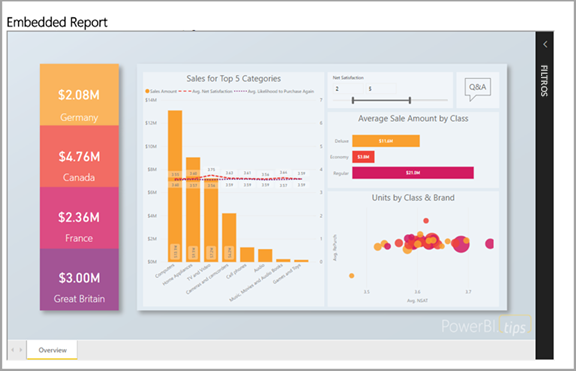
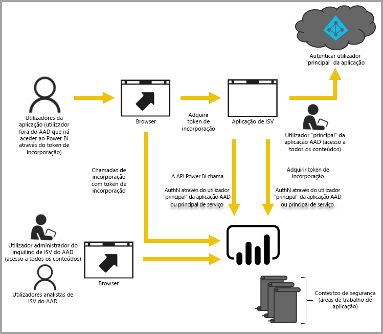

# Análise incorporada com o Power BI

O serviço Power BI (SaaS) e o serviço Power BI Embedded no Azure (PaaS) têm APIs para incorporar os seus dashboards e relatórios. Ao incorporar conteúdos, terá acesso às mais recentes funcionalidades do Power BI, como dashboards, gateways e áreas de trabalho.

Pode utilizar a [Ferramenta de configuração de incorporação](https://aka.ms/embedsetup) para começar rapidamente e transferir uma aplicação de exemplo.

Escolha a solução mais adequada para si:

* A solução [Incorporar para a sua organização](embedding.md#embedding-for-your-organization) permite-lhe alargar o serviço Power BI. Para tal, na [Ferramenta de configuração de incorporação](https://app.powerbi.com/embedsetup), implemente a solução *Incorporar para a sua organização*.
* A solução [Incorporar para os seus clientes](embedding.md#embedding-for-your-customers) permite-lhe incorporar dashboards e relatórios para utilizadores que não têm uma conta do Power BI. Para tal, na [Ferramenta de configuração de incorporação](https://app.powerbi.com/embedsetup), implemente a solução *Incorporar para os seus clientes*.

## Utilizar APIs

Existem dois cenários principais ao incorporar conteúdos do Power BI:
- Incorporação para os utilizadores da sua organização (que tenham licenças do Power BI). 
 
- Incorporação para os seus utilizadores e clientes sem a necessidade de licenças do Power BI. 

A [API REST do Power BI](/rest/api/power-bi/) permite ambos os cenários.

No caso de clientes e utilizadores sem licenças do Power BI, pode incorporar dashboards e relatórios na sua aplicação personalizada, utilizando a mesma API para servir a sua organização ou os seus clientes. Os seus clientes veem os dados que são geridos pela aplicação. Além disso, os utilizadores do Power BI da sua organização têm opções adicionais para verem *os respetivos dados* diretamente no Power BI ou no contexto da aplicação incorporada. Pode tirar total partido das APIs REST e JavaScript para as suas necessidades de incorporação.

Para compreender o funcionamento da incorporação, veja o [exemplo de incorporação do JavaScript](https://microsoft.github.io/PowerBI-JavaScript/demo/).

## Incorporar para a sua organização

A solução **Incorporar para a sua organização** permite-lhe alargar o serviço Power BI. Este tipo de incorporação exige que os utilizadores da sua aplicação iniciem sessão no serviço Power BI para verem os conteúdos. Quando alguém na sua organização iniciar sessão, essa pessoa só terá acesso aos relatórios e dashboards de que é proprietária ou que alguém partilhou com a mesma no serviço Power BI.

Alguns exemplos de incorporação para organizações incluem aplicações internas, como o [SharePoint Online](https://powerbi.microsoft.com/blog/integrate-power-bi-reports-in-sharepoint-online/), a [integração do Microsoft Teams (tem de ter direitos de administrador)](https://powerbi.microsoft.com/blog/power-bi-teams-up-with-microsoft-teams/) e o [Microsoft Dynamics](/dynamics365/customer-engagement/basics/add-edit-power-bi-visualizations-dashboard).

Para incorporar para a sua organização, veja [Tutorial: incorporar conteúdos do Power BI numa aplicação para a sua organização](embed-sample-for-your-organization.md).

Capacidades self-service, como editar, guardar, entre outras, estão disponíveis na [API de JavaScript](https://github.com/Microsoft/PowerBI-JavaScript) na incorporação para utilizadores do Power BI.

Pode utilizar a [Ferramenta de configuração de incorporação](https://app.powerbi.com/embedsetup) para começar e transferir uma aplicação de exemplo que o orienta ao longo da integração de um relatório na sua organização.

## Incorporar para os seus clientes

A solução **Incorporar para os seus clientes** permite-lhe incorporar dashboards e relatórios para utilizadores que não têm uma conta do Power BI. Este tipo de incorporação também é conhecido como *Power BI Embedded*.

O [Power BI Embedded](azure-pbie-what-is-power-bi-embedded.md) é um serviço do **Microsoft Azure** que permite que os fabricantes independentes de software (ISVs) e programadores incorporem rapidamente elementos visuais, relatórios e dashboards numa aplicação. Esta incorporação é feita através de um modelo baseado em capacidades e com taxa de utilização por hora.

O Power BI Embedded tem vantagens para um ISV e para os respetivos programadores e clientes. Por exemplo, um ISV pode começar a criar elementos visuais gratuitamente com o Power BI Desktop. Ao minimizarem os esforços de programação analítica de elementos visuais, os ISVs iniciam a comercialização mais rapidamente e destacam-se da concorrência com experiências de dados diferenciadas. Os ISVs também podem optar por cobrar um custo Premium pelo valor adicional obtido com a análise incorporada.

Com o Power BI Embedded, os seus clientes não precisam de ter conhecimentos sobre o Power BI. Pode utilizar dois métodos diferentes para criar uma aplicação incorporada:
- Conta do Power BI Pro 
- Service principal (Principal de serviço) 

A conta do Power BI Pro atua como a conta principal da sua aplicação (é como se fosse uma conta proxy). Esta conta permite-lhe gerar tokens de incorporação que fornecem acesso aos dashboards e relatórios do Power BI da sua aplicação.

O [principal de serviço](embed-service-principal.md) pode incorporar conteúdos do Power BI numa aplicação através de um token **só para aplicações**. Também lhe permite gerar tokens de incorporação que fornecem acesso aos dashboards e relatórios do Power BI da sua aplicação.

Os programadores que utilizam o Power BI Embedded podem ter tempo para se focar na criação da principal funcionalidade da sua aplicação, em vez de gastar tempo com a programação de elementos visuais e análises. Também podem satisfazer rapidamente as necessidades relativas a dashboards e relatórios dos clientes e incorporar facilmente com APIs e SDKs totalmente documentados. Ao ativar a exploração de dados de fácil navegação nas aplicações, os ISVs permitem que os clientes tomem decisões rápidas e baseadas em dados de acordo com o contexto a partir de qualquer dispositivo.

> [!IMPORTANT]
> Embora o serviço Power BI seja necessário para a incorporação, os seus clientes não precisam de ter uma conta do Power BI para ver os conteúdos incorporados da sua aplicação.

Quando tiver tudo pronto para passar à produção, terá de ser atribuída uma capacidade à área de trabalho. [Crie uma capacidade do Power BI Embedded](azure-pbie-create-capacity.md) no Microsoft Azure para utilizar com as aplicações.

Para obter informações sobre a incorporação, veja [Como incorporar conteúdos do Power BI](embed-sample-for-customers.md).

## Próximos passos

Agora, pode tentar incorporar conteúdo do Power BI numa aplicação ou tentar incorporar conteúdo do Power BI para os seus clientes.

> [!div class="nextstepaction"]
> [Incorporar para a sua organização](embed-sample-for-your-organization.md)

> [!div class="nextstepaction"]
> [O que é o Power BI Embedded?](azure-pbie-what-is-power-bi-embedded.md)

> [!div class="nextstepaction"]
>[Incorporar para os seus clientes](embed-sample-for-customers.md)

Mais perguntas? [Experimente perguntar à Comunidade do Power BI](https://community.powerbi.com/)