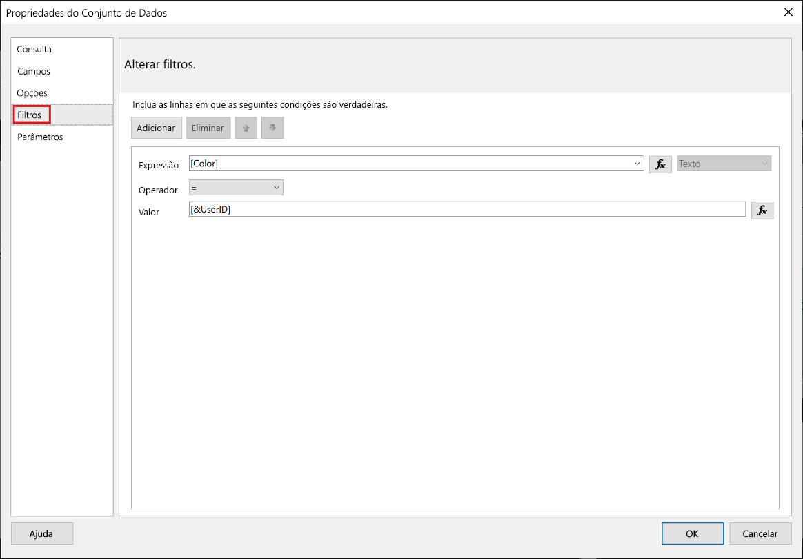
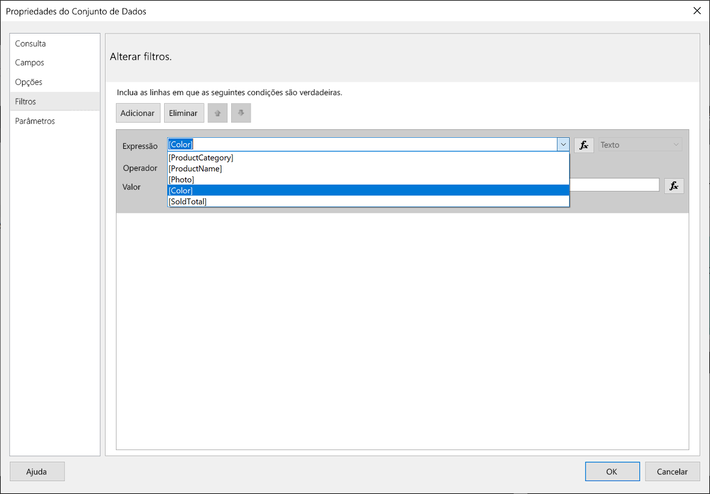
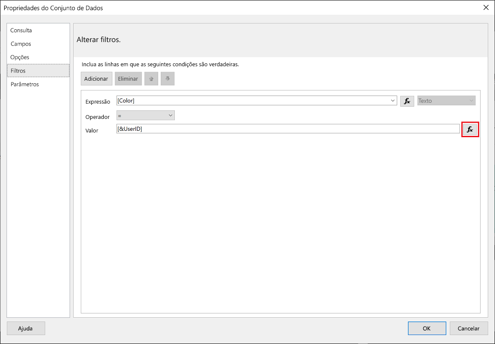
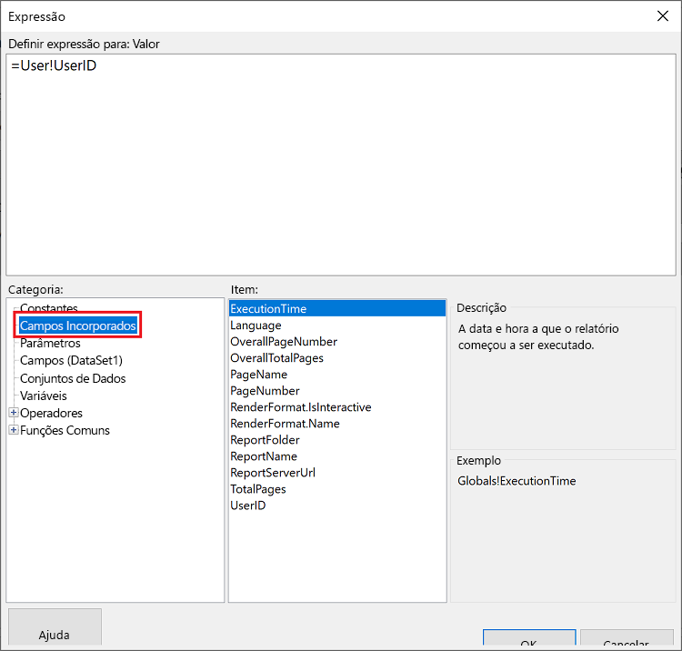
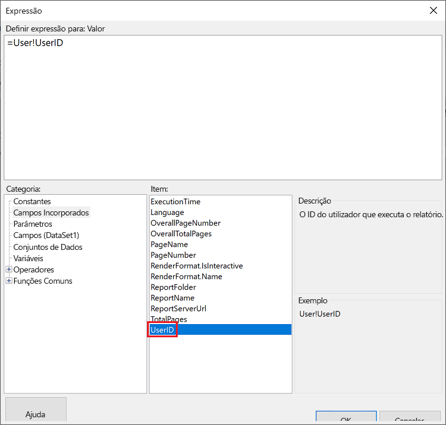
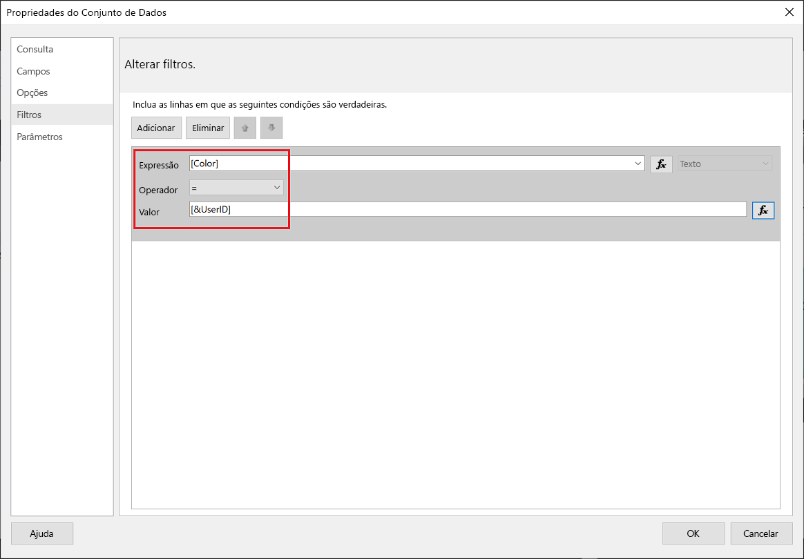
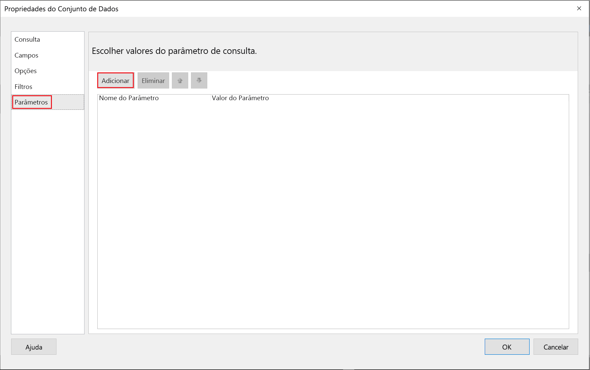
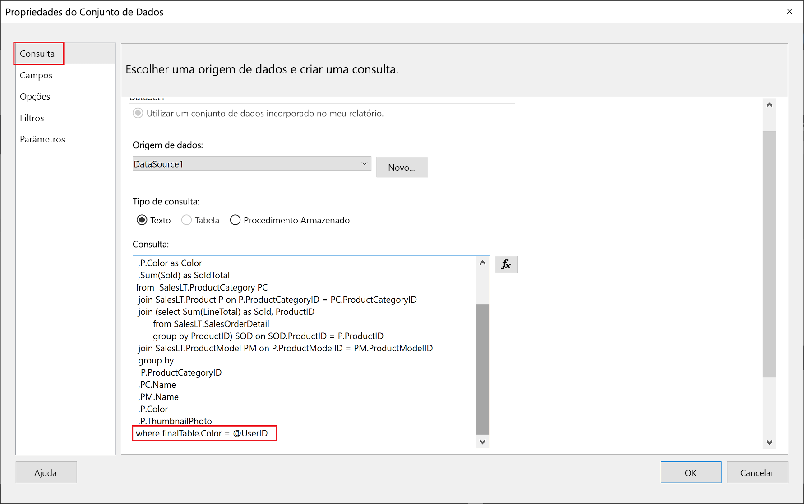

# <a name="implementing-row-level-security-in-embedded-paginated-reports"></a>Implementar segurança ao nível de linhas nos relatórios paginados incorporados

Quando incorporar um relatório paginado, pode controlar quais os dados que são apresentados. Isso permite adaptar as informações apresentadas por utilizador. Por exemplo, se tiver um relatório paginado do Power BI que inclua resultados de vendas globais, pode incorporar o mesmo para que estejam disponíveis apenas os resultados de vendas de uma determinada região.

Esta funcionalidade fornece uma forma segura de mostrar um subconjunto dos dados de forma a que não se comprometa o resto dos dados. É semelhante à funcionalidade de [Segurança ao Nível da Linha (RLS)](embedded-row-level-security.md), que proporciona uma forma segura de mostrar dados em relatórios do Power BI (não paginados), dashboards, mosaicos e conjuntos de dados.  

> [!NOTE]
> Esta funcionalidade funciona com a incorporação de relatórios paginados para clientes.

## <a name="configuring-a-parameter-to-filter-the-dataset"></a>Configurar um parâmetro para filtrar o conjunto de dados

Ao aplicar a segurança ao nível de linha a um relatório paginado do Power BI, tem de atribuir um [parâmetro](../../paginated-reports/report-builder-parameters.md) ao atributo **UserID**. Este parâmetro irá restringir os dados solicitados do conjunto de dados antes de o relatório ser incorporado.

Após atribuir o parâmetro ao **UserID**, utilize a API [Reports GenerateTokenInGroup](/rest/api/power-bi/embedtoken/reports_generatetokeningroup) para obter o token de incorporação.

## <a name="use-userid-as-a-filter-at-report-or-query-level"></a>Utilizar UserID como filtro ao nível de relatório ou consulta

Pode utilizar **UserId** como *filtro* ou numa *consulta* para a origem de dados no [Report Builder do Power BI](../../paginated-reports/report-builder-power-bi.md).

### <a name="using-the-filter"></a>Utilizar o filtro

1. Na janela **Propriedades do Conjunto de Dados**, no painel da esquerda, selecione **Filtro**.

    

2. No menu pendente **Expressão**, selecione o parâmetro que pretende utilizar para filtrar os dados.

     

3. Clique no botão de função **Valor**. 

    

4. Na janela **Expressão**, na lista de **Categorias**, selecione **Campos Incorporados**.

    

5. Na lista de **Itens**, selecione **UserID** e clique em **OK**.

    

6. Na janela de **Propriedades de Conjuntos de Dados**, certifique-se de que a expressão é *o seu parâmetro selecionado = UserID* e clique em **OK**.

    

### <a name="using-a-query"></a>Utilizar uma consulta

1. Na janela **Propriedades do Conjunto de Dados**, no painel da esquerda, selecione **Parâmetros** e clique em **Adicionar**.

    

2. No **Nome de Parâmetro**, introduza **\@UserID**; no **Valor de Parâmetro**, adicione **[&UserID]** .

     

3. No painel à esquerda, selecione **Consulta**; na Consulta adicione o parâmetro **UserID** como parte da sua consulta e clique em **OK**.
    > [!NOTE]
    > Na captura de ecrã abaixo, o parâmetro de cor é utilizado como exemplo (whereFinalTable.Color = @UserID). Se for necessário, pode criar uma consulta mais complexa.

    

## <a name="passing-the-configured-parameter-using-the-embed-token"></a>Transmitir o parâmetro configurado com o token de incorporação

Ao incorporar um relatório paginado para os seus clientes, a API [Reports GenerateTokenInGroup](/rest/api/power-bi/embedtoken/reports_generatetokeningroup) é utilizada para obter o token de incorporação. Este token também pode ser utilizado para filtrar alguns dos dados que são solicitados do relatório paginado.

Para expor apenas alguns dos dados, atribua o campo `username` com as informações que pretende apresentar. Por exemplo, num relatório paginado que tem um parâmetro de cor, se introduzir *green* no campo `username`, o token de incorporação irá restringir os dados incorporados para mostrar apenas os dados que têm o valor *green* na coluna de cor.

```JSON
{
    "accessLevel": "View",
    "reportId": "cfafbeb1-8037-4d0c-896e-a46fb27ff229",
    "identities": [
            {
                    // Replace the 'username' with a paginated report parameter
                    "username":     "...",
                    "reports: [
                        "cfafbeb1-8037-4d0c-896e-a46fb27ff229"
                    ]
            }
    ]
}
```