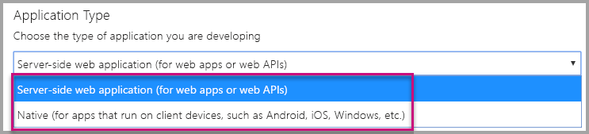
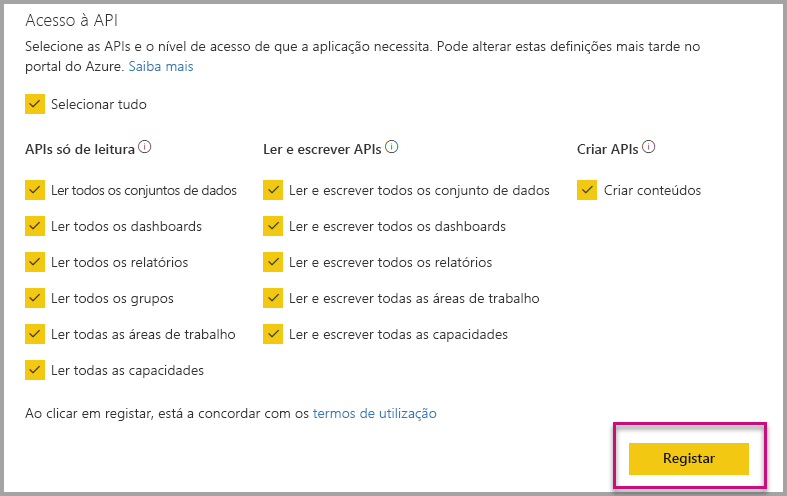
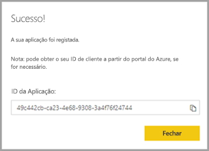
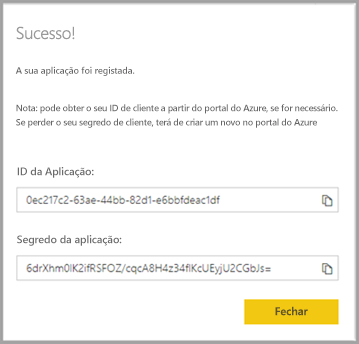
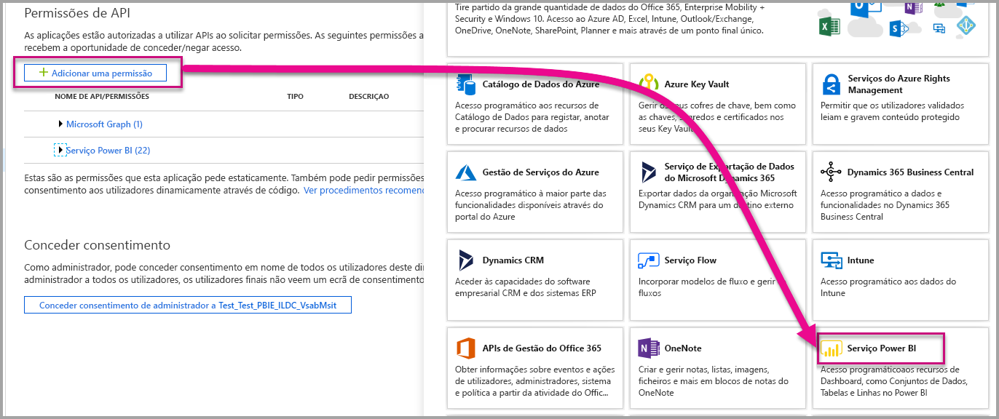

# <a name="register-an-azure-ad-application-to-use-with-power-bi"></a>Registar uma aplicação do Azure AD para utilizar com o Power BI

Saiba como registar uma aplicação no Azure Active Directory (Azure AD) para utilizar ao incorporar conteúdo do Power BI.

Pode registar a aplicação com o Azure AD para permitir que a sua aplicação aceda às [APIs REST do Power BI](https://docs.microsoft.com/rest/api/power-bi/). Quando registar a sua aplicação, pode estabelecer uma identidade para a sua aplicação e especificar permissões para recursos REST do Power BI.

> [!IMPORTANT]
> Antes de registar uma aplicação do Power BI, precisa de um [inquilino do Azure Active Directory e um utilizador organizacional](create-an-azure-active-directory-tenant.md). Se ainda não se inscreveu no Power BI com um utilizador no seu inquilino, o registo da aplicação não é concluído com êxito.

Existem duas formas de registar a sua aplicação. A primeira é com a [Ferramenta de Registo de Aplicações do Power BI](https://dev.powerbi.com/apps/) ou pode fazê-lo diretamente no portal do Azure. A Ferramenta de Registo de Aplicações do Power BI é a opção mais adequada, pois há apenas alguns campos para preencher. Se quiser fazer alterações na sua aplicação, utilize o portal do Azure.

## <a name="register-with-the-power-bi-application-registration-tool"></a>Registar com a Ferramenta de Registo de Aplicações do Power BI

Registe a aplicação no **Azure Active Directory** para estabelecer uma identidade para a sua aplicação e especificar permissões para recursos REST do Power BI. Ao registar uma aplicação, como uma aplicação de consola ou de um site, receberá um identificador que é utilizado pela aplicação para se identificar perante os utilizadores a quem está a pedir permissões.

Veja aqui como registar a sua aplicação com a Ferramenta de Registo de Aplicações do Power BI:

1. Vá para [dev.powerbi.com/apps](https://dev.powerbi.com/apps).

2. Selecione **Iniciar sessão** com a sua conta existente e, em seguida, selecione **Seguinte**.

3. Forneça um **Nome da Aplicação**.

4. Forneça um **Tipo de Aplicação**.

    Eis as diferenças entre optar por uma aplicação **Nativa** e uma **Aplicação Web do lado do servidor** para um tipo de aplicação.

    Nativa:
    * Planeia criar uma aplicação [destinada aos seus clientes](embed-sample-for-customers.md) através de uma conta de utilizador principal (uma licença do Power BI Pro utilizada para iniciar sessão no Power BI) para autenticar.

    Aplicação Web do lado do servidor:
    * Planeia criar uma aplicação [destinada à sua organização](embed-sample-for-your-organization.md).
    * Planeia criar uma aplicação [destinada aos seus clientes](embed-sample-for-customers.md) através do principal de serviço para autenticar.
    * Planeia criar aplicações Web ou APIs Web.

    

5. Se selecionou **Aplicação Web do lado do servidor** para o tipo de aplicação, então continue a introduzir um valor para o **URL da Home Page** e **URL de Redirecionamento**. O **URL de Redirecionamento** funciona com qualquer URL válido e deve corresponder à aplicação que criou. Se selecionou **Nativa**, então avance para o passo 6.

6. Selecione as APIs Power BI de que a sua aplicação precisa. Para obter mais informações sobre as permissões de acesso do Power BI, veja [Permissões do Power BI](power-bi-permissions.md). Em seguida, selecione **Registar**.

    

    > [!Important]
    > Se ativar os principais de serviço a serem utilizados com o Power BI, as permissões do Azure Active Directory deixarão de estar em vigor. As permissões são geridas através do portal de administração do Power BI.

7. Se selecionar **Nativa** para o tipo de aplicação, ser-lhe-á fornecido um **ID de Aplicação**. Se selecionar **Aplicação Web do lado do servidor** para o tipo de aplicação, irá receber um **ID de Aplicação** e um **Segredo da aplicação**.

    > [!Note]
    > O **ID de Aplicação** pode ser obtido a partir do portal do Azure, posteriormente, se necessário. Se perder o **Segredo da aplicação**, terá de criar um novo no portal do Azure.

| Nativa | Aplicação Web do lado do servidor |
|--------|-----------------------------|
|  |  |

Agora pode utilizar a aplicação registada como parte da sua aplicação personalizada para interagir com o serviço Power BI e a sua aplicação do Power BI Embedded.

## <a name="register-with-the-azure-portal"></a>Registar com o portal do Azure

A outra opção para registar a aplicação é fazê-lo diretamente no portal do Azure. Para registar a sua aplicação, siga estes passos.

1. Aceite os [Termos da API do Microsoft Power BI](https://powerbi.microsoft.com/api-terms).

2. Inicie sessão no [portal do Azure](https://portal.azure.com).

3. Escolha o seu inquilino do Azure AD ao selecionar a sua conta no canto superior direito da página.

4. No painel de navegação esquerdo, aceda a **Todos os serviços**, selecione **Registos das Aplicações** e, em seguida, selecione **Novo registo**.

5. Siga as instruções e crie uma nova aplicação.

   Para obter mais informações sobre como registar aplicações no Azure Active Directory, veja [Register an app with the Azure Active Directory](https://docs.microsoft.com/azure/active-directory/develop/quickstart-v2-register-an-app) (Registar aplicações com o Azure Active Directory)

## <a name="how-to-get-the-application-id"></a>Como obter o ID de Aplicação

Ao registar uma aplicação, receberá um [ID de Aplicação](embed-sample-for-customers.md#application-id).  O **ID de Aplicação** pede permissões aos utilizadores através da aplicação para os identificar.

## <a name="how-to-get-the-service-principal-object-id"></a>Como obter o ID do objeto do principal de serviço

Ao utilizar as [APIs Power BI](https://docs.microsoft.com/rest/api/power-bi/), certifique-se de que define as operações através do [ID do objeto do principal de serviço](embed-service-principal.md#how-to-get-the-service-principal-object-id) para fazer referência ao principal de serviço – por exemplo, para aplicar um principal de serviço como um administrador à sua área de trabalho.

## <a name="apply-permissions-to-your-application-within-azure-ad"></a>Aplicar permissões à sua aplicação no Azure AD

Ative permissões adicionais na sua aplicação, para além do que a página de registo de aplicações fornece. Pode realizar esta tarefa através do portal do Azure AD ou ao programar.

Precisa de ter sessão iniciada com uma conta *mestra*, utilizada para incorporar, ou uma conta de Administrador global.

### <a name="using-the-azure-ad-portal"></a>Utilizar o portal do Azure AD

1. Navegue até aos [Registos de aplicações](https://portal.azure.com/#blade/Microsoft_AAD_RegisteredApps/ApplicationsListBlade/quickStartType//sourceType/) no portal do Azure e selecione a aplicação que estiver a utilizar para incorporar.

2. Selecione **Permissões de API** em **Gerir**.

3. Em **Permissões de API**, selecione **Adicionar uma permissão** e, em seguida, selecione **Serviço Power BI**.

    

4. Selecione as permissões específicas de que precisa em **Permissões Delegadas**. Selecione-as uma a uma para guardar as seleções. Selecione **Guardar** quando terminar.

5. Selecione **Conceder Consentimento**.

    A ação **Conceder Consentimento** precisa da *conta principal* para evitar que lhe seja pedido consentimento pelo Azure AD. Se a conta que executa esta ação for de um Administrador Global, concede permissões a todos os utilizadores na sua organização para esta aplicação. Se a conta que realiza esta ação for a *conta principal* e não for de um Administrador Global, concede permissões apenas à *conta principal* para esta aplicação.

### <a name="applying-permissions-programmatically"></a>Aplicar permissões programaticamente

1. Tem de obter os principais de serviço existentes (utilizadores) no seu inquilino. Para obter informações sobre como fazê-lo, veja [servicePrincipal](https://docs.microsoft.com/graph/api/resources/serviceprincipal?view=graph-rest-beta).

    Pode chamar a *API Obter servicePrincipal* sem {ID} e esta irá apresentar-lhe todos os principais de serviço no inquilino.

2. Verifique a existência de um principal de serviço com o ID de aplicação da aplicação como a propriedade **appId**.

3. Crie um novo plano de serviço se estiver em falta na sua aplicação.

    ```json
    Post https://graph.microsoft.com/beta/servicePrincipals
    Authorization: Bearer ey..qw
    Content-Type: application/json
    {
    "accountEnabled" : true,
    "appId" : "{App_Client_ID}",
    "displayName" : "{App_DisplayName}"
    }
    ```

4. Conceder Permissões de Aplicação à API do Power BI

   Se estiver a utilizar um inquilino existente e não estiver interessado em conceder permissões em nome de todos os utilizadores de inquilino, pode conceder permissões a um utilizador específico ao substituir o valor de **contentType** para **Principal**.

   O valor para **consentType** pode indicar **AllPrincipals** ou **Principal**.

   * **AllPrincipals** só pode ser utilizado por um administrador de inquilinos para conceder permissões em nome de todos os utilizadores no inquilino.
   * **Principal** serve para conceder permissões em nome de um utilizador específico. Neste caso, deve ser adicionada uma propriedade adicional ao corpo do pedido: *principalId = {User_ObjectId}* .

     Precisa de *Conceder permissões* para a conta principal, para evitar que lhe seja pedido consentimento pelo Azure AD, o que não é possível ao efetuar um início de sessão não interativo.

     ```json
     Post https://graph.microsoft.com/beta/OAuth2PermissionGrants
     Authorization: Bearer ey..qw
     Content-Type: application/json
     {
     "clientId":"{Service_Plan_ID}",
     "consentType":"AllPrincipals",
     "resourceId":"c78a3685-1ce7-52cd-95f7-dc5aea8ec98e",
     "scope":"Dataset.ReadWrite.All Dashboard.Read.All Report.Read.All Group.Read Group.Read.All Content.Create Metadata.View_Any Dataset.Read.All Data.Alter_Any",
     "expiryTime":"2018-03-29T14:35:32.4943409+03:00",
     "startTime":"2017-03-29T14:35:32.4933413+03:00"
     }
     ```

    O **resourceId** *c78a3685-1ce7-52cd-95f7-dc5aea8ec98e* não é universal mas está dependente de inquilinos. Este valor é o objectId da aplicação "Serviço Power BI" no inquilino do Azure Active Directory (AAD).

    O utilizador pode obter este valor rapidamente no portal do Azure:
    1. https://portal.azure.com/#blade/Microsoft_AAD_IAM/StartboardApplicationsMenuBlade/AllApps

    2. Procure "Serviço Power BI" na Caixa de Pesquisa

5. Conceder Permissões de Aplicação ao Azure Active Directory (AAD)

   O valor para **consentType** pode indicar **AllPrincipals** ou **Principal**.

   * **AllPrincipals** só pode ser utilizado por um administrador de inquilinos para conceder permissões para todos os utilizadores no inquilino.
   * **Principal** serve para conceder permissões a um utilizador específico. Neste caso, deve ser adicionada uma propriedade adicional ao corpo do pedido: *principalId = {User_ObjectId}* .

   Precisa de *Conceder permissões* para a conta principal, para evitar que lhe seja pedido consentimento pelo Azure AD, o que não é possível ao efetuar um início de sessão não interativo.

   ```json
   Post https://graph.microsoft.com/beta/OAuth2PermissionGrants
   Authorization: Bearer ey..qw
   Content-Type: application/json
   { 
   "clientId":"{Service_Plan_ID}",
   "consentType":"AllPrincipals",
   "resourceId":"61e57743-d5cf-41ba-bd1a-2b381390a3f1",
   "scope":"User.Read Directory.AccessAsUser.All",
   "expiryTime":"2018-03-29T14:35:32.4943409+03:00",
   "startTime":"2017-03-29T14:35:32.4933413+03:00"
   }
   ```

## <a name="next-steps"></a>Próximos passos

Agora que registou a aplicação no Azure AD, tem de autenticar os utilizadores na sua aplicação. Dê uma vista de olhos em [Autenticar utilizadores e obter um token de acesso do Azure AD para a sua aplicação do Power BI](get-azuread-access-token.md) para aprender mais.

Mais perguntas? [Experimente perguntar à Comunidade do Power BI](https://community.powerbi.com/)