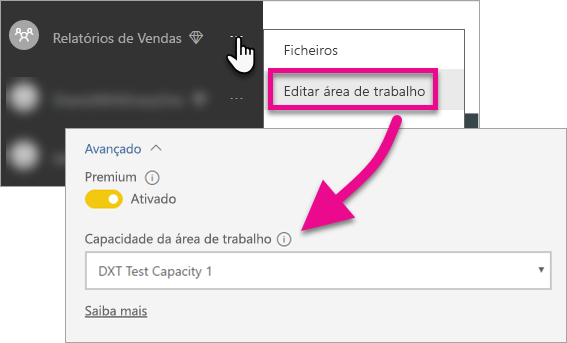

# Incorporar os dashboards, os relatórios e os mosaicos do Power BI

Saiba mais sobre os passos que precisa de tomar para incorporar conteúdo do Power BI na sua aplicação.

A Microsoft [anunciou o Power BI Premium](https://powerbi.microsoft.com/blog/microsoft-accelerates-modern-bi-adoption-with-power-bi-premium/), um novo modelo de licenciamento baseado em capacidades que aumenta a flexibilidade com que os utilizadores acedem, partilham e distribuem conteúdo. Esta oferta também proporciona desempenho e escalabilidade adicionais para o serviço Power BI. Também foi anunciado que o Power BI Embedded permite a criação de capacidade no Microsoft Azure. O Power BI Embedded concentra-se na sua aplicação e nos seus clientes. 

Este artigo analisa a incorporação dos conteúdos do Power BI para a sua organização e os seus clientes. Os passos são semelhantes entre os dois cenários. São feitas notas de aviso quando um passo é específico para incorporar para o seu cliente.

Existem alguns passos que tem de fazer com a sua aplicação, para tornar esta ação possível. Iremos percorrer os passos necessários para lhe permitir criar e utilizar conteúdos incorporados na aplicação.

> [!NOTE]
> As APIs do Power BI ainda se referem às áreas de trabalho de aplicações como grupos. Quaisquer referências a grupos significam que está a trabalhar com áreas de trabalho de aplicações.

## Passo 1: configure o ambiente de desenvolvimento de análise incorporado

Antes de começar a incorporar dashboards e relatórios na sua aplicação, deve certificar-se de que o ambiente está configurado para permitir a incorporação. Como parte da configuração, tem de fazer o seguinte.

* [Certificar-se de que cria um inquilino do Azure Active Directory](embedding-content.md#azureadtenant)
* [Criar a sua conta do Power BI Pro](embedding-content.md#proaccount)
* [Registo da aplicação e permissões](embedding-content.md#appreg)
* [Criar áreas de trabalho de aplicação](embedding-content.md#appws)
* [Criar e carregar os seus relatórios](embedding-content.md#createreports)

Pode utilizar a [Ferramenta de experiência de inclusão](https://aka.ms/embedsetup) para começar rapidamente e transferir uma aplicação de exemplo.

Escolha a solução mais adequada para si:
* [A incorporação para os seus clientes](embedding.md#embedding-for-your-customers) permite-lhe incorporar dashboards e relatórios para utilizadores que não têm uma conta para o Power BI. Execute a solução [Incorporar para os seus clientes](https://aka.ms/embedsetup/AppOwnsData).
* [A incorporação para a sua organização](embedding.md#embedding-for-your-organization) permite-lhe alargar o serviço Power BI. Execute a solução [Incorporar a sua organização](https://aka.ms/embedsetup/UserOwnsData).

No entanto, se optar por configurar o ambiente manualmente, pode continuar abaixo. 

> [!NOTE]
> A capacidade dedicada não é necessária para o desenvolvimento da sua aplicação. Os programadores da aplicação precisam de uma licença do Power BI Pro.

### Inquilino do Azure Active Directory

Precisa de um inquilino do Azure Active Directory (Azure AD) para incorporar os itens do Power BI. Este inquilino precisa de, pelo menos, um utilizador do Power BI Pro. Também tem de definir uma aplicação do Azure AD no inquilino. Pode utilizar um inquilino do Azure AD existente ou criar um novo especificamente para fins de incorporação.

Tem de determinar a configuração do inquilino a utilizar se estiver a incorporar para os seus clientes.

* Utilizar o inquilino do Power BI empresarial existente?
* Utilizar um inquilino separado para a sua aplicação?
* Utilizar um inquilino separado para cada cliente?

Se não quiser utilizar um inquilino existente, pode optar por criar um novo inquilino para a sua aplicação ou um para cada cliente, veja [Create an Azure Active Directory tenant (Criar um inquilino do Azure Active Directory)](create-an-azure-active-directory-tenant.md) ou [How to get an Azure Active Directory tenant (Como obter um inquilino do Azure Active Directory)](https://docs.microsoft.com/azure/active-directory/develop/active-directory-howto-tenant).

### Criar uma conta de utilizador do Power BI Pro

Apenas precisa de uma única conta Power BI Pro para incorporar conteúdo. No entanto, poderá ter alguns utilizadores diferentes que tenham acesso específico aos itens. Eis uma vista de possíveis utilizadores a considerar no seu inquilino.

As seguintes contas têm de existir no seu inquilino e ter uma licença do Power BI Pro atribuída às mesmas. É precisa uma licença do Power BI Pro para trabalhar com áreas de trabalho de aplicação no Power BI.

#### Um utilizador administrador de inquilino/organização

Recomenda-se que o Administrador Global de inquilino/organização não seja utilizado como a conta que a sua aplicação utiliza ao incorporar para os seus clientes. Esta ação serve para minimizar o acesso que a conta da aplicação tem no seu inquilino. O utilizador administrador tem de ser o administrador de todas as áreas de trabalho de aplicação criadas para incorporação.

#### Contas para os analistas que criam conteúdos

Pode ter vários utilizadores que criam conteúdo para o Power BI. Precisa de uma conta do Power BI Pro para cada analista que esteja a criar e implementar conteúdos para o Power BI.

#### Uma conta de utilizador *mestre* da aplicação para incorporar para os seus clientes

A conta mestra é a conta que a aplicação utiliza ao incorporar conteúdos para os seus clientes. O cenário é normalmente para aplicações ISV. A conta mestra é a única conta de que precisa na sua organização. Também pode ser utilizada como a conta de administrador e analista, mas não é recomendado. O seu back-end da aplicação armazena as credenciais desta conta e utiliza-as para obter um token de autenticação do Azure AD para utilização com as APIs do Power BI. Esta conta gera um token de incorporação para a aplicação para utilizar para os seus clientes.

A conta mestre é apenas um utilizador normal com uma licença do Power BI Pro que utiliza com a sua aplicação. A conta tem de ser um administrador da área de trabalho de aplicação que está a ser utilizada para incorporar.

###  Registo da aplicação e permissões

Tem de registar a sua aplicação no Azure AD para fazer chamadas à API REST. Para obter mais informações, veja [Register an Azure AD app to embed Power BI content (Registar uma aplicação do Azure AD para incorporar conteúdo do Power BI)](register-app.md).

### Criar áreas de trabalho de aplicação

Se está a incorporar dashboards e relatórios para os seus clientes, esses dashboards e relatórios têm de ser colocados numa área de trabalho da aplicação. A conta *mestra*, que foi mencionada acima, tem de ser um administrador da área de trabalho da aplicação.

[!INCLUDE [powerbi-service-create-app-workspace](../includes/powerbi-service-create-app-workspace.md)]

> [!NOTE]
> Um utilizador que não seja administrador só pode criar até 250 áreas de trabalho de aplicações. Para criar mais áreas de trabalho de aplicações, tem de utilizar uma conta de administrador de inquilinos.
>

### Criar e carregar os seus relatórios

Pode criar os seus relatórios e conjuntos de dados com o Power BI Desktop e, em seguida, publicar esses relatórios numa área de trabalho de aplicação. O utilizador final que publica os relatórios tem de ter uma licença do Power BI Pro para poder publicar numa área de trabalho da aplicação.

## Passo 2: incorpore os seus conteúdos

Na sua aplicação, precisa de autenticar com o Power BI. Se estiver a incorporar os conteúdos para os seus clientes, deve armazenar as credenciais para a conta *mestra* na sua aplicação.

> [!NOTE]
> Para obter mais informações sobre como autenticar os utilizadores e incorporar para os seus clientes, veja [Autenticar utilizadores e obter um token de acesso do Azure AD para a sua aplicação do Power BI](get-azuread-access-token.md).
>

Uma vez autenticados, na sua aplicação, utilize as APIs REST do Power BI e as APIs de JavaScript para incorporar os dashboards e relatórios na sua aplicação. 

Para **incorporar para a sua organização**, veja as seguintes orientações:

* [Integrar um dashboard numa aplicação](integrate-dashboard.md)
* [Integrar um mosaico numa aplicação](integrate-tile.md)
* [Integrar uma relatório numa aplicação](integrate-report.md)

Para **incorporar com os seus clientes**, o que é habitual para ISVs, veja o seguinte:

* [Integre um dashboard, mosaico ou relatório na sua aplicação](embed-sample-for-customers.md)

Ao incorporar para os seus clientes, é preciso um token de incorporação. Para saber mais, veja [Token de Incorporação](https://docs.microsoft.com/rest/api/power-bi/embedtoken).

## Passo 3: promova a sua solução para produção

São precisos alguns passos extra para mover para produção.

### Incorporar para a sua organização

Se estiver a incorporar para a sua organização, apenas terá de informar as pessoas como chegar à sua aplicação. 

Todos os utilizadores, independentemente da licença atribuída, podem utilizar conteúdos incorporados a partir de uma área de trabalho de aplicação (grupo), se essa área de trabalho for suportada por capacidade dedicada. Dito isto, tem de adicionar explicitamente à área de trabalho de aplicação todos os utilizadores que não tenham uma licença do Power BI Pro, caso contrário irá obter um erro 401 não autorizado. A tabela seguinte lista as SKUs do Power BI Premium disponíveis no Office 365.

| Nó de Capacidade | Total de núcleos *(Back-end + front-end)* | Núcleos de Back-end | Núcleos de Front-end | Limites do DirectQuery/ligação em direto | Composição máxima de páginas em hora de ponta |
| --- | --- | --- | --- | --- | --- |
| EM3 |4 núcleos virtuais |2 núcleos, 10 GB de RAM |2 núcleos | |601-1200 |
| P1 |8 núcleos virtuais |4 núcleos, 25 GB de RAM |4 núcleos |30 por segundo |1,201-2,400 |
| P2 |16 núcleos virtuais |8 núcleos, 50 GB de RAM |8 núcleos |60 por segundo |2,401-4,800 |
| P3 |32 núcleos virtuais |16 núcleos, 100 GB de RAM |16 núcleos |120 por segundo |4801-9600 |

> [!NOTE]
> Para comprar o Power BI Premium, tem de ser um Administrador Global ou de Faturação no seu inquilino. Para obter informações sobre como comprar o Power BI Premium, veja [How to purchase Power BI Premium (Como comprar o Power BI Premium)](../service-admin-premium-purchase.md).

>[!Note]
>[Configure o ambiente de análise incorporada para a sua organização.](#step-1-setup-your-embedded-analytics-development-environment)
>

### Incorporar para os seus clientes

Se estiver a incorporar para os seus clientes, faça o seguinte.

* Se estiver a utilizar um inquilino separado para o desenvolvimento, terá de se certificar de que as áreas de trabalho da aplicação, a par dos dashboards e relatórios, estão disponíveis no seu ambiente de produção. Certifique-se de que cria a aplicação no Azure AD para o seu inquilino de produção e que atribui as permissões de aplicação corretas, conforme indicado no Passo 1.
* Compre uma capacidade adequada às suas necessidades. Pode utilizar a tabela abaixo para compreender a SKU de capacidade do Power BI Embedded que poderá precisar. Para obter mais detalhes, veja [Embedded analytics capacity planning whitepaper (Documento técnico de planeamento da capacidade de análise incorporada)](https://aka.ms/pbiewhitepaper). Quando estiver pronto para comprar, poderá fazê-lo no [Portal do Microsoft Azure](https://portal.azure.com). Para obter mais informações sobre como criar a capacidade do Power BI Embedded, veja [Create Power BI Embedded capacity in the Azure portal (Criar capacidade do Power BI Embedded no portal do Azure)](https://docs.microsoft.com/azure/power-bi-embedded/create-capacity).

> [!IMPORTANT]
> Visto que os tokens de incorporação se destinam apenas a testes de programadores, o número de tokens de incorporação que uma conta principal do Power BI pode gerar é limitado. Tem de [comprar capacidade](https://docs.microsoft.com/power-bi/developer/embedded-faq#technical) para cenários de incorporação de tokens. Não existe limite para a geração de tokens de incorporação quando é comprada capacidade dedicada. Aceda a [Funcionalidades Disponíveis](https://docs.microsoft.com/rest/api/power-bi/availablefeatures) para verificar quantos tokens de incorporação gratuitos foram utilizados.

| Nó de Capacidade | Total de núcleos *(Back-end + front-end)* | Núcleos de Back-end | Núcleos de Front-end | Limites do DirectQuery/ligação em direto | Composição máxima de páginas em hora de ponta |
| --- | --- | --- | --- | --- | --- |
| A1 |1 núcleo virtual |.5 núcleos, 3 GB de RAM |.5 núcleos | 5 por segundo |1-300 |
| A2 |2 núcleos virtuais |1 núcleo, 5 GB de RAM |1 núcleo | 10 por segundo |301-600 |
| A3 |4 núcleos virtuais |2 núcleos, 10 GB de RAM |2 núcleos | 15 por segundo |601-1200 |
| A4 |8 núcleos virtuais |4 núcleos, 25 GB de RAM |4 núcleos |30 por segundo |1,201-2,400 |
| A5 |16 núcleos virtuais |8 núcleos, 50 GB de RAM |8 núcleos |60 por segundo |2,401-4,800 |
| A6 |32 núcleos virtuais |16 núcleos, 100 GB de RAM |16 núcleos |120 por segundo |4801-9600 |

* Edite a área de trabalho da aplicação e atribua-a a uma capacidade dedicada em Avançadas.

    

* Envie a sua aplicação atualizada para a produção e comece a incorporar dashboards e relatórios do Power BI.

>[!Note]
>[Configure o ambiente de análise incorporada para os seus clientes.](#step-1-setup-your-embedded-analytics-development-environment) 
>

## Definições de administração

Os Administradores Globais ou os administradores de serviço Power BI podem permitir a capacidade de utilizar as APIs REST, ou ativar ou desativar um inquilino. Os administradores do Power BI podem configurar esta definição para toda a organização ou para grupos de segurança individuais. Está ativada para toda a organização por predefinição. Isto é efetuado através do [portal de administração do Power BI](../service-admin-portal.md).

## Próximos passos

[Incorporação com o Power BI](embedding.md)  
[Como migrar conteúdos da coleção de áreas de trabalho do Power BI Embedded para o Power BI](migrate-from-powerbi-embedded.md)  
[Power BI Premium – o que é?](../service-premium.md)  
[Como comprar o Power BI Premium](../service-admin-premium-purchase.md)  
[Repositório Git da API JavaScript](https://github.com/Microsoft/PowerBI-JavaScript)  
[Repositório Git C# do Power BI](https://github.com/Microsoft/PowerBI-CSharp)  
[Exemplo de incorporação de JavaScript](https://microsoft.github.io/PowerBI-JavaScript/demo/)  
[Documento técnico de planeamento da capacidade de análise incorporada](https://aka.ms/pbiewhitepaper)  
[Documento técnico do Power BI Premium](https://aka.ms/pbipremiumwhitepaper)  

Mais perguntas? [Experimente perguntar à Comunidade do Power BI](http://community.powerbi.com/)