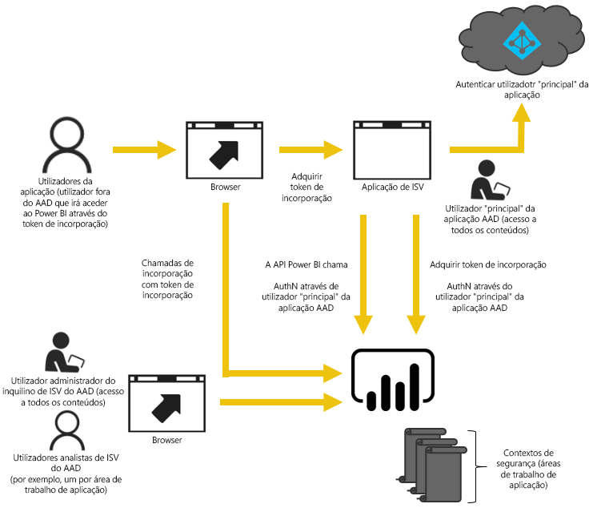

# Análise incorporada com o Power BI

O serviço Power BI (SaaS) e o serviço Power BI Embedded no Azure (PaaS) têm APIs para incorporar os seus dashboards e relatórios. Esta funcionalidade significa que terá um conjunto de capacidades e acesso às funcionalidades mais recentes do Power BI, tais como dashboards, gateways e áreas de trabalho de aplicações, quando incorporar o seu conteúdo.

Pode utilizar a [Ferramenta de configuração de incorporação](https://aka.ms/embedsetup) para começar rapidamente e transferir uma aplicação de exemplo.

Escolha a solução mais adequada para si:

* A solução [Incorporar para a sua organização](embedding.md#embedding-for-your-organization) permite-lhe alargar o serviço Power BI. Execute a solução [Incorporar a sua organização](https://aka.ms/embedsetup/UserOwnsData).
* A solução [Incorporar para os seus clientes](embedding.md#embedding-for-your-customers) permite-lhe incorporar dashboards e relatórios para utilizadores que não têm uma conta para o Power BI. Execute a solução [Incorporar para os seus clientes](https://aka.ms/embedsetup/AppOwnsData).

## Com APIs

Existem dois cenários principais ao incorporar conteúdos do Power BI.  Incorporação para utilizadores na sua organização (que possuem licenças do Power BI) e incorporação para os seus utilizadores e clientes sem que necessitem de licenças do Power BI. A API REST do Power BI permite ambos os cenários.

No caso de clientes e utilizadores sem licenças do Power BI, pode incorporar dashboards e relatórios na sua aplicação personalizada, utilizando a mesma API para servir a sua organização ou os seus clientes. Os seus clientes veem os dados que são geridos pela aplicação. Também, no caso dos utilizadores do Power BI na sua organização, estes terão as opções adicionais para ver *os seus dados* diretamente no Power BI ou no contexto da aplicação incorporada. Pode tirar total partido das APIs REST e JavaScript para as suas necessidades de incorporação.

Para ver um exemplo de como a incorporação funciona, consulte o [exemplo de incorporação de JavaScript](https://microsoft.github.io/PowerBI-JavaScript/demo/).

## Incorporar para a sua organização

A solução **Incorporar para a sua organização** permite-lhe alargar o serviço Power BI. A solução Incorporar para a sua organização requer que os utilizadores da sua aplicação iniciem sessão no serviço Power BI quando quiserem ver os seus conteúdos. Quando alguém na sua organização iniciar sessão, esta pessoa só tem acesso aos relatórios e dashboards de que é proprietária ou que foram partilhados com ela no serviço Power BI.

*Alguns exemplos de incorporação para a sua organização incluem aplicações internas, como o [SharePoint Online](https://powerbi.microsoft.com/blog/integrate-power-bi-reports-in-sharepoint-online/), a [integração do Microsoft Teams (tem de ter direitos de administrador)](https://powerbi.microsoft.com/blog/power-bi-teams-up-with-microsoft-teams/) e o [Microsoft Dynamics](https://docs.microsoft.com/dynamics365/customer-engagement/basics/add-edit-power-bi-visualizations-dashboard).*

Para incorporação na sua organização, veja abaixo:

* [Integrar uma relatório numa aplicação](embed-sample-for-your-organization.md)

Capacidades self-service, como editar, guardar, entre outras, estão disponíveis na [API de JavaScript](https://github.com/Microsoft/PowerBI-JavaScript) na incorporação para utilizadores do Power BI.

Pode utilizar a [Ferramenta de configuração de incorporação](https://aka.ms/embedsetup/UserOwnsData) para incorporação na sua organização e começar rapidamente e transferir uma aplicação de exemplo que o orienta ao longo da integração de um relatório na sua organização.

## Incorporar para os seus clientes

A solução **Incorporar para os seus clientes** permite-lhe incorporar dashboards e relatórios para utilizadores que não tenham uma conta para o Power BI. A solução Incorporar para os seus clientes também é conhecida como **Power BI Embedded**.

O [Power BI Embedded](azure-pbie-what-is-power-bi-embedded.md) é um serviço do **Microsoft Azure** que permite que os fabricantes independentes de software (ISVs) e programadores incorporem rapidamente elementos visuais, relatórios e dashboards numa aplicação através de um modelo baseado em capacidades e com taxa de utilização por hora.

O Power BI Embedded tem vantagens para um ISV e para os respetivos programadores e clientes. Por exemplo, um ISV pode começar a criar elementos visuais gratuitamente com o Power BI Desktop. Os ISVs podem iniciar a comercialização mais rapidamente ao minimizarem os esforços de programação analítica de elementos visuais e destacarem-se da concorrência com experiências de dados diferenciadas. Os ISVs também podem optar por cobrar um Premium pelo valor adicional obtido com a análise incorporada.

Com o Power BI Embedded, os seus clientes não precisam de ter conhecimentos sobre o Power BI. Só precisa de uma conta do Power BI Pro para criar uma aplicação incorporada. A conta do Power BI Pro atua como uma conta principal para a sua aplicação (é como se esta conta principal fosse uma conta proxy). A conta do Power BI Pro também permite gerar tokens de incorporação que fornecem acesso a dashboards e relatórios no serviço Power BI que são propriedade da/geridos pela sua aplicação.

Os programadores que utilizam o Power BI Embedded podem ter tempo para se focar no objetivo principal da aplicação em vez de gastar tempo com elementos visuais e análises. Os programadores podem satisfazer rapidamente as necessidades relativas a dashboards e relatórios dos clientes e incorporar facilmente com APIs e SDKs totalmente documentados. Ao ativar a exploração de dados de fácil navegação nas aplicações, os ISVs permitem que os clientes tomem decisões rápidas e baseadas em dados de acordo com o contexto a partir de qualquer dispositivo.

> [!IMPORTANT]
> Apesar de a incorporação ter uma dependência no serviço Power BI, não existe uma dependência no Power BI para os seus clientes. Os utilizadores não terão de se inscrever no Power BI para ver o conteúdo incorporado na aplicação.

Quando estiver pronto para passar à produção, terá de ser atribuída uma capacidade dedicada à sua área de trabalho de aplicação. O Power BI Embedded, no Microsoft Azure, disponibiliza [capacidades dedicadas](azure-pbie-create-capacity.md) para as suas aplicações.

Para obter detalhes sobre como incorporar, veja [Como incorporar os seus dashboards, relatórios e mosaicos do Power BI](embed-sample-for-customers.md).

## Próximos passos

Agora, pode tentar incorporar conteúdo do Power BI numa aplicação ou tentar incorporar conteúdo do Power BI para os seus clientes.

> [!div class="nextstepaction"]
> [Incorporar para a sua organização](embed-sample-for-your-organization.md)

> [!div class="nextstepaction"]
> [O que é o Power BI Embedded?](azure-pbie-what-is-power-bi-embedded.md)

> [!div class="nextstepaction"]
>[Incorporar para os seus clientes](embed-sample-for-customers.md)

Mais perguntas? [Experimente perguntar à Comunidade do Power BI](http://community.powerbi.com/)