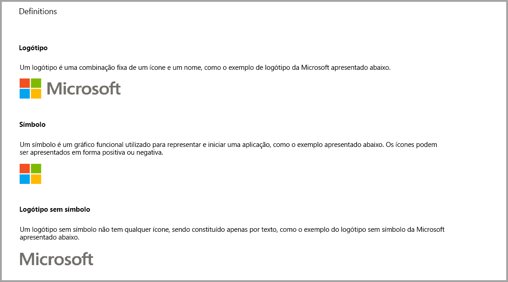
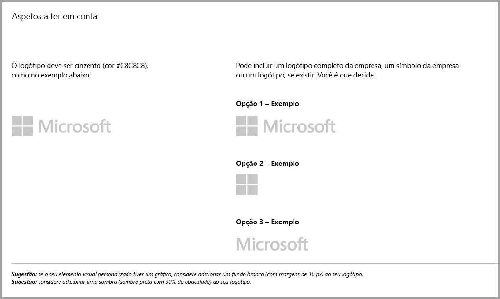
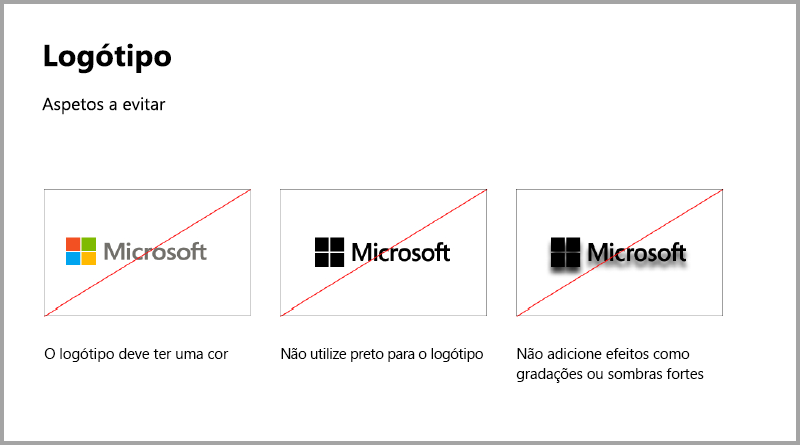
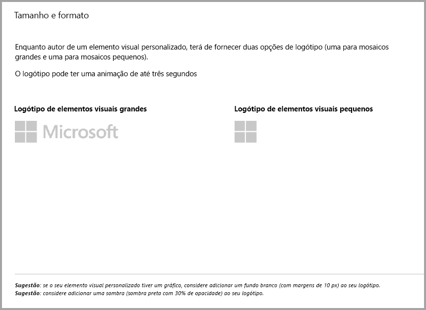
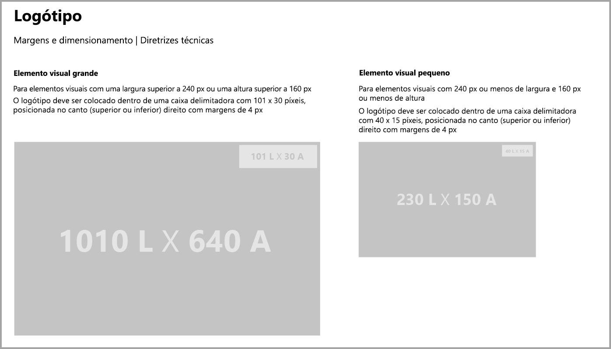
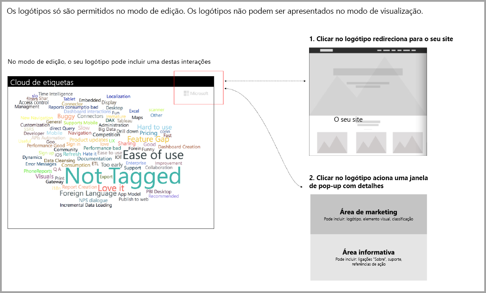

# Diretrizes de elementos visuais do Power BI
Antes de [publicar](https://docs.microsoft.com/power-bi/developer/office-store) o seu elemento visual no AppSource para que outras pessoas o descubram e utilizem, certifique-se de que segue as diretrizes para criar uma ótima experiência para os seus utilizadores. 

## Menu de contexto
O menu de contexto é o menu de clique com o botão direito do rato apresentado quando o utilizador passa o rato sobre um elemento visual.
Todos os elementos visuais do Power BI devem permitir que o menu de contexto proporcione uma experiência unificada. Veja [este artigo](https://github.com/Microsoft/PowerBI-visuals/blob/gh-pages/tutorials/building-bar-chart/adding-context-menu-to-the-bar.md) para saber como adicionar um menu de contexto.

## Diretrizes de logótipo
> [!NOTE]
> A palavra logótipo neste artigo refere-se a qualquer ícone de empresa comercial, conforme descrito nas imagens abaixo. 

Esta secção descreve as especificações para adicionar logótipos aos elementos visuais do Power BI. Os logótipos não são obrigatórios. Se forem adicionados, têm de seguir estas diretrizes. 

> [!IMPORTANT]
> Os logótipos são permitidos no *modo só de edição*. Os logótipos *não podem* ser apresentados no modo de visualização.

Os ícones informativos, se existirem, no modo de leitura devem estar em conformidade com a cor, o tamanho e o local como logótipos acima.

## Diretrizes para elementos visuais do Power BI com compras adicionais

Até recentemente, o Marketplace (AppSource) aceitava apenas elementos visuais do Power BI gratuitos. Esta política foi alterada (dezembro de 2018) para que também possa submeter os elementos visuais para o AppSource com uma etiqueta de preço "Pode ser necessária a compra adicional". 

Os elementos visuais com a etiqueta “Pode ser necessária uma compra adicional” são semelhantes aos suplementos de compras via aplicação (IAP) na Loja Office. Os programadores também podem submeter estes elementos visuais para obter uma certificação depois de a equipa do AppSource os aprovar e confirmar que estão em conformidade com os requisitos de certificação. Para obter mais informações sobre os requisitos, veja [Elementos visuais certificados do Power BI](../power-bi-custom-visuals-certified.md).

> [!NOTE]
> Para o elemento visual ser certificado, não deve aceder a serviços externos ou recursos.

>[!IMPORTANT]  
> Se atualizar o seu elemento visual de gratuito para "Pode ser necessária a compra adicional", os utilizadores têm de receber o mesmo nível de funcionalidades gratuitas como antes da atualização. Opcionalmente, pode adicionar funcionalidades avançadas pagas para além das funcionalidades gratuitas existentes. Recomendamos que submeta os elementos visuais de IAP com as funcionalidades avançadas como novos elementos visuais e que não atualize as funcionalidades gratuitas existentes.

## O que foi alterado no processo de submissão?

Os programadores carregam os elementos visuais de IAP no AppSource através do Dashboard de Vendedor, conforme têm vindo a fazer com os elementos visuais gratuitos. Para indicar que o elemento visual submetido tem funcionalidades de IAP, os programadores devem escrever nas notas do Dashboard de Vendedor: “Elemento visual com compra via aplicação”. Além disso, os programadores necessitam de fornecer um token ou chave de licença para que a equipa de validação possa validar as funcionalidades de IAP. Quando o elemento visual estiver validado e aprovado, a listagem do AppSource para o elemento visual de IAP apresentará a informação “Pode ser necessária uma compra adicional" sob as opções de preços.

## O que é um elemento visual do Power BI com funcionalidades de IAP?

Um elemento visual de IAP é um elemento visual *gratuito* que oferece *funcionalidades gratuitas*. Também tem algumas funcionalidades avançadas para as quais podem ser aplicados custos adicionais para serem utilizadas. Na descrição do elemento visual, os programadores têm de notificar os utilizadores sobre as funcionalidades que exigem compras adicionais para poderem ser utilizadas. Atualmente, a Microsoft não disponibiliza APIs nativas para suportar a compra de aplicações e suplementos.

Os programadores podem utilizar qualquer sistema de pagamento externo para estas compras. Para obter mais informações, veja a [nossa política de loja](https://docs.microsoft.com/office/dev/store/validation-policies#2-apps-or-add-ins-can-display-certain-ads).

> [!NOTE]
> Não são permitidas marcas d'água nas funcionalidades ou elementos visuais gratuitos. As marcas d'água só podem ser utilizadas em funcionalidades pagas utilizadas sem uma licença válida. Recomendamos que seja apresentada uma janela pop-up com todas as informações relacionadas com a licença, caso as funcionalidades pagas avançadas sejam utilizadas sem uma licença válida.  

## Melhores práticas

### Página de destino da aplicação

Utilize a página de destino para esclarecer aos utilizadores como podem utilizar o elemento visual e onde comprar a licença. Não inclua vídeos acionados automaticamente. Adicione apenas material que ajude a melhorar a experiência do utilizador, tais como informações ou ligações para detalhes da compra da licença e como utilizar as funcionalidades de IAP.

### Chave de licença e token

Para comodidade do utilizador, adicione campos relativos à chave de licença ou token na parte superior do painel de formatação.

## PERGUNTAS FREQUENTES

Para obter mais informações acerca dos elementos visuais, aceda às [Perguntas frequentes sobre os elementos visuais com compras adicionais](https://docs.microsoft.com/power-bi/power-bi-custom-visuals-faq#visuals-with-additional-purchases).

## Próximos passos

Saiba como pode publicar o seu elemento visual personalizado no [AppSource](office-store.md) para que outros o possam encontrar e utilizar.
