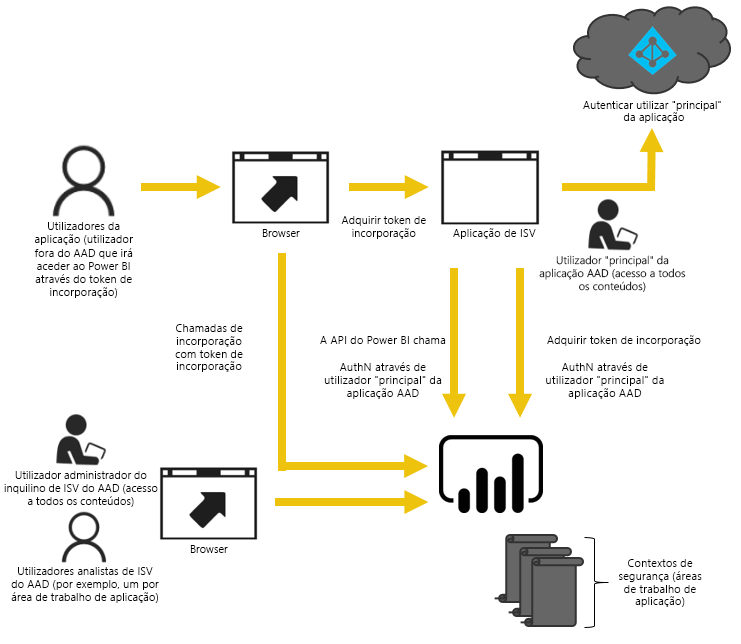
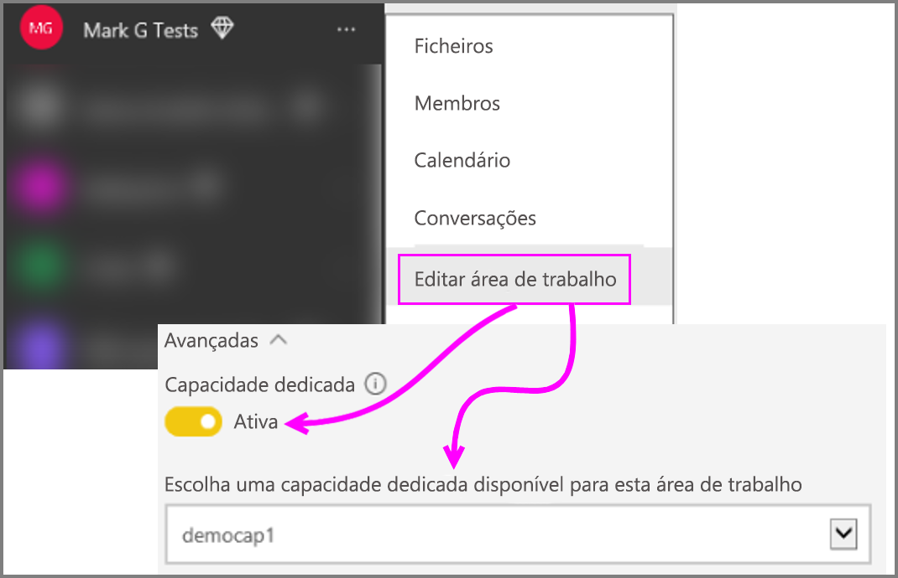

# Como migrar conteúdos da Coleção de Áreas de Trabalho do Power BI para o Power BI Embedded

Saiba como migrar a partir da Coleção de Áreas de Trabalho do Power BI para o Power BI Embedded e tire partido dos avanços de incorporação de conteúdos nas aplicações.

Recentemente, a Microsoft [anunciou o Power BI Embedded](https://powerbi.microsoft.com/blog/power-bi-embedded-capacity-based-skus-coming-to-azure/), um novo modelo de licenciamento baseado em capacidades que aumenta a flexibilidade com que os utilizadores acedem, partilham e distribuem conteúdos. Esta oferta também proporciona desempenho e escalabilidade adicionais.

Com o Power BI Embedded, ao incorporar os conteúdos, terá uma superfície de API, um conjunto consistente de capacidades e acesso às funcionalidades mais recentes do Power BI, como dashboards, gateways e áreas de trabalho. Daqui em diante, poderá começar com o Power BI Desktop e mudar para a implementação com o Power BI Embedded.

A Coleção de Áreas de Trabalho do Power BI atual continuará disponível por tempo limitado. Os clientes que tiverem um Contrato Enterprise terão acesso até à expiração dos contratos existentes; os clientes que adquiriram a Coleção de Áreas de Trabalho do Power BI através de canais diretos ou CSP irão continuar a usufruir do acesso durante um ano a contar da data de Disponibilidade Geral do Power BI Embedded.  Este artigo fornece algumas orientações sobre a migração da Coleção de Áreas de Trabalho do Power BI para a nova experiência do Power BI Embedded e que alterações deve esperar encontrar na sua aplicação.

> [!IMPORTANT]
> Apesar de a migração estabelecer uma dependência em relação ao Power BI Embedded, não haverá qualquer dependência relativamente ao Power BI para os utilizadores da aplicação ao utilizarem um **token de incorporação**. Os utilizadores não terão de se inscrever no Power BI para ver o conteúdo incorporado na aplicação. Pode recorrer a esta abordagem de incorporação para utilizadores do Embedded que não utilizam o Power BI.

Antes de começar a migrar para o novo Power BI Embedded, pode percorrer rapidamente um guia passo a passo que o ajuda a configurar o seu novo ambiente do Power BI Embedded ao utilizar a [Ferramenta de configuração de incorporação](https://aka.ms/embedsetup).

Escolha a solução mais adequada para si:
* **Incorporar para os seus clientes**, se estiver interessado numa solução em que [os dados pertencem à aplicação](https://aka.ms/embedsetup/AppOwnsData). A solução [Incorporar para os seus clientes](embedding.md#embedding-for-your-customers) permite-lhe incorporar dashboards e relatórios para utilizadores que não têm uma conta para o Power BI. 

* **Incorporar para a sua organização**, se estiver interessado numa solução em que [os dados pertencem ao utilizador](https://aka.ms/embedsetup/UserOwnsData). A solução [Incorporar para a sua organização](embedding.md#embedding-for-your-organization) permite-lhe alargar o serviço Power BI.

## Preparar a migração

Tem de efetuar alguns procedimentos para preparar a migração da Coleção de Áreas de Trabalho do Power BI para o Power BI Embedded. Precisa de um inquilino disponível, a par de um utilizador que tenha uma licença do Power BI Pro.

1. Certifique-se de que tem acesso a um inquilino do Azure Active Directory (Azure AD).

    Tem de especificar a configuração do inquilino a utilizar.

   * Utilizar o inquilino do Power BI empresarial existente?
   * Utilizar um inquilino separado para a sua aplicação?
   * Utilizar um inquilino separado para cada cliente?

     Se optar por criar um novo inquilino para a sua aplicação ou para cada cliente, consulte o artigo [Criar um inquilino do Azure Active Directory](create-an-azure-active-directory-tenant.md) ou [Como obter um inquilino do Azure Active Directory](https://docs.microsoft.com/azure/active-directory/develop/active-directory-howto-tenant).
2. Crie um utilizador neste novo inquilino que irá funcionar como a conta "principal" da aplicação. Essa conta tem de se inscrever no Power BI e tem de ter uma licença do Power BI Pro atribuída.

## Contas no Azure AD

As contas que se seguem têm de existir no seu inquilino.

> [!NOTE]
> Estas contas têm de ter licenças do Power BI Pro para poderem utilizar áreas de trabalho.

1. Um utilizador administrador do inquilino.

    Recomenda-se que este utilizador seja membro de todas as áreas de trabalho criadas para fins de incorporação.

2. Contas para os analistas que irão criar o conteúdo.

    Estes utilizadores devem ser atribuídos a áreas de trabalho conforme necessário.

3. Uma conta de utilizador *principal* da aplicação ou uma conta do Power BI Embedded.

    O back-end da aplicação irá armazenar as credenciais desta conta e utilizá-las para obter um token do Azure AD para utilização com as APIs REST do Power BI. Esta conta será utilizada para gerar o token de incorporação para a aplicação. Esta conta também tem de ser um administrador das áreas de trabalho criadas para fins de incorporação.

> [!NOTE]
> Esta é apenas uma conta de utilizador normal na sua organização que será utilizada para fins de incorporação.

## Registo da aplicação e permissões

Terá de registar uma aplicação no Azure AD e conceder determinadas permissões.

### Registar uma aplicação

Terá de registar a sua aplicação no Azure AD para fazer chamadas à API REST. Isto inclui aceder ao portal do Azure para aplicar configuração adicional, bem como aceder à página de registo de aplicações do Power BI. Para obter mais informações, consulte [Registar uma aplicação do Azure AD para incorporar conteúdo do Power BI](register-app.md).

Deve registar a aplicação com a conta **principal** da aplicação.

## Criar áreas de trabalho (Obrigatório)

Poderá tirar partido das áreas de trabalho para proporcionar um isolamento melhor se a aplicação estiver a prestar serviços a múltiplos clientes. Os dashboards e relatórios estariam isolados entre os clientes. Em seguida, poderia utilizar uma conta do Power BI por área de trabalho para isolar ainda mais as experiências da aplicação entre os clientes.

> [!IMPORTANT]
> Não pode utilizar uma área de trabalho pessoal de modo a tirar partido da incorporação para utilizadores que não utilizam o Power BI.

Precisa de um utilizador que tenha uma licença do Pro para criar uma área de trabalho no Power BI. Por predefinição, o utilizador do Power BI que cria a área de trabalho será o administrador dessa área de trabalho.

> [!NOTE]
> A conta *principal* da aplicação tem de ser um administrador da área de trabalho.

## Migração de conteúdo

A migração do conteúdo das suas coleções de áreas de trabalho para o Power BI Embedded pode ser feita em paralelo para a sua solução atual e não implica qualquer período de indisponibilidade.

Existe uma **ferramenta de migração** à sua disposição para ajudar a copiar o conteúdo da Coleção de Áreas de Trabalho do Power BI para o Power BI Embedded. Especialmente se tiver muito conteúdo. Para obter mais informações, consulte [Ferramenta de migração do Power BI Embedded](migrate-tool.md).

A migração do conteúdo baseia-se sobretudo em duas APIs.

1. Transferir PBIX – Esta API pode transferir os ficheiros PBIX carregados no Power BI depois de Outubro de 2016.
2. Importar PBIX – Esta API carrega ficheiros PBIX no Power BI.

Para alguns fragmentos de código relacionados, veja [Code snippets for migrating content from Power BI Workspace Collection (Fragmentos de código para a migração de conteúdos a partir da Coleção de Áreas de Trabalho do Power BI)](migrate-code-snippets.md).

### Tipos de relatório

Existem vários tipos de relatório, sendo que cada um deles precisa de um fluxo de migração ligeiramente diferente.

#### Relatório e conjunto de dados em cache

Os conjuntos de dados em cache reportam a ficheiros PBIX com dados importados, por oposição a uma ligação em direto ou uma ligação de DirectQuery.

**Fluxo**

1. Chame a API Transferir PBIX a partir da área de trabalho PaaS.
2. Guarde o PBIX.
3. Chame Importar PBIX para a área de trabalho SaaS.

#### Relatório e conjunto de dados de DirectQuery

**Fluxo**

1. Chame GET https://api.powerbi.com/v1.0/collections/{collection_id}/workspaces/{wid}/datasets/{dataset_id}/Default.GetBoundGatewayDataSources e guarde a cadeia de ligação que recebeu.
2. Chame a API Transferir PBIX a partir da área de trabalho PaaS.
3. Guarde o PBIX.
4. Chame Importar PBIX para a área de trabalho SaaS.
5. Atualize a cadeia de ligação ao chamar - POST https://api.powerbi.com/v1.0/myorg/datasets/{dataset_id}/Default.SetAllConnections
6. Obtenha identificadores de GW e de origem de dados ao chamar - GET https://api.powerbi.com/v1.0/myorg/datasets/{dataset_id}/Default.GetBoundGatewayDataSources
7. Atualize as credenciais do utilizador ao chamar - PATCH https://api.powerbi.com/v1.0/myorg/gateways/{gateway_id}/datasources/{datasource_id}

#### Relatórios e conjunto de dados antigos

Estes são conjuntos de dados/relatórios criados antes de Outubro de 2016. A API Transferir PBIX não suporta PBIXs carregados antes de Outubro de 2016

**Fluxo**

1. Obtenha o PBIX a partir do seu ambiente de desenvolvimento (o controlo de origem interno).
2. Chame Importar PBIX para a área de trabalho SaaS.

#### Relatório e conjunto de dados push

A API Transferir PBIX não suporta conjuntos de dados da *API Push*. Os dados de conjuntos de dados da API Push não podem ser transferidos de PaaS para SaaS.

**Fluxo**

1. Chame a API "Criar conjunto de dados" com o conjunto de dados JSON para criar o conjunto de dados na área de trabalho SaaS.
2. Reconstrua o relatório para o conjunto de dados criado*.

É possível utilizar algumas soluções para migrar o relatório da API push de PaaS para SaaS com o seguinte procedimento.

1. Carregue um PBIX fictício para a área de trabalho PaaS.
2. Clone o relatório da api push e vincule-o ao PBIX fictício do passo 1.
3. Transfira o relatório da API push com o PBIX fictício.
4. Carregue o PBIX fictício para a sua área de trabalho SaaS.
5. Crie o conjunto de dados push na sua área de trabalho SaaS.
6. Volte a vincular o relatório ao conjunto de dados da api push.

## Criar e carregar novos relatórios

Além do conteúdo migrado a partir da Coleção de Áreas de Trabalho do Power BI, pode criar os seus relatórios e conjuntos de dados com o Power BI Desktop e, em seguida, publicar esses relatórios numa área de trabalho. O utilizador final que publica os relatórios tem de ter uma licença do Power BI Pro para poder publicar numa área de trabalho.

## Reconstruir a aplicação

1. Terá de modificar a sua aplicação para utilizar as APIs REST do Power BI e a localização de relatórios no powerbi.com.
2. Reconstrua a sua autenticação AuthN/AuthZ com a conta *principal* da aplicação. Pode tirar partido da utilização de um [token de incorporação](https://docs.microsoft.com/rest/api/power-bi/embedtoken) para permitir que este utilizador aja em nome de outros utilizadores.
3. Incorpore os relatórios de powerbi.com na sua aplicação.

## Mapear os utilizadores para um utilizador do Power BI

Na sua aplicação, irá mapear os utilizadores que gere na aplicação para uma credencial *principal* do Power BI destinada à sua aplicação. As credenciais para esta conta *principal* do Power BI serão armazenadas na aplicação e utilizadas para criar tokens de incorporação.

## O que fazer quando estiver pronto para a fase de produção

Quando estiver pronto para avançar para a produção, terá de fazer o seguinte.

* Se estiver a utilizar um inquilino separado para o desenvolvimento, terá de se certificar de que as áreas de trabalho, a par dos dashboards e relatórios, estão disponíveis no seu ambiente de produção. Também terá de se certificar de que criou a aplicação no Azure AD para o seu inquilino de produção e que atribuiu as permissões de aplicação corretas, conforme indicado no Passo 1.
* Compre uma capacidade adequada às suas necessidades. Para compreender melhor a quantidade e o tipo de capacidade que precisa, veja o [Documento técnico de planeamento da capacidade de análise do Power BI Embedded](https://aka.ms/pbiewhitepaper). Pode [comprar capacidade](https://portal.azure.com/#create/Microsoft.PowerBIDedicated) no Azure.
* Edite a área de trabalho e atribua-a a uma capacidade Premium em Avançadas.

    

* Envie a sua aplicação atualizada para a produção e comece a incorporar relatórios do Power BI Embedded.

## Após a migração

Deve fazer uma limpeza no Azure.

* Remova todas as áreas de trabalho da solução implementada no Azure Embedded da Coleção de Áreas de Trabalho do Power BI.
* Elimine as Coleções de Áreas de Trabalho existentes no Azure.

## Passos seguintes

[Incorporar com o Power BI](embedding.md)  
[Ferramenta de migração da Coleção de Áreas de Trabalho do Power BI](migrate-tool.md)  
[Fragmentos de código para a migração de conteúdo a partir da Coleção de Áreas de Trabalho do Power BI](migrate-code-snippets.md)  
[Como incorporar os dashboards, relatórios e mosaicos do Power BI](embedding-content.md)  
[Power BI Premium – o que é?](../service-premium-what-is.md)  
[Repositório Git da API JavaScript](https://github.com/Microsoft/PowerBI-JavaScript)  
[Repositório Git C# do Power BI](https://github.com/Microsoft/PowerBI-CSharp)  
[Exemplo de incorporação de JavaScript](https://microsoft.github.io/PowerBI-JavaScript/demo/)  
[Documento técnico de planeamento da capacidade de análise da Coleção de Áreas de Trabalho](https://aka.ms/pbiewhitepaper)  
[Documento técnico do Power BI Premium](https://aka.ms/pbipremiumwhitepaper)  

Mais perguntas? [Experimente perguntar à Comunidade do Power BI](https://community.powerbi.com/)
