# <a name="power-bi-embedded-migration-tool"></a>Power BI Embedded migration tool (Ferramenta de migração Power BI Embedded)
Esta ferramenta de migração pode ser utilizada para copiar os seus relatórios do serviço Power BI Embedded do Azure (PaaS) para o serviço Power BI (SaaS).

A migração do conteúdo das suas coleções de áreas de trabalho para o serviço Power BI pode ser feita em paralelo para a sua solução atual e não implica qualquer período de indisponibilidade.

## <a name="limitations"></a>Limitações
* Não é possível transferir os conjuntos de dados enviados por push, pelo que terão de ser recriados com as APIs REST do Power BI para o serviço Power BI.
* Os ficheiros PBIX importados antes de 26 de novembro de 2016 não serão transferíveis.

## <a name="download"></a>Transferir
Pode transferir o exemplo de ferramenta de migração a partir do [GitHub](https://github.com/Microsoft/powerbi-migration-sample). Pode transferir um zip do repositório ou pode cloná-lo localmente. Depois de transferido, pode abrir *powerbi-migration-sample.sln* no Visual Studio para criar e executar a ferramenta de migração.

## <a name="migration-plans"></a>Planos de Migração
Um plano de migração consiste apenas em metadados que catalogam o conteúdo no Power BI Embedded e na forma como pretende publicá-los no serviço Power BI.

### <a name="start-with-a-new-migration-plan"></a>Começar com um novo plano de migração
Um plano de migração consiste nos metadados dos itens disponíveis no Power BI Embedded que pretende mover para o serviço Power BI. O plano de migração é armazenado como um ficheiro XML.

Deverá começar por criar um novo plano de migração. Para criar um novo plano de migração, faça o seguinte.

1. Selecione **Ficheiro** > **Novo Plano de Migração**.
   
    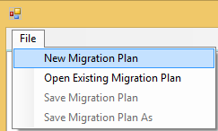
2. Na caixa de diálogo **Selecionar Grupo de Recursos do Power BI Embedded**, selecione o menu pendente de Ambiente e selecione prod.
3. É-lhe pedido que inicie sessão. Utilize o início de sessão da sua subscrição do Azure.
   
   > [!IMPORTANT]
   > Esta **não** é a sua conta de organização do Office 365 com a qual inicia sessão no Power BI.
   > 
   > 
4. Selecione a subscrição do Azure que armazena as coleções de áreas de trabalho do Power BI Embedded.
   
    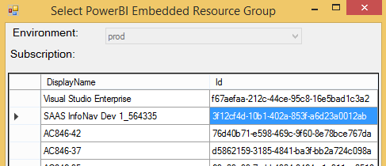
5. Abaixo da lista de subscrições, selecione o **Grupo de Recursos** que contém as coleções de áreas de trabalho e selecione **Selecionar**.
   
    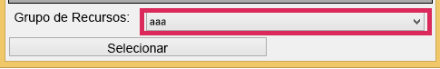
6. Selecione **Analisar**. Com esta ação, obtém um inventário dos itens na sua subscrição do Azure para que possa começar o seu plano.
   
    
   
   > [!NOTE]
   > O processo de análise pode demorar vários minutos, consoante o número de coleções de áreas de trabalho e a quantidade de conteúdo existente na coleção de áreas de trabalho.
   > 
   > 
7. Quando a **Análise** estiver concluída, ser-lhe-á pedido que guarde o seu plano de migração.

Neste momento, ligou o seu plano de migração à sua subscrição do Azure. Leia abaixo para compreender o fluxo de como trabalhar com o seu plano de migração. Este fluxo inclui Analisar e Planear a Migração, Transferir, Criar Grupos e Carregar.

### <a name="save-your-migration-plan"></a>Guardar o plano de migração
Pode guardar o seu plano de migração para utilizar mais tarde. Esta ação irá criar um ficheiro XML que contém todas as informações do seu plano de migração.

Para guardar o plano de migração, faça o seguinte.

1. Selecione **Ficheiro** > **Guardar Plano de Migração**.
   
    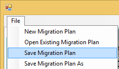
2. Dê um nome ao ficheiro ou utilize o nome de ficheiro gerado e selecione **Guardar**.

### <a name="open-an-existing-migration-plan"></a>Abrir um plano de migração existente
Pode abrir um plano de migração guardado para continuar a trabalhar na sua migração.

Para abrir o seu plano de migração existente, faça o seguinte.

1. Selecione **Ficheiro** > **Abrir Plano de Migração Existente**.
   
    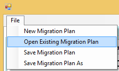
2. Selecione o ficheiro de migração e selecione **Abrir**.

## <a name="step-1-analyze--plan-migration"></a>Passo 1: Analyze & Plan Migration
O separador **Analisar e Planear a Migração** dá uma vista do que se encontra atualmente no grupo de recursos da sua subscrição do Azure.

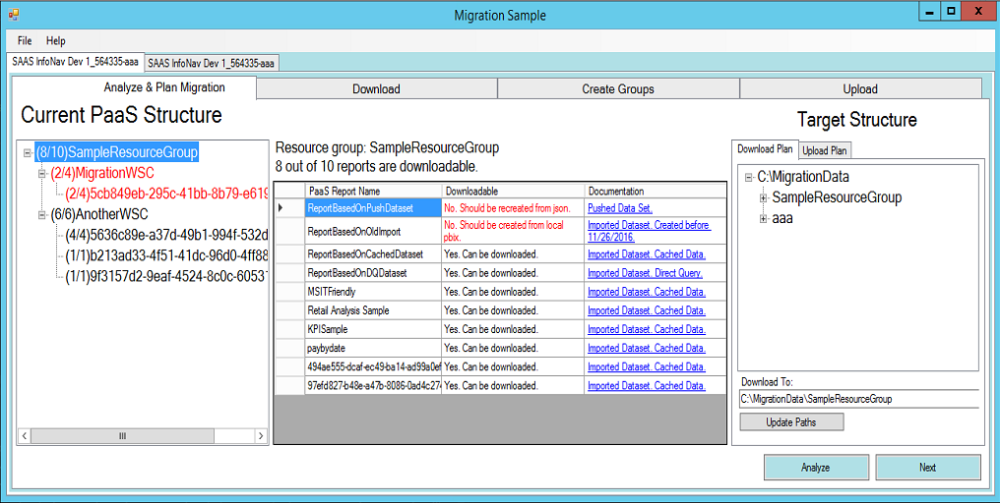

Vamos ver o *SampleResourceGroup* como exemplo.

### <a name="paas-topology"></a>Topologia PaaS
Esta é uma listagem de *Grupo de Recursos > Coleções de áreas de trabalho > Áreas de trabalho*. O grupo de recursos e as coleções de áreas de trabalho irão mostrar um nome amigável. As áreas de trabalho irão mostrar um GUID.

Os itens na lista também apresentam uma cor e um número no formato (#/ #). Indica o número de relatórios que podem ser transferidos. A cor preta indica que todos os relatórios podem ser transferidos.

A cor vermelha indica que alguns relatórios não podem ser transferidos. O número à esquerda indica o número total de relatórios que podem ser transferidos. O número à direita indica o número total de relatórios dentro do agrupamento.

Pode selecionar um item na topologia PaaS para apresentar os relatórios na secção de relatórios.

### <a name="reports"></a>Relatórios
A secção de relatórios irá listar os relatórios disponíveis e indica se podem ser transferidos ou não.


### <a name="target-structure"></a>Estrutura de destino
A **Estrutura de destino** é o local que indica à ferramenta para o qual os objetos serão transferidos e como carregá-los.

#### <a name="download-plan"></a>Plano de Transferência
Um caminho será criado automaticamente para si. Se quiser, pode alterar este caminho. Se alterar o caminho, terá de selecionar **Caminhos de atualização**.

> [!NOTE]
> Esta ação não executa efetivamente a transferência. Está apenas a especificar a estrutura do local para onde os relatórios serão transferidos.
> 
> 

#### <a name="upload-plan"></a>Plano de Carregamento
Aqui, pode especificar um prefixo que será utilizado para as Áreas de Trabalho de Aplicação que serão criadas no serviço Power BI. Depois do prefixo, irá especificar o GUID para a área de trabalho que existia no Azure.

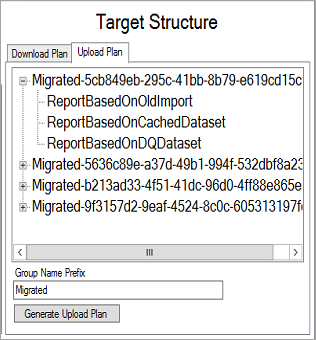

> [!NOTE]
> Esta ação não cria efetivamente os grupos no serviço Power BI. Define apenas a estrutura de nomenclatura para os grupos.
> 
> 

Se alterar o prefixo, terá de selecionar **Gerar Plano de Carregamento**.

Pode clicar com o botão direito do rato num grupo e escolher mudar o nome do grupo diretamente no Plano de carregamento, se assim pretender.

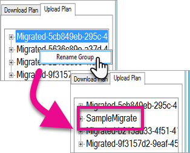

> [!NOTE]
> O nome do *grupo* não pode conter espaços ou carateres inválidos.
> 
> 

## <a name="step-2-download"></a>Passo 2: Transferir
No separador **Transferir**, verá a lista de relatórios e os metadados associados. Pode ver qual é o estado de exportação, juntamente com o estado de exportação anterior.

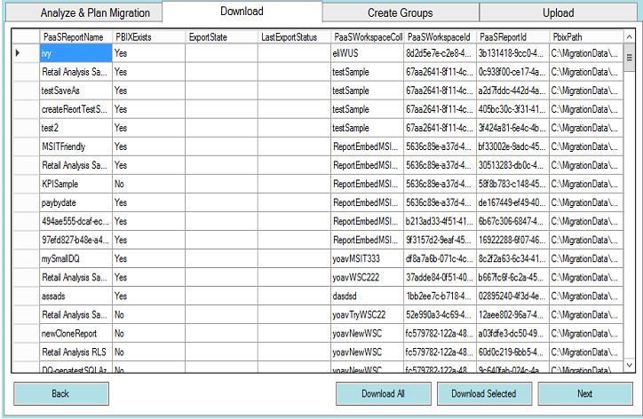

Tem duas opções.

* Selecionar relatórios específicos e selecionar **Transferir Selecionados**
* Selecione **Transferir Tudo**.

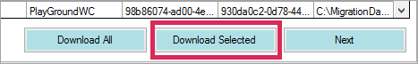

No caso de uma transferência com êxito, verá o estado *Concluído*, que irá refletir que o ficheiro PBIX existe.

Quando a transferência estiver concluída, selecione o separador **Criar Grupos**.

## <a name="step-3-create-groups"></a>Passo 3: Create Groups
Depois de transferir os relatórios que estão disponíveis, pode ir para o separador **Criar Grupos**. Este separador irá criar as áreas de trabalho de aplicação no serviço Power BI com base no plano de migração que criou. Irá criar a área de trabalho de aplicação com o nome que indicou no separador **Carregar** em **Analisar e Planear a Migração**.

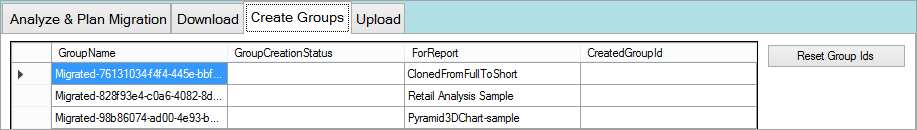

Para criar as áreas de trabalho de aplicação, pode selecionar **Criar Grupos Selecionados** ou **Criar Todos os Grupos em Falta**.

Quando seleciona uma destas opções, ser-lhe-á pedido que inicie sessão. *Deverá utilizar as credenciais do serviço Power BI no qual pretende criar as áreas de trabalho da aplicação.*

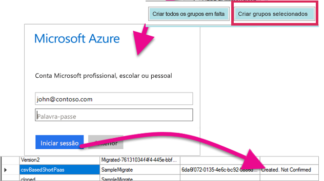

Esta ação irá criar a área de trabalho da aplicação no serviço Power BI. Não carrega os relatórios para a área de trabalho da aplicação.

Pode verificar se a área de trabalho da aplicação foi criada ao iniciar sessão no Power BI e confirma que a área de trabalho existe. Vai notar que a área de trabalho está vazia.

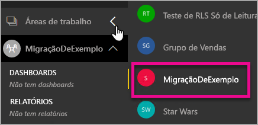

Após a criação da área de trabalho, pode passar para o separador **Carregar**.

## <a name="step-4-upload"></a>Passo 4: Carregar
No separador **Carregar**, irá carregar os relatórios para o serviço Power BI. Irá ver uma lista dos relatórios que transferimos no separador Transferir, juntamente com o nome do grupo de destino com base no seu plano de migração.

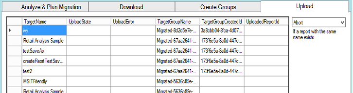

Pode carregar os relatórios selecionados ou pode carregar todos os relatórios. Também pode repor o estado de carregamento para voltar a carregar itens.

Também tem a opção de selecionar o que fazer se já existir um relatório com o mesmo nome. Pode escolher entre **Abortar**, **Ignorar** e **Substituir**.

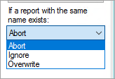

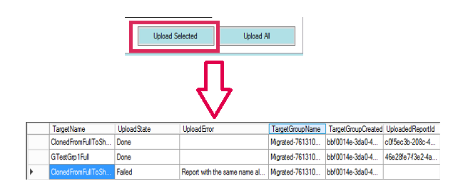

### <a name="duplicate-report-names"></a>Nomes de relatório duplicados
Se tiver um relatório com o mesmo nome, mas souber que é um relatório diferente, terá de alterar o **TargetName** do relatório. Pode alterar o nome ao editar manualmente o XML do plano de migração.

Para fazer a alteração, é preciso fechar a ferramenta de migração e, em seguida, voltar a abrir a ferramenta e o plano de migração.

No exemplo acima, um dos relatórios clonados falhou com a indicação de que existia um relatório com o mesmo nome. Se formos observar o XML do plano de migração, veremos o seguinte.

```
<ReportMigrationData>
    <PaaSWorkspaceCollectionName>SampleWorkspaceCollection</PaaSWorkspaceCollectionName>
    <PaaSWorkspaceId>4c04147b-d8fc-478b-8dcb-bcf687149823</PaaSWorkspaceId>
    <PaaSReportId>525a8328-b8cc-4f0d-b2cb-c3a9b4ba2efe</PaaSReportId>
    <PaaSReportLastImportTime>1/3/2017 2:10:19 PM</PaaSReportLastImportTime>
    <PaaSReportName>cloned</PaaSReportName>
    <IsPushDataset>false</IsPushDataset>
    <IsBoundToOldDataset>false</IsBoundToOldDataset>
    <PbixPath>C:\MigrationData\SampleResourceGroup\SampleWorkspaceCollection\4c04147b-d8fc-478b-8dcb-bcf687149823\cloned-525a8328-b8cc-4f0d-b2cb-c3a9b4ba2efe.pbix</PbixPath>
    <ExportState>Done</ExportState>
    <LastExportStatus>OK</LastExportStatus>
    <SaaSTargetGroupName>SampleMigrate</SaaSTargetGroupName>
    <SaaSTargetGroupId>6da6f072-0135-4e6c-bc92-0886d8aeb79d</SaaSTargetGroupId>
    <SaaSTargetReportName>cloned</SaaSTargetReportName>
    <SaaSImportState>Failed</SaaSImportState>
    <SaaSImportError>Report with the same name already exists</SaaSImportError>
</ReportMigrationData>
```

Para o item falhado, podemos alterar o nome do SaaSTargetReportName.

```
<SaaSTargetReportName>cloned2</SaaSTargetReportName>
```

Em seguida, podemos reabrir o plano, na ferramenta de migração, e carregar o relatório falhado.

Voltando ao Power BI, podemos ver que os relatórios e conjuntos de dados foram carregados na área de trabalho da aplicação.

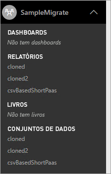

<a name="upload-local-file"></a>

### <a name="upload-a-local-pbix-file"></a>Carregar um ficheiro PBIX local
Pode carregar uma versão local de um ficheiro do Power BI Desktop. Terá de fechar a ferramenta, editar o XML e colocar o caminho completo para o PBIX local na propriedade **PbixPath**.

```
<PbixPath>[Full Path to PBIX file]</PbixPath>
```

Depois de editar o xml, reabra o plano na ferramenta de migração e carregue o relatório.

<a name="directquery-reports"></a>

### <a name="directquery-reports"></a>Relatórios de DirectQuery
Terá de atualizar a cadeia de ligação para relatórios de DirectQuery. Pode fazê-lo em *powerbi.com* ou pode consultar através de programação a cadeia de ligação do Power BI Embedded (Paas). Por exemplo, veja [Extrair a cadeia de ligação de DirectQuery do relatório de PaaS](migrate-code-snippets.md#extract-directquery-connection-string-from-paas-report).

Em seguida, pode atualizar a cadeia de ligação para o conjunto de dados no serviço Power BI (Saas) e definir as credenciais da origem de dados. Pode observar os exemplos seguintes para ver como fazê-lo.

* [Atualizar a cadeia de ligação de DirectQuery na área de trabalho de SaaS](migrate-code-snippets.md#update-directquery-connection-string-is-saas-workspace)
* [Definir as credenciais de DirectQuery na área de trabalho de SaaS](migrate-code-snippets.md#set-directquery-credentials-in-saas-workspace)

## <a name="embedding"></a>Incorporação
Agora que os seus relatórios foram migrados do serviço Power BI Embedded do Azure para o serviço Power BI, já pode atualizar a sua aplicação e começar a incorporar os relatórios na área de trabalho desta aplicação.

Para obter mais informações, veja [Como migrar conteúdos da coleção de áreas de trabalho do Power BI Embedded para o Power BI](migrate-from-powerbi-embedded.md).

## <a name="next-steps"></a>Próximos passos
[Incorporar com o Power BI](embedding.md)  
[Como migrar conteúdos da coleção de áreas de trabalho do Power BI Embedded para o Power BI](migrate-from-powerbi-embedded.md)  
[Power BI Premium – o que é?](../service-premium.md)  
[Repositório Git da API JavaScript](https://github.com/Microsoft/PowerBI-JavaScript)  
[Repositório Git C# do Power BI](https://github.com/Microsoft/PowerBI-CSharp)  
[Exemplo de incorporação de JavaScript](https://microsoft.github.io/PowerBI-JavaScript/demo/)  
[Documento técnico do Power BI Premium](https://aka.ms/pbipremiumwhitepaper)  

Mais perguntas? [Experimente perguntar à Comunidade do Power BI](http://community.powerbi.com/)

