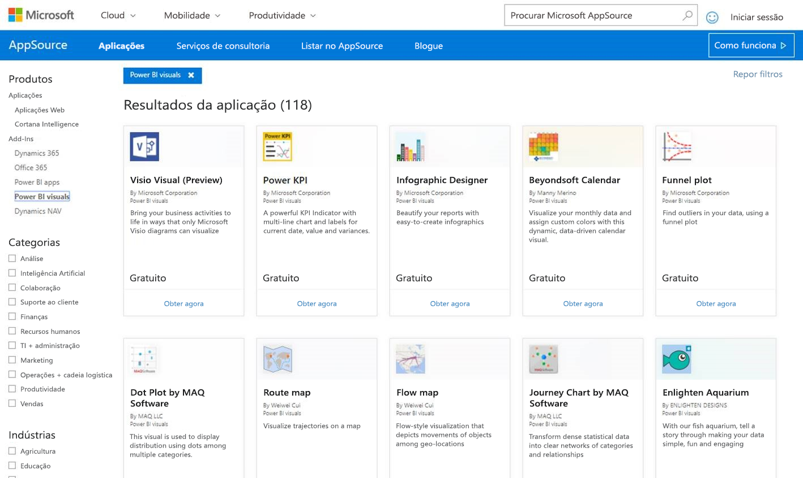
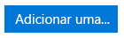
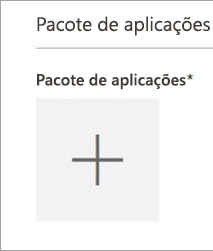
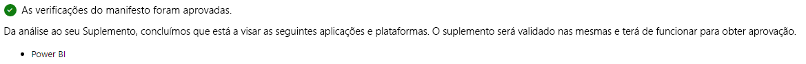
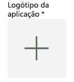
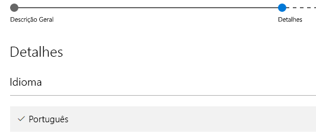

# Publicar elementos visuais do Power BI no AppSource

Saiba como pode publicar o seu visual personalizado no AppSource para que outros o possam encontrar e utilizar.

Depois de criar o seu visual personalizado, pode querer publicá-lo no AppSource para que outros o possam encontrar e utilizar. Tem de fazer alguns preparativos para o poder fazer. Para obter mais informações sobre como criar um elemento visual personalizado, veja Desenvolver um [Elemento Visual Personalizado do Power BI](visuals/custom-visual-develop-tutorial.md).

   

## O que é o AppSource?

O **AppSource** é o local onde pode encontrar aplicações SaaS e suplementos para os seus produtos e serviços Microsoft. O [AppSource](https://appsource.microsoft.com/marketplace/apps?product=power-bi-visuals) liga milhões de utilizadores do Office 365, Dynamics 365, Cortana Intelligence e outros produtos a soluções que os ajudam a trabalhar com mais eficácia, mais informações e melhores visuais.

## Preparar a submissão do seu elemento visual personalizado

Depois de concluir a leitura das nossas [diretrizes sobre elementos visuais do Power BI](guidelines-powerbi-visuals.md), de codificar e [testar o elemento visual personalizado](https://github.com/Microsoft/PowerBI-visuals/blob/master/Tutorial/SubmissionTesting.md) e de o ter compactado num ficheiro pbiviz, também deverá ter os seguintes itens prontos para serem submetidos.

| Item | Necessário | Descrição |
| --- | --- | --- |
| Pacote pbiviz com todos os metadados necessários |Sim |Nome do elemento visual Nome a apresentar GUID Versão Descrição Nome e e-mail do autor |
| Ficheiro de relatório. pbix de exemplo |Sim |Para evidenciar o seu elemento visual, ajude os utilizadores a familiarizarem-se com o mesmo. Deve destacar o valor que o elemento visual proporciona ao utilizador e dar exemplos de utilização, opções de formatação, etc. Também pode adicionar uma página de *"sugestões"* no final com algumas sugestões e truques, aspetos a evitar e outras informações do género. O ficheiro de relatório .pbix de exemplo deve funcionar offline, sem qualquer ligação externa |
| Ícone |Sim |Deve incluir o logótipo do elemento visual personalizado que será apresentado na loja. Os formatos possíveis são .png, .jpg, .jpeg ou .gif. Tem de ter exatamente 300 x 300 px (largura x altura). **Importante!** Reveja atentamente o [guia abreviado](https://docs.microsoft.com/office/dev/store/craft-effective-appsource-store-images) antes de submeter o Ícone. |
| Capturas de ecrã |Sim |Tem de fornecer, pelo menos, uma captura de ecrã. Os formatos possíveis são .png, .jpg, .jpeg ou .gif. Tem de ter exatamente 1366 x 768 px (largura x altura). O tamanho do ficheiro não pode ser superior a 1024 KB. *Para promover uma maior utilização, adicione balões de texto para articular a proposta de valor das principais funcionalidades mostradas em cada captura de ecrã.* |
| Ligação de transferência do suporte |Sim |Forneça o URL para prestar suporte aos clientes que tenham problemas com o elemento visual. Esta ligação é introduzida como parte da sua lista SellerDashboard e está visível para os utilizadores quando acederem à lista do seu elemento visual no AppSource. O formato do URL deve incluir https:// ou http://. |
| Ligação para documento sobre privacidade |Sim |Forneça uma ligação para a política de privacidade destinada aos clientes que utilizam o elemento visual. Esta ligação é introduzida como parte da sua lista SellerDashboard e está visível para os utilizadores quando acederem à lista do seu elemento visual no AppSource. O formato da ligação deve incluir https:// ou http://. |
| Contrato de licença do utilizador final (EULA) |Sim |Tem de carregar um ficheiro EULA. Pode ser o seu próprio EULA ou pode utilizar o EULA predefinido existente na Loja Office para os elementos visuais do Power BI. Para utilizar o EULA predefinido, cole o seguinte URL na caixa de diálogo de carregamento do ficheiro "Contrato de Licença do Utilizador Final" do dashboard de vendedor: [https://visuals.azureedge.net/app-store/Power BI - Default Custom Visual EULA.pdf](https://visuals.azureedge.net/app-store/Power%20BI%20-%20Default%20Custom%20Visual%20EULA.pdf). |
| Ligação para vídeo |Não |Para aumentar o interesse dos utilizadores relativamente ao seu elemento visual personalizado, recomenda-se que forneça uma ligação para um vídeo sobre o elemento visual. O formato do URL deve incluir https:// ou http://. |
| Repositório do GitHub |Não |O ideal será ter uma ligação pública e válida para um repositório do [GitHub](https://www.github.com) com as origens do elemento visual e dos dados de exemplo incluídas para que outros programadores possam fornecer comentários e propor melhoramentos para o seu código. |

## Submeter no Power BI

O processo de submissão começa com o envio de uma mensagem de e-mail para a equipa de submissão de elementos visuais do Power BI. Pode enviar a mensagem de e-mail para [pbivizsubmit@microsoft.com](mailto:pbivizsubmit@microsoft.com).

> [!IMPORTANT]
> Terá de preencher os campos seguintes no ficheiro pbiviz.json: “descrição”, “supportUrl”, “autor”, “nome” e “e-mail” antes de criar o pacote .pbiviz.

Anexe o **ficheiro .pbiviz** e o **ficheiro. pbix do relatório de exemplo** ao e-mail. A equipa do Power BI irá responder com instruções e um ficheiro XML do pacote de aplicação para carregamento. Este XML do pacote de aplicação é necessário para submeter o elemento visual através do Centro de Programadores do Office.

> [!NOTE]
> A fim de melhorar a qualidade e garantir que os relatórios existentes não apresentam falhas, as atualizações aos elementos visuais existentes irão demorar mais duas semanas a atingir o ambiente de produção após a aprovação na loja.

## Submeter no AppSource

Após obter o XML do pacote de aplicação junto da equipa do Power BI, navegue para o [centro de programadores](https://sellerdashboard.microsoft.com/Application/Summary) para submeter o seu visual no AppSource.

> [!NOTE]
> Tem de ter uma conta de programador do Office válida para iniciar sessão no [Centro de Programadores do Office](https://dev.office.com/). Uma conta de programador do Office tem de ser uma Conta Microsoft (Live ID como, por exemplo, hotmail.com ou outlook.com).

> [!IMPORTANT]
> Tem de enviar um e-mail com o ficheiro .pbiviz e o ficheiro. pbix à equipa do Power BI antes de efetuar a submissão no AppSource. Este passo permite que a equipa do Power BI carregue os ficheiros para o servidor de partilha público. Caso contrário, a loja não conseguirá obter os ficheiros. Tem de enviar os ficheiros sempre que fizer uma nova submissão do visual, atualizar o visual existente e corrigir submissões rejeitadas.

### Processo para submeter o elemento visual

Siga os passos abaixo para concluir a submissão.

1. Selecione **Adicionar uma nova aplicação**.

    

2. Selecione **Visual personalizado do Power BI** e depois selecione **Seguinte**.

3. Selecione o símbolo **+** em **Pacote de aplicação** e, em seguida, selecione o ficheiro XML do pacote de aplicação que recebeu da equipa do Power BI na caixa de diálogo para abrir o ficheiro.

    

4. Deverá receber uma aprovação de que se trata de um pacote de aplicação válido do Power BI.

    

5. Preencha os detalhes de **Informações Gerais**.

   * *Título da submissão:* O nome a utilizar para a submissão no Centro de Programadores
   * *Versão:* O número da versão é povoado automaticamente com base no pacote de aplicação do suplemento.
   * *Data de Lançamento (UTC):* Selecione uma data para a aplicação ser lançada na loja. Se for escolhida uma data no futuro, a aplicação só estará disponível na Loja a partir dessa data.
   * *Categoria:* A primeira categoria será povoada automaticamente como "Visualização de Dados + BI". Esta é a forma como todos os elementos visuais do Power BI serão etiquetados. Pode indicar até duas categorias adicionais, para facilitar a pesquisa do elemento visual por parte dos utilizadores
   * *Notas de teste:* é opcional, no caso de querer fornecer algumas instruções aos técnicos de testes da Microsoft.
   * *A minha aplicação chama, suporta, contém ou utiliza criptografia ou encriptação:* deixe desmarcado.
   * *Disponibilizar este suplemento no catálogo de suplementos do Office no iPad:* deixe desmarcado.
6. Carregue o logótipo do elemento visual selecionando o símbolo **+** em **Logótipo da aplicação**. Em seguida, selecione o ficheiro de ícone na caixa de diálogo para abrir o ficheiro. O ficheiro tem de ter o formato .png, .jpg, .jpeg ou .gif. Tem de ter exatamente 300 x 300 px (largura x altura) e o tamanho não pode ser superior a 512 KB.

    

7. Preencha os detalhes de **Documentos de suporte**.

   * Ligação para documento sobre suporte
   * Ligação para documento sobre privacidade
   * Ligação para vídeo
   * Contrato de Licença do Utilizador Final (EULA)

       Tem de carregar um ficheiro EULA. Pode ser o seu próprio EULA ou pode utilizar o EULA predefinido existente na Loja Office para os elementos visuais do Power BI. Para utilizar o EULA predefinido, cole o seguinte URL na caixa de diálogo de carregamento do ficheiro "Contrato de Licença do Utilizador Final" do dashboard de vendedor: [https://visuals.azureedge.net/app-store/Power BI - Default Custom Visual EULA.pdf](https://visuals.azureedge.net/app-store/Power%20BI%20-%20Default%20Custom%20Visual%20EULA.pdf).

8. Selecione **Seguinte** para avançar para a página **Detalhes**.

9. Selecione **Idioma** e escolha um idioma na lista.

    

10. Preencha os detalhes de "Descrição".

    * *Nome da aplicação (para este idioma):* Introduza o título da aplicação conforme deverá aparecer na loja.
    * *Descrição breve:* Introduza uma breve descrição da aplicação, até 100 carateres, conforme deverá aparecer na loja. Esta descrição será apresentada nas páginas de nível superior juntamente com o logótipo. Pode utilizar a descrição do pacote pbiviz.
    * *Descrição longa:* Forneça uma descrição mais detalhada da aplicação, que será apresentada aos clientes na página de detalhes da aplicação. Se quiser o contributo da comunidade para melhorar o elemento visual, disponibilizando-o em código fonte aberto, forneça a ligação para o repositório público, como o GitHub, aqui.

11. Carregue, pelo menos, uma captura de ecrã. Os formatos possíveis são .png, .jpg, .jpeg ou .gif. Tem de ter exatamente 1366 x 768 px (largura x altura). O tamanho do ficheiro não pode ser superior a 1024 KB. *Para promover uma maior utilização, adicione balões de texto para articular a proposta de valor das principais funcionalidades mostradas em cada captura de ecrã.*

12. Se quiser adicionar mais idiomas, selecione **Adicionar um idioma** e repita os passos 10 e 11. Ao adicionar mais idiomas, permite que os utilizadores vejam os detalhes do elemento visual personalizado nos seus idiomas. Os idiomas que não constarem da lista assumem como predefinição o primeiro idioma selecionado.

13. Quando tiver terminado de adicionar idiomas, selecione **Seguinte** para avançar para a página **Bloquear acesso**.

14. Se quiser impedir a utilização ou compra da sua aplicação por parte de clientes em países ou regiões específicos, marque a caixa e selecione-os na lista.

15. Selecione **Seguinte** para avançar para a página **Preços**.

16. Atualmente, só são suportados elementos visuais *gratuitos* e não são permitidas compras adicionais dentro do elemento visual (compra via aplicação). Selecione **Esta aplicação é gratuita**.

    > [!NOTE]
    > Se selecionar qualquer outra opção sem ser "gratuita" ou se tiver conteúdo com compra via aplicação inserido no elemento visual submetido, a submissão será rejeitada.

17. Agora, pode selecionar **Guardar como rascunho** e submeter mais tarde ou pode selecionar **Submeter para aprovação** para submeter o elemento visual personalizado na Microsoft Store.

## Controlar o estado da submissão e a utilização

Pode rever as [políticas de validação](https://dev.office.com/officestore/docs/validation-policies#13-power-bi-custom-visuals).

Após a submissão, poderá ver o estado da submissão no [dashboard da aplicação](https://sellerdashboard.microsoft.com/Application/Summary/).

## Certificar o elemento visual

Uma vez criado o elemento visual, pode proceder opcionalmente à certificação do mesmo. Isto significa que pode ser executado no âmbito do serviço Power BI e ser utilizado com outras funcionalidades do serviço, como exportar para o PowerPoint. Para obter mais informações, consulte [*Certificar* um elemento visual personalizado](../power-bi-custom-visuals-certified.md).

## Próximos passos

[Developing a Power BI custom visual](visuals/custom-visual-develop-tutorial.md) (Desenvolver um elemento visual personalizado do Power BI)  
[Visualizações no Power BI](../visuals/power-bi-report-visualizations.md)  
[Visualizações Personalizadas no Power BI](../power-bi-custom-visuals.md)  
[*Certificar* um elemento visual personalizado](../power-bi-custom-visuals-certified.md)

Mais perguntas? [Experimente perguntar à Comunidade do Power BI](http://community.powerbi.com/)
