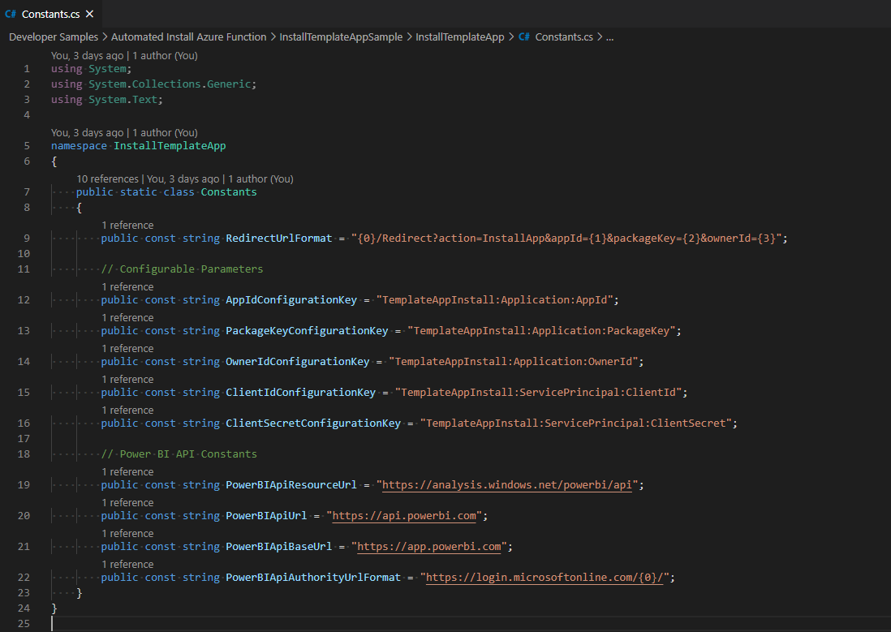

# <a name="tutorial-automate-configuration-of-template-app-installation-using-an-azure-function"></a>Tutorial: Automatizar a configuração da instalação da aplicação de modelo com uma função do Azure

As aplicações de modelo são uma forma excelente para os clientes começarem a obter informações sobre os dados. As aplicações de modelo permitem uma rápida colocação em funcionamento, através da ligação aos dados e ao fornecimento de relatórios pré-criados que podem ser personalizados se assim o pretenderem.

Os clientes nem sempre estão familiarizados com os detalhes sobre como ligar os dados e ter de proporcionar estes detalhes ao instalar uma aplicação de modelo pode ser incómodo.

Se for um fornecedor de serviços de dados e tiver criado uma aplicação de modelo para ajudar os clientes a começar a utilizar os dados no serviço, poderá facilitar-lhes a instalação da aplicação de modelo através da automatização da configuração dos parâmetros da aplicação de modelo. Quando o cliente inicia sessão no portal, este clica numa ligação especial que preparou. Esta ligação vai permitir iniciar a automatização e reunir as informações necessárias, pré-configurar os parâmetros da aplicação de modelo e redirecionar o cliente para a conta do Power BI onde pode instalar a aplicação. Em seguida, o cliente terá apenas de clicar em instalar, autenticar-se na origem de dados e poderá começar! 

Esta experiência de cliente é ilustrada abaixo.


Neste tutorial, vai utilizar um exemplo da instalação automatizada da Função do Azure que criamos para pré-configurar e instalar a aplicação de modelo. Este exemplo foi deliberadamente simplificado para fins de demonstração. Encapsula a configuração de uma função do Azure para tirar partido das APIs do Power BI para instalar uma Aplicação de modelo e configurá-la para os utilizadores automaticamente.

Para obter mais informações sobre o fluxo de automatização geral e sobre as APIs que este utiliza, veja [Automatizar a configuração da instalação da aplicação de modelo](template-apps-auto-install.md)

A nossa aplicação simples utiliza uma função do Azure. Para obter mais informações sobre as Funções do Azure, veja a [documentação das Funções do Azure](https://docs.microsoft.com/azure/azure-functions/).

## <a name="basic-flow"></a>Fluxo básico

A seguir encontra-se um fluxo básico do que a aplicação faz quando o cliente a inicia ao clicar na ligação no portal.

1. O utilizador inicia sessão no portal do ISV e clica na ligação indicada para iniciar o fluxo. O portal do ISV prepara a configuração específica do utilizador nesta fase.

2. O ISV adquire um token **Apenas de aplicação** com base num [principal de serviço (token apenas de aplicação)](../embedded/embed-service-principal.md), que é registado no inquilino do ISV.

3. Com as [APIs REST do Power BI](https://docs.microsoft.com/rest/api/power-bi/), o ISV cria um **Pedido de Instalação** que contém a configuração dos parâmetros específica do utilizador, conforme preparado pelo ISV.

4. O ISV redireciona o utilizador para o Power BI com um método de redirecionamento ```POST```, que contém o pedido de instalação.

5. O utilizador é redirecionado para a conta do Power BI com o pedido de instalação e é pedida a instalação com a aplicação de modelo. Quando o utilizador clicar em instalar, a aplicação de modelo será instalada.

>[!Note]
>Apesar de os valores dos parâmetros serem configurados pelo ISV ao criar o pedido de instalação, as credenciais relacionadas com a origem de dados são disponibilizadas apenas pelo utilizador nas fases finais da instalação, o que impede que sejam expostas a terceiros e garante ma ligação segura entre o utilizador e as origens de dados da aplicação de modelo.

## <a name="prerequisites"></a>Pré-requisitos

Antes de começar, deve ter:

* Uma configuração de inquilino do Azure Active Directory própria. Veja [Criar um inquilino do Azure Active Directory](https://docs.microsoft.com/power-bi/developer/embedded/create-an-azure-active-directory-tenant) para obter instruções sobre como configurar um.

* Um [principal de serviço (token apenas de aplicação)](https://docs.microsoft.com/power-bi/developer/embedded/embed-service-principal) registado no inquilino acima.

* Uma [aplicação de modelo parametrizada](https://docs.microsoft.com/power-bi/connect-data/service-template-apps-overview) pronta para instalação. A aplicação de modelo deve ser criada no mesmo inquilino no qual registou a aplicação no Azure Active Directory (AAD). Para obter mais informações, veja [sugestões da aplicação modelo](https://docs.microsoft.com/power-bi/connect-data/service-template-apps-tips.md) ou [Criar uma aplicação de modelo no Power BI](https://docs.microsoft.com/power-bi/connect-data/service-template-apps-create).

* Uma **licença do Power BI Pro**. Se não estiver inscrito no Power BI Pro, [inscreva-se para uma avaliação gratuita](https://powerbi.microsoft.com/pricing/) antes de começar.

## <a name="set-up-your-template-apps-automation-development-environment"></a>Configurar o ambiente de desenvolvimento da automatização da aplicação de modelo

Antes de continuar a configuração da aplicação, siga as instruções no [Início Rápido: Criar uma aplicação das Funções do Azure com o Azure App Configuration](https://docs.microsoft.com/azure/azure-app-configuration/quickstart-azure-functions-csharp) para desenvolver uma Função do Azure juntamente com o Azure App Configuration. Crie o App Configuration conforme descrito no artigo.

### <a name="register-an-application-in-azure-active-directory-azure-ad"></a>Registar uma aplicação no Azure Active Directory (Azure AD)

Crie um principal de serviço conforme descrito em [Incorporar conteúdos do Power BI com o principal de serviço e um segredo da aplicação](https://docs.microsoft.com/power-bi/developer/embedded/embed-service-principal).

Confirme que regista a aplicação como uma **aplicação Web do lado do servidor**. Registe uma aplicação Web do lado do servidor para criar um segredo da aplicação.

Guarde o *ID da Aplicação* (ID do Cliente) e o *Segredo da aplicação* (Segredo do Cliente) para os passos posteriores.

Pode utilizar a [Ferramenta de configuração de incorporação](https://aka.ms/embedsetup/AppOwnsData) para começar rapidamente a criar um registo de aplicações. Se estiver a utilizar a [Ferramenta de Registo da Aplicação do Power BI](https://app.powerbi.com/embedsetup), selecione a opção *Incorporar para os clientes*.

## <a name="template-app-preparation"></a>Preparação da aplicação de modelo

Após criar a aplicação de modelo e esta estar pronta para instalação, guarde as informações seguintes para os próximos passos:

* *ID da Aplicação*, *Chave do Pacote* e *ID do Proprietário* como aparecem no URL de instalação no final do processo [Definir as propriedades da aplicação de modelo](../../connect-data/service-template-apps-create.md#define-the-properties-of-the-template-app) quando a aplicação foi criada.

    Também pode obter a mesma ligação ao clicar em **Obter ligação** na [Gestão de Versão](../../connect-data/service-template-apps-create.md#manage-the-template-app-release) da aplicação de modelo.

* *Nomes dos Parâmetros* como definidos no conjunto de dados da aplicação de modelo. Os nomes dos parâmetros são cadeias de carateres sensíveis às maiúsculas e minúsculas e também podem ser obtidos no separador **Definições dos Parâmetros** quando [Definir as propriedades da aplicação de modelo](../../connect-data/service-template-apps-create.md#define-the-properties-of-the-template-app) ou nas definições dos conjuntos de dados no Power BI.

>[!NOTE]
>Poderá testar a aplicação de instalação pré-configurada na aplicação de modelo se esta estiver pronta para instalação, mesmo que ainda não esteja publicamente disponível no AppSource. No entanto, para que os utilizadores fora do inquilino sejam capazes de utilizar a aplicação de instalação automatizada para instalar a aplicação de modelo, esta deve estar publicamente disponível no [Marketplace de Aplicações do Power BI](https://app.powerbi.com/getdata/services). Portanto, antes de distribuir a aplicação de modelo com a aplicação de instalação automatizada que está a criar, confirme que a publica no [Centro de Parceiros](https://docs.microsoft.com/azure/marketplace/partner-center-portal/create-power-bi-app-offer).


## <a name="install-and-configure-your-template-app-using-our-azure-function-sample"></a>Instale e configure a aplicação de modelo com o nosso exemplo da Função do Azure

Nesta secção, vai utilizar um exemplo da instalação automatizada da Função do Azure que criamos para pré-configurar e instalar a aplicação de modelo. Este exemplo foi deliberadamente simplificado para fins de demonstração. Permite que tire partido de uma [Função do Azure](https://docs.microsoft.com/azure/azure-functions/functions-overview) e do [Azure App Configuration](https://docs.microsoft.com/azure/azure-app-configuration/overview) para implementar e utilizar facilmente a API de instalação automatizada para aplicações de modelo.

### <a name="download-visual-studio-version-2017-or-later"></a>Transfira o [Visual Studio](https://www.visualstudio.com/) (versão 2017 ou posterior)

Transfira o [Visual Studio](https://www.visualstudio.com/) (versão 2017 ou posterior). Certifique-se de que transfere o [pacote NuGet](https://www.nuget.org/profiles/powerbi) mais recente.

### <a name="download-the-automated-install-azure-function-sample"></a>Transferir o exemplo de Função do Azure de Instalação Automatizada

Transfira o [Exemplo de Função do Azure de Instalação Automatizada](https://github.com/microsoft/Template-apps-examples/tree/master/Developer%20Samples/Automated%20Install%20Azure%20Function) a partir do GitHub para começar.


### <a name="setup-your-azure-app-configuration"></a>Configurar o Azure App Configuration

Para executar este exemplo, precisa de configurar o Azure App Configuration com os valores e as chaves conforme descrito abaixo. As chaves são o **ID da aplicação**, o **Segredo da aplicação** e o **AppId**, a **PackageKey** e o **OwnerId** da aplicação de modelo. Veja as secções abaixo para obter informações sobre como obter estes valores. 

As chaves também são definidas no ficheiro **Constants.cs**.

| Chave de Configuração | Significado           |
|---------------    |-------------------|
| TemplateAppInstall:Application:AppId | *AppId* do [URL de instalação](#getting-the-template-app-properties) |
| TemplateAppInstall:Application:PackageKey | *PackageKey* do [URL de instalação](#getting-the-template-app-properties) |
| TemplateAppInstall:Application:OwnerId | *OwnerId* do [URL de instalação](#getting-the-template-app-properties) |
| TemplateAppInstall:ServicePrincipal:ClientId | [ID de Aplicação](#getting-the-application-id) do Principal de Serviço |
| TemplateAppInstall:ServicePrincipal:ClientSecret | [Segredo de aplicação](#getting-the-application-secret) do Principal de Serviço |
|||


O ficheiro **Constants.cs**:



#### <a name="getting-the-template-app-properties"></a>Obter as propriedades da aplicação de modelo
Preencha todas as propriedades da Aplicação de modelo relevantes, pois estas são definidas quando a aplicação é criada. Estas propriedades são o **AppId**, a **PakcageKey** e o  & **OwnerId** da aplicação de modelo.

Para obter os valores acima, siga estes passos:

1. Inicie sessão no [Power BI](https://app.powerbi.com).

2. Aceda à área de trabalho original da aplicação.

3. Abra o painel Gestão de versões.

    

4. Selecione a versão da aplicação e obtenha a ligação de instalação.

    

5. Copie a ligação para área de transferência.

    

6. Este URL de instalação contém os três parâmetros do URL cujos valores precisa. Utilize os valores de **appId**, **packageKey** e  & **ownerId** para a aplicação. Um URL de exemplo será semelhante ao apresentado abaixo.

    ```html
    https://app.powerbi.com/Redirect?action=InstallApp&appId=3c386...16bf71c67&packageKey=b2df4b...dLpHIUnum2pr6k&ownerId=72f9...1db47&buildVersion=5
    ```

#### <a name="getting-the-application-id"></a>Obter o ID da Aplicação

Preencha as informações de **applicationId** com o **ID da Aplicação** do **Azure**. O **applicationId** serve para a aplicação se identificar junto dos utilizadores aos quais está a pedir permissões.

Para obter o **applicationId**, siga estes passos:

1. Inicie sessão no [portal do Azure](https://portal.azure.com).

2. No painel de navegação esquerdo, selecione **Todos os Serviços** e **Registos de Aplicações**.

    

3. Selecione a aplicação que precisa do **applicationId**.

    

4. Existe um **ID da Aplicação** listado como um GUID. Utilize este **ID da Aplicação** como o **applicationId** da aplicação.

    

#### <a name="getting-the-application-secret"></a>Obter o Segredo da aplicação

Preencha as informações de **ApplicationSecret** na secção **Chaves** da sua secção **Registos das aplicações** no **Azure**.  Este atributo funciona ao utilizar o [principal de serviço](../embedded/embed-service-principal.md).

Para obter o **ApplicationSecret**, siga estes passos:

 1. Inicie sessão no [portal do Azure](https://portal.azure.com).

 2. No painel de navegação esquerdo, selecione **Todos os serviços** e, em seguida, **Registos de aplicações**.

    

3. Selecione a aplicação que precisa de utilizar o **ApplicationSecret**.

    

4. Em **Gerir**, selecione **Certificados e segredos**.

5. Selecione **Novo segredo do cliente**.

6. Introduza um nome na caixa **Descrição** e selecione uma duração. Em seguida, selecione **Guardar** para obter o **Valor** para a sua aplicação. Quando fecha o painel **Chaves** depois de guardar o valor da chave, o campo do valor é apresentado apenas como oculto. Nesse momento, não é possível obter o valor da chave. Se perder o valor da chave, crie um novo no portal do Azure.

    

## <a name="test-your-function-locally"></a>Testar a função localmente

Siga os passos conforme descrito em [Executar a função localmente](https://docs.microsoft.com/azure/azure-functions/functions-create-your-first-function-visual-studio#run-the-function-locally) para executar a função.

Configure o portal para emitir um pedido ```POST``` para o URL da função (por exemplo, ```POST http://localhost:7071/api/install```). O corpo do pedido deve ser um objeto JSON que descreve os pares Chave-Valor, onde as chaves são *nomes de parâmetro* (definidos no Power BI Desktop) e os valores são os valores desejados a definir para cada parâmetro na aplicação de modelo.

>[!Note]
> Na produção, os valores dos parâmetros são deduzidos para cada utilizador pela lógica pretendida do portal.

O fluxo pretendido deve ser:

1. O portal prepara o pedido, por utilizador\sessão.
2. O pedido ```POST /api/install``` é emitido para a função do Azure. O corpo do pedido consiste em pares de chave-valor, onde a chave é o nome do parâmetro e o valor é o valor desejado a ser definido. 
3. Se tudo estiver configurado corretamente, o browser deverá redirecionar automaticamente para a conta do Power BI do cliente e mostrar o fluxo de instalação automatizada.
4. Aquando da instalação, os valores dos parâmetros são definidos conforme configurados nos passos 1 e 2.
 
## <a name="next-steps"></a>Passos seguintes

### <a name="publish-your-project-to-azure"></a>Publicar o projeto no Azure

Siga a [documentação das funções do Azure](https://docs.microsoft.com/azure/azure-functions/functions-create-your-first-function-visual-studio#publish-the-project-to-azure) para obter instruções sobre como publicar o projeto no Azure para que possa integrar as APIs de instalação automatizada na aplicação de modelo no produto e começar a testá-lo em ambientes de produção.
