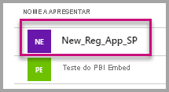

# <a name="tutorial-automate-configuration-of-template-app-installation-using-an-azure-function"></a>Tutorial: Automatizar a configuração da instalação da aplicação de modelo com uma função do Azure

As aplicações de modelo são uma forma excelente para os clientes começarem a obter informações sobre os dados. As aplicações de modelo permitem que os clientes comecem rapidamente ao ligá-los aos respetivos dados. As aplicações de modelo fornecem relatórios pré-concebidos aos clientes que estes podem personalizar, se assim o quiserem.

Os clientes nem sempre estão familiarizados com os detalhes sobre como podem estabelecer ligação aos seus dados. Fornecer estes detalhes ao instalar uma aplicação de modelo pode tornar-se problemático para eles.

Se for um fornecedor de serviços de dados e tiver criado uma aplicação de modelo para ajudar os clientes a começar a utilizar os dados no serviço, poderá facilitar-lhes a instalação da sua aplicação de modelo. Pode automatizar a configuração dos parâmetros da aplicação de modelo.

Quando um cliente inicia sessão no seu portal, este clica numa ligação especial preparada por si. Esta ligação:

- Inicia o processo de automatização, que reúne as informações necessárias.
- Pré-configura os parâmetros da aplicação de modelo.
- Redireciona o cliente para a respetiva conta do Power BI, onde poderá instalar a aplicação.

Em seguida, o cliente terá apenas de selecionar **Instalar**, autenticar-se na respetiva origem de dados e poderá começar!

A experiência de cliente é ilustrada a seguir.


Neste tutorial, irá utilizar um exemplo de instalação automatizada das Funções do Azure que criámos para pré-configurar e instalar a aplicação de modelo. Este exemplo foi deliberadamente simplificado para fins de demonstração. Encapsula a configuração de uma função do Azure para utilizar as APIs do Power BI para instalar uma aplicação de modelo e configurá-la para os utilizadores automaticamente.

Para obter mais informações sobre o fluxo de automatização geral e sobre as APIs que a aplicação utiliza, veja [Automatizar a configuração da instalação de uma aplicação de modelo](template-apps-auto-install.md).

A nossa aplicação simples utiliza uma função do Azure. Para obter mais informações sobre as Funções do Azure, veja a [documentação das Funções do Azure](https://docs.microsoft.com/azure/azure-functions/).

## <a name="basic-flow"></a>Fluxo básico

A seguir encontra-se um fluxo básico do que a aplicação faz quando o cliente a inicia ao selecionar a ligação no portal.

1. O utilizador inicia sessão no portal do ISV e seleciona a ligação fornecida. Esta ação inicia o fluxo. O portal do ISV prepara a configuração específica do utilizador nesta fase.

1. O ISV adquire um token *apenas de aplicação* com base num [principal de serviço (token apenas de aplicação)](../embedded/embed-service-principal.md), que é registado no inquilino do ISV.

1. Com as [APIs REST do Power BI](https://docs.microsoft.com/rest/api/power-bi/), o ISV cria um *pedido de instalação* que contém a configuração dos parâmetros específica do utilizador, conforme preparado pelo ISV.

1. O ISV redireciona o utilizador para o Power BI através de um método de redirecionamento ```POST```, que contém o pedido de instalação.

1. O utilizador é redirecionado para a conta do Power BI com o pedido de instalação e é pedida a instalação com a aplicação de modelo. Quando o utilizador selecionar **Instalar**, a aplicação de modelo será instalada.

>[!Note]
>Apesar de os valores dos parâmetros serem configurados pelo ISV no processo de criação do pedido de instalação, as credenciais relacionadas com a origem de dados são disponibilizadas apenas pelo utilizador nas fases finais da instalação. Esta configuração impede que as credenciais sejam expostas a terceiros e garante uma ligação segura entre o utilizador e as origens de dados da aplicação de modelo.

## <a name="prerequisites"></a>Pré-requisitos

* A configuração do seu próprio inquilino do Azure Active Directory (Azure AD). Para obter instruções sobre como configurar um, veja [Criar um inquilino do Azure AD](https://docs.microsoft.com/power-bi/developer/embedded/create-an-azure-active-directory-tenant).
* Um [principal de serviço (token apenas de aplicação)](https://docs.microsoft.com/power-bi/developer/embedded/embed-service-principal) registado no inquilino anterior.
* Uma [aplicação de modelo parametrizada](https://docs.microsoft.com/power-bi/connect-data/service-template-apps-overview) pronta para instalação. A aplicação de modelo tem de ser criada no mesmo inquilino no qual registou a aplicação no Azure AD. Para obter mais informações, veja [Sugestões da aplicação de modelo](https://docs.microsoft.com/power-bi/connect-data/service-template-apps-tips.md) ou [Criar uma aplicação de modelo no Power BI](https://docs.microsoft.com/power-bi/connect-data/service-template-apps-create).
* Uma licença do Power BI Pro. Se não estiver inscrito no Power BI Pro, [inscreva-se para uma avaliação gratuita](https://powerbi.microsoft.com/pricing/) antes de começar.

## <a name="set-up-your-template-apps-automation-development-environment"></a>Configurar o ambiente de desenvolvimento da automatização da aplicação de modelo

Antes de continuar a configuração da aplicação, siga as instruções no [Início Rápido: Criar uma aplicação das Funções do Azure com o Azure App Configuration](https://docs.microsoft.com/azure/azure-app-configuration/quickstart-azure-functions-csharp) para desenvolver uma função do Azure juntamente com o Azure App Configuration. Crie a sua configuração de aplicações conforme descrito no artigo.

### <a name="register-an-application-in-azure-ad"></a>Registar uma aplicação no Azure AD

Crie um principal de serviço conforme descrito em [Incorporar conteúdos do Power BI com o principal de serviço e um segredo da aplicação](https://docs.microsoft.com/power-bi/developer/embedded/embed-service-principal).

Confirme que regista a aplicação como uma **aplicação Web do lado do servidor**. Registe uma aplicação Web do lado do servidor para criar um segredo da aplicação.

Guarde o *ID da aplicação* (ClientID) e o *segredo da aplicação* (ClientSecret) para os passos posteriores.

Pode utilizar a [Ferramenta de configuração de incorporação](https://aka.ms/embedsetup/AppOwnsData) para começar rapidamente a criar um registo de aplicações. Se estiver a utilizar a [Ferramenta de Registo da Aplicação do Power BI](https://app.powerbi.com/embedsetup), selecione a opção **Incorporar para os clientes**.

## <a name="template-app-preparation"></a>Preparação da aplicação de modelo

Após criar a aplicação de modelo e esta estar pronta para instalação, guarde as informações seguintes para os próximos passos:

* *ID da Aplicação*, *Chave do Pacote* e *ID do Proprietário* como aparecem no URL de instalação no final do processo de [Definir as propriedades da aplicação de modelo](../../connect-data/service-template-apps-create.md#define-the-properties-of-the-template-app) quando a aplicação foi criada.

    Também pode obter a mesma ligação ao selecionar **Obter ligação** no [painel Gestão de Versões](../../connect-data/service-template-apps-create.md#manage-the-template-app-release) da aplicação de modelo.

* *Nomes dos parâmetros* conforme definidos no conjunto de dados da aplicação de modelo. Os nomes de parâmetros são cadeias de carateres sensíveis às maiúsculas e minúsculas. Também podem ser obtidos no separador **Definições dos Parâmetros** quando [definir as propriedades da aplicação de modelo](../../connect-data/service-template-apps-create.md#define-the-properties-of-the-template-app) ou nas definições dos conjuntos de dados no Power BI.

>[!NOTE]
>Poderá testar a aplicação de instalação pré-configurada na aplicação de modelo se esta estiver pronta para instalação, mesmo que ainda não esteja publicamente disponível no AppSource. Para que os utilizadores fora do inquilino sejam capazes de utilizar a aplicação de instalação automatizada para instalar a aplicação de modelo, esta tem de estar publicamente disponível no [Marketplace de aplicações do Power BI](https://app.powerbi.com/getdata/services). Antes de distribuir a aplicação de modelo através da aplicação de instalação automatizada que está a criar, confirme que a publica no [Centro de Parceiros](https://docs.microsoft.com/azure/marketplace/partner-center-portal/create-power-bi-app-offer).


## <a name="install-and-configure-your-template-app"></a>Instalar e configurar uma aplicação de modelo

Nesta secção, irá utilizar um exemplo de instalação automatizada das Funções do Azure que criámos para pré-configurar e instalar a aplicação de modelo. Este exemplo foi deliberadamente simplificado para fins de demonstração. Permite-lhe utilizar uma [função do Azure](https://docs.microsoft.com/azure/azure-functions/functions-overview) e do [Azure App Configuration](https://docs.microsoft.com/azure/azure-app-configuration/overview) para implementar e utilizar facilmente a API de instalação automatizada para aplicações de modelo.

### <a name="download-visual-studio-version-2017-or-later"></a>Transfira o [Visual Studio](https://www.visualstudio.com/) (versão 2017 ou posterior)

Transfira o [Visual Studio](https://www.visualstudio.com/) (versão 2017 ou posterior). Certifique-se de que transfere o [pacote NuGet](https://www.nuget.org/profiles/powerbi) mais recente.

### <a name="download-the-automated-installation-azure-functions-sample"></a>Transferir o exemplo de instalação automatizada das Funções do Azure

Transfira o [exemplo de instalação automatizada das Funções do Azure](https://github.com/microsoft/Template-apps-examples/tree/master/Developer%20Samples/Automated%20Install%20Azure%20Function) a partir do GitHub para começar.


### <a name="set-up-your-azure-app-configuration"></a>Configurar o Azure App Configuration

Para executar este exemplo, precisa de configurar o Azure App Configuration com os valores e as chaves conforme descrito a seguir. As chaves são o **ID da aplicação**, o **segredo da aplicação** e os valores **AppId**, **PackageKey** e **OwnerId** da aplicação de modelo. Veja as secções seguintes para obter mais informações sobre como obter esses valores.

As chaves também são definidas no ficheiro **Constants.cs**.

| Chave de configuração | Significado           |
|---------------    |-------------------|
| TemplateAppInstall:Application:AppId | **AppId** do [URL de instalação](#get-the-template-app-properties) |
| TemplateAppInstall:Application:PackageKey | **PackageKey** do [URL de instalação](#get-the-template-app-properties) |
| TemplateAppInstall:Application:OwnerId | **OwnerId** do [URL de instalação](#get-the-template-app-properties) |
| TemplateAppInstall:ServicePrincipal:ClientId | [ID de aplicação](#get-the-application-id) do principal de serviço |
| TemplateAppInstall:ServicePrincipal:ClientSecret | [Segredo da aplicação](#get-the-application-secret) do principal de serviço |
|||


O ficheiro **Constants.cs** é apresentado aqui.


#### <a name="get-the-template-app-properties"></a>Obter as propriedades da aplicação de modelo

Preencha todas as propriedades da aplicação de modelo relevantes, pois estas são definidas quando a aplicação é criada. Estas propriedades são os valores **AppId**, **PackageKey** e **OwnerId** da aplicação de modelo.

Para obter os valores anteriores, siga estes passos:

1. Inicie sessão no [Power BI](https://app.powerbi.com).

1. Aceda à área de trabalho original da aplicação.

1. Abra o painel **Gestão de Versões**.

    

1. Selecione a versão da aplicação e obtenha a ligação de instalação.

    

1. Copie a ligação para a área de transferência.

    

1. Este URL de instalação contém os três parâmetros do URL cujos valores precisa. Utilize os valores **AppId**, **PackageKey** e **OwnerId** para a aplicação. Um URL de exemplo será semelhante ao apresentado a seguir.

    ```html
    https://app.powerbi.com/Redirect?action=InstallApp&appId=3c386...16bf71c67&packageKey=b2df4b...dLpHIUnum2pr6k&ownerId=72f9...1db47&buildVersion=5
    ```

#### <a name="get-the-application-id"></a>Obter o ID da aplicação

Preencha as informações de **applicationId** com o ID da aplicação do Azure. O valor **applicationId** serve para a aplicação se identificar junto dos utilizadores aos quais está a pedir permissões.

Para obter o applicationId, siga estes passos:

1. Inicie sessão no [portal do Azure](https://portal.azure.com).

1. No painel esquerdo, selecione **Todos os serviços** > **Registos de aplicações**.

    

1. Selecione a aplicação que precisa do **ID da aplicação**.

    

1. Existe um ID da aplicação listado como um GUID. Utilize este ID da aplicação como o valor **applicationId** da aplicação.

    

#### <a name="get-the-application-secret"></a>Obter o segredo da aplicação

Preencha as informações de **ApplicationSecret** na secção **Chaves** da sua secção **Registos de aplicações** no Azure. Este atributo funciona ao utilizar o [principal de serviço](../embedded/embed-service-principal.md).

Para obter o segredo da aplicação, siga estes passos:

 1. Inicie sessão no [portal do Azure](https://portal.azure.com).

 1. No painel esquerdo, selecione **Todos os serviços** > **Registos de aplicações**.

    

1. Selecione a aplicação que precisa de utilizar o **segredo da aplicação**.

    

1. Em **Gerir**, selecione **Certificados e segredos**.

1. Selecione **Novo segredo do cliente**.

1. Introduza um nome na caixa **Descrição** e selecione uma duração. Em seguida, selecione **Guardar** para obter o valor para a sua aplicação. Ao fechar o painel **Chaves** depois de guardar o valor da chave, o campo **Valor** é apresentado apenas como oculto. Nesse momento, não é possível obter o valor da chave. Se perder o valor da chave, crie um novo no portal do Azure.

    

## <a name="test-your-function-locally"></a>Testar a função localmente

Siga os passos conforme descrito em [Executar a função localmente](https://docs.microsoft.com/azure/azure-functions/functions-create-your-first-function-visual-studio#run-the-function-locally) para executar a função.

Configure o portal para emitir um pedido ```POST``` para o URL da função. Um exemplo é ```POST http://localhost:7071/api/install```. O corpo do pedido deve ser um objeto JSON que descreve os pares chave-valor. As chaves são *nomes de parâmetros*, conforme definido no Power BI Desktop. Os valores são os valores que pretende definir para cada parâmetro na aplicação de modelo.

>[!Note]
> Na produção, os valores dos parâmetros são deduzidos para cada utilizador pela lógica pretendida do portal.

O fluxo pretendido deve ser:

1. O portal prepara o pedido, por utilizador ou sessão.
1. O pedido ```POST /api/install``` é emitido para a função do Azure. O corpo do pedido consiste em pares chave-valor. A chave é o nome do parâmetro. O valor é o valor que pretende que seja definido.
1. Se tudo estiver configurado corretamente, o browser deverá redirecionar automaticamente para a conta do Power BI do cliente e mostrar o fluxo de instalação automatizada.
1. Aquando da instalação, os valores dos parâmetros são definidos conforme configurados nos passos 1 e 2.
 
## <a name="next-steps"></a>Passos seguintes

### <a name="publish-your-project-to-azure"></a>Publicar o projeto no Azure

Para publicar o projeto no Azure, siga as instruções na [documentação das Funções do Azure](https://docs.microsoft.com/azure/azure-functions/functions-create-your-first-function-visual-studio#publish-the-project-to-azure). Em seguida, pode integrar as APIs de instalação automatizada de aplicações de modelo no produto e começar a testá-las em ambientes de produção.
