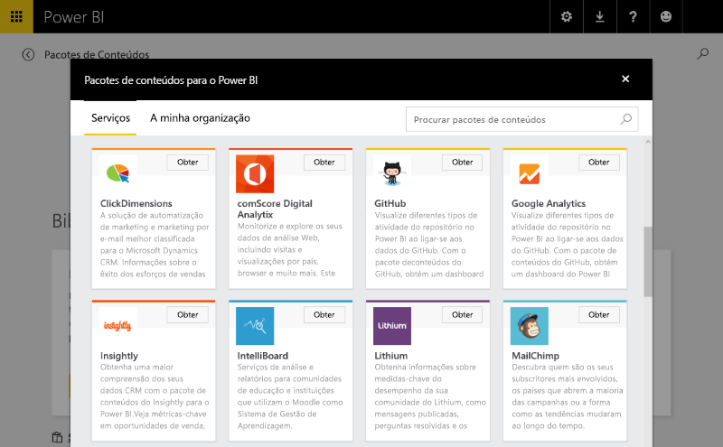
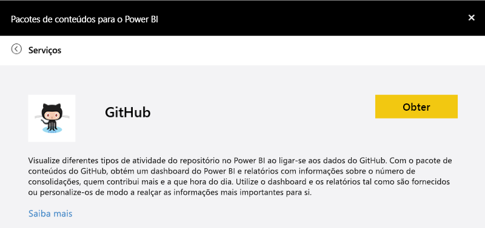
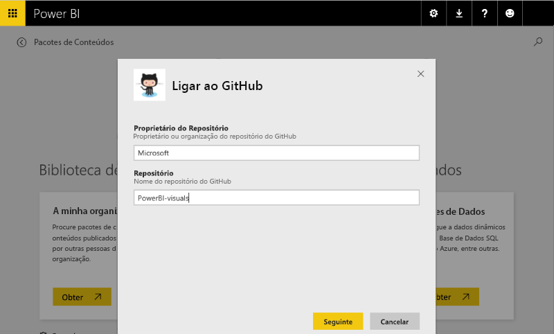
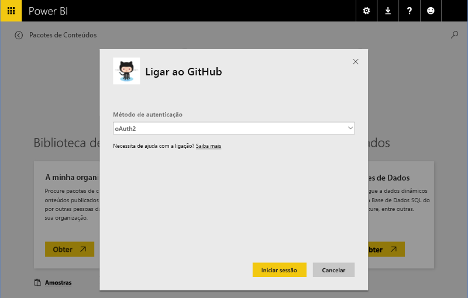
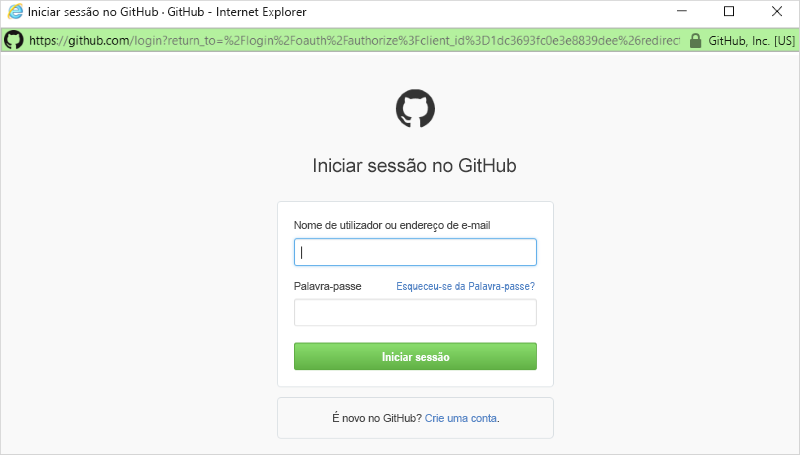
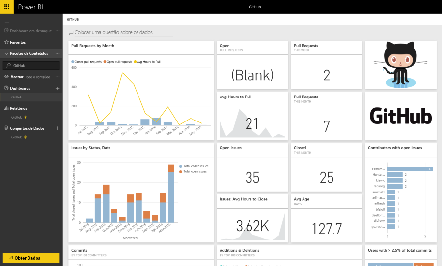

# Experiências do pacote de conteúdos de modelo no Power BI
Esta secção destaca uma experiência normal para um utilizador que se liga a um [pacote de conteúdos](../service-connect-to-services.md) ISV. 

Experimente a experiência de ligação ao ligar-se a um pacote de conteúdos lançado em https://app.powerbi.com/getdata/services (como o [pacote de conteúdos do GitHub](https://app.powerbi.com/getdata/services/github) descrito abaixo).

## Ligar
Para começar, um utilizador navega para a galeria de pacotes de conteúdos e seleciona um pacote de conteúdos ao qual se ligar. A entrada do pacote de conteúdos fornece um nome, um ícone e um texto descritivo a fornecer mais informações para o utilizador.

## Parâmetros
Após a seleção, será pedido ao utilizador que forneça parâmetros (se forem necessários). A caixa de diálogo dos parâmetros é fornecida de forma declarativa pelo autor durante a criação do pacote de conteúdos.

Atualmente, a IU dos parâmetros é bastante básica. Não há forma de enumerar listas pendentes e a validação da entrada de dados está restrita ao regex.

## Credenciais
Após os parâmetros, será pedido ao utilizador que inicie sessão.  Se a origem suportar múltiplos tipos de autenticação, o utilizador irá selecionar a opção adequada. Se a origem requerer OAuth, a IU de início de sessão do serviço será apresentada quando utilizador premir Iniciar Sessão.  Caso contrário, o utilizador pode introduzir as respetivas credenciais na caixa de diálogo apresentada.

## Instalação
Após iniciar sessão com êxito, os artefactos incluídos no pacote de conteúdos (modelos, relatórios e dashboards) são apresentados na barra de navegação.  Estes artefactos são adicionados às contas de cada um dos utilizadores.  Os dados são carregados de forma assíncrona para preencher o conjunto de dados (modelo).  O utilizador poderá então fazer uso do dashboard, dos relatórios e do modelo.

Por predefinição, é configurada uma agenda de atualização diária para o utilizador, que irá reavaliar as consultas no modelo.  As credenciais fornecidas ao utilizador têm de lhes permitir atualizar os dados sem que estejam presentes.

## Exploração e Monitorização
Após o pacote de conteúdos ser enviado para a conta de utilizadores, estes poderão explorar e monitorizar os dados/informações.

Normalmente, tal inclui:

* Ver e personalizar o dashboard.
* Ver e personalizar o relatório.
* Utilizar linguagem natural para colocar perguntas sobre os dados
* Utilizar a tela de exploração para explorar os dados no modelo de dados

Deve haver consideração para fornecer modelagem em linguagem natural (sinónimos) e esquemas de modelos compreensíveis de forma a permitir melhores experiências de exploração.

