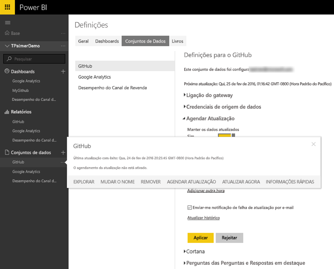
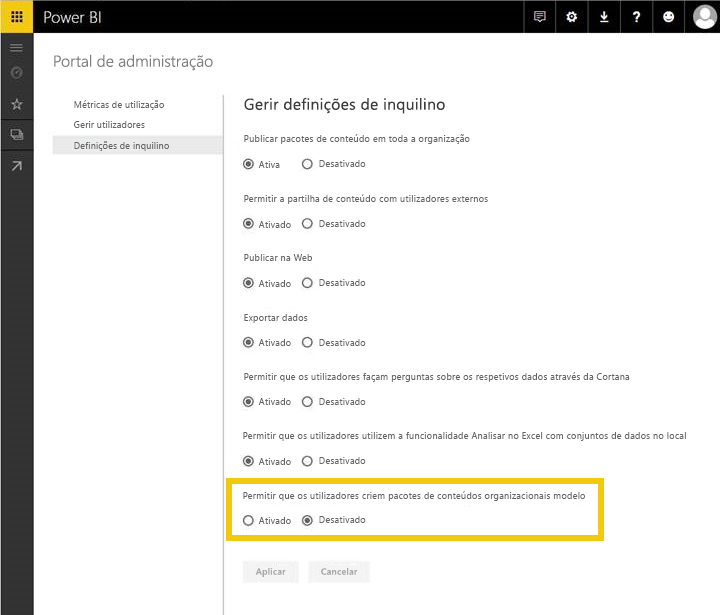
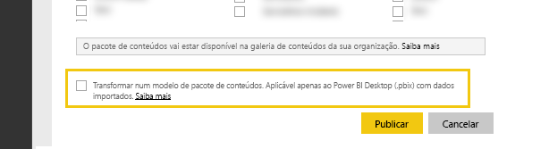
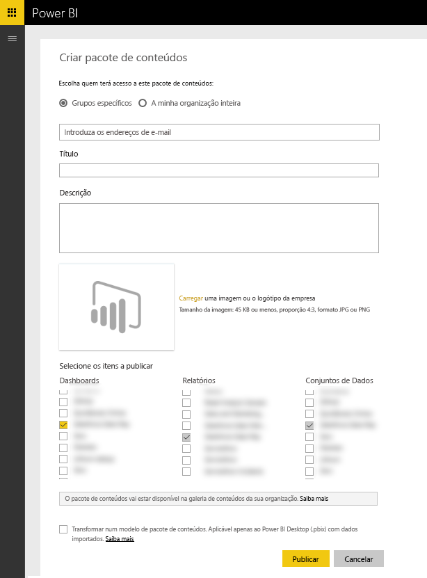

# Testar pacotes de conteúdos de modelo para o Power BI
Existem várias formas de testar o seu pacote de conteúdos antes de submetê-lo para publicação.  

> [!NOTE]
> Se o pacote de conteúdos utilizar um [Conector de Dados](https://aka.ms/DataConnectors) personalizado que tenha desenvolvido, não poderá testar a atualização de dados ou o pacote de conteúdos de modelo conforme descrito abaixo. Se for esse o caso, [submeta](#submission) o pacote de conteúdos e a equipa do Power BI irá trabalhar consigo no teste do pacote de conteúdos.
> 
> 

## Testar a Atualização de Dados Agendada
Os pacotes de conteúdos de modelo tiram partido da Atualização no PowerBI.com para instanciar um pacote de conteúdos com os dados do cliente quando este estabelece ligação. Antes de o pacote de conteúdos estar disponível publicamente, pode testar este fluxo com o ficheiro de Ambiente de Trabalho que criou.

Depois de carregar o ficheiro, selecione "..." junto ao conjunto de dados e selecione Agendar Atualização. Configure as credenciais da origem. Certifique-se de que o conjunto de dados é atualizado com êxito; experimente "Atualizar Agora" e "Atualização Agendada". Se a atualização tiver falhas, consulte a mensagem de erro e valide as suas consultas e o sistema final.

### Sugestões de atualização adicionais
* Apenas deve ser detetada uma origem de dados ao tentar agendar a atualização  
* A ligação de teste deve indicar que o utilizador consegue carregar o pacote de conteúdos. Se não for esse o caso, certifique-se de que as suas consultas processam os casos de erro adicionais.  
* A atualização deve ser concluída num tempo razoável; cerca de 5 minutos é o tempo sugerido  

## Testar Modelos
Um pacote de conteúdos de modelo é semelhante às soluções existentes, exceto que não inclui os dados reais no conjunto de dados. Em vez disso, quando um utilizador consome ou instancia um modelo, é-lhe pedido para fornecer os parâmetros e as credenciais para a ligação. Assim que estiver ligado, verá os seus próprios dados no dashboard, relatório e conjuntos de dados. 

Depois de um utilizador instanciar o pacote de conteúdos, passa a ter acesso às definições do conjunto de dados, incluindo a atualização agendada, e todas as definições de RLS no conjunto de dados **não** são publicadas com o pacote de conteúdos.  

> [!NOTE]
> Os pacotes de conteúdos de modelo só podem incluir 1 dashboard, 1 relatório e 1 conjunto de dados. Consulte a lista de restrições na página de [criação](template-content-pack-authoring.md#restrictions). 
> 
> 

Para permitir a criação de modelos para o seu inquilino,. contacte o administrador do Power BI para ativar o comutador da funcionalidade abaixo. 

Após a ativação, verá uma caixa de verificação na parte inferior de ["Criar pacote de conteúdos"](https://app.powerbi.com/groups/me/publish-content/) que lhe permite publicar um pacote de conteúdos de modelo para a sua organização. 

### Atribuição de nomes
Sugerimos que atribua um nome ao dashboard, ao relatório e ao conjunto de dados de forma consistente no pacote de conteúdos. Estes nomes estão codificados e serão os mesmos para todos os utilizadores, pelo que utilizar o nome do produto/cenário pode facilitar a localização para os seus clientes.

### Sugestões de modelos adicionais
* Certifique-se de que os parâmetros que especificou nas consultas são significativos para os utilizadores finais
* Considere o período de tempo que o utilizador final aguardará até a atualização agendada estar concluída

## Submissão
O processo de submissão através do [Microsoft AppSource](https://appsource.microsoft.com/en-us/partners/list-an-app) permite-lhe publicar o pacote de conteúdos de modelo na galeria de pacotes de conteúdos de serviço no PowerBI.com, bem como listar o pacote de conteúdos no [Microsoft AppSource ](http://appsource.microsoft.com).

### Antes da submissão
* Reveja as sugestões de criação para cada um dos artefactos no pacote de conteúdos
* Teste e ligue-se com várias contas e condições de dados. (Ignore este passo se desenvolveu o seu próprio [Conector de Dados](https://aka.ms/DataConnectors) personalizado)
* Reveja todos os elementos visuais e procure cuidadosamente itens com erros ortográficos
* Certifique-se de que o pacote de conteúdos responde corretamente às perguntas e respostas; sugerimos que teste, pelo menos, 30 perguntas variadas no modelo de dados. (Ignore este passo se desenvolveu o seu próprio [Conector de Dados](https://aka.ms/DataConnectors) personalizado)

### Submissão
Quando estiver pronto para submeter, visite a [página de submissão de aplicações](https://appsource.microsoft.com/en-us/partners/list-an-app) no AppSource e submeta as suas informações. Certifique-se de que seleciona o Power BI na lista de produtos disponíveis

A equipa do Power BI analisará a sua submissão e irá contactá-lo para garantir que todos os artefactos cumprem os requisitos de submissão. Além da conclusão, iremos também validar a qualidade do dashboard e dos relatórios fornecidos para garantir que cumprem o cenário empresarial descrito na aplicação.

### Atualizações
A atualização do pacote de conteúdos segue um fluxo semelhante à submissão original. 

