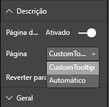

# <a name="tooltips-in-power-bi-visuals"></a>Descrições em elementos visuais do Power BI

Agora os elementos visuais conseguem utilizar o suporte de descrições do Power BI. As descrições do Power BI suportam as seguintes interações:

* Mostrar uma descrição.
* Ocultar uma descrição.
* Mover uma descrição.

As descrições podem apresentar um elemento textual com um título, um valor com uma determinada cor e opacidade num conjunto especificado de coordenadas. Estes dados são fornecidos à API e o anfitrião do Power BI compõe-nos da mesma forma que compõe descrições para elementos visuais nativos.

A seguinte imagem apresenta uma descrição num gráfico de barras de exemplo:


A imagem de descrição anterior ilustra o valor e a categoria de uma única barra. Pode expandir uma única descrição para apresentar múltiplos valores.

## <a name="manage-tooltips"></a>Gerir descrições

A interface através da qual gere descrições é o "ITooltipService". É utilizada para notificar o anfitrião de que é necessário apresentar, remover ou mover uma descrição.

```typescript
    interface ITooltipService {
        enabled(): boolean;
        show(options: TooltipShowOptions): void;
        move(options: TooltipMoveOptions): void;
        hide(options: TooltipHideOptions): void;
    }
```

O seu elemento visual tem de escutar os eventos de rato dentro do seu elemento visual e chamar os delegados `show()`, `move()` e `hide()` conforme necessário com o devido conteúdo preenchido nos objetos `Tooltip****Options`.
`TooltipShowOptions` e `TooltipHideOptions`, por sua vez, definiriam o que apresentar e o comportamento a adotar nestes eventos.

Como a chamada destes métodos envolve eventos de utilizador, tais como eventos de toque ou movimentos do rato, é boa ideia criar serviços de escuta para estes eventos, o que, por sua vez, invoca os membros `TooltipService`.
Os nossos exemplos de agregações numa classe chamada `TooltipServiceWrapper`.

### <a name="the-tooltipservicewrapper-class"></a>Classe TooltipServiceWrapper

A ideia básica subjacente a esta classe consiste em conter a instância do `TooltipService`, escutar eventos de rato D3 sobre elementos relevantes e, em seguida, chamar os elementos `show()` e `hide()` quando for necessário.

A classe contém e gere todos os estados e lógicas relevantes para estes eventos, especialmente destinados a ser utilizados com interface com o código D3 subjacente. A utilização com interface e a conversão D3 estão fora do âmbito deste artigo.

Pode encontrar o exemplo de código completo no [repositório de elementos visuais do SampleBarChart](https://github.com/Microsoft/PowerBI-visuals-sampleBarChart/commit/981b021612d7b333adffe9f723ab27783c76fb14).

### <a name="create-tooltipservicewrapper"></a>Criar classe TooltipServiceWrapper

O construtor do gráfico de barras tem agora um membro `TooltipServiceWrapper`, que é instanciado no construtor com a instância `tooltipService` do anfitrião.

```typescript
        private tooltipServiceWrapper: ITooltipServiceWrapper;

        this.tooltipServiceWrapper = createTooltipServiceWrapper(this.host.tooltipService, options.element);
```

A classe `TooltipServiceWrapper` contém a instância `tooltipService`, assim como o elemento D3 raiz dos parâmetros visuais e de toque.

```typescript
    class TooltipServiceWrapper implements ITooltipServiceWrapper {
        private handleTouchTimeoutId: number;
        private visualHostTooltipService: ITooltipService;
        private rootElement: Element;
        private handleTouchDelay: number;

        constructor(tooltipService: ITooltipService, rootElement: Element, handleTouchDelay: number) {
            this.visualHostTooltipService = tooltipService;
            this.handleTouchDelay = handleTouchDelay;
            this.rootElement = rootElement;
        }
        .
        .
        .
    }
```

O único ponto de entrada para esta classe registar serviços de escuta de eventos é o método `addTooltip`.

### <a name="the-addtooltip-method"></a>Método addTooltip

```typescript
        public addTooltip<T>(
            selection: d3.Selection<Element>,
            getTooltipInfoDelegate: (args: TooltipEventArgs<T>) => VisualTooltipDataItem[],
            getDataPointIdentity: (args: TooltipEventArgs<T>) => ISelectionId,
            reloadTooltipDataOnMouseMove?: boolean): void {

            if (!selection || !this.visualHostTooltipService.enabled()) {
                return;
            }
        ...
        ...
        }
```

* **selection: d3.Selection<Element>** : os elementos D3 sobre os quais são processadas descrições.

* **getTooltipInfoDelegate: (args: TooltipEventArgs<T>) => VisualTooltipDataItem[]** : o delegado para preencher o conteúdo da descrição (o que apresentar) por contexto.

* **getDataPointIdentity: (args: TooltipEventArgs<T>) => ISelectionId**: o delegado para recuperar o ID do ponto de dados (não utilizado neste exemplo). 

* **reloadTooltipDataOnMouseMove? boolean**: um booleano que indica se os dados da descrição devem ou não ser atualizados durante um evento MouseMove (não utilizado neste exemplo).

Como pode ver, `addTooltip` sairá sem ação se `tooltipService` estiver desativado ou não houver nenhuma seleção real.

### <a name="call-the-show-method-to-display-a-tooltip"></a>Chamar o método Show para apresentar uma descrição

O método `addTooltip` ouve o evento D3 `mouseover`, conforme apresentado no código seguinte:

```typescript
        ...
        ...
        selection.on("mouseover.tooltip", () => {
            // Ignore mouseover while handling touch events
            if (!this.canDisplayTooltip(d3.event))
                return;

            let tooltipEventArgs = this.makeTooltipEventArgs<T>(rootNode, true, false);
            if (!tooltipEventArgs)
                return;

            let tooltipInfo = getTooltipInfoDelegate(tooltipEventArgs);
            if (tooltipInfo == null)
                return;

            let selectionId = getDataPointIdentity(tooltipEventArgs);

            this.visualHostTooltipService.show({
                coordinates: tooltipEventArgs.coordinates,
                isTouchEvent: false,
                dataItems: tooltipInfo,
                identities: selectionId ? [selectionId] : [],
            });
        });
```

* **makeTooltipEventArgs**: Extrai o contexto dos elementos D3 selecionados para um ToolTipEventArgs. Também calcula as coordenadas.

* **getTooltipInfoDelegate**: em seguida, cria o conteúdo da descrição a partir de ToolTipEventArgs. É uma chamada de retorno para a classe BarChart, dado ser a lógica do elemento visual. É o conteúdo de texto que será efetivamente apresentado na descrição.

* **getDataPointIdentity**: não utilizado neste exemplo.

* **this.visualHostTooltipService.show**: a chamada para apresentar a descrição.  

É possível encontrar processamento adicional no exemplo dos eventos `mouseout` e `mousemove`.

Para obter mais informações, veja o [repositório de elementos visuais do SampleBarChart](https://github.com/Microsoft/PowerBI-visuals-sampleBarChart/commit/981b021612d7b333adffe9f723ab27783c76fb14).

### <a name="populate-the-tooltip-content-by-the-gettooltipdata-method"></a>Preencher o conteúdo da descrição através do método getTooltipData

A classe BarChart foi adicionada com um membro `getTooltipData` que simplesmente extrai a `category`, o `value` e a `color` do ponto de dados para um elemento VisualTooltipDataItem[].

```typescript
        private static getTooltipData(value: any): VisualTooltipDataItem[] {
            return [{
                displayName: value.category,
                value: value.value.toString(),
                color: value.color,
                header: 'ToolTip Title'
            }];
        }
```

Na implementação anterior, o membro `header` é constante, mas pode utilizá-lo para implementações mais complexas que exigem valores dinâmicos. Pode preencher `VisualTooltipDataItem[]` com mais do que um elemento, o que adicionará múltiplas linhas à descrição. Pode ser útil em elementos visuais, tais como gráficos de barras empilhadas, nos quais a descrição poderá apresentar dados de mais do que um único ponto de dados.

### <a name="call-the-addtooltip-method"></a>Chamar o método addTooltip

O último passo consiste em chamar o método `addTooltip` quando os dados podem mudar. Esta chamada ocorre no método `BarChart.update()`. É efetuada uma chamada para monitorizar a seleção de todos os elementos da "barra" e transmite-se apenas `BarChart.getTooltipData()`, conforme mencionado anteriormente.

```typescript
        this.tooltipServiceWrapper.addTooltip(this.barContainer.selectAll('.bar'),
            (tooltipEvent: TooltipEventArgs<number>) => BarChart.getTooltipData(tooltipEvent.data),
            (tooltipEvent: TooltipEventArgs<number>) => null);
```

## <a name="add-report-page-tooltips"></a>Adicionar descrições de página do relatório

Para adicionar suporte de descrições da página de relatório, irá encontrar a maioria das alterações no ficheiro *capabilities.json*.

Abaixo encontra-se um exemplo de esquema.

```json
{
    "tooltips": {
        "supportedTypes": {
            "default": true,
            "canvas": true
        },
        "roles": [
            "tooltips"
        ]
    }
}
```

Pode definir descrições da página de relatório no painel **Formatar**.



* `supportedTypes`: A configuração das descrições é suportada pelo elemento visual e refletida no conjunto de campos. 
   * `default`: especifica se o enlace de descrições "automático" através do campo de dados é suportado. 
   * `canvas`: especifica se as descrições da página de relatório são suportadas.

* `roles`: (opcional) quando está definido, indica as funções de dados que estarão vinculadas à opção de descrição selecionada no conjunto de campos.

Para obter mais informações, veja as [diretrizes de utilização das descrições da página de relatório ](https://powerbi.microsoft.com/blog/power-bi-desktop-march-2018-feature-summary/#tooltips).

Para apresentar a descrição da página de relatório, após o anfitrião do Power BI chamar `ITooltipService.Show(options: TooltipShowOptions)` ou `ITooltipService.Move(options: TooltipMoveOptions)`, consome a propriedade selectionId (`identities`) do argumento `options` anterior. Para ser obtido pela descrição, SelectionId deverá representar os dados selecionados (categoria, série, entre outros), relativos ao item sobre o qual pairou o cursor do rato.

No seguinte código, é apresentado um exemplo do envio de selectionId para chamadas de apresentação de descrições:

```typescript
    this.tooltipServiceWrapper.addTooltip(this.barContainer.selectAll('.bar'),
        (tooltipEvent: TooltipEventArgs<number>) => BarChart.getTooltipData(tooltipEvent.data),
        (tooltipEvent: TooltipEventArgs<number>) => tooltipEvent.data.selectionID);
```
