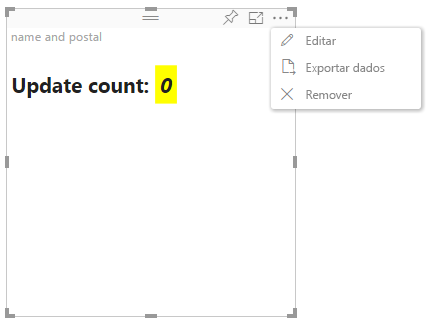

# Modo de edição avançado nos elementos visuais do Power BI

Se precisar de controlos avançados de IU no seu elemento visual do Power BI, poderá tirar proveito do modo de edição avançado. No modo de edição de relatórios, selecione o botão **Editar** para definir o modo de edição para **Avançado**. O elemento visual pode utilizar o sinalizador `EditMode` para determinar se esse controlo de IU deve ser apresentado.

Por predefinição, o elemento visual não suporta o modo de edição avançado. Se for necessário um comportamento diferente, pode declará-lo explicitamente no ficheiro *capabilities.json* do elemento visual, através da definição da propriedade `advancedEditModeSupport`.

Os valores possíveis são:

- `0` – NotSupported

- `1` – SupportedNoAction

- `2` – SupportedInFocus

## Entrar no modo de edição avançado

Um botão **Editar** será apresentado se:

* A propriedade `advancedEditModeSupport` estiver definida no ficheiro *capabilities.json* para `SupportedNoAction` ou `SupportedInFocus`.

* O elemento visual for visualizado no modo de edição de relatórios.

Se a propriedade `advancedEditModeSupport` estiver fora do ficheiro *capabilities.json* ou estiver definida como `NotSupported`, o botão **Editar** não é apresentado.

Ao selecionar **Editar**, o elemento visual obtém uma chamada de atualização() com EditMode definido como `Advanced`. Consoante o valor definido no ficheiro *capabilities.json*, irão ocorrer as seguintes ações:

* `SupportedNoAction`: Não será necessária qualquer ação adicional da parte do anfitrião.
* `SupportedInFocus`: O anfitrião irá apresentar o elemento visual no modo de detalhe.

## Sair do modo de edição avançado

O botão **Voltar ao relatório** é apresentado se:

* A propriedade `advancedEditModeSupport` estiver definida no ficheiro *capabilities.json* para `SupportedInFocus`.
