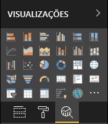

# <a name="the-analytics-pane-in-power-bi-visuals"></a>O Painel de análise em elementos visuais do Power BI

O Painel de **análise** foi apresentado para [elementos visuais nativos](https://docs.microsoft.com/power-bi/desktop-analytics-pane) em novembro de 2018.
Este artigo aborda a forma como os elementos visuais do Power BI com a API v2.5.0 podem apresentar e gerir as suas propriedades no Painel de **análise**.



## <a name="manage-the-analytics-pane"></a>Gerir o Painel de análise

Do mesmo modo que gere as propriedades no painel [**Formatação**](https://docs.microsoft.com/power-bi/developer/visuals/custom-visual-develop-tutorial-format-options), também pode gerir o Painel de **análise** ao definir um objeto no ficheiro *capabilities.json* do elemento visual.

Relativamente ao Painel de **análise**, as diferenças são as seguintes:

* Por baixo da definição do objeto, adicione um campo **objectCategory** com o valor de 2.

    > [!NOTE]
    > O campo opcional `objectCategory` foi apresentado na API 2.5.0. Define o aspeto do elemento visual que o objeto controla (1 = Formatação, 2 = Análise). `Formatting` é utilizado para elementos como o aspeto e a funcionalidade, cores, eixos e etiquetas. `Analytics` é utilizado para elementos como previsões, linhas de tendência, linhas de referência e formas.
    >
    > Se o valor não for especificado, `objectCategory` assume a predefinição de "Formatação".

* O objeto tem de ter as duas propriedades seguintes:
    * `show` de tipo `bool`, com um valor predefinido de `false`.
    * `displayName` de tipo `text`. O valor predefinido que escolher torna-se o nome a apresentar inicial da instância.

```json
{
  "objects": {
    "YourAnalyticsPropertiesCard": {
      "displayName": "Your analytics properties card's name",
      "objectCategory": 2,
      "properties": {
        "show": {
          "type": {
            "bool": true
          }
        },
        "displayName": {
          "type": {
            "text": true
          }
        },
      ... //any other properties for your Analytics card
      }
    }
  ...
  }
}
```

Pode definir outras propriedades da mesma forma que faz para os objetos de **Formatação**. Pode ainda enumerar objetos tal como faz no painel **Formatação**.

## <a name="known-limitations-and-issues-of-the-analytics-pane"></a>Limitações e problemas conhecidos do Painel de análise

* O painel **Análise** ainda não tem suporte de várias instâncias. Os objetos não podem ter um [seletor](https://microsoft.github.io/PowerBI-visuals/docs/concepts/objects-and-properties/#selector) diferente de estático (ou seja, "seletor": nulo) e os elementos visuais do Power BI não podem ter múltiplas instâncias de um cartão definidas pelo utilizador.
* As propriedades do tipo `integer` não são apresentadas corretamente. Como alternativa, utilize o tipo `numeric`.

> [!NOTE]
> * Utilize o Painel de **análise** apenas para objetos que adicionam novas informações ou que revelam detalhes sobre as informações apresentadas (por exemplo, linhas de referência dinâmicas que ilustram tendências importantes).
> * Qualquer opção que controle o aspeto e funcionalidade do elemento visual, ou seja, a formatação, deve ser limitada ao painel **Formatação**.
