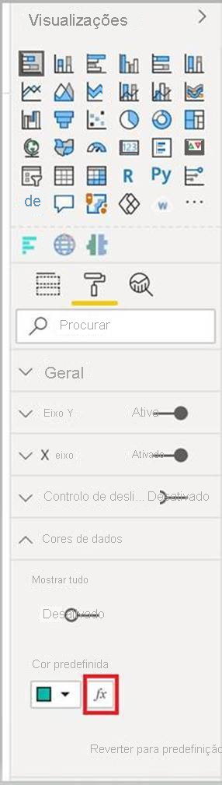

# <a name="add-conditional-formatting"></a>Adicionar formatação condicional

A [formatação condicional](../../visuals/service-tips-and-tricks-for-color-formatting.md#conditional-formatting-for-visualizations) permite que um criador de relatórios especifique como as cores são apresentadas num relatório, de acordo com um valor numérico.

Este artigo descreve como adicionar a funcionalidade de formatação condicional ao seu elemento visual do Power BI.

A formatação condicional só pode ser aplicada aos seguintes tipos de propriedade:
* Cor
* Texto
* Ícone
* URL da Web

## <a name="add-conditional-formatting-to-your-project"></a>Adicionar formatação condicional ao seu projeto

Esta secção mostra como adicionar formatação condicional a um elemento visual do Power BI existente. O código de exemplo neste artigo baseia-se no elemento visual [SampleBarChart](https://github.com/microsoft/PowerBI-visuals-sampleBarChart). Pode examinar o código fonte em [barChart.ts](https://github.com/microsoft/PowerBI-visuals-sampleBarChart/blob/master/src/barChart.ts).

### <a name="add-a-conditional-color-formatting-entry-in-the-format-pane"></a>Adicionar uma entrada de formatação de cor condicional no painel Formatar

Nesta secção, vai aprender a adicionar uma entrada de formatação de cor condicional a um ponto de dados no painel Formatar.

1. Vai usar a matriz `propertyInstanceKind` em `VisualObjectInstance`, que é exposta por `powerbi-visuals-api`. O primeiro passo é verificar se o ficheiro inclui esta importação:

    ```typescript
    import powerbiVisualsApi from "powerbi-visuals-api";
    ```

2. Para especificar o tipo adequado de formatação (*Constant*, *ConstantOrRule* ou *Rule*), vai usar o enum `VisualEnumerationInstanceKinds`. Adicione a seguinte importação ao seu ficheiro:

    ```typescript
    import VisualEnumerationInstanceKinds = powerbiVisualsApi.VisualEnumerationInstanceKinds;
    ```

3. Liste todas as propriedades que quer que suportem a formatação condicional, na matriz `propertyInstanceKind`. Defina estas propriedades no método `enumerateObjectInstances`.

    ```typescript
    public enumerateObjectInstances(options: EnumerateVisualObjectInstancesOptions): VisualObjectInstanceEnumeration {
            …
            case 'colorSelector':
                …
                    objectEnumeration.push({
                        objectName: objectName,
                        displayName: barDataPoint.category,
                        properties: {
                            fill: {
                                solid: {
                                    color: barDataPoint.color
                                }
                            }
                        },
                        selector: dataViewWildcard.createDataViewWildcardSelector(dataViewWildcard.DataViewWildcardMatchingOption.InstancesAndTotals),
                        altConstantValueSelector: barDataPoint.selectionId.getSelector(),

                        // List your conditional formatting properties
                        propertyInstanceKind: {
                            fill: VisualEnumerationInstanceKinds.ConstantOrRule
                        }
                    });
                }
            …
    }

    ```

    `VisualEnumerationInstanceKinds.ConstantOrRule` criará a entrada de IU de formatação condicional junto com o elemento de IU de formatação constante.

    >[!div class="mx-imgBorder"]
    >

### <a name="define-how-conditional-formatting-behaves"></a>Definir o comportamento da formatação condicional

Defina como a formatação será aplicada aos seus pontos de dados.

Ao usar `createDataViewWildcardSelector` declarado em `powerbi-visuals-utils-dataviewutils`, especifique se a formatação condicional será aplicada a instâncias, a totais ou a ambos. Para obter mais informações, veja [DataViewWildcard](utils-dataview.md#).

No `enumerateObjectInstances`, faça as seguintes alterações aos objetos aos quais quer aplicar a formatação condicional:

 * Substitua o valor `selector` pela chamada `dataViewWildcard.createDataViewWildcardSelector(dataViewWildcardMatchingOption)`. `DataViewWildcardMatchingOption` define se a formatação condicional é aplicada a instâncias, a totais ou a ambos.

* Adicione a propriedade `altConstantValueSelector` com o valor definido anteriormente para a propriedade `selector`.

```typescript
case 'colorSelector':
         …
            objectEnumeration.push({
                objectName: objectName,
                displayName: barDataPoint.category,
                properties: {
                    fill: {
                        solid: {
                            color: barDataPoint.color
                        }
                    }
                },

                // Define whether the conditional formatting will apply to instances, totals, or both
                selector: dataViewWildcard.createDataViewWildcardSelector(dataViewWildcard.DataViewWildcardMatchingOption.InstancesAndTotals),

                // Add this property with the value previously defined for the selector property
                altConstantValueSelector: barDataPoint.selectionId.getSelector(),

                propertyInstanceKind: { 
                    fill: VisualEnumerationInstanceKinds.ConstantOrRule
                }
            });
        }

```

## <a name="next-steps"></a>Passos seguintes

Veja o artigo [DataViewUtils](utils-dataview.md).