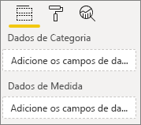
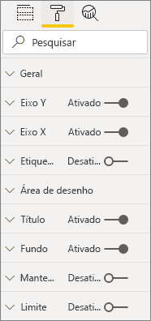
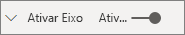
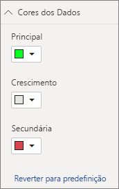

# <a name="build-a-bar-chart"></a>Build a bar chart (Criar um gráfico de barras)

Este artigo é um guia passo a passo para criar um elemento visual de gráfico de barras de exemplo do Power BI com código. Pode obter o exemplo de código completo em [https://github.com/Microsoft/PowerBI-visuals-sampleBarChart](https://github.com/Microsoft/PowerBI-visuals-sampleBarChart).

## <a name="view-model"></a>Modelo de visualização
É importante definir primeiro o modelo de visualização do gráfico de barras e iterar sobre o que está exposto ao elemento visual à medida que é criado.

```typescript
/**
 * Interface for BarCharts viewmodel.
 *
 * @interface
 * @property {BarChartDataPoint[]} dataPoints - Set of data points the visual will render.
 * @property {number} dataMax                 - Maximum data value in the set of data points.
 */
interface BarChartViewModel {
    dataPoints: BarChartDataPoint[];
    dataMax: number;
};

/**
 * Interface for BarChart data points.
 *
 * @interface
 * @property {number} value    - Data value for the point.
 * @property {string} category - Corresponding category of the data value.
 */
interface BarChartDataPoint {
    value: number;
    category: string;
};
```

### <a name="use-static-data"></a>Utilizar dados estáticos

A utilização de dados estáticos é uma excelente forma de testar o elemento visual sem enlace de dados. O modelo de visualização não será alterado, mesmo depois de adicionar o enlace de dados num passo posterior.

```typescript
let testData: BarChartDataPoint[] = [
    {
        value: 10,
        category: 'a'
    },
    {
        value: 20,
        category: 'b'
    },
    {
        value: 1,
        category: 'c'
    },
    {
        value: 100,
        category: 'd'
    },
    {
        value: 500,
        category: 'e'
    }];

let viewModel: BarChartViewModel = {
    dataPoints: testData,
    dataMax: d3.max(testData.map((dataPoint) => dataPoint.value))
};
```

## <a name="data-binding"></a>Enlace de dados 
Pode adicionar o enlace de dados ao definir as capacidades visuais no ficheiro *capabilities.json*. O código de exemplo já tem um esquema para utilização.

O enlace de dados atua num conjunto de **Campos** e no Power BI.



### <a name="add-data-roles"></a>Adicionar funções de dados
O código de exemplo já tem funções de dados, mas pode personalizá-las.

- `displayName` é o nome apresentado no conjunto de **Campos**.
- `name` é o nome interno utilizado para se referir à função de dados.
- `kind` é o tipo de campo. Os campos *Agrupamento* (0) têm valores discretos. Os campos *Medição* (1) têm valores de dados numéricos.

```json
"dataRoles": [
    {
        "displayName": "Category Data",
        "name": "category",
        "kind": 0
    },
    {
        "displayName": "Measure Data",
        "name": "measure",
        "kind": 1
    }
],
```

Para obter mais informações, veja [Funções de dados](./capabilities.md#define-the-data-fields-that-your-visual-expects-dataroles).

### <a name="add-conditions-to-dataviewmapping"></a>Adicionar condições a DataViewMapping
Defina as condições em `dataViewMappings` para definir quantos campos cada conjunto pode vincular. Utilize o `name` interno da função de dados para se referir a cada campo.

```json
    "dataViewMappings": [
        {
            "conditions": [
                {
                    "category": {
                        "max": 1
                    },
                    "measure": {
                        "max": 1
                    }
                }
            ],
        }
    ]
```

Para obter mais informações, veja [Mapeamento da vista de dados](./dataview-mappings.md).

### <a name="define-and-use-visualtransform"></a>Definir e utilizar visualTransform
`DataView` é a estrutura que o Power BI proporciona ao elemento visual, que contém os dados consultados a visualizar. No entanto, `DataView` pode proporcionar dados em formatos diferentes, como categóricos e tabulares. Para criar um elemento visual categórico como um gráfico de barras, só tem de utilizar a propriedade categórica em `DataView`. A definição de `visualTransform` permite converter `DataView` num modelo de visualização que será utilizado pelo elemento visual.

Para atribuir cores e selecioná-las quando definir pontos de dados individuais, vai utilizar `IVisualHost`. 

```typescript
/**
 * Function that converts queried data into a view model that will be used by the visual
 *
 * @function
 * @param {VisualUpdateOptions} options - Contains references to the size of the container
 *                                        and the dataView which contains all the data
 *                                        the visual had queried.
 * @param {IVisualHost} host            - Contains references to the host which contains services
 */
function visualTransform(options: VisualUpdateOptions, host: IVisualHost): BarChartViewModel {
    /*Convert dataView to your viewModel*/
}

```

## <a name="color"></a>Cor 
A cor é exposta como um dos serviços disponíveis em `IVisualHost`.

### <a name="add-color-to-data-points"></a>Adicionar cor aos pontos de dados
Cada ponto de dados é representado por uma cor diferente. Vai adicionar cor à interface `BarChartDataPoint`.

```typescript
/**
 * Interface for BarChart data points.
 *
 * @interface
 * @property {number} value    - Data value for the point.
 * @property {string} category - Corresponding category of the data value.
 * @property {string} color    - Color corresponding to the data point.
 */
interface BarChartDataPoint {
    value: number;
    category: string;
    color: string;
};
```

### <a name="the-colorpalette-service"></a>Serviço colorPalette
O serviço `colorPalette` faz a gestão das cores utilizadas no elemento visual. A instância está disponível em `IVisualHost`.

### <a name="assign-color-to-data-points"></a>Atribuir cor aos pontos de dados
Definiu `visualTransform` como uma construção para converter `dataView` num modelo de visualização que pode ser utilizado por um gráfico de barras. Uma vez que itera através dos pontos de dados em `visualTransform`, é também o local ideal para atribuir cores.

```typescript
let colorPalette: IColorPalette = host.colorPalette; // host: IVisualHost
for (let i = 0, len = Math.max(category.values.length, dataValue.values.length); i < len; i++) {
    barChartDataPoints.push({
        category: category.values[i],
        value: dataValue.values[i],
        color: colorPalette.getColor(category.values[i]).value,
    });
}
```

## <a name="selection-and-interactions"></a>Seleção e interações
A seleção permite ao utilizador interagir tanto com o seu elemento visual como com outros elementos visuais. 

### <a name="add-selection-to-each-data-point"></a>Adicionar a seleção a cada ponto de dados
Uma vez que cada ponto de dados é único, adicione a seleção a cada ponto de dados. Pode adicionar a propriedade de seleção na interface `BarChartDataPoint`.

```typescript
/**
 * Interface for BarChart data points.
 *
 * @interface
 * @property {number} value             - Data value for the point.
 * @property {string} category          - Corresponding category of data value.
 * @property {string} color             - Color corresponding to data point.
 * @property {ISelectionId} selectionId - Id assigned to data point for cross filtering
 *                                        and visual interaction.
 */
interface BarChartDataPoint {
    value: number;
    category: string;
    color: string;
    selectionId: ISelectionId;
};
```

### <a name="assign-selection-ids-to-each-data-point"></a>Atribuir IDs de seleção a cada ponto de dados
Uma vez que itera através dos pontos de dados em `visualTransform`, é também o local ideal para criar IDs de seleção. A variável de anfitrião é `IVisualHost`, que contém os serviços que o elemento visual pode utilizar, como o construtor de cores e seleções. 

Utilize o método de fábrica `createSelectionIdBuilder` em `IVisualHost` para criar um novo ID de seleção. Crie um novo construtor de seleções para cada ponto de dados.

Uma vez que está a fazer seleções baseadas apenas na categoria, só precisa de definir seleções `withCategory`.

```typescript
for (let i = 0, len = Math.max(category.values.length, dataValue.values.length); i < len; i++) {
    barChartDataPoints.push({
        category: category.values[i],
        value: dataValue.values[i],
        color: colorPalette.getColor(category.values[i]).value,
        selectionId: host.createSelectionIdBuilder()
            .withCategory(category, i)
            .createSelectionId()
    });
}
```

Para obter mais informações, veja [Criar uma instância do construtor de seleções](./selection-api.md#create-an-instance-of-the-selection-builder).

### <a name="interact-with-data-points"></a>Interagir com pontos de dados
Pode interagir com cada barra do gráfico de barras assim que for atribuído um ID de seleção ao ponto de dados. O gráfico de barras escuta os eventos `click`.

Utilize o método de fábrica `selectionManager` em `IVisualHost` para criar um gestor de seleções para filtragem cruzada e limpar seleções.

```typescript
let selectionManager = this.selectionManager;

//This must be an anonymous function instead of a lambda because
//d3 uses 'this' as the reference to the element that was clicked.
bars.on('click', function(d) {
    selectionManager.select(d.selectionId).then((ids: ISelectionId[]) => {
        bars.attr({
            'fill-opacity': ids.length > 0 ? BarChart.Config.transparentOpacity : BarChart.Config.solidOpacity
        });

        d3.select(this).attr({
            'fill-opacity': BarChart.Config.solidOpacity
        });
    });

    (<Event>d3.event).stopPropagation();
});
```

Para obter mais informações, veja [Como utilizar o SelectionManager](./selection-api.md#how-to-use-selectionmanager-to-select-data-points).

## <a name="static-objects"></a>Objetos estáticos

Pode adicionar objetos ao painel **Propriedade** para personalizar ainda mais o elemento visual. Estas personalizações podem ser alterações à interface de utilizador ou alterações relacionadas com os dados que foram consultados. O exemplo utiliza objetos estáticos para compor o eixo X do gráfico de barras.

Pode ativar e desativar objetos no painel **Propriedade**.



### <a name="define-objects-in-capabilities"></a>Definir objetos em capacidades
Defina uma propriedade `objects` no ficheiro *capabilities.json* para serem apresentados objetos no painel **Propriedade**.
- `enableAxis` é o nome interno referenciado por `dataView`. 
- `displayName` é o nome apresentado no painel **Propriedade**.
- `bool` é um valor primitivo normalmente utilizado com objetos estáticos, como caixas de texto ou comutadores.
- `show` é uma propriedade especial em `properties` que ativa o comutador `show` no objeto. Uma vez que `show` é um comutador, é escrito como `bool`.



```typescript
"objects": {
    "enableAxis": {
        "displayName": "Enable Axis",
        "properties": {
            "show": {
                "displayName": "Enable Axis",
                "type": { "bool": true }
            }
        }
    }
}
```

Para obter mais informações, veja [Objetos](./objects-properties.md).

### <a name="define-property-settings"></a>Definições de propriedades

As secções seguintes descrevem os princípios básicos das definições de propriedades. Também pode utilizar as classes de utilitários definidas no pacote `powerbi-visuals-utils-dataviewutils` para definir propriedades. Para obter mais informações, veja a documentação e os exemplos da classe [DataViewObjectsParser](https://github.com/Microsoft/powerbi-visuals-utils-dataviewutils/blob/master/docs/api/data-view-objects-parser.md).


Embora seja opcional, é melhor localizar a maioria das definições num único objeto para fácil referência.

```typescript
/**
 * Interface for BarCharts viewmodel.
 *
 * @interface
 * @property {BarChartDataPoint[]} dataPoints - Set of data points the visual will render.
 * @property {number} dataMax                 - Maximum data value in the set of data points.
 * @property {BarChartSettings} settings      - Object property settings
 */
interface BarChartViewModel {
    dataPoints: BarChartDataPoint[];
    dataMax: number;
    settings: BarChartSettings;
};

/**
 * Interface for BarChart settings.
 *
 * @interface
 * @property "show" enableAxis - Object property that allows axis to be enabled.
 */
interface BarChartSettings {
    enableAxis: {
        show: boolean;
    };
}
```

### <a name="define-and-use-objectenumerationutility"></a>Definir e utilizar ObjectEnumerationUtility
Os valores das propriedades de objetos estão disponíveis como metadados em `dataView`, mas não há nenhum serviço para ajudar a obter estas propriedades. `ObjectEnumerationUtility` é um conjunto de funções estáticas que pode utilizar para obter os valores de objetos de `dataView`, e de outros projetos visuais. `ObjectEnumerationUtility` é opcional, mas é excelente para iterar através de `dataView` para obter as propriedades dos objetos.

```typescript
/**
 * Gets property value for a particular object.
 *
 * @function
 * @param {DataViewObjects} objects - Map of defined objects.
 * @param {string} objectName       - Name of desired object.
 * @param {string} propertyName     - Name of desired property.
 * @param {T} defaultValue          - Default value of desired property.
 */
export function getValue<T>(objects: DataViewObjects, objectName: string, propertyName: string, defaultValue: T ): T {
    if(objects) {
        let object = objects[objectName];
        if(object) {
            let property: T = object[propertyName];
            if(property !== undefined) {
                return property;
            }
        }
    }
    return defaultValue;
}
```

Veja [objectEnumerationUtility.ts](https://github.com/Microsoft/PowerBI-visuals-sampleBarChart/blob/master/src/objectEnumerationUtility.ts) para obter o código-fonte.

### <a name="retrieve-property-values-from-dataview"></a>Obter valores de propriedades a partir de dataView
`visualTransform` é o local ideal para manipular o modelo de visualização do elemento visual. Para continuar este padrão, obtenha as propriedades de objetos a partir de `dataView`.

Defina o estado predefinido da propriedade e utilize `getValue` para obter a propriedade a partir de `dataView`.

```typescript
let defaultSettings: BarChartSettings = {
    enableAxis: {
        show: false,
    }
};

let barChartSettings: BarChartSettings = {
    enableAxis: {
        show: getValue<boolean>(objects, 'enableAxis', 'show', defaultSettings.enableAxis.show),
    }
}
```

### <a name="populate-property-pane-with-enumerateobjectinstances"></a>Povoar o painel Propriedade com enumerateObjectInstances
O método opcional `enumerateObjectInstances` em `IVisual` enumera todos os objetos e coloca-os no painel **Propriedade**. Cada objeto é chamado com `enumerateObjectInstances`. O nome do objeto está disponível em `EnumerateVisualObjectInstancesOptions`.

Para cada objeto, defina a propriedade com o seu estado atual.

```typescript
/**
 * Enumerates through the objects defined in the capabilities and adds the properties to the format pane
 *
 * @function
 * @param {EnumerateVisualObjectInstancesOptions} options - Map of defined objects
 */
public enumerateObjectInstances(options: EnumerateVisualObjectInstancesOptions): VisualObjectInstanceEnumeration {
    let objectName = options.objectName;
    let objectEnumeration: VisualObjectInstance[] = [];

    switch(objectName) {
        case 'enableAxis':
            objectEnumeration.push({
                objectName: objectName,
                properties: {
                    show: this.barChartSettings.enableAxis.show,
                },
                selector: null
            });
    };

    return objectEnumeration;
}
```

### <a name="control-property-update-logic"></a>Controlar a lógica de atualização da propriedade
Depois de adicionar um objeto ao painel **Propriedade**, cada seletor aciona uma atualização. Adicione a lógica de objeto específica nos blocos `if`:

```typescript
if(settings.enableAxis.show) {
    let margins = BarChart.Config.margins;
    height -= margins.bottom;
}
```

## <a name="databound-objects"></a>Objetos Databound
Os objetos Databound são semelhantes aos objetos estáticos, mas normalmente lidam com a seleção de dados. Por exemplo, pode alterar a cor associada ao ponto de dados.



### <a name="define-object-in-capabilities"></a>Definir objetos em capacidades
Semelhante aos objetos estáticos, defina outro objeto no ficheiro *capabilities.json*. 
- `colorSelector` é o nome interno referenciado por `dataView`.
- `displayName` é o nome apresentado no painel **Propriedade**.
- `fill` é um valor de objeto estrutural não associado a um tipo primitivo.

```typescript
"colorSelector": {
    "displayName": "Data Colors",
    "properties": {
        "fill": {
            "displayName": "Color",
            "type": {
                "fill": {
                    "solid": {
                        "color": true
                    }
                }
            }
        }
    }
}
```

Para obter mais informações, veja [Objetos](./objects-properties.md).

### <a name="use-objectenumerationutility"></a>Utilizar ObjectEnumerationUtility
Tal como acontece com os objetos estáticos, terá de obter os detalhes do objeto a partir de `dataView`. No entanto, em vez de os valores do objeto estarem nos metadados, estão associados a cada categoria.

```typescript
/**
 * Gets property value for a particular object in a category.
 *
 * @function
 * @param {DataViewCategoryColumn} category - List of category objects.
 * @param {number} index                    - Index of category object.
 * @param {string} objectName               - Name of desired object.
 * @param {string} propertyName             - Name of desired property.
 * @param {T} defaultValue                  - Default value of desired property.
 */
export function getCategoricalObjectValue<T>(category: DataViewCategoryColumn, index: number, objectName: string, propertyName: string, defaultValue: T): T {
    let categoryObjects = category.objects;

    if(categoryObjects) {
        let categoryObject: DataViewObject = categoryObjects[index];
        if(categoryObject) {
            let object = categoryObject[objectName];
            if(object) {
                let property: T = object[propertyName];
                if(property !== undefined) {
                    return property;
                }
            }
        }
    }
    return defaultValue;
}
```

Veja [objectEnumerationUtility.ts](https://github.com/Microsoft/PowerBI-visuals-sampleBarChart/blob/master/src/objectEnumerationUtility.ts) para obter o código-fonte.

### <a name="define-default-color-and-retrieve-categorical-object-from-dataview"></a>Definir a cor predefinida e obter o objeto categórico a partir de dataView
Cada cor está agora associada a cada categoria dentro de `dataView`. Pode definir cada ponto de dados para a cor correspondente.

```typescript
for (let i = 0, len = Math.max(category.values.length, dataValue.values.length); i < len; i++) {
    let defaultColor: Fill = {
        solid: {
            color: colorPalette.getColor(category.values[i]).value
        }
    }

    barChartDataPoints.push({
        category: category.values[i],
        value: dataValue.values[i],
        color: getCategoricalObjectValue<Fill>(category, i, 'colorSelector', 'fill', defaultColor).solid.color,
        selectionId: host.createSelectionIdBuilder()
            .withCategory(category, i)
            .createSelectionId()
    });
}
```

### <a name="populate-property-pane-with-enumerateobjectinstances"></a>Povoar o painel Propriedade com enumerateObjectInstances
Utilize `enumerateObjectInstances` para povoar o painel **Propriedade** com objetos. 

Para este caso, adicione um seletor de cores para compor cada categoria no painel **Propriedade**. Para tal, adicione um caso adicional à instrução `switch` para `colorSelector` e itere através de cada ponto de dados com a cor associada. 

A seleção é necessária para associar a cor ao ponto de dados.

```typescript
/**
 * Enumerates through the objects defined in the capabilities and adds the properties to the format pane
 *
 * @function
 * @param {EnumerateVisualObjectInstancesOptions} options - Map of defined objects
 */
public enumerateObjectInstances(options: EnumerateVisualObjectInstancesOptions): VisualObjectInstanceEnumeration {
    let objectName = options.objectName;
    let objectEnumeration: VisualObjectInstance[] = [];

    switch(objectName) {
        case 'enableAxis':
            objectEnumeration.push({
                objectName: objectName,
                properties: {
                    show: this.barChartSettings.enableAxis.show,
                },
                selector: null
            });
            break;
        case 'colorSelector':
            for(let barDataPoint of this.barDataPoints) {
                objectEnumeration.push({
                    objectName: objectName,
                    displayName: barDataPoint.category,
                    properties: {
                        fill: {
                            solid: {
                                color: barDataPoint.color
                            }
                        }
                    },
                    selector: barDataPoint.selectionId.getSelector()
                });
            }
            break;
    };

    return objectEnumeration;
}
```

Depois de indicar um seletor para cada propriedade, obtém a seguinte matriz de objetos `dataView`:


Cada item na matriz `dataViews[0].categorical.categories[0].objects` corresponde à categoria concreta do conjunto de dados.

A função `getCategoricalObjectValue` apenas proporciona uma forma conveniente de aceder às propriedades pelo índice de categorias. Tem de indicar os elementos `objectName` e `propertyName` correspondentes ao objeto e à propriedade no ficheiro *capabilities.json*.

## <a name="other-features"></a>Outras funcionalidades 
Pode adicionar um controlo de deslize ou descrições ao gráfico de barras. Para o código a adicionar, veja as consolidações em [Adicionar um controlo de deslize ao painel de propriedades para controlar a opacidade](https://github.com/Microsoft/PowerBI-visuals-sampleBarChart/commit/e2e0bc5888d9a3ca305a7a7af5046068645c8b30) e [Adicionar suporte para as descrições](https://github.com/Microsoft/PowerBI-visuals-sampleBarChart/commit/981b021612d7b333adffe9f723ab27783c76fb14). Para obter mais informações sobre as descrições, veja [Descrições nos elementos visuais do Power BI](./add-tooltips.md).

## <a name="packaging"></a>Packaging

Para poder carregar o elemento visual para o [Power BI Desktop](https://powerbi.microsoft.com/desktop/) ou partilhá-lo com a comunidade na [Galeria de Elementos Visuais do Power BI](https://visuals.powerbi.com/), tem de empacotá-lo. Navegue para a pasta raiz do projeto visual, que contém o ficheiro *pbiviz.json* e utilize o comando seguinte para gerar um ficheiro *pbiviz*:

```bash
pbiviz package
```
Este comando cria um ficheiro *pbiviz* no diretório *dist/* do projeto visual e substitui qualquer ficheiro *pbiviz* das operações de pacotes anteriores.

## <a name="next-steps"></a>Próximos passos
Pode adicionar as capacidades seguintes ao elemento visual:
* [Adicionar um menu de contexto a um elemento visual](./context-menu.md)
* [Página de destino](./landing-page.md)
* [URL de iniciação](./launch-url.md)
* [Suporte de região](./localization.md)