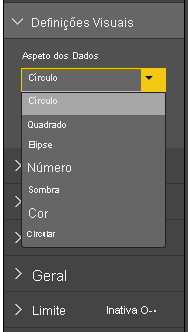
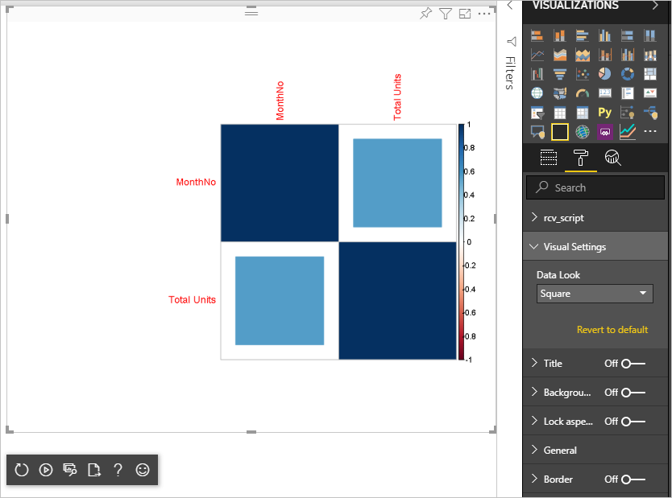

# <a name="tutorial-create-an-r-powered-power-bi-visual"></a>Tutorial: Criar um elemento visual do Power BI baseado em R

Este tutorial descreve como criar um elemento visual baseado em R do Power BI.

Neste tutorial, vai aprender a:

> [!div class="checklist"]
>
> * Criar um elemento visual baseado em R
> * Editar um script R no Power BI Desktop
> * Adicionar bibliotecas ao elemento visual
> * Adicionar uma propriedade estática

## <a name="prerequisites"></a>Pré-requisitos

* Uma conta do **Power BI Pro**. [Inscreva-se numa avaliação gratuita](https://powerbi.microsoft.com/pricing/) antes de começar.
* O motor de linguagem R. Pode transferir e instalá-lo gratuitamente a partir de vários locais, incluindo a [página de transferência do Revolution Open](https://mran.revolutionanalytics.com/download/) e o [Repositório CRAN](https://cran.r-project.org/bin/windows/base/). Para obter mais informações, veja [Criar elementos visuais do Power BI com o R](../../create-reports/desktop-r-visuals.md).
* [Power BI Desktop](../../fundamentals/desktop-get-the-desktop.md).
* Versão 4 ou posterior do [Windows PowerShell](/powershell/scripting/install/installing-windows-powershell?view=powershell-6) para utilizadores do Windows OU o [Terminal](https://macpaw.com/how-to/use-terminal-on-mac) para utilizadores do OSX.

## <a name="getting-started"></a>Introdução

1. Prepare dados de exemplo para o elemento visual. Pode guardar estes valores numa base de dados do Excel ou ficheiro *.csv* e importá-los para o Power BI Desktop.

    | NúmeroDoMês | Total de Unidades |
    |-----|-----|
    | 1 | 2303 |
    | 2 | 2319 |
    | 3 | 1732 |
    | 4 | 1615 |
    | 5 | 1427 |
    | 6 | 2253 |
    | 7 | 1147 |
    | 8 | 1515 |
    | 9 | 2516 |
    | 10 | 3131 |
    | 11 | 3170 |
    | 12 | 2762 |

1. Para criar um elemento visual, abra o PowerShell ou o Terminal e execute o seguinte comando:

   ```cmd
   pbiviz new rVisualSample -t rvisual
   ```

   Este comando cria uma nova estrutura de pastas baseada no modelo `rvisual`. Este modelo inclui um elemento visual básico pronto a executar baseado em R que executa o seguinte script R:

   ```r
   plot(Values)
   ```

   O pacote de dados `Values` conterá colunas na função de dados `Values`.

1. Atribua os dados ao elemento visual do programador ao adicionar **MonthNo** e **Total de unidades** a **Values** para o elemento visual.

   

## <a name="editing-the-r-script"></a>Editar o Script R

Quando utiliza o `pbiviz` para criar o elemento visual baseado em R com base no modelo `rvisual`, este cria um ficheiro chamado *script.r* na pasta raiz do elemento visual. Este ficheiro contém o script R que é executado para gerar a imagem para um utilizador. Pode criar o script R no Power BI Desktop.

1. No Power BI Desktop, selecione **Elemento visual do script R**:

   

1. Cole este código do R no **editor de script R**:

    ```r
    x <- dataset[,1] # get the first column from dataset
    y <- dataset[,2] # get the second column from dataset

    columnNames = colnames(dataset) # get column names

    plot(x, y, type="n", xlab=columnNames[1], ylab=columnNames[2]) # draw empty plot with axis and labels only
    lines(x, y, col="green") # draw line plot
    ```

1. Selecione o ícone **Executar script** para ver o resultado.

    

1. Quando o script R estiver pronto, copie-o para o ficheiro `script.r` no projeto do elemento visual criado num dos passos anteriores.

1. Altere o `name` de `dataRoles` em *capabilities.json* para `dataRoles`. O Power BI transmite os dados como o objeto do pacote de dados `dataset` para o elemento visual do script R, mas o elemento visual R obtém o nome do pacote de dados de acordo com os nomes de `dataRoles`.

    ```json
    {
      "dataRoles": [
        {
          "displayName": "Values",
          "kind": "GroupingOrMeasure",
          "name": "dataRoles"
        }
      ],
      "dataViewMappings": [
        {
          "scriptResult": {
            "dataInput": {
              "table": {
                "rows": {
                  "select": [
                    {
                      "for": {
                        "in": "dataset"
                      }
                    }
                  ],
                  "dataReductionAlgorithm": {
                    "top": {}
                  }
                }
              }
            },
            ...
          }
        }
      ],
    }
    ```

1. Adicione o seguinte código para suportar o redimensionamento da imagem no ficheiro *src/visual.ts*.

    ```typescript
      public onResizing(finalViewport: IViewport): void {
          this.imageDiv.style.height = finalViewport.height + "px";
          this.imageDiv.style.width = finalViewport.width + "px";
          this.imageElement.style.height = finalViewport.height + "px";
          this.imageElement.style.width = finalViewport.width + "px";
      }
    ```

## <a name="add-libraries-to-visual-package"></a>Adicionar bibliotecas ao pacote de elementos visuais

Este procedimento permite que o elemento visual utilize o pacote `corrplot`.

1. Adicione a dependência da biblioteca do elemento visual a `dependencies.json`. Veja a seguir um exemplo do conteúdo do ficheiro:

    ```json
    {
      "cranPackages": [
        {
          "name": "corrplot",
          "displayName": "corrplot",
          "url": "https://cran.r-project.org/web/packages/corrplot/"
        }
      ]
    }
    ```

    O pacote `corrplot` é uma apresentação gráfica de uma matriz de correlação. Para obter mais informações sobre `corrplot`, veja [Introdução ao Pacote corrplot](https://cran.r-project.org/web/packages/corrplot/vignettes/corrplot-intro.html).

1. Depois de fazer estas alterações, comece a utilizar o pacote no ficheiro `script.r`.

    ```r
    library(corrplot)
    corr <- cor(dataset)
    corrplot(corr, method="circle", order = "hclust")
    ```

O resultado da utilização do pacote `corrplot` é semelhante ao seguinte exemplo:


## <a name="adding-a-static-property-to-the-property-pane"></a>Adicionar uma propriedade estática ao painel de propriedades

Permita que os utilizadores alterarem as definições da IU. Para tal, adicione propriedades ao painel de propriedades que alteram o comportamento baseado na introdução do utilizador do script R.

Pode configurar `corrplot` com o argumento `method` da função `corrplot`. O script predefinido utiliza um círculo. Modifique o elemento visual para permitir que o utilizador escolha entre diferentes opções.

1. Defina o objeto e a propriedade no ficheiro *capabilities.json*. Em seguida, utilize este nome do objeto no método de enumeração para obter esses valores do painel de propriedades.

    ```json
    {
      "settings": {
      "displayName": "Visual Settings",
      "description": "Settings to control the look and feel of the visual",
      "properties": {
        "method": {
          "displayName": "Data Look",
          "description": "Control the look and feel of the data points in the visual",
          "type": {
            "enumeration": [
              {
                "displayName": "Circle",
                "value": "circle"
              },
              {
                "displayName": "Square",
                "value": "square"
              },
              {
                "displayName": "Ellipse",
                "value": "ellipse"
              },
              {
                "displayName": "Number",
                "value": "number"
              },
              {
                "displayName": "Shade",
                "value": "shade"
              },
              {
                "displayName": "Color",
                "value": "color"
              },
              {
                "displayName": "Pie",
                "value": "pie"
              }
            ]
          }
        }
      }
    }
    ```

1. Abra o ficheiro *src/settings.ts*. Crie uma classe `CorrPlotSettings` com a propriedade pública `method`. O tipo é `string` e o valor predefinido é `circle`. Adicione a propriedade `settings` à classe `VisualSettings` com o valor predefinido:

    ```typescript
    "use strict";

    import { dataViewObjectsParser } from "powerbi-visuals-utils-dataviewutils";
    import DataViewObjectsParser = dataViewObjectsParser.DataViewObjectsParser;

    export class VisualSettings extends DataViewObjectsParser {
      public rcv_script: rcv_scriptSettings = new rcv_scriptSettings();
      public settings: CorrPlotSettings = new CorrPlotSettings();
    }

    export class CorrPlotSettings {
      public method: string = "circle";
    }

    export class rcv_scriptSettings {
      public provider;
      public source;
    }
    ```

    Após estes passos, pode alterar a propriedade do elemento visual.

   

    Por fim, o script R tem de começar por uma propriedade. Se o utilizador não alterar a propriedade, o elemento visual não obterá qualquer valor para esta propriedade.

    Para as variáveis de runtime de R das propriedades, a convenção de nomenclatura é `<objectname>_<propertyname>` e, neste caso, `settings_method`.

1. Altere o script R no elemento visual para corresponder ao seguinte código:

    ```r
    library(corrplot)
    corr <- cor(dataset)

    if (!exists("settings_method"))
    {
        settings_method = "circle";
    }

    corrplot(corr, method=settings_method, order = "hclust")
    ```

O aspeto final é semelhante ao exemplo abaixo:



## <a name="next-steps"></a>Próximos passos

Para saber mais sobre os elementos visuais baseados em R, veja [Utilizar elementos visuais do Power BI baseados em R no Power BI](../../create-reports/desktop-r-powered-custom-visuals.md).

Para obter mais informações sobre elementos visuais baseados em linguagem R no Power BI Desktop, veja [Criar elementos visuais do Power BI através da linguagem R](../../create-reports/desktop-r-visuals.md).