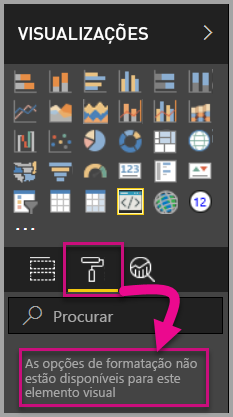
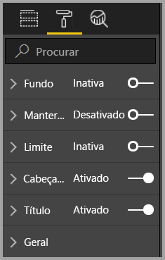
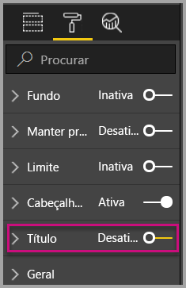
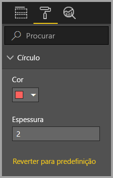
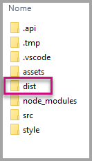
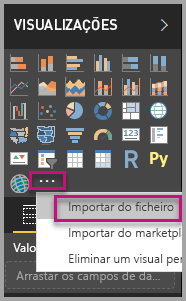
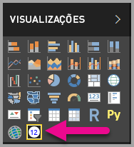

# <a name="tutorial-adding-formatting-options-to-a-power-bi-visual"></a>Tutorial: Adicionar opções de formatação a um elemento visual do Power BI

Neste tutorial, vamos abordar o método de adicionar propriedades comuns ao elemento visual.

Neste tutorial, vai aprender a:
> [!div class="checklist"]
> * Adicionar propriedades aos elementos visuais.
> * Criar um pacote com o elemento visual.
> * Importar o elemento visual personalizado para um relatório do Power BI Desktop.

## <a name="adding-formatting-options"></a>Adicionar opções de formatação

1. No **Power BI**, selecione a **página Formatar**.

    É apresentada uma mensagem que indica o seguinte: *As opções de formatação não estão disponíveis para este elemento visual.*

    

2. No **Visual Studio Code**, abra o ficheiro *capabilities.json*.

3. Antes da matriz **dataViewMappings**, adicione **objetos** (após a linha 8).

    ```json
    "objects": {},
    ```

    

4. Guarde o ficheiro **capabilities.json**.

5. No **Power BI**, reveja as opções de formatação novamente.

    > [!Note]
    > Se não vir as opções de formatação, selecione **Recarregar Elemento Visual Personalizado**.

    

6. Defina a opção **Título** como *Desativado*. Repare que o elemento visual já não apresenta o nome da medida no canto superior esquerdo.

    

    

### <a name="adding-custom-formatting-options"></a>Adicionar opções de formatação personalizadas

Pode adicionar propriedades personalizadas para ativar a configuração da cor do círculo e também a largura do limite.

1. No PowerShell, pare o elemento visual personalizado.

2. No Visual Studio Code, no ficheiro **capabilities.json**, insira o seguinte fragmento JSON no objeto etiquetado **objects**.

    ```json
        {
            "circle": {
                "displayName": "Circle",
                "properties": {
                    "circleColor": {
                        "displayName": "Color",
                        "description": "The fill color of the circle.",
                        "type": {
                            "fill": {
                                "solid": {
                                    "color": true
                                }
                            }
                        }
                    },
                    "circleThickness": {
                        "displayName": "Thickness",
                        "description": "The circle thickness.",
                        "type": {
                            "numeric": true
                        }
                    }
                }
            }
        }
    ```

    O fragmento JSON descreve um grupo com o nome circle, que contém duas opções com o nome circleColor e circleThickness.

   

3. Guarde o ficheiro **capabilities.json**.

4. No **painel Explorador**, expanda a pasta **src** e selecione **settings.ts**. *Este ficheiro representa as definições para os elementos visuais iniciais*.

5. No ficheiro **settings.ts**, substitua as duas classes pelo seguinte código.

    ```typescript
    export class CircleSettings {
        public circleColor: string = "white";
        public circleThickness: number = 2;
    }
    export class VisualSettings extends DataViewObjectsParser {
        public circle: CircleSettings = new CircleSettings();
    }
    ```

    

    Este módulo define as duas classes. A classe **CircleSettings** define duas propriedades com nomes que correspondem aos objetos definidos no ficheiro **capabilities.json** (**circleColor** e  **circleThickness**) e também define os valores predefinidos. A classe **VisualSettings** herda a classe **DataViewObjectParser** e adiciona uma propriedade com o nome **circle**, que corresponde ao objeto definido no ficheiro *capabilities.json* e devolve uma instância de **CircleSettings**.

6. Guarde o ficheiro **settings.ts**.

7. Abra o ficheiro **visual.ts**.

8. No ficheiro **visual.ts**,

    importe `VisualSettings`, `VisualObjectInstanceEnumeration` e `EnumerateVisualObjectInstancesOptions`:

    ```typescript
    import { VisualSettings } from "./settings";
    import VisualObjectInstanceEnumeration = powerbi.VisualObjectInstanceEnumeration;
    import EnumerateVisualObjectInstancesOptions = powerbi.EnumerateVisualObjectInstancesOptions;
    ```

    e, na classe **Visual**, adicione a seguinte propriedade:

    ```typescript
    private visualSettings: VisualSettings;
    ```

    Esta propriedade armazena uma referência ao objeto **VisualSettings**, que descreve as definições do elemento visual.

    

9. Na classe **Visual**, adicione o seguinte método antes do método **update**. Este método serve para preencher as opções de formatação.

    ```typescript
    public enumerateObjectInstances(options: EnumerateVisualObjectInstancesOptions): VisualObjectInstanceEnumeration {
        const settings: VisualSettings = this.visualSettings || <VisualSettings>VisualSettings.getDefault();
        return VisualSettings.enumerateObjectInstances(settings, options);
    }
    ```

    Este método serve para preencher as opções de formatação.

    

10. No método **update**, depois da declaração da variável **radius**, adicione o seguinte código.

    ```typescript
    this.visualSettings = VisualSettings.parse<VisualSettings>(dataView);

    this.visualSettings.circle.circleThickness = Math.max(0, this.visualSettings.circle.circleThickness);
    this.visualSettings.circle.circleThickness = Math.min(10, this.visualSettings.circle.circleThickness);
    ```

    Este código devolve as opções de formatação. Ajustará qualquer valor transmitido para a propriedade **circleThickness** ao convertê-lo em 0 se o valor for negativo ou em 10 se for um valor superior a 10.

    

11. No  **elemento circle**, altere o valor transmitido para o **fill style** para a seguinte expressão.

    ```typescript
    this.visualSettings.circle.circleColor
    ```

    

12. No  **elemento circle**, altere o valor transmitido para o **stroke-width style** para a seguinte expressão.

    ```typescript
    this.visualSettings.circle.circleThickness
    ```

    

13. Guarde o ficheiro visual.ts.

14. No PowerShell, inicie o elemento visual.

    ```powershell
    pbiviz start
    ```

15. No **Power BI**, na barra de ferramentas flutuante acima do elemento visual, selecione **Alternar Recarregamento Automático**.

16. Nas opções de **formatação do elemento visual**, expanda **Círculo**.

    

    Modifique as opções **cor** e **espessura**.

    Modifique a opção **espessura** para um valor inferior a zero e um valor superior a 10. Em seguida, observe que o elemento visual atualiza o valor para um valor tolerável mínimo ou máximo.

## <a name="packaging-the-custom-visual"></a>Empacotamento do elemento visual personalizado

Introduza os valores de propriedade para o projeto do elemento visual personalizado, atualize o ficheiro de ícone e, em seguida, proceda ao empacotamento do elemento visual personalizado.

1. No **PowerShell**, pare o elemento visual personalizado.

2. Abra o ficheiro **pbiviz.json** no **Visual Studio Code**.

3. No objeto **elemento visual**, modifique a propriedade **displayName** para *Cartão Circular*.

    No painel **Visualizações**, pairar o rato sobre o ícone revela o nome a apresentar.

    

4. Na propriedade **descrição**, introduza o seguinte texto.

    *Apresenta um valor de medida formatado dentro de um círculo*

5. Preencha **supportUrl** e **gitHubUrl** para o elemento visual.

    Por exemplo:

    ```json
    {
        "supportUrl": "https://community.powerbi.com",
        "gitHubUrl": "https://github.com/microsoft/PowerBI-visuals-circlecard"
    }
    ```

6. Introduza os seus detalhes no objeto **autor**.

7. Guarde o ficheiro **pbiviz.json**.

8. No objeto **recursos**, observe que o documento define um caminho para um ícone. O ícone é a imagem que aparece no painel **_Visualizações_** . Tem de ser um ficheiro **PNG** com *20 por 20 pixéis*.

9. No Explorador do Windows, copie o ficheiro icon.png e, em seguida, cole-o para substituir o ficheiro padrão localizado na pasta de recursos.

10. No Visual Studio Code, no painel do Explorador, expanda a pasta de recursos e selecione o ficheiro icon.png.

11. Reveja o ícone.

    

12. No Visual Studio Code, confirme que todos os ficheiros estão guardados.

13. Para empacotar o elemento visual personalizado, no PowerShell, introduza o seguinte comando.

    ```powershell
    pbiviz package
    ```

    

Agora, o pacote é a saída para a pasta **dist** do projeto. O pacote contém tudo o que é preciso para importar o elemento visual personalizado para o serviço Power BI ou para um relatório do Power BI Desktop. O elemento visual personalizado já está empacotado e pronto a ser utilizado.

## <a name="importing-the-custom-visual"></a>Importar o elemento visual personalizado

Agora, pode abrir o relatório do Power BI Desktop e importar o elemento visual personalizado de Cartão Circular.

1. Abra o **Power BI Desktop** e crie um novo relatório com qualquer *conjunto de dados de exemplo*.

2. No painel **_Visualizações_** , selecione as **reticências** e, em seguida, selecione **Importar** em Ficheiro.

    

3. Na **janela de importação**, selecione **Importar**.

4. Na janela Aberta, navegue para a pasta **dist** no diretório do projeto.

5. Selecione o ficheiro **circleCard.pbiviz** e, em seguida, selecione **Abrir**.

6. Assim que o elemento visual for importado com êxito, selecione **OK**.

7. Confirme que o elemento visual foi adicionado ao painel **_Visualizações_** .

    

8. Paire o rato sobre o ícone do **Cartão Circular** e repare na descrição que é apresentada.

## <a name="debugging"></a>Depurar

Para obter sugestões sobre como depurar elementos visuais personalizados, consulte o [guia de depuração](./visuals-how-to-debug.md#how-to-debug-power-bi-visuals).

## <a name="next-steps"></a>Próximos passos

Pode listar o seu elemento visual recentemente criado, para que outras pessoas possam utilizá-lo, ao submetê-lo para o **AppSource**. Para obter mais informações sobre este processo, veja [Publicar elementos visuais do Power BI no AppSource](office-store.md).
