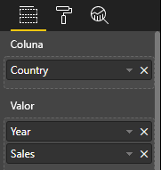
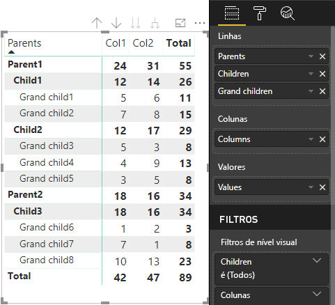

# <a name="understand-data-view-mapping-in-power-bi-visuals"></a>Compreender o mapeamento de vista de dados em elementos visuais do Power BI

Este artigo aborda o mapeamento de vista de dados e descreve como as funções de dados se relacionam entre si e permite especificar requisitos condicionais. O artigo também descreve cada tipo `dataMappings`.

Cada mapeamento válido produz uma vista de dados, mas atualmente suportamos a execução de apenas uma consulta por elemento visual. Normalmente, obtém apenas uma vista de dados. No entanto, pode fornecer múltiplos mapeamentos de dados em determinadas condições, que permitem o seguinte:

```json
"dataViewMappings": [
    {
        "conditions": [ ... ],
        "categorical": { ... },
        "single": { ... },
        "table": { ... },
        "matrix": { ... }
    }
]
```

O Power BI apenas cria um mapeamento para uma vista de dados se o mapeamento válido estiver preenchido nos `dataViewMappings`.

Por outras palavras, `categorical` pode estar definido em `dataViewMappings`, mas os outros mapeamentos, como `table` ou `single`, poderão não estar. Por exemplo:

```json
"dataViewMappings": [
    {
        "categorical": { ... }
    }
]
```

O Power BI produz uma vista de dados com um único mapeamento `categorical`. Contudo, `table` e os outros mapeamentos são indefinidos:

```javascript
{
    "categorical": {
        "categories": [ ... ],
        "values": [ ... ]
    },
    "metadata": { ... }
}
```

## <a name="conditions"></a>Condições

Esta secção descreve as condições para um mapeamento de dados específico. Pode fornecer múltiplos conjuntos de condições e, se os dados corresponderem a um dos conjuntos de condições descritos, o elemento visual irá aceitar os dados como válidos.

De momento, pode especificar um valor mínimo e um valor máximo para cada campo. O valor representa o número de campos que podem ser vinculados a essa função de dados. 

> [!NOTE]
> Se uma função de dados for omitida na condição, esta poderá ter qualquer número de campos.

### <a name="example-1"></a>Exemplo 1

Pode arrastar múltiplos campos para cada função de dados. Neste exemplo, limita a categoria a um campo de dados e a medida para dois campos de dados.

```json
"conditions": [
    { "category": { "max": 1 }, "y": { "max": 2 } },
]
```

### <a name="example-2"></a>Exemplo 2

Neste exemplo, é necessária uma de duas condições:
* Exatamente um campo de dados de categoria e exatamente duas medidas
* Exatamente duas categorias e exatamente uma medida.

```json
"conditions": [
    { "category": { "min": 1, "max": 1 }, "measure": { "min": 2, "max": 2 } },
    { "category": { "min": 2, "max": 2 }, "measure": { "min": 1, "max": 1 } }
]
```

## <a name="single-data-mapping"></a>Mapeamento de dados únicos

O mapeamento de dados únicos é a forma mais simples de mapeamento de dados. Aceita um único campo de medida e dá-lhe o total. Se o campo for numérico, fornece-lhe a soma. Caso contrário, fornece-lhe uma contagem de valores únicos.

Para utilizar o mapeamento de dados únicos, tem de definir o nome da função de dados que pretende mapear. Este mapeamento funciona apenas com um único campo de medida. Se for atribuído um segundo campo, não será gerada nenhuma vista de dados, por isso também é boa prática incluir uma condição que limite os dados a um único campo.

> [!NOTE]
> Este mapeamento de dados não pode ser utilizado em conjunto com outros mapeamentos de dados. Destina-se a reduzir os dados a único valor numérico.

### <a name="example-3"></a>Exemplo 3

```json
{
    "dataRoles": [
        {
            "displayName": "Y",
            "name": "Y",
            "kind": "Measure"
        }
    ],
    "dataViewMappings": [
        {
            "conditions": [
                {
                    "Y": {
                        "max": 1
                    }
                }
            ],
            "single": {
                "role": "Y"
            }
        }
    ]
}
```

A vista de dados resultante ainda contém os outros tipos (tabela, categórico, e por aí adiante), mas cada mapeamento contém apenas o valor único. Recomenda-se aceder ao valor apenas em único.

```JSON
{
    "dataView": [
        {
            "metadata": null,
            "categorical": null,
            "matrix": null,
            "table": null,
            "tree": null,
            "single": {
                "value": 94163140.3560001
            }
        }
    ]
}
```

Exemplo de código para processar o mapeamento de vista de dados simples

```typescript
"use strict";
import powerbi from "powerbi-visuals-api";
import DataView = powerbi.DataView;
import DataViewSingle = powerbi.DataViewSingle;
// standart imports
// ...

export class Visual implements IVisual {
    private target: HTMLElement;
    private host: IVisualHost;
    private valueText: HTMLParagraphElement;

    constructor(options: VisualConstructorOptions) {
        // constructor body
        this.target = options.element;
        this.host = options.host;
        this.valueText = document.createElement("p");
        this.target.appendChild(this.valueText);
        // ...
    }

    public update(options: VisualUpdateOptions) {
        const dataView: DataView = options.dataViews[0];
        const singleDataView: DataViewSingle = dataView.single;

        if (!singleDataView ||
            !singleDataView.value ) {
            return
        }

        this.valueText.innerText = singleDataView.value.toString();
    }
}
```

Como resultado, o elemento visual apresenta um único valor do Power BI:


## <a name="categorical-data-mapping"></a>Mapeamento de dados categóricos

O mapeamento de dados categóricos é utilizado para obter um ou dois agrupamentos independentes de dados.

### <a name="example-4"></a>Exemplo 4

Eis a definição do exemplo anterior relativo às funções de dados:

```json
"dataRole":[
    {
        "displayName": "Category",
        "name": "category",
        "kind": "Grouping"
    },
    {
        "displayName": "Y Axis",
        "name": "measure",
        "kind": "Measure"
    }
]
```

Eis o mapeamento:

```json
"dataViewMappings": {
    "categorical": {
        "categories": {
            "for": { "in": "category" }
        },
        "values": {
            "select": [
                { "bind": { "to": "measure" } }
            ]
        }
    }
}
```

É um exemplo simples. Indica o seguinte: "Mapear a minha função de dados `category` de forma a que, para cada campo que arrastar para `category`, os respetivos dados sejam mapeados para `categorical.categories`. Mapear também a minha função de dados `measure` para `categorical.values`".

* **for...in**: incluir todos os itens desta função de dados na consulta de dados.
* **bind...to**: produz o mesmo resultado de *"for...in"* , mas espera-se que a função de dados tenha uma condição que a restrinja a um único campo.

### <a name="example-5"></a>Exemplo 5

Este exemplo utiliza as duas primeiras funções de dados do exemplo anterior, além de definir `grouping` e `measure2`.

```json
"dataRole":[
    {
        "displayName": "Category",
        "name": "category",
        "kind": "Grouping"
    },
    {
        "displayName": "Y Axis",
        "name": "measure",
        "kind": "Measure"
    },
    {
        "displayName": "Grouping with",
        "name": "grouping",
        "kind": "Grouping"
    },
    {
        "displayName": "X Axis",
        "name": "measure2",
        "kind": "Grouping"
    }
]
```

Eis o mapeamento:

```json
"dataViewMappings":{
    "categorical": {
        "categories": {
            "for": { "in": "category" }
        },
        "values": {
            "group": {
                "by": "grouping",
                "select":[
                    { "bind": { "to": "measure" } },
                    { "bind": { "to": "measure2" } }
                ]
            }
        }
    }
}
```

Neste caso, a diferença está na forma como estamos a mapear categorical.values. Estamos a dizer "Mapear as minhas funções de dados `measure` e `measure2` para que sejam agrupadas pela função de dados `grouping`".

### <a name="example-6"></a>Exemplo 6

Eis as funções de dados:

```json
"dataRoles": [
    {
        "displayName": "Categories",
        "name": "category",
        "kind": "Grouping"
    },
    {
        "displayName": "Measures",
        "name": "measure",
        "kind": "Measure"
    },
    {
        "displayName": "Series",
        "name": "series",
        "kind": "Measure"
    }
]
```

Eis o mapeamento de vista de dados:

```json
"dataViewMappings": [
    {
        "categorical": {
            "categories": {
                "for": {
                    "in": "category"
                }
            },
            "values": {
                "group": {
                    "by": "series",
                    "select": [{
                            "for": {
                                "in": "measure"
                            }
                        }
                    ]
                }
            }
        }
    }
]
```

A vista de dados categóricos poderia ser visualizada desta forma:

| Categórico |  |  | | | |
|-----|-----|------|------|------|------|
| | Ano | 2013 | 2014 | 2015 | 2016 |
| País | | |
| EUA | | x | x | 650 | 350 |
| Canadá | | x | 630 | 490 | x |
| México | | 645 | x | x | x |
| REINO UNIDO | | x | x | 831 | x |

A vista de dados categóricos é produzida pelo Power BI. É o conjunto de categorias.

```JSON
{
    "categorical": {
        "categories": [
            {
                "source": {...},
                "values": [
                    "Canada",
                    "USA",
                    "UK",
                    "Mexico"
                ],
                "identity": [...],
                "identityFields": [...],
            }
        ]
    }
}
```

Cada categoria também mapeia a um conjunto de valores. Cada um destes valores é agrupado por série, ou seja, por ano.

Por exemplo, cada matriz `values` representa dados para cada ano.
Além disso, cada matriz `values` tem 4 valores, para Canadá, EUA, Reino Unido e México, respetivamente:

```JSON
{
    "values": [
        // Values for 2013 year
        {
            "source": {...},
            "values": [
                null, // Value for `Canada` category
                null, // Value for `USA` category
                null, // Value for `UK` category
                645 // Value for `Mexico` category
            ],
            "identity": [...],
        },
        // Values for 2014 year
        {
            "source": {...},
            "values": [
                630, // Value for `Canada` category
                null, // Value for `USA` category
                null, // Value for `UK` category
                null // Value for `Mexico` category
            ],
            "identity": [...],
        },
        // Values for 2015 year
        {
            "source": {...},
            "values": [
                490, // Value for `Canada` category
                650, // Value for `USA` category
                831, // Value for `UK` category
                null // Value for `Mexico` category
            ],
            "identity": [...],
        },
        // Values for 2016 year
        {
            "source": {...},
            "values": [
                null, // Value for `Canada` category
                350, // Value for `USA` category
                null, // Value for `UK` category
                null // Value for `Mexico` category
            ],
            "identity": [...],
        }
    ]
}
```

O exemplo de código para processar o mapeamento de vista de dados categóricos é descrito abaixo. O exemplo cria a estrutura hierárquica `Country => Year => Value`

```typescript
"use strict";
import powerbi from "powerbi-visuals-api";
import DataView = powerbi.DataView;
import DataViewDataViewCategoricalSingle = powerbi.DataViewCategorical;
import DataViewValueColumnGroup = powerbi.DataViewValueColumnGroup;
import PrimitiveValue = powerbi.PrimitiveValue;
// standart imports
// ...

export class Visual implements IVisual {
    private target: HTMLElement;
    private host: IVisualHost;
    private categories: HTMLElement;

    constructor(options: VisualConstructorOptions) {
        // constructor body
        this.target = options.element;
        this.host = options.host;
        this.categories = document.createElement("pre");
        this.target.appendChild(this.categories);
        // ...
    }

    public update(options: VisualUpdateOptions) {
        const dataView: DataView = options.dataViews[0];
        const categoricalDataView: DataViewCategorical = dataView.categorical;

        if (!categoricalDataView ||
            !categoricalDataView.categories ||
            !categoricalDataView.categories[0] ||
            !categoricalDataView.values) {
            return;
        }

        // Categories have only one column in data buckets
        // If you want to support several columns of categories data bucket, you should iterate categoricalDataView.categories array.
        const categoryFieldIndex = 0;
        // Measure has only one column in data buckets.
        // If you want to support several columns on data bucket, you should iterate years.values array in map function
        const measureFieldIndex = 0;
        let categories: PrimitiveValue[] = categoricalDataView.categories[categoryFieldIndex].values;
        let values: DataViewValueColumnGroup[] = categoricalDataView.values.grouped();

        let data = {};
        // iterate categories/countries
        categories.map((category: PrimitiveValue, categoryIndex: number) => {
            data[category.toString()] = {};
            // iterate series/years
            values.map((years: DataViewValueColumnGroup) => {
                if (!data[category.toString()][years.name] && years.values[measureFieldIndex].values[categoryIndex]) {
                    data[category.toString()][years.name] = []
                }
                if (years.values[0].values[categoryIndex]) {
                    data[category.toString()][years.name].push(years.values[measureFieldIndex].values[categoryIndex]);
                }
            });
        });

        this.categories.innerText = JSON.stringify(data, null, 6);
        console.log(data);
    }
}
```

O resultado do elemento visual:


## <a name="table-data-mapping"></a>Mapeamento de dados em tabela

A vista de dados em tabela é um mapeamento de dados simples. Essencialmente, é uma lista de pontos de dados onde os pontos de dados numéricos podem ser agregados.

### <a name="example-7"></a>Exemplo 7

Com as capacidades fornecidas:

```json
"dataRoles": [
    {
        "displayName": "Column",
        "name": "column",
        "kind": "Grouping"
    },
    {
        "displayName": "Value",
        "name": "value",
        "kind": "Measure"
    }
]
```

```json
"dataViewMappings": [
    {
        "table": {
            "rows": {
                "select": [
                    {
                        "for": {
                            "in": "column"
                        }
                    },
                    {
                        "for": {
                            "in": "value"
                        }
                    }
                ]
            }
        }
    }
]
```

Pode visualizar a vista de dados em tabela da seguinte forma:  

Exemplo de dados:

| País| Ano | Vendas |
|-----|-----|------|
| EUA | 2016 | 100 |
| EUA | 2015 | 50 |
| Canadá | 2015 | 200 |
| Canadá | 2015 | 50 |
| México | 2013 | 300 |
| REINO UNIDO | 2014 | 150 |
| EUA | 2015 | 75 |

Enlace de dados:



O Power BI apresenta os seus dados sob a forma da vista de dados em tabela. Não deve presumir que os dados estão ordenados.

```JSON
{
    "table" : {
        "columns": [...],
        "rows": [
            [
                "Canada",
                2014,
                630
            ],
            [
                "Canada",
                2015,
                490
            ],
            [
                "Mexico",
                2013,
                645
            ],
            [
                "UK",
                2014,
                831
            ],
            [
                "USA",
                2015,
                650
            ],
            [
                "USA",
                2016,
                350
            ]
        ]
    }
}
```

Pode agregar os dados ao selecionar o campo pretendido e, em seguida, selecionar a soma.  


Exemplo de código para processar o mapeamento de vista de dados em tabela.

```typescript
"use strict";
import "./../style/visual.less";
import powerbi from "powerbi-visuals-api";
// ...
import DataViewMetadataColumn = powerbi.DataViewMetadataColumn;
import DataViewTable = powerbi.DataViewTable;
import DataViewTableRow = powerbi.DataViewTableRow;
import PrimitiveValue = powerbi.PrimitiveValue;
// other imports
// ...

export class Visual implements IVisual {
    private target: HTMLElement;
    private host: IVisualHost;
    private table: HTMLParagraphElement;

    constructor(options: VisualConstructorOptions) {
        // constructor body
        this.target = options.element;
        this.host = options.host;
        this.table = document.createElement("table");
        this.target.appendChild(this.table);
        // ...
    }

    public update(options: VisualUpdateOptions) {
        const dataView: DataView = options.dataViews[0];
        const tableDataView: DataViewTable = dataView.table;

        if (!tableDataView) {
            return
        }
        while(this.table.firstChild) {
            this.table.removeChild(this.table.firstChild);
        }

        //draw header
        const tableHeader = document.createElement("th");
        tableDataView.columns.forEach((column: DataViewMetadataColumn) => {
            const tableHeaderColumn = document.createElement("td");
            tableHeaderColumn.innerText = column.displayName
            tableHeader.appendChild(tableHeaderColumn);
        });
        this.table.appendChild(tableHeader);

        //draw rows
        tableDataView.rows.forEach((row: DataViewTableRow) => {
            const tableRow = document.createElement("tr");
            row.forEach((columnValue: PrimitiveValue) => {
                const cell = document.createElement("td");
                cell.innerText = columnValue.toString();
                tableRow.appendChild(cell);
            })
            this.table.appendChild(tableRow);
        });
    }
}
```

O ficheiro de estilos visuais `style/visual.less` contém o esquema da tabela:

```less
table {
    display: flex;
    flex-direction: column;
}

tr, th {
    display: flex;
    flex: 1;
}

td {
    flex: 1;
    border: 1px solid black;
}
```


## <a name="matrix-data-mapping"></a>Mapeamento de dados em matriz

O mapeamento de dados em matriz é semelhante ao mapeamento de dados em tabela, mas as linhas são apresentadas hierarquicamente. Qualquer um dos valores da função de dados pode ser utilizado como valor de cabeçalho de coluna.

```json
{
    "dataRoles": [
        {
            "name": "Category",
            "displayName": "Category",
            "displayNameKey": "Visual_Category",
            "kind": "Grouping"
        },
        {
            "name": "Column",
            "displayName": "Column",
            "displayNameKey": "Visual_Column",
            "kind": "Grouping"
        },
        {
            "name": "Measure",
            "displayName": "Measure",
            "displayNameKey": "Visual_Values",
            "kind": "Measure"
        }
    ],
    "dataViewMappings": [
        {
            "matrix": {
                "rows": {
                    "for": {
                        "in": "Category"
                    }
                },
                "columns": {
                    "for": {
                        "in": "Column"
                    }
                },
                "values": {
                    "select": [
                        {
                            "for": {
                                "in": "Measure"
                            }
                        }
                    ]
                }
            }
        }
    ]
}
```

O Power BI cria uma estrutura de dados hierárquica. A raiz da árvore hierárquica inclui os dados da coluna **Elementos principais** da função de dados `Category`, com elementos subordinados da coluna **Elementos subordinados** da tabela de função de dados.

Conjunto de dados:

| Elementos principais | Elementos subordinados | Elementos secundários | Colunas | Valores |
|-----|-----|------|-------|-------|
| Elemento principal1 | Elemento subordinado1 | Elemento secundário1 | Col1 | 5 |
| Elemento principal1 | Elemento subordinado1 | Elemento secundário1 | Col2 | 6 |
| Elemento principal1 | Elemento subordinado1 | Elemento secundário2 | Col1 | 7 |
| Elemento principal1 | Elemento subordinado1 | Elemento secundário2 | Col2 | 8 |
| Elemento principal1 | Elemento subordinado2 | Elemento secundário3 | Col1 | 5 |
| Elemento principal1 | Elemento subordinado2 | Elemento secundário3 | Col2 | 3 |
| Elemento principal1 | Elemento subordinado2 | Elemento secundário4 | Col1 | 4 |
| Elemento principal1 | Elemento subordinado2 | Elemento secundário4 | Col2 | 9 |
| Elemento principal1 | Elemento subordinado2 | Elemento secundário5 | Col1 | 3 |
| Elemento principal1 | Elemento subordinado2 | Elemento secundário5 | Col2 | 5 |
| Elemento principal2 | Elemento subordinado3 | Elemento secundário6 | Col1 | 1 |
| Elemento principal2 | Elemento subordinado3 | Elemento secundário6 | Col2 | 2 |
| Elemento principal2 | Elemento subordinado3 | Elemento secundário7 | Col1 | 7 |
| Elemento principal2 | Elemento subordinado3 | Elemento secundário7 | Col2 | 1 |
| Elemento principal2 | Elemento subordinado3 | Elemento secundário8 | Col1 | 10 |
| Elemento principal2 | Elemento subordinado3 | Elemento secundário8 | Col2 | 13 |

O elemento visual de matriz nuclear do Power BI compõe os dados sob a forma de tabela.



O elemento visual obtém a respetiva estrutura de dados conforme descrito no seguinte código (apenas as duas primeiras linhas da tabela são mostradas aqui):

```json
{
    "metadata": {...},
    "matrix": {
        "rows": {
            "levels": [...],
            "root": {
                "childIdentityFields": [...],
                "children": [
                    {
                        "level": 0,
                        "levelValues": [...],
                        "value": "Parent1",
                        "identity": {...},
                        "childIdentityFields": [...],
                        "children": [
                            {
                                "level": 1,
                                "levelValues": [...],
                                "value": "Child1",
                                "identity": {...},
                                "childIdentityFields": [...],
                                "children": [
                                    {
                                        "level": 2,
                                        "levelValues": [...],
                                        "value": "Grand child1",
                                        "identity": {...},
                                        "values": {
                                            "0": {
                                                "value": 5 // value for Col1
                                            },
                                            "1": {
                                                "value": 6 // value for Col2
                                            }
                                        }
                                    },
                                    ...
                                ]
                            },
                            ...
                        ]
                    },
                    ...
                ]
            }
        },
        "columns": {
            "levels": [...],
            "root": {
                "childIdentityFields": [...],
                "children": [
                    {
                        "level": 0,
                        "levelValues": [...],
                        "value": "Col1",
                        "identity": {...}
                    },
                    {
                        "level": 0,
                        "levelValues": [...],
                        "value": "Col2",
                        "identity": {...}
                    },
                    ...
                ]
            }
        },
        "valueSources": [...]
    }
}
```

## <a name="data-reduction-algorithm"></a>Algoritmo de redução de dados

Para controlar a quantidade de dados a receber na vista de dados, pode aplicar-se um algoritmo de redução de dados.

Por predefinição, todos os elementos visuais do Power BI têm o principal algoritmo de redução de dados aplicado com a *contagem* definida como 1000 pontos de dados. Isto é equivalente a definir as seguintes propriedades no ficheiro *capabilities.json*:

```json
"dataReductionAlgorithm": {
    "top": {
        "count": 1000
    }
}
```

Pode mudar o valor de *contagem* para qualquer valor inteiro até 30 000. Os elementos visuais do Power BI baseados em R conseguem suportar até 150 000 linhas.

## <a name="data-reduction-algorithm-types"></a>Tipos de algoritmo de redução de dados

Existem quatro tipos de definições de algoritmo de redução de dados:

* `top`: se quiser limitar os dados a valores extraídos da parte superior do conjunto de dados. Os primeiros valores de *contagem* serão retirados do conjunto de dados.
* `bottom`: se quiser limitar os dados a valores extraídos da parte inferior do conjunto de dados. Os últimos valores de "contagem" serão retirados do conjunto de dados.
* `sample`: para reduzir o conjunto de dados através de um algoritmo de amostragem simples limitado a um número de itens de *contagem*. Isto significa que o primeiro e o último item estão incluídos e que um número de itens de *contagem* tem intervalos iguais entre eles.
Por exemplo, se tiver obtido um conjunto de dados [0, 1, 2, ... 100] e uma *contagem* de 9, irá obter os valores [0, 10, 20 ... 100].
* `window`: carrega uma *janela* de pontos de dados de cada vez com elementos de *contagem*. De momento, `top` e `window` são equivalentes. Estamos a trabalhar no sentido de suportar totalmente uma configuração de janelas.

## <a name="data-reduction-algorithm-usage"></a>Utilização do algoritmo de redução de dados

O algoritmo de redução de dados pode ser utilizado no mapeamento da vista de dados por categoria, tabela ou matriz.

Pode definir o algoritmo em `categories` e/ou na secção de grupo de `values` para mapeamento de dados categóricos.

### <a name="example-8"></a>Exemplo 8

```json
"dataViewMappings": {
    "categorical": {
        "categories": {
            "for": { "in": "category" },
            "dataReductionAlgorithm": {
                "window": {
                    "count": 300
                }
            }  
        },
        "values": {
            "group": {
                "by": "series",
                "select": [{
                        "for": {
                            "in": "measure"
                        }
                    }
                ],
                "dataReductionAlgorithm": {
                    "top": {
                        "count": 100
                    }
                }  
            }
        }
    }
}
```

Pode aplicar o algoritmo de redução de dados à secção `rows` da tabela de mapeamento de Vista de Dados.

### <a name="example-9"></a>Exemplo 9

```json
"dataViewMappings": [
    {
        "table": {
            "rows": {
                "for": {
                    "in": "values"
                },
                "dataReductionAlgorithm": {
                    "top": {
                        "count": 2000
                    }
                }
            }
        }
    }
]
```

Pode aplicar o algoritmo de redução de dados às secções `rows` e `columns` da matriz de mapeamento de Vista de Dados.

## <a name="next-steps"></a>Próximos passos

Leia como [adicionar suporte de desagregação para mapeamentos de vista de dados em elementos visuais do Power BI](drill-down-support.md).
