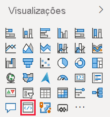
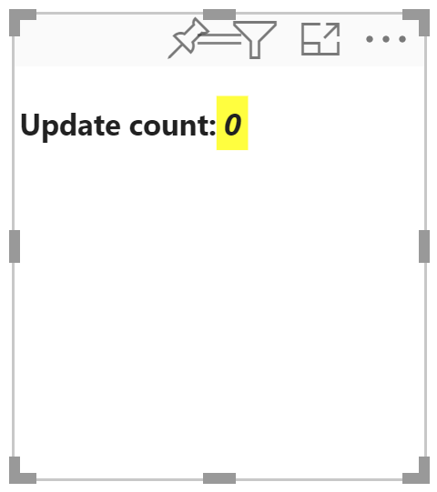
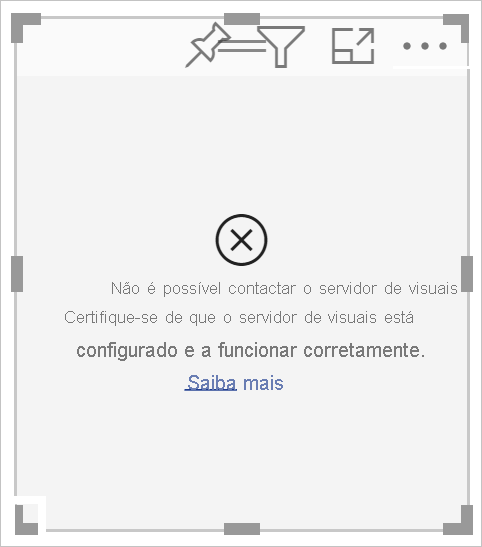
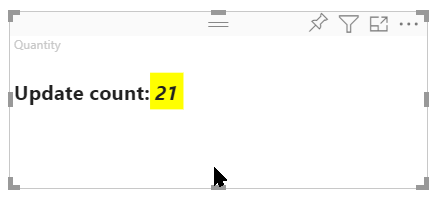
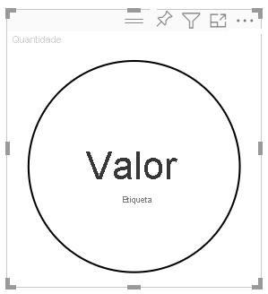
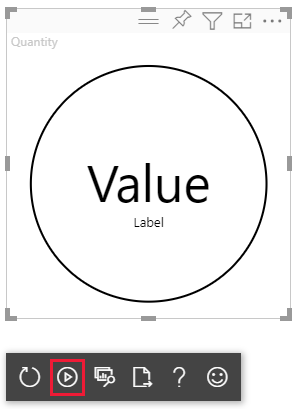

# <a name="tutorial-develop-a-power-bi-circle-card-visual"></a>Tutorial: Programar um elemento visual de cartão circular do Power BI

Como programador, pode criar os seus próprios elementos visuais do Power BI. Estes elementos visuais podem ser usados por si, pela sua organização ou por terceiros.

Neste tutorial, vai programar um elemento visual do Power BI designado cartão circular que apresenta um valor de medida formatado dentro de um círculo. O elemento visual cartão circular suporta a personalização da cor de preenchimento e da espessura do contorno.

Neste tutorial, ficará a saber como:
> [!div class="checklist"]
> * Criar um projeto de programação para o seu elemento visual.
> * Programar o seu elemento visual com elementos visuais D3.
> * Configurar o seu elemento visual para processar dados.

## <a name="prerequisites"></a>Pré-requisitos

Antes de começar a programar o seu elemento visual do Power BI, verifique se tem tudo o que está listado nesta secção.

* Precisa de uma conta **Power BI Pro**. Se não possui uma chave, [inscreva-se numa avaliação gratuita](https://powerbi.microsoft.com/pricing/).

* [Visual Studio Code (VS Code)](https://www.visualstudio.com/). O VS Code é um IDE (ambiente de desenvolvimento integrado) ideal para a programação de aplicações JavaScript e TypeScript.

* [Windows PowerShell](/powershell/scripting/install/installing-windows-powershell) versão 4 ou posterior (para Windows). Ou [Terminal](https://macpaw.com/how-to/use-terminal-on-mac) (para OSX).

* Um ambiente preparado para programar um elemento visual do Power BI. [Configurar o seu ambiente para programar um elemento visual do Power BI](environment-setup.md).

* Este tutorial usa o relatório **Análise de Vendas dos EUA**. Pode [transferir](https://microsoft.github.io/PowerBI-visuals/docs/step-by-step-lab/images/US_Sales_Analysis.pbix) este relatório e carregá-lo para o serviço Power BI ou usar o seu próprio relatório. Se precisar de mais informações sobre o serviço Power BI e como carregar ficheiros, veja o tutorial [Introdução ao serviço de criação no Power BI](../../fundamentals/service-get-started.md).

## <a name="create-a-development-project"></a>Criar um projeto de programação

Nesta secção, vai criar um projeto para o elemento visual cartão circular.

1. Abra o PowerShell e navegue até à pasta na qual pretende criar o seu projeto.

2. Introduza o seguinte comando:

    ```PowerShell
    pbiviz new CircleCard
    ```

3. Navegue para a pasta do projeto.

    ```powershell
    cd CircleCard
    ```

4. Inicie o elemento visual do cartão circular. O elemento visual está agora em execução, alojado no seu computador.

    ```powershell
    pbiviz start
    ```
    >[!IMPORTANT]
    >Não feche a janela do PowerShell até o final do tutorial. Para impedir que o elemento visual seja executado, introduza o atalho Ctrl + C e, se lhe for pedido para encerrar a tarefa de lote, introduza Y e prima *Enter*.

## <a name="view-the-circle-card-in-power-bi-service"></a>Ver o cartão circular no serviço Power BI

Para testar o elemento visual do cartão circular no serviço Power BI, usaremos o relatório **Análise de Vendas dos EUA**. Pode [transferir](https://microsoft.github.io/PowerBI-visuals/docs/step-by-step-lab/images/US_Sales_Analysis.pbix) este relatório e carregá-lo para o serviço Power BI.

Também pode usar o seu próprio relatório para testar os elementos visuais do cartão circular.

>[!NOTE]
>Antes de continuar, verifique se [ativou as definições de programador de elementos visuais](environment-setup.md#set-up-power-bi-service-for-developing-a-visual).

1. Inicie sessão no [PowerBI.com](https://powerbi.microsoft.com/) e abra o relatório **Análise de Vendas dos EUA**.

2. Selecione **Mais opções** > **Editar**.

    >[!div class="mx-imgBorder"]
    >

3. Crie uma nova página para teste ao clicar no botão **Nova página** na parte inferior da interface do serviço Power BI.

    >[!div class="mx-imgBorder"]
    >

4. No painel **Visualizações** , selecione o **Elemento Visual do Programador**.

    >[!div class="mx-imgBorder"]
    >

    Este elemento visual representa o elemento visual personalizado que está a executar no computador. Só estará disponível quando a definição [depuração visual personalizada](environment-setup.md#set-up-power-bi-service-for-developing-a-visual) estiver ativada.

5. Confirme que foi adicionado um elemento visual à tela do relatório.

    >[!div class="mx-imgBorder"]
    >

    Este é um elemento visual simples que mostra o número de vezes que o método Atualizar foi chamado. Nesta fase, o elemento visual não devolve quaisquer dados.

    >[!NOTE]
    >Se o elemento visual apresentar uma mensagem de erro de ligação, abra um novo separador no browser, navegue até `https://localhost:8080/assets/status` e autorize o browser a usar este endereço.
    >
    >

6. Com o novo elemento visual selecionado, aceda ao painel **Campos** , expanda **Vendas** e selecione **Quantidade**.

    >[!div class="mx-imgBorder"]
    >

7. Para testar como o elemento visual está a responder, redimensione-o e observe que o valor *Contagem de atualizações* é incrementado sempre que redimensiona o elemento visual.

    >[!div class="mx-imgBorder"]
    >

## <a name="add-visual-elements-and-text"></a>Adicionar elementos visuais e texto

Nesta secção, vai aprender a transformar o seu elemento visual num círculo e a transformá-lo em texto a apresentar.

>[!NOTE]
>Neste tutorial, o [Visual Studio Code](https://code.visualstudio.com/) (VS Code) serve para desenvolver o elemento visual do Power BI.

### <a name="modify-the-visuals-file"></a>Modificar o ficheiro de elementos visuais

Configure o ficheiro **visual.ts** ao excluir e adicionar algumas linhas de código.

1. Abra o seu projeto no VS Code ( **Ficheiro** > **Abrir Pasta** ).

2. No **painel Explorador** , expanda a pasta **src** e selecione o ficheiro **visual.ts**.

    >[!div class="mx-imgBorder"]
    >

    > [!IMPORTANT]
    > Tenha em atenção os comentários na parte superior do ficheiro **visual.ts**. Tem permissão para utilizar os pacotes de elementos visuais do Power BI gratuitamente ao abrigo da Licença do Massachusetts Institute of Technology (MIT). Como parte do contrato, tem de deixar os comentários na parte superior do ficheiro.

3. Remova as seguintes linhas de código do ficheiro *visual.ts*.

    * O *VisualSettings* importa:
        ```typescript
        import { VisualSettings } from "./settings";
        ```

    * As quatro declarações de variável privada de nível de classe.

    * Todas as linhas de código dentro do *construtor*.

    * Todas as linhas de código dentro do método *atualizar*.

    * Todas as restantes linhas de código abaixo do método *atualizar* , incluindo os métodos *parseSettings* e *enumerateObjectInstances*.

4. Adicione as seguintes linhas de código no final da secção de importação:

    * *IVisualHost* – Uma coleção de propriedades e serviços que serve para interagir com o anfitrião do elemento visual (Power BI).

         ```typescript
        import IVisualHost = powerbi.extensibility.IVisualHost;
        ```

    * *Biblioteca D3*

        ```typescript
        import * as d3 from "d3";
        type Selection<T extends d3.BaseType> = d3.Selection<T, any,any, any>;
        ```
    
        >[!NOTE]
        >Se não instalou esta biblioteca como parte da sua configuração, [instale a biblioteca de JavaScript D3](environment-setup.md#d3-javascript-library).

5. Abaixo da declaração de classe *Visual* , introduza as seguintes propriedades de nível de classe. Só precisa de adicionar as linhas de código que começam por `private`.

    ```typescript
    export class Visual implements IVisual {
        // ...
        private host: IVisualHost;
        private svg: Selection<SVGElement>;
        private container: Selection<SVGElement>;
        private circle: Selection<SVGElement>;
        private textValue: Selection<SVGElement>;
        private textLabel: Selection<SVGElement>;
        // ...
    }
    ```

6. Guarde o ficheiro **visual.ts**.

### <a name="add-a-circle-and-text-elements"></a>Adicionar um círculo e elementos de texto

Adicionar Scalable Vector Graphics D3 (SVG). Isto permite a criação de três formas: um círculo e dois elementos de texto.

1. Abra **visual.ts** no VS Code.

2. Adicione o seguinte código ao *construtor*.

    ```typescript
    this.svg = d3.select(options.element)
        .append('svg')
        .classed('circleCard', true);
    this.container = this.svg.append("g")
        .classed('container', true);
    this.circle = this.container.append("circle")
        .classed('circle', true);
    this.textValue = this.container.append("text")
        .classed("textValue", true);
    this.textLabel = this.container.append("text")
        .classed("textLabel", true);
    ```

    >[!TIP]
    >Para melhorar a legibilidade, recomenda-se a formatação do documento sempre que copiar fragmentos de código no seu projeto. Clique com o botão direito do rato em qualquer lugar no VS Code e selecione *Formatar Documento* (Alt + Shift + F).

3. Guarde o ficheiro **visual.ts**.

### <a name="set-the-width-and-height"></a>Definir a largura e a altura

Defina a largura e a altura do elemento visual e, em seguida, inicialize os atributos e os estilos dos elementos visuais.

1. Abra **visual.ts** no VS Code.

2. Adicione o seguinte código ao método *update*.

    ```typescript
    let width: number = options.viewport.width;
    let height: number = options.viewport.height;
    this.svg.attr("width", width);
    this.svg.attr("height", height);
    let radius: number = Math.min(width, height) / 2.2;
    this.circle
        .style("fill", "white")
        .style("fill-opacity", 0.5)
        .style("stroke", "black")
        .style("stroke-width", 2)
        .attr("r", radius)
        .attr("cx", width / 2)
        .attr("cy", height / 2);
    let fontSizeValue: number = Math.min(width, height) / 5;
    this.textValue
        .text("Value")
        .attr("x", "50%")
        .attr("y", "50%")
        .attr("dy", "0.35em")
        .attr("text-anchor", "middle")
        .style("font-size", fontSizeValue + "px");
    let fontSizeLabel: number = fontSizeValue / 4;
    this.textLabel
        .text("Label")
        .attr("x", "50%")
        .attr("y", height / 2)
        .attr("dy", fontSizeValue / 1.2)
        .attr("text-anchor", "middle")
        .style("font-size", fontSizeLabel + "px");
    ```

3. Guarde o ficheiro **visual.ts**.

### <a name="optional-review-the-code-in-the-visuals-file"></a>(Opcional) Rever o código no ficheiro de elementos visuais

Verifique se o código no ficheiro *visuals.ts* é semelhante ao seguinte:

```typescript
/*
*  Power BI Visual CLI
*
*  Copyright (c) Microsoft Corporation
*  All rights reserved.
*  MIT License
*
*  Permission is hereby granted, free of charge, to any person obtaining a copy
*  of this software and associated documentation files (the ""Software""), to deal
*  in the Software without restriction, including without limitation the rights
*  to use, copy, modify, merge, publish, distribute, sublicense, and/or sell
*  copies of the Software, and to permit persons to whom the Software is
*  furnished to do so, subject to the following conditions:
*
*  The above copyright notice and this permission notice shall be included in
*  all copies or substantial portions of the Software.
*
*  THE SOFTWARE IS PROVIDED *AS IS*, WITHOUT WARRANTY OF ANY KIND, EXPRESS OR
*  IMPLIED, INCLUDING BUT NOT LIMITED TO THE WARRANTIES OF MERCHANTABILITY,
*  FITNESS FOR A PARTICULAR PURPOSE AND NONINFRINGEMENT. IN NO EVENT SHALL THE
*  AUTHORS OR COPYRIGHT HOLDERS BE LIABLE FOR ANY CLAIM, DAMAGES OR OTHER
*  LIABILITY, WHETHER IN AN ACTION OF CONTRACT, TORT OR OTHERWISE, ARISING FROM,
*  OUT OF OR IN CONNECTION WITH THE SOFTWARE OR THE USE OR OTHER DEALINGS IN
*  THE SOFTWARE.
*/
"use strict";

import "core-js/stable";
import "./../style/visual.less";
import powerbi from "powerbi-visuals-api";
import VisualConstructorOptions = powerbi.extensibility.visual.VisualConstructorOptions;
import VisualUpdateOptions = powerbi.extensibility.visual.VisualUpdateOptions;
import IVisual = powerbi.extensibility.visual.IVisual;
import EnumerateVisualObjectInstancesOptions = powerbi.EnumerateVisualObjectInstancesOptions;
import VisualObjectInstance = powerbi.VisualObjectInstance;
import DataView = powerbi.DataView;
import VisualObjectInstanceEnumerationObject = powerbi.VisualObjectInstanceEnumerationObject;
import IVisualHost = powerbi.extensibility.IVisualHost;
import * as d3 from "d3";
type Selection<T extends d3.BaseType> = d3.Selection<T, any, any, any>;

export class Visual implements IVisual {
    private host: IVisualHost;
    private svg: Selection<SVGElement>;
    private container: Selection<SVGElement>;
    private circle: Selection<SVGElement>;
    private textValue: Selection<SVGElement>;
    private textLabel: Selection<SVGElement>;

    constructor(options: VisualConstructorOptions) {
        this.svg = d3.select(options.element)
            .append('svg')
            .classed('circleCard', true);
        this.container = this.svg.append("g")
            .classed('container', true);
        this.circle = this.container.append("circle")
            .classed('circle', true);
        this.textValue = this.container.append("text")
            .classed("textValue", true);
        this.textLabel = this.container.append("text")
            .classed("textLabel", true);
    }

    public update(options: VisualUpdateOptions) {
        let width: number = options.viewport.width;
        let height: number = options.viewport.height;
        this.svg.attr("width", width);
        this.svg.attr("height", height);
        let radius: number = Math.min(width, height) / 2.2;
        this.circle
            .style("fill", "white")
            .style("fill-opacity", 0.5)
            .style("stroke", "black")
            .style("stroke-width", 2)
            .attr("r", radius)
            .attr("cx", width / 2)
            .attr("cy", height / 2);
        let fontSizeValue: number = Math.min(width, height) / 5;
        this.textValue
            .text("Value")
            .attr("x", "50%")
            .attr("y", "50%")
            .attr("dy", "0.35em")
            .attr("text-anchor", "middle")
            .style("font-size", fontSizeValue + "px");
        let fontSizeLabel: number = fontSizeValue / 4;
        this.textLabel
            .text("Label")
            .attr("x", "50%")
            .attr("y", height / 2)
            .attr("dy", fontSizeValue / 1.2)
            .attr("text-anchor", "middle")
            .style("font-size", fontSizeLabel + "px");
    }
}
```

### <a name="modify-the-capabilities-file"></a>Modificar o ficheiro de capacidades

Elimine as linhas desnecessárias de código do ficheiro de capacidades.

1. Abra o seu projeto no VS Code ( **Ficheiro** > **Abrir Pasta** ).

2. Selecione o ficheiro **capabilities.json**.

    >[!div class="mx-imgBorder"]
    >

3. Remova todos os elementos de objetos (linhas 14-60).

4. Guarde o ficheiro **capabilities.json**.

### <a name="restart-the-circle-card-visual"></a>Reiniciar o elemento visual do cartão circular

Pare a execução do elemento visual e reinicie-o.

1. Na janela do PowerShell que está a executar o elemento visual, introduza o atalho Ctrl + C e, se lhe for pedido para encerrar a tarefa de lote, introduza Y e prima *Enter*.

2. No PowerShell, inicie o elemento visual.

    ```powershell
    pbiviz start
    ```

### <a name="test-the-visual-with-the-added-elements"></a>Testar o elemento visual com os elementos adicionados

Verifique se o elemento visual apresenta os elementos acabados de adicionar.

1. No serviço Power BI, abra o relatório *Análise de Vendas dos EUA do Power BI*. Se estiver a usar um relatório diferente para desenvolver o elemento visual de cartão circular, navegue até esse relatório.

2. Verifique se o elemento visual tem forma circular.

    >[!div class="mx-imgBorder"]
    >

    >[!NOTE]
    >Se o elemento visual não estiver a apresentar nada, no painel **Campos** , arraste o campo **Quantidade** para o elemento visual do programador.

3. Redimensione o elemento visual.

    Repare que o círculo e o texto são dimensionados de acordo com as dimensões do elemento visual. O método atualizar é chamado quando redimensiona o elemento visual e, como resultado, os elementos visuais são redimensionados.

### <a name="enable-auto-reload"></a>Ativar o recarregamento automático

Utilize esta definição para confirmar que o elemento visual é recarregado automaticamente sempre que guardar as alterações do projeto.

1. Navegue até ao relatório *Análise de Vendas dos EUA do Power BI* (ou ao projeto que tem o elemento visual do cartão circular).

2. Selecione o elemento visual do cartão circular.

3. Na barra de ferramentas flutuante, selecione **Alternar Recarregamento Automático**.

    >[!div class="mx-imgBorder"]
    >

## <a name="get-the-visual-to-process-data"></a>Fazer com que o elemento visual processe dados

Nesta secção, define as funções de dados e os mapeamentos de vista de dados. Também modificará o elemento visual para apresentar o nome do valor que está a ser apresentado.

### <a name="configure-the-capabilities-file"></a>Configurar o ficheiro de capacidades

Modifique o ficheiro **capabilities.json** para definir os mapeamentos da visualização de dados e das funções de dados.

* **Definir a função de dados**

    Defina a matriz *dataroles* com uma única função de dados do tipo *medida*. Esta função de dados é denominada *medida* e é apresentada como *Medida*. Permite a passagem de um campo de medida ou de um campo resumido.

    1. Selecione o ficheiro **capabilities.json** no VS Code.

    2. Remova todo o conteúdo dentro da matriz **dataRoles** (linhas 3-12).

    3. Introduza o seguinte código na matriz **dataRoles**.

        ```json
        {
            "displayName": "Measure",
            "name": "measure",
            "kind": "Measure"
        }
        ```

    4. Guarde o ficheiro **capabilities.json**.

* **Definir o mapeamento de vista de dados**

    Defina um ficheiro chamado *medida* na matriz *dataViewMappings*. Este campo pode ser passado para a função de dados.

    1. Selecione o ficheiro **capabilities.json** no VS Code.

    2. Remova todo o conteúdo no interior da matriz **dataViewMappings** (linhas 10 a 30).

    3. Introduza o seguinte código na matriz **dataViewMappings**.

        ```json
        {
            "conditions": [
                { "measure": { "max": 1 } }
            ],
            "single": {
                "role": "measure"
            }
        }
        ```

    4. Guarde o ficheiro **capabilities.json**.

### <a name="optional-review-the-capabilities-file-code-changes"></a>(Opcional) Rever as alterações de código do ficheiro de capacidades

Verifique se o elemento visual do cartão circular apresenta o campo *medida* e reveja as alterações feitas através da opção *Mostrar Dataview*. 

1. No serviço Power BI, abra o relatório *Análise de Vendas dos EUA do Power BI*. Se estiver a usar um relatório diferente para desenvolver o elemento visual de cartão circular, navegue até esse relatório.

2. Observe que o elemento visual do cartão circular já pode ser configurado com um campo intitulado *Medida*. Pode arrastar e soltar elementos do painel **Campos** para o campo *Medida*.

    >[!div class="mx-imgBorder"]
    >

    > [!Note]
    > O projeto do elemento visual ainda não inclui a lógica do enlace de dados.

3. Na barra de ferramentas flutuante, selecione **Mostrar Dataview**. 

    >[!div class="mx-imgBorder"]
    >

4. Selecione os três pontos para expandir a apresentação e selecione **único** para ver o valor.

    >[!div class="mx-imgBorder"]
    >

5. Expanda **metadados** e, em seguida, a matriz **colunas** e reveja os valores **formato** e **displayName**.

    >[!div class="mx-imgBorder"]
    >

6. Para voltar ao elemento visual, na barra de ferramentas flutuante acima do elemento visual, selecione **Mostrar Dataview**.

### <a name="configure-the-visual-to-consume-data"></a>Configurar o elemento visual para consumir dados

Faça alterações no ficheiro **visual.ts** , para que o elemento visual do cartão circular possa consumir dados.

1. Abra o ficheiro **visual.ts** no VS Code.

2. Adicione a seguinte linha para importar a interface de `DataView` do módulo `powerbi`.

    ```typescript
    import DataView = powerbi.DataView;
    ```

3. No método *atualizar* , faça o seguinte:

    * Adicione a seguinte instrução como a primeira instrução. A instrução atribui *dataView* a uma variável para facilitar o acesso e declara a variável para fazer referência ao objeto *dataView*.

        ```typescript
        let dataView: DataView = options.dataViews[0];
        ```

    * Substitua **.text("Value")** por esta linha de código:

        ```typescript
        .text(<string>dataView.single.value)
        ```

    * Substitua **.text("Label")** por esta linha de código:

        ```typescript
        .text(dataView.metadata.columns[0].displayName)
        ```

4. Guarde o ficheiro **visual.ts**.

5. Examine o elemento visual no serviço Power BI. O elemento visual agora apresenta o valor e o nome a apresentar.

## <a name="next-steps"></a>Passos seguintes

> [!div class="nextstepaction"]
> [Adicionar opções de formatação ao elemento visual do cartão circular](custom-visual-develop-tutorial-format-options.md)

> [!div class="nextstepaction"]
> [Criar um elemento visual de gráfico de barras do Power BI](create-bar-chart.md)

> [!div class="nextstepaction"]
> [Saiba como depurar um elemento visual do Power BI que criou](visuals-how-to-debug.md)

> [!div class="nextstepaction"]
> [Estrutura de projeto de elementos visuais do Power BI](visual-project-structure.md)
