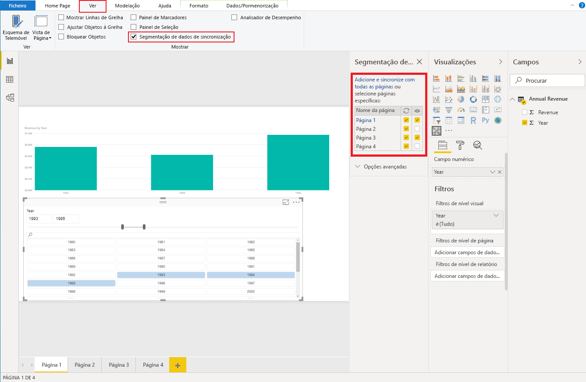

# <a name="sync-slicers-in-power-bi-visuals"></a>Segmentação de Dados de Sincronização em elementos visuais do Power BI

Para suportar a funcionalidade [Segmentação de Dados de Sincronização](https://docs.microsoft.com/power-bi/desktop-slicers), o seu elemento visual de segmentação de dados personalizado tem de utilizar a versão de API 1.13 ou posterior.

Além disso, tem de ativar a opção no ficheiro *capabilities.json*, conforme mostrado no seguinte código:

```json
{
    ...
    "supportsHighlight": true,
    "suppressDefaultTitle": true,
    "supportsSynchronizingFilterState": true,
    "sorting": {
        "default": {}
    }
}
```

Depois de atualizar o ficheiro *capabilities.json*, poderá ver o painel de opções **Segmentação de dados de sincronização** quando selecionar o seu elemento visual de segmentação de dados personalizado.

> [!NOTE]
> A funcionalidade Segmentação de Dados de Sincronização não suporta mais do que um campo. Se a sua segmentação de dados tiver mais do que um campo (**Categoria** ou **Medida**), a funcionalidade será desativada.



No painel **Segmentação de dados de sincronização**, pode ver que a visibilidade e os filtros da segmentação de dados podem ser aplicados a várias páginas do relatório.
