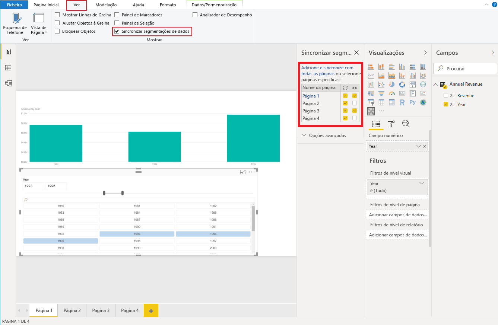

# <a name="sync-slicers"></a>Segmentação de dados de sincronização

Para suportar a [segmentação de dados de sincronização](https://docs.microsoft.com/power-bi/desktop-slicers), o seu elemento visual de segmentação de dados personalizado tem de utilizar a API 1.13 ou posterior.

Também é necessário que a opção esteja ativada em `capabilities.json` (veja o exemplo abaixo).

```json
{
    ...
    "supportsHighlight": true,
    "suppressDefaultTitle": true,
    "supportsSynchronizingFilterState": true,
    "sorting": {
        "default": {}
    }
}
```

Após a realização das alterações em `capabilities.json`, pode ver o painel de opções da segmentação de dados de sincronização quando clicar no seu elemento visual de segmentação de dados personalizado.

> [!NOTE]
> Se a sua segmentação de dados tiver mais do que um campo (categoria ou medida), a funcionalidade será desativada porque a segmentação de dados de sincronização não suporta vários campos.



No painel, pode ver que a visibilidade da sua segmentação de dados e a respetiva filtragem poderão ser aplicadas a várias páginas de relatório.
