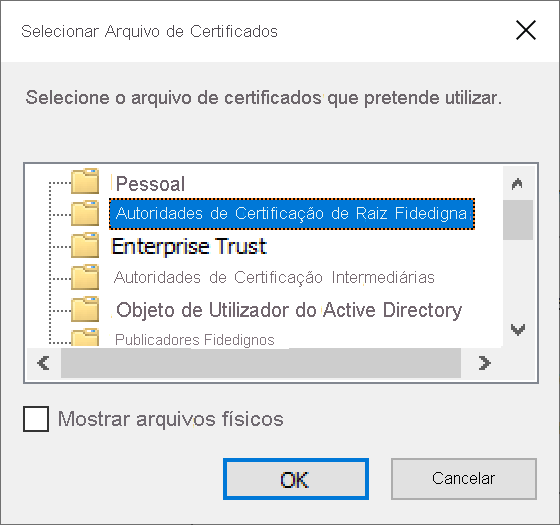
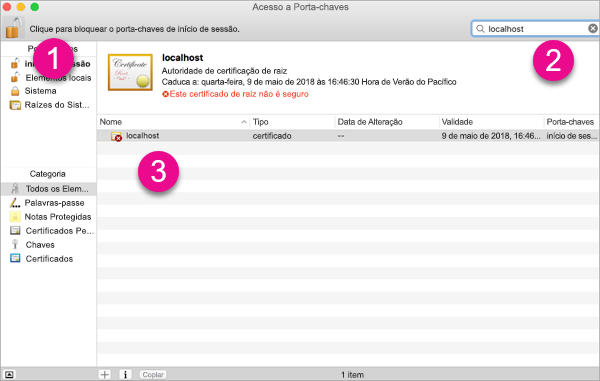
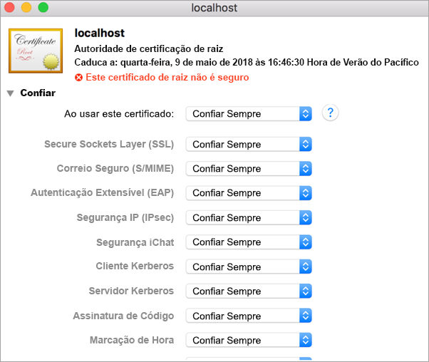
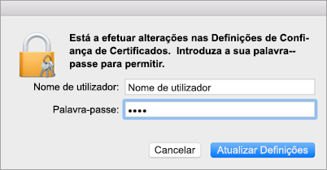
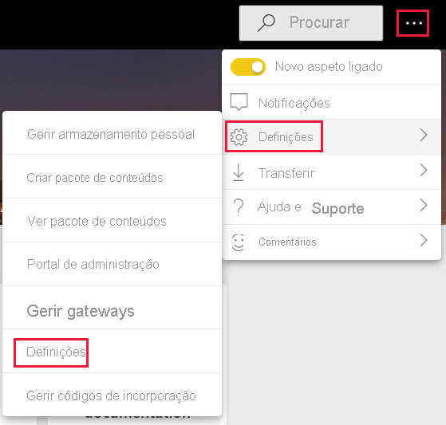
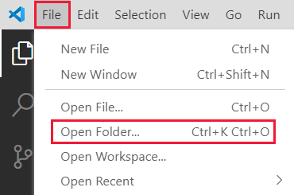
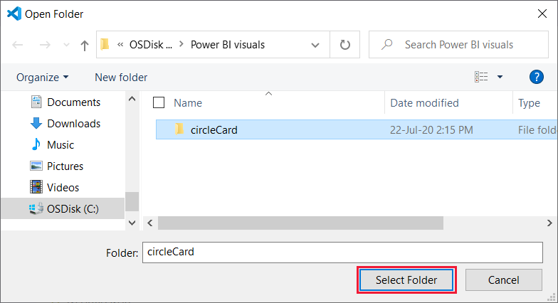
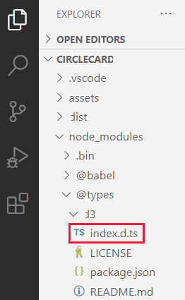

# <a name="set-up-your-environment-for-developing-a-power-bi-visual"></a>Configurar o seu ambiente para programar um elemento visual do Power BI

Neste artigo, vai aprender a configurar o seu ambiente para programar um elemento visual do Power BI.

Antes de começar a programação, tem de instalar **node.js** e o pacote **pbiviz** . Também precisa de criar e instalar um certificado. Quando o ambiente local estiver configurado, vai precisar de configurar o serviço Power BI para programar um elemento visual do Power BI.

Neste artigo, vai aprender a:
> [!div class="checklist"]
> * Instalar o *nodes.js* .
> * Instalar o *pbiviz* .
> * Criar e instalar um certificado.
> * Configurar o serviço Power BI para programar um elemento visual.
> * Instalar bibliotecas adicionais (obrigatórias para programar um elemento visual).

## <a name="install-nodejs"></a>Instalar o node.js

O *Node.js* é um runtime JavaScript criado no motor JavaScript V8 do Chrome. Permite que os programadores executem qualquer aplicação criada em JavaScript.

1. Para instalar o *node.js* , num browser, navegue até [node.js](https://nodejs.org).

2. Transfira o instalador MSI mais recente.

3. Execute o instalador e, em seguida, siga os passos de instalação. Aceite os termos do contrato de licença e todas as predefinições.

4. Reinicie o computador.

## <a name="install-pbiviz"></a>Instalar o pbiviz

A ferramenta *pbiviz* , que é escrita com JavaScript, compila o código fonte do elemento visual do pacote *pbiviz* .

O pacote *pbiviz* é um projeto de elemento visual do Power BI comprimido, com todos os scripts e recursos necessários.

1. Abra o Windows PowerShell e introduza o seguinte comando.

    ```powershell
    npm i -g powerbi-visuals-tools
    ```

## <a name="create-and-install-a-certificate"></a>Criar e instalar um certificado

Para que um cliente (o seu computador) e um servidor (serviço Power BI) interajam com segurança, é obrigatório um [Certificado SSL (Secure Sockets Layer)](create-ssl-certificate.md). Sem um certificado para garantir interações seguras, eles serão bloqueados pelo browser.

# <a name="windows"></a>[Windows](#tab/windows)

Este processo descreve a execução de um comando do PowerShell que inicia o **Assistente para Importar Certificados** . Siga os passos abaixo para configurar o certificado no assistente.

>[!IMPORTANT]
>Não feche a janela do PowerShell durante este procedimento.

1. Abra o Windows PowerShell e introduza o seguinte comando.

    ```powershell
    pbiviz --install-cert
    ```

    Este comando realiza duas ações:
    * Devolve uma *frase de acesso* . Neste caso, a *frase de acesso* é 9765328806094.
    * Também inicia o Assistente para Importar Certificados.
    
    >[!div class="mx-imgBorder"]
    >

2. No Assistente para Importar Certificados, verifique se a localização de armazenamento está definida como *Utilizador Atual* e selecione **Seguinte** .

    >[!div class="mx-imgBorder"]
    >

3. Na janela **Ficheiro a Importar** , selecione **Seguinte** .

4. Na janela **Proteção da Chave Privada** , na caixa de texto *Palavra-passe* , cole a frase de acesso que recebeu ao executar o comando do PowerShell (passo 1) e selecione **Seguinte** . Neste exemplo, a frase de acesso é 9765328806094.

    >[!div class="mx-imgBorder"]
    >

5. Na janela **Arquivo de Certificados** , selecione a opção **Colocar todos os certificados no seguinte arquivo** e selecione **Procurar** .

    >[!div class="mx-imgBorder"]
    >

6. Na janela **Selecionar Arquivo de Certificados** , selecione **Autoridades de Certificação de Raiz Fidedigna** e, em seguida, selecione **OK** .

    >[!div class="mx-imgBorder"]
    >

7. Selecione *Seguinte* na janela **Arquivo de Certificados** .

    >[!div class="mx-imgBorder"]
    >

8. Na janela **Concluir o Assistente para Importar Certificados** , verifique as suas definições e selecione **Concluir** .

    >[!NOTE]
    >Se receber um aviso de segurança, selecione **Sim** .


# <a name="osx"></a>[OSX](#tab/sdk2osx)

1. Se o bloqueio no canto superior esquerdo estiver bloqueado, selecione-o para o desbloquear. Procure *localhost* e faça duplo clique no certificado.

    

2. Selecione **Confiar Sempre** e feche a janela.

    

3. Introduza o seu nome de utilizador e palavra-passe e selecione **Definições de Atualização** .

    

4. Feche os browsers que tenha aberto.

> [!NOTE]
> Se o certificado não for reconhecido, reinicie o computador.

---

## <a name="optional-verify-that-your-environment-is-set-up"></a>(Opcional) Verifique se o seu ambiente está configurado

Confirme que o pacote de ferramentas de elementos visuais do Power BI está instalado. No PowerShell, execute o comando `pbiviz` e reveja o resultado, incluindo a lista de comandos suportados.

>[!div class="mx-imgBorder"]
>

## <a name="set-up-power-bi-service-for-developing-a-visual"></a>Configurar o serviço Power BI para programar um elemento visual

Para programar um elemento visual do Power BI, tem de ativar a depuração de elementos visuais personalizados no serviço Power BI. Siga as instruções nesta secção para ativar esta opção.

1. Inicie sessão em [PowerBI.com](https://powerbi.microsoft.com/).

2. Navegue até **Definições** > **Definições** > **Definições** .

    >[!div class="mx-imgBorder"]
    >

3. No separador **Geral** , selecione **Programador** . Nas **Definições de Programador** selecione a caixa de verificação **Ativar a depuração de elementos visuais personalizados com o elemento visual do programador** e selecione **Aplicar** .

    >[!div class="mx-imgBorder"]
    >

## <a name="install-development-libraries"></a>Instalar bibliotecas de programação

Para programar o seu próprio elemento visual do Power BI, tem de instalar bibliotecas adicionais. Esta secção descreve como instalar estas bibliotecas e verificar se a instalação foi bem-sucedida.

Para instalar as bibliotecas listadas neste artigo, abra o PowerShell e introduza o comando de instalação para cada componente.

>[!NOTE]
>Depois de instalar estas bibliotecas no seu computador, poderá usá-las para qualquer projeto de elementos visuais do Power BI. Este é um procedimento de instalação único, por máquina.


### <a name="d3-javascript-library"></a>Biblioteca de JavaScript D3

A [D3](https://d3js.org/) é uma biblioteca de JavaScript para a produção de visualizações de dados dinâmicas e interativas nos browsers. Baseia-se em padrões SVG (Scalable Vector Graphics), HTML5 e CSS amplamente implementados.

```powershell
npm i d3@^5.0.0 --save
```

### <a name="typescript-definitions"></a>Definições do TypeScript

Instale as definições do TypeScript para poder programar o seu elemento visual do Power BI no [TypeScript](https://www.typescriptlang.org/), um superconjunto do JavaScript.

```powershell
npm i @types/d3@^5.0.0 --save
```

### <a name="core-js"></a>core-js

A [core-js](https://www.npmjs.com/package/core-js) é uma biblioteca padrão modular para JavaScript que inclui polyfills para ECMAScript.

```powershell
npm i core-js@3.2.1 --save
```

### <a name="powerbi-visual-api"></a>powerbi-visual-api

Instale as definições da API de Elementos Visuais do Power BI.

```powershell
npm i powerbi-visuals-api --save-dev
```

### <a name="optional-verify-that-the-d3-library-is-installed"></a>(Opcional) Verificar se a biblioteca D3 está instalada

O [Visual Studio Code](https://code.visualstudio.com/) (VS Code) é um IDE (Ambiente de Desenvolvimento Integrado) ideal para a programação de aplicações TypeScript. Nesta secção, usaremos o VS Code para verificar se a biblioteca D3 de que precisa para programar o seu elemento visual do Power BI está instalada corretamente.

>[!NOTE]
>O processo de verificação descrito nesta secção pressupõe que tem um projeto de elementos visuais do Power BI existente. Se não tiver um projeto de elementos visuais Power BI, pode criar um ao seguir as instruções [criação de projeto de cartão circular](develop-circle-card.md#create-a-development-project).

1. Abra o VS Code.

    >[!TIP]
    >Pode abrir o VS Code no PowerShell ao executar o seguinte comando:
    >
    >```powershell
    >code .
    >```
2. No VS Code, abra o menu **Ficheiro** e selecione **Abrir Pasta** .

    >[!div class="mx-imgBorder"]
    >

3. Na janela **Abrir Pasta** , selecione a pasta que contém o projeto do elemento visual do Power BI e selecione **Selecionar Pasta** .

    >[!div class="mx-imgBorder"]
    >

4. No painel **Explorador** , expanda a pasta **node_modules** e verifique se a biblioteca **d3** foi instalada.

    >[!div class="mx-imgBorder"]
    >

5. No painel **Explorer** , expanda **node_modules > @types  > d3** e verifique se o ficheiro **index.t.ds** está instalado.

    >[!div class="mx-imgBorder"]
    >

## <a name="next-steps"></a>Passos seguintes

> [!div class="nextstepaction"]
> [Criar um elemento visual de cartão circular do Power BI](develop-circle-card.md)

> [!div class="nextstepaction"]
> [Criar um elemento visual de gráfico de barras do Power BI](create-bar-chart.md)