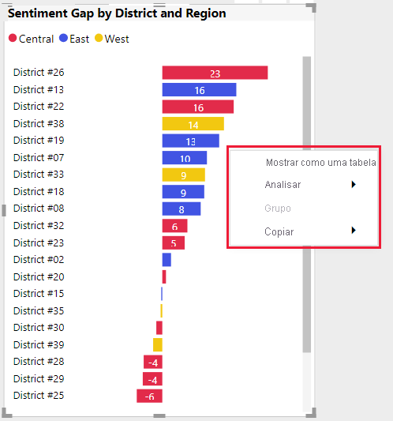

# Diretrizes de elementos visuais do Power BI
Antes de [publicar](office-store.md) o seu elemento visual do Power BI no Microsoft AppSource para que outras pessoas o descubram e utilizem, certifique-se de que segue as diretrizes para criar uma ótima experiência para os seus utilizadores.

## Elementos visuais do Power BI com possibilidade de compras adicionais

Pode enviar elementos visuais do Power BI gratuitos para o Marketplace (Microsoft AppSource). Também pode enviar elementos visuais do Power BI para o Microsoft AppSource com uma etiqueta de preço "Pode ser necessária uma compra adicional". Os elementos visuais do Power BI com a etiqueta "Pode ser necessária uma compra adicional" são semelhantes aos suplementos de compras via aplicação (IAP) na Loja Office. 

Tal como um elemento visual gratuito do Power BI, um elemento visual de IAP do Power BI também pode ser certificado. Antes de enviar o seu elemento visual de IAP do Power BI para certificação, certifique-se de que o mesmo cumpre os [requisitos de certificação](power-bi-custom-visuals-certified.md).

### O que é um elemento visual do Power BI com funcionalidades de IAP?

Um elemento visual de IAP do Power BI é um elemento visual *gratuito* que oferece *funcionalidades gratuitas*. Também tem algumas funcionalidades avançadas para as quais podem ser aplicados custos adicionais. Na descrição do elemento visual do Power BI, os programadores têm de notificar os utilizadores sobre as funcionalidades que exigem compras adicionais para poderem ser utilizadas. Atualmente, a Microsoft não disponibiliza APIs nativas para suportar a compra de aplicações e suplementos.

Os programadores podem utilizar qualquer sistema de pagamento externo para estas compras. Para obter mais informações, veja a [nossa política de loja](/legal/marketplace/certification-policies#11002-displaying-ads).

>[!IMPORTANT]  
> Se atualizar o seu elemento visual do Power BI de gratuito para "Pode ser necessária uma compra adicional", os utilizadores têm de receber o mesmo nível de funcionalidades gratuitas como antes da atualização. Opcionalmente, pode adicionar funcionalidades avançadas pagas para além das funcionalidades gratuitas existentes.

### Marcas d'água

Pode utilizar marcas d'água para que os clientes continuem a utilizar as funcionalidades avançadas de IAP sem pagar. 

As marcas d'água podem ser utilizadas para demonstrar todas as funcionalidades do elemento visual do Power BI antes de efetuar uma compra. 

* As marcas d'água só podem ser utilizadas em funcionalidades pagas utilizadas sem uma licença válida.
* As marcas d'água com uma etiqueta de preço *gratuito* não são permitidas em elementos visuais do Power BI.
* As marcas d'água não são permitidas em elementos visuais de IAP quando alguém utilizar funcionalidades gratuitas. 

### Janela de pop-up

Pode utilizar uma janela de pop-up para explicar como é possível comprar licenças quando for utilizada uma licença inválida (ou expirada) com o seu elemento visual de IAP do Power BI.

### Processo de submissão

Siga o [processo de submissão](office-store.md#submitting-to-appsource) e, em seguida, navegue para o separador *Configuração do produto* e selecione a caixa de verificação *O meu produto requer a compra de um serviço*.

Quando o elemento visual do Power BI estiver validado e aprovado, a listagem do Microsoft AppSource para o elemento visual de IAP do Power BI apresentará a informação "Pode ser necessária uma compra adicional" sob as opções de preços.

## Menu de contexto
O menu de contexto é o menu de clique com o botão direito do rato apresentado quando o utilizador passa o rato sobre um elemento visual.
Todos os elementos visuais do Power BI devem permitir que o menu de contexto proporcione uma experiência unificada.
Veja [este artigo](https://github.com/Microsoft/PowerBI-visuals/blob/gh-pages/tutorials/building-bar-chart/adding-context-menu-to-the-bar.md) para saber como adicionar um menu de contexto.

>[!div class="mx-imgBorder"]
>

## Logótipo comercial
Esta secção descreve as especificações para adicionar logótipos comerciais aos elementos visuais do Power BI. Os logótipos comerciais não são obrigatórios. Se forem adicionados, têm de seguir estas diretrizes.

> [!NOTE]
> * O termo "logótipo comercial" neste artigo refere-se a qualquer ícone de empresa comercial, conforme descrito nas imagens abaixo.
> * O logótipo comercial da Microsoft é utilizado neste artigo apenas como exemplo. Utilize o seu próprio logótipo comercial com o seu elemento visual do Power BI.

> [!IMPORTANT]
> Os logótipos comerciais só são permitidos no *modo de edição*. Os logótipos comerciais *não podem* ser apresentados no modo de visualização.

### Tipo de logótipo comercial

Existem três tipos de logótipos comerciais:
* **Logo** – é composto por dois elementos: um ícone e um nome.

    

* **Símbolo** – um gráfico sem texto.

    

* **Logótipo** – um logo sem ícone e composto apenas por texto.

    

### Cor do logótipo comercial

Ao utilizar um logótipo comercial, a cor do mesmo tem de ser cinzenta (cor hexadecimal #C8C8C8). Não adicione efeitos, como gradações, ao logótipo comercial.

* **Logótipo**

    

* **Símbolo** – um gráfico sem texto.

    

* **Logótipo** – um logo sem ícone e composto apenas por texto.

    

> [!TIP]
> * Se o seu elemento visual do Power BI tiver um gráfico, considere adicionar um fundo branco com margens de 10 px ao seu logótipo.
> * Considere adicionar uma sombra ao seu logótipo (sombra preta com 30% de opacidade).

### Tamanho do logótipo comercial

Um elemento visual do Power BI requer dois logótipos comerciais: um para mosaicos grandes e outro para mosaicos pequenos. Introduza o logótipo numa caixa delimitadora colocada no canto superior ou inferior direito com margens de 4 px.

A seguinte tabela descreve as considerações sobre o tamanho para elementos visuais do Power BI.

|Definições  |Elemento visual do Power BI pequeno  |Elemento visual do Power BI grande  |
|---------|---------|---------|
|*Largura do logótipo*    |Até 240 px         |Maior do que 240 px         |
|*Altura do logótipo*     |Até 160 px         |Maior do que 160 px         |
|*Tamanho da caixa delimitadora*     |40x15 px         |101x30 px         |
|*Exemplo de logótipo comercial*     |         |         |
|*Exemplo de caixa delimitadora*    |         |         |
|    |         |         |

### Comportamento do logótipo comercial

Os logótipos comerciais só são permitidos no modo de edição. Ao clicar num logótipo comercial, este só pode incluir as seguintes funcionalidades:

* Os cliques no logótipo redirecionam para o seu site.

* Os cliques no logótipo comercial abrem uma janela de pop-up com informações adicionais. A janela de pop-up deverá dividir-se em duas secções:
    * Uma área de marketing que pode incluir o logótipo comercial, um elemento visual e classificações de mercado.
    * Uma área informativa que pode incluir informações e ligações.    

### Aspetos a evitar

* Os logótipos comerciais não podem ser apresentados no modo de visualização.

* Um logótipo comercial animado pode apresentar animações até cinco segundos.

* Se o seu elemento visual do Power BI incluir ícones informativos (i) no modo de leitura, estes devem corresponder à cor, tamanho e localização do logótipo comercial conforme descrito acima.

* Evite um logótipo comercial colorido ou a preto. O logótipo comercial tem de ser cinzento (cor hexadecimal #C8C8C8).

     

* Um logótipo comercial com efeitos, tais como gradações ou sombras fortes.

    

## Melhores práticas

Ao publicar um elemento visual do Power BI, considere as seguintes recomendações de forma a proporcionar a melhor experiência aos utilizadores.

### Página de destino da aplicação

Utilize a página de destino para esclarecer aos utilizadores como podem utilizar o elemento visual do Power BI e onde comprar a licença. Não inclua vídeos acionados automaticamente. Adicione apenas material que ajude a melhorar a experiência do utilizador, tais como informações ou ligações para detalhes da compra da licença e como utilizar as funcionalidades de IAP.

### Chave de licença e token

Para comodidade do utilizador, adicione campos relativos à chave de licença ou token na parte superior do painel de formatação.

## FAQ

Para obter mais informações acerca dos elementos visuais do Power BI, aceda às [Perguntas frequentes sobre os elementos visuais do Power BI com compras adicionais](power-bi-custom-visuals-faq.md#visuals-with-additional-purchases).

## Passos seguintes

Saiba como pode publicar o seu elemento visual do Power BI no Microsoft AppSource para que outros o possam encontrar e utilizar.

>[!div class="nextstepaction"]
>[Publicar elementos visuais do Power BI](office-store.md)