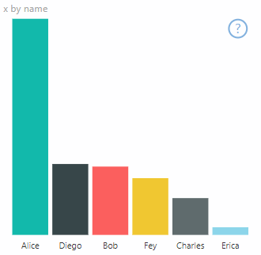

# <a name="high-contrast-mode-support"></a>Suporte do modo de Alto Contraste

A definição de *Alto Contraste* do Windows facilita a visualização de texto e aplicações graças à utilização de cores mais nítidas.
Leia mais sobre o [suporte de alto contraste no Power BI](https://powerbi.microsoft.com/blog/power-bi-desktop-june-2018-feature-summary/#highContrast).

A adição do suporte de alto contraste ao seu elemento visual requer o seguinte:

1. Durante a inicialização: verifique se o Power BI está no modo de alto contraste e, se for o caso, obtenha as cores de alto contraste atuais.
2. Em todas as atualizações: altere a composição do elemento visual para facilitar a visualização.

O elemento visual PowerBI-visuals-sampleBarChart inclui a implementação do suporte de alto contraste.

Para obter mais informações, veja o [repositório de elementos visuais PowerBI-visuals-sampleBarChart](https://github.com/Microsoft/PowerBI-visuals-sampleBarChart/commit/61011c82b66ca0d3321868f1d089c65101ca42e6)

## <a name="on-init"></a>Durante a Inicialização

O membro de paleta de cores de `options.host` tem várias propriedades para o modo de alto contraste. Utilize essas propriedades para determinar se o modo de alto contraste está ativo e, caso esteja, escolher as cores a utilizar.

### <a name="detect-that-power-bi-is-in-high-contrast-mode"></a>Verificar se o Power BI está no modo de alto contraste

Se `host.colorPalette.isHighContrast` for `true`, significa que o modo de alto contraste está ativo e o elemento visual deverá ser desenhado em conformidade.

### <a name="get-high-contrast-colors"></a>Obter cores de alto contraste

No modo de alto contraste, o seu elemento visual deve limitar-se às seguintes cores:

* A cor **de primeiro plano** é utilizada para desenhar todas as linhas, ícones e texto, bem como para contornar ou preencher formas.
* A cor **de fundo** é utilizada no fundo e como cor de preenchimento de formas contornadas.
* A cor de **primeiro plano – selecionada** é utilizada para indicar um elemento selecionado ou ativo.
* A cor de **hiperligação** é utilizada apenas para o texto de hiperligações.

> [!NOTE]
> Se necessitar de uma cor secundária, a cor de primeiro plano pode ser utilizada com alguma opacidade (os elementos visuais nativos do Power BI têm 40% de opacidade). Faça-o com moderação para que seja fácil ver os detalhes do elemento visual.

Pode armazenar estes valores durante a inicialização:

```typescript
private isHighContrast: boolean;

private foregroundColor: string;
private backgroundColor: string;
private foregroundSelectedColor: string;
private hyperlinkColor: string;
//...

constructor(options: VisualConstructorOptions) {
    this.host = options.host;
    let colorPalette: ISandboxExtendedColorPalette = host.colorPalette;
    //...
    this.isHighContrast = colorPalette.isHighContrast;
    if (this.isHighContrast) {
        this.foregroundColor = colorPalette.foreground.value;
        this.backgroundColor = colorPalette.background.value;
        this.foregroundSelectedColor = colorPalette.foregroundSelected.value;
        this.hyperlinkColor = colorPalette.hyperlink.value;
    }
```

Em alternativa, pode armazenar o objeto `host` durante a inicialização e aceder às propriedades de `colorPalette` relevantes durante a atualização.

## <a name="on-update"></a>Durante a atualização

As implementações específicas do suporte de alto contraste variam consoante o elemento visual e dependem dos detalhes do respetivo design gráfico. Normalmente, o modo de alto contraste requer um design ligeiramente diferente da predefinição, de modo a que seja fácil distinguir os detalhes importantes através de cores limitadas.

Eis algumas diretrizes seguidas pelos elementos visuais nativos do Power BI:

* Todos os pontos de dados utilizam a mesma cor (primeiro plano).
* Todo o texto, eixos, setas, linhas, entre outros, utilizam uma cor de primeiro plano.
* As formas espessas são desenhadas como contornos com traços espessos (pelo menos dois píxeis) e preenchimento de cor de fundo.
* Caso seja relevante, os pontos de dados são distinguidos com diferentes formas de marcador e as linhas de dados são distinguidas com um tracejado diferente.
* Se um elemento de dados estiver destacado, todos os outros elementos terão uma opacidade de 40%.
* No caso das segmentações de dados, os elementos de filtro ativos utilizam a cor de primeiro plano selecionada.

Por exemplo, no Gráfico de Barras de Exemplo, todas as barras são desenhadas com um contorno de primeiro plano e um preenchimento de fundo com dois píxeis de espessura. Compare o aspeto do gráfico com as cores predefinidas e alguns temas de alto contraste:




Eis um local na função `visualTransform` que foi alterado para suportar o alto contraste. É chamado como parte da composição durante `update`:

### <a name="before"></a>Antes de

```typescript
for (let i = 0, len = Math.max(category.values.length, dataValue.values.length); i < len; i++) {
    let defaultColor: Fill = {
        solid: {
            color: colorPalette.getColor(category.values[i] + '').value
        }
    };

    barChartDataPoints.push({
        category: category.values[i] + '',
        value: dataValue.values[i],
        color: getCategoricalObjectValue<Fill>(category, i, 'colorSelector', 'fill', defaultColor).solid.color,
        selectionId: host.createSelectionIdBuilder()
            .withCategory(category, i)
            .createSelectionId()
    });
}
```

### <a name="after"></a>Depois de

```typescript
for (let i = 0, len = Math.max(category.values.length, dataValue.values.length); i < len; i++) {
    const color: string = getColumnColorByIndex(category, i, colorPalette);

    const selectionId: ISelectionId = host.createSelectionIdBuilder()
        .withCategory(category, i)
        .createSelectionId();

    barChartDataPoints.push({
        color,
        strokeColor,
        strokeWidth,
        selectionId,
        value: dataValue.values[i],
        category: `${category.values[i]}`,
    });
}

//...

function getColumnColorByIndex(
    category: DataViewCategoryColumn,
    index: number,
    colorPalette: ISandboxExtendedColorPalette,
): string {
    if (colorPalette.isHighContrast) {
        return colorPalette.background.value;
    }

    const defaultColor: Fill = {
        solid: {
            color: colorPalette.getColor(`${category.values[index]}`).value,
        }
    };

    return getCategoricalObjectValue<Fill>(category, index, 'colorSelector', 'fill', defaultColor).solid.color;
}
```
