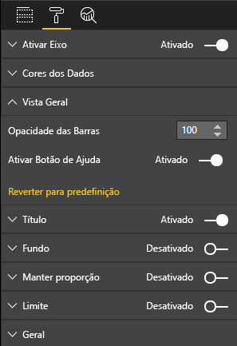

# <a name="create-a-launch-url"></a>Criar um URL de iniciação

Ao criar um URL de iniciação, pode abrir um novo separador (ou janela) do browser ao delegar o trabalho real no Power BI.

## <a name="sample"></a>Exemplo

```typescript
   this.host.launchUrl('https://powerbi.microsoft.com');
```

## <a name="usage"></a>Utilização

Utilize a chamada à API `host.launchUrl()` ao transmitir o seu URL de destino como argumento de cadeia de carateres:

```typescript
this.host.launchUrl('http://some.link.net');
```

## <a name="restrictions"></a>Restrições

* Utilize apenas caminhos absolutos e não relativos. Por exemplo, utilize um caminho absoluto como `http://some.link.net/subfolder/page.html`. O caminho relativo (`/page.html`) não será aberto.

* De momento, só são suportados os protocolos *HTTP* e *HTTPS*. Evite o *FTP*, o *MAILTO* e assim por adiante.

## <a name="best-practices"></a>Melhores práticas

* Geralmente, é melhor abrir uma ligação apenas como resposta a uma ação explícita de um utilizador. Faça com que seja fácil o utilizador compreender que, se clicar na ligação ou no botão, será aberto um novo separador. O utilizador poderá ficar confuso ou frustrado se acionar uma chamada `launchUrl()` sem ter realizado uma ação ou como efeito secundário de uma ação diferente.

* Se a ligação não for essencial para o funcionamento do elemento visual, recomendamos que forneça ao autor do relatório uma forma de desativar e ocultar a ligação. Esta recomendação é especialmente relevante em casos de utilização do Power BI especiais, tais como a incorporação de um relatório numa aplicação de terceiros ou a respetiva publicação na Web.

* Evite acionar uma chamada `launchUrl()` dentro de um ciclo, da função `update` do elemento visual ou de outro código que surja frequentemente.

## <a name="a-step-by-step-example"></a>Um exemplo passo a passo

### <a name="add-a-link-launching-element"></a>Adicionar um elemento de inicialização de ligação

As seguintes linhas foram adicionadas à função `constructor` do elemento visual:

```typescript
    this.helpLinkElement = this.createHelpLinkElement();
    options.element.appendChild(this.helpLinkElement);
```

Foi adicionada uma função privada que cria e anexa o elemento de âncora:

```typescript
private createHelpLinkElement(): Element {
    let linkElement = document.createElement("a");
    linkElement.textContent = "?";
    linkElement.setAttribute("title", "Open documentation");
    linkElement.setAttribute("class", "helpLink");
    linkElement.addEventListener("click", () => {
        this.host.launchUrl("https://docs.microsoft.com/power-bi/developer/visuals/custom-visual-develop-tutorial");
    });
    return linkElement;
};
```

Por último, uma entrada no ficheiro *visual.less* define o estilo para o elemento de ligação:

```less
.helpLink {
    position: absolute;
    top: 0px;
    right: 12px;
    display: block;
    width: 20px;
    height: 20px;
    border: 2px solid #80B0E0;
    border-radius: 20px;
    color: #80B0E0;
    text-align: center;
    font-size: 16px;
    line-height: 20px;
    background-color: #FFFFFF;
    transition: all 900ms ease;

    &:hover {
        background-color: #DDEEFF;
        color: #5080B0;
        border-color: #5080B0;
        transition: all 250ms ease;
    }

    &.hidden {
        display: none;
    }
}
```

### <a name="add-a-toggling-mechanism"></a>Adicionar um mecanismo de alternância

Para adicionar um mecanismo de alternância, precisa de adicionar um objeto estático para que o autor do relatório possa alternar a visibilidade do elemento de ligação. (A predefinição está definida como *Oculta*). Para obter mais informações, veja o [tutorial relativo a objetos estáticos](https://microsoft.github.io/PowerBI-visuals/docs/concepts/objects-and-properties).

Foi adicionado um objeto estático booleano `showHelpLink` à entrada de objetos do ficheiro *capabilities.json*, conforme mostrado no seguinte código:

```typescript
"objects": {
    "generalView": {
            "displayName": "General View",
            "properties":
                "showHelpLink": {
                    "displayName": "Show Help Button",
                    "type": {
                        "bool": true
                    }
                }
            }
        }
    }
```



Além disso, foram adicionadas as seguintes linhas na função `update` do elemento visual:

```typescript
if (settings.generalView.showHelpLink) {
    this.helpLinkElement.classList.remove("hidden");
} else {
    this.helpLinkElement.classList.add("hidden");
}
```

A classe *Oculta* está definida no *visual.less* para controlar a apresentação do elemento.
