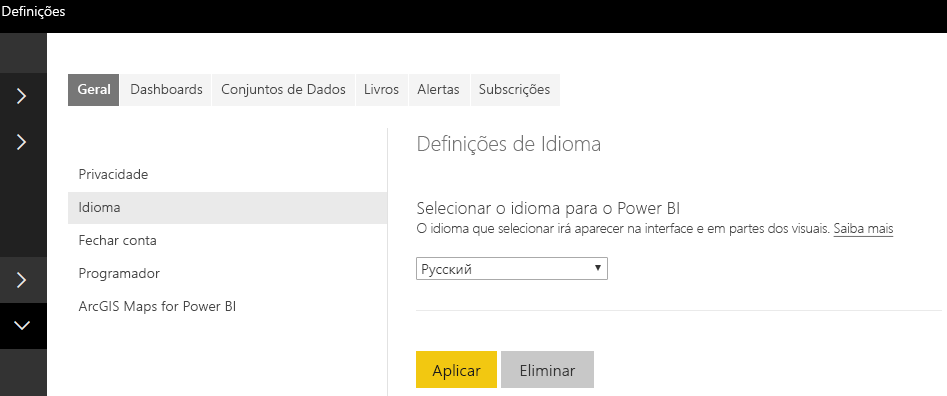

# <a name="add-the-locale-in-power-bi-for-power-bi-visuals"></a>Adicionar a região do Power BI para obter elementos visuais do Power BI

Os elementos visuais podem obter a região do Power BI para localizar os respetivos conteúdos para o idioma aplicável.

Leia mais sobre [Idiomas com suporte e países/regiões do Power BI](./../../supported-languages-countries-regions.md)

Por exemplo, obter a região do elemento visual Gráfico de Barras de Exemplo.


Cada um destes gráficos de barras foi criado numa região diferente (Inglês, Basco, Hindi) e é apresentado na descrição.

> [!NOTE]
> O gestor de localização no código do elemento visual é suportado pela API 1.10.0 e posterior.

## <a name="get-the-locale"></a>Obter a região

A `locale` é transmitida como uma cadeia durante a inicialização do elemento visual. Se alterar uma região no Power BI, o elemento visual será novamente gerado com a nova região. Pode encontrar o código de exemplo completo em SampleBarChart with Locale

O construtor do BarChart tem agora um membro de região, que é instanciado no construtor com a instância da região do anfitrião.

```typescript
private locale: string;
...
this.locale = options.host.locale;
```

Regiões suportadas:

Cadeia de região | Idioma
--------------|----------------------
ar-SA | العربية (Árabe)
bg-BG | български (Búlgaro)
ca-ES | català (Catalão)
cs-CZ | čeština (Checo)
da-DK | dansk (Dinamarquês)
de-DE | Deutsche (Alemão)
el-GR | ελληνικά (Grego)
en-PT | English (Inglês)
es-ES | español (Espanhol)
et-EE | eesti (Estónio)
eU-ES | Euskal (Basco)
fi-FI | suomi (Finlandês)
fr-FR | français (Francês)
gl-ES | galego (Galego)
he-IL | עברית (Hebraico)
hi-IN | हिन्दी (Hindi)
hr-HR | hrvatski (Croata)
hu-HU | magyar (Húngaro)
id-ID | Bahasa Indonesia (Indonésio)
it-IT | italiano (Italiano)
ja-JP | 日本の (Japonês)
kk-KZ | Қазақ (Cazaque)
ko-KR | 한국의 (Coreano)
lt-LT | Lietuvos (Lituano)
lv-LV | Latvijas (Letão)
ms-MY | Bahasa Melayu (Malaio)
nb-NO | norsk (Norueguês)
nl-NL | Nederlands (Neerlandês)
pl-PL | polski (Polaco)
pt-BR | português (Português)
pt-PT | português (Português)
ro-RO | românesc (Romeno)
ru-RU | русский (Russo)
sk-SK | slovenský (Eslovaco)
sl-SI | slovenski (Esloveno)
sr-Cyrl-RS | српски (Sérvio)
sr-Latn-RS | srpski (Sérvio)
sv-SE | svenska (Sueco)
th-TH | ไทย (Tailandês)
tr-TR | Türk (Turco)
uk-UA | український (Ucraniano)
vi-VN | tiếng Việt (Vietnamita)
zh-CN | 中国 (Chinês Simplificado)
zh-TW | 中國 (Chinês Tradicional)

> [!NOTE]
> No Power BI Desktop, a propriedade da região irá conter o idioma instalado.

## <a name="localizing-the-property-pane-for-power-bi-visuals"></a>Localizar o painel de propriedades dos elementos visuais do Power BI

Os campos no painel de propriedades podem ser localizados, de modo a fornecer uma experiência mais integrada e coerente. Isto faz com que o seu elemento visual se comporte como qualquer outro elemento visual importante do Power BI.

Por exemplo, um elemento visual personalizado não localizado, criado através do comando `pbiviz new`, apresenta os seguintes campos no painel de propriedades:


os campos Dados de Categorias e Dados de Medida são definidos no ficheiro .json de capacidades `displayName`.

## <a name="how-to-localize-capabilities"></a>Como localizar capacidades

Em primeiro lugar, adicione uma chave de nome a apresentar para qualquer nome a apresentar que pretenda localizar nas suas capacidades. Neste exemplo:

```json
{
    "dataRoles": [
        {
            "displayName": "Category Data",
            "displayNameKey": "VisualCategoryDataNameKey1",
            "name": "category",
            "kind": "Grouping"
        },
        {
            "displayName": "Measure Data",
            "displayNameKey": "VisualMeasureDataNameKey2",
            "name": "measure",
            "kind": "Measure"
        }
    ]
}
```

Em seguida, adicione um diretório chamado stringResources. O diretório irá conter todos os seus ficheiros de recursos de cadeia com base nas regiões que pretende que o elemento visual suporte. Neste diretório, terá de adicionar um ficheiro JSON por cada região que pretende suportar. Esses ficheiros contêm as informações da região e os valores das cadeias localizadas de cada displayNameKey que pretenda substituir.

No nosso exemplo, queremos suportar o árabe e o hebraico. Teremos de adicionar dois ficheiros JSON da seguinte forma:


Todos os ficheiros JSON definem uma única região (o ficheiro tem de ser uma das regiões da lista suportada apresentada acima) com os valores de cadeia para as chaves pretendidas do nome a apresentar. No nosso exemplo, o ficheiro de recursos de cadeia em hebraico terá o seguinte aspeto:

```json
{
    "locale": "he-IL",
    "values": {
        "VisualCategoryDataNameKey1": "קטגוריה",
        "VisualMeasureDataNameKey2": "יחידות מידה"
    }
}
```

Todos os passos necessários para utilizar o gestor de localização estão descritos abaixo.

> [!NOTE]
> Neste momento, a localização não é suportada para realizar a depuração do elemento visual do programador

## <a name="setup-environment"></a>Ambiente de configuração

### <a name="desktop"></a>Ambiente de trabalho

Para utilização em computador, transfira a versão localizada do Power BI Desktop em https://powerbi.microsoft.com.

### <a name="web-service"></a>Serviço Web

Se utilizar o cliente Web (browser) no serviço, altere o seu idioma nas definições:



## <a name="resource-file"></a>Ficheiro de recurso

Adicione um ficheiro resources.resjson a uma pasta com o mesmo nome da região que vai utilizar dentro da pasta stringResources. No nosso exemplo, as regiões são en-US e ru-RU.


Depois disso, adicione todas as cadeias de localização que irá utilizar ao ficheiro resources.resjson que adicionou no passo anterior.

```json
{
    ...
    "Role_Legend": "Обозначения",
    "Role_task": "Задача",
    "Role_StartDate": "Дата начала",
    "Role_Duration": "Длительность"
    ...
}
```

Este exemplo é a versão en-US do ficheiro resources.resjson:

```json
{
    ...
    "Role_Legend": "Legend",
    "Role_task": "Task",
    "Role_StartDate": "Start date",
    "Role_Duration": "Duration"
    ...
}
```

Nova instância da função localizationManager. Crie uma instância da função localizationManager no código do seu elemento visual como indicado abaixo:

```typescript
private localizationManager: ILocalizationManager;

constructor(options: VisualConstructorOptions) {
    this.localizationManager = options.host.createLocalizationManager();
}
```

## <a name="localizationmanager-usage-sample"></a>Exemplo de utilização da função localizationManager

Agora pode chamar a função getDisplayName do gestor de localização com o argumento da chave da cadeia que definiu no ficheiro resources.resjson para obter a cadeia necessária em qualquer do seu código:

```typescript
let legend: string = this.localization.getDisplayName("Role_Legend");
```

Devolve "Legend" para en-US e "Обозначения" para ru-RU

## <a name="next-steps"></a>Próximos passos

* [Saiba como utiliza utilitários de formatação para fornecer formatos localizados](utils-formatting.md)
