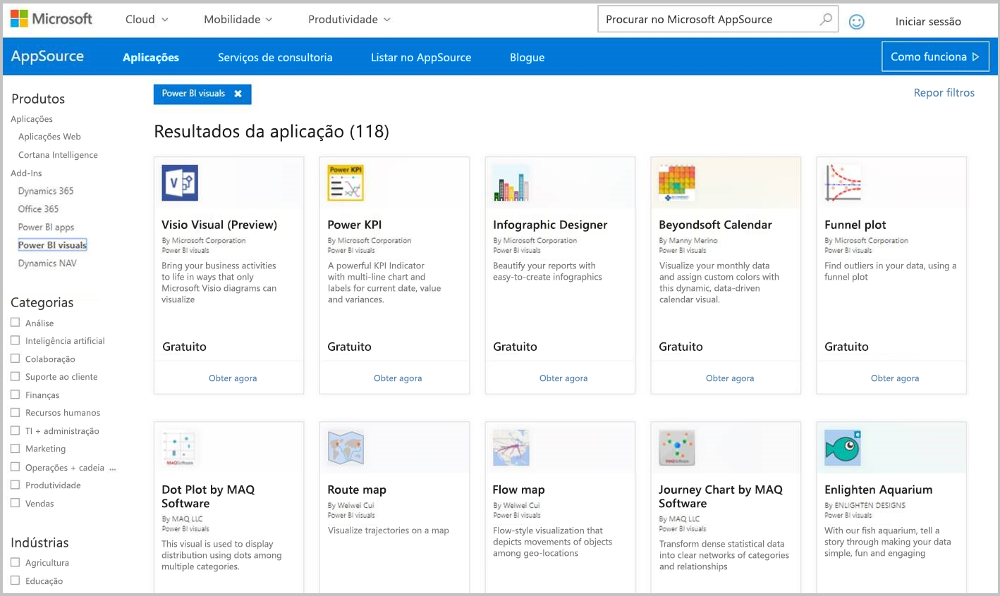
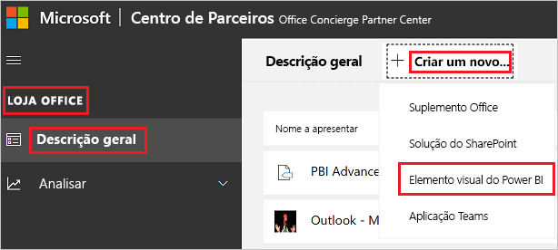

# Publicar elementos visuais do Power BI no Centro de Parceiros

Depois de criar o elemento visual do Power BI, poderá querer publicá-lo no AppSource para que outros utilizadores o possam encontrar e utilizar. Para obter mais informações acerca da criação de um elemento visual do Power BI, veja [Desenvolver um elemento visual do Power BI](custom-visual-develop-tutorial.md).

## O que é o AppSource?

O [AppSource](https://appsource.microsoft.com/marketplace/apps?product=power-bi-visuals) é o local onde pode encontrar aplicações SaaS e suplementos para os produtos e os serviços Microsoft.

## Preparar a submissão do elemento visual do Power BI

Antes de submeter um elemento visual do Power BI no AppSource, garanta que leu as [Diretrizes dos elementos visuais do Power BI](guidelines-powerbi-visuals.md) e [testou o elemento visual personalizado](https://github.com/Microsoft/PowerBI-visuals/blob/master/Tutorial/SubmissionTesting.md).

Quando estiver pronto para submeter o elemento visual do Power BI, verifique se cumpre todos os requisitos listados abaixo.

| Item | Obrigatório | Descrição |
| --- | --- | --- |
| Pacote Pbiviz |Sim |Compacte o elemento visual do Power BI num pacote Pbiviz com todos os metadados necessários. Nome do elemento visual Nome a apresentar GUID Versão Descrição Nome e e-mail do autor |
| Ficheiro de relatório. pbix de exemplo |Sim |Para demonstrar o elemento visual, ajude os utilizadores a familiarizarem-se com o mesmo. Realce o valor que o elemento visual proporciona ao utilizador e dê exemplos de utilização e opções de formatação. Também pode adicionar uma página de *“sugestões”* no final com algumas sugestões e truques e aspetos a evitar. O ficheiro de relatório .pbix de exemplo deve funcionar offline, sem quaisquer ligações externas. |
| Ícone |Sim |Deve incluir o logótipo do elemento visual personalizado que será apresentado na loja. Os formatos possíveis são .png, .jpg, .jpeg ou .gif. Tem de ter exatamente 300 x 300 px (largura x altura). **Importante!** Reveja atentamente o [guia de imagens da loja AppSource](https://docs.microsoft.com/office/dev/store/craft-effective-appsource-store-images) antes de submeter o ícone. |
| Capturas de ecrã |Sim |Forneça, pelo menos, uma captura de ecrã. Os formatos possíveis são .png, .jpg, .jpeg ou .gif. As dimensões devem ter exatamente 1366 px (largura) por 768 px (altura). O tamanho do ficheiro não pode ser superior a 1024 KB. Para promover uma maior utilização, adicione balões de texto para articular a proposta de valor das principais funcionalidades mostradas em cada captura de ecrã. |
| Ligação de transferência do suporte |Sim |Forneça uma URL de suporte para os clientes. Esta ligação é introduzida como parte da sua lista do Centro de Parceiros e está visível para os utilizadores quando acederem à lista do elemento visual no AppSource. O formato do URL deve incluir https:// ou https://. |
| Ligação para documento sobre privacidade |Sim |Forneça uma ligação para a política de privacidade do elemento visual. Esta ligação é introduzida como parte da sua lista do Centro de Parceiros e está visível para os utilizadores quando acederem à lista do elemento visual no AppSource. O formato da ligação deve incluir https:// ou https://. |
| Contrato de licença do utilizador final (EULA) |Sim |Tem de fornecer um ficheiro EULA para o elemento visual do Power BI. Pode utilizar o [contrato standard](https://go.microsoft.com/fwlink/?linkid=2041178), o [contrato dos elementos visuais do Power BI](https://visuals.azureedge.net/app-store/Power%20BI%20-%20Default%20Custom%20Visual%20EULA.pdf) ou o seu próprio EULA. |
| Ligação para vídeo |Não |Para aumentar o interesse dos utilizadores relativamente ao elemento visual personalizado, forneça uma ligação para um vídeo sobre o elemento visual. O formato do URL deve incluir https:// ou https://. |
| Repositório do GitHub |Não |Partilhe uma ligação pública para um repositório do [GitHub](https://www.github.com) com as origens do elemento visual do Power BI e dados de exemplo. Esta ligação permite que outros programadores tenham a oportunidade de fornecer comentários e propor melhorias ao código. |

## Obter um XML do pacote de aplicação

Para submeter um elemento visual do Power BI, necessita de um XML do pacote de aplicação da equipa do Power BI. Para obter o XML do pacote de aplicação, envie um e-mail para a equipa de submissão de elementos visuais do Power BI ([pbivizsubmit@microsoft.com](mailto:pbivizsubmit@microsoft.com)).

Antes de criar o pacote **pbiviz**, terá de preencher os seguintes campos no ficheiro **pbiviz.json**:
* descrição
* supportUrl
* autor
* name
* e-mail

Anexe o **ficheiro pbiviz** e o **ficheiro pbix do relatório de exemplo** ao e-mail. A equipa do Power BI irá responder com instruções e um ficheiro XML do pacote de aplicação para carregamento. Este XML do pacote de aplicação é necessário para submeter o elemento visual através do Centro de Programadores do Office.

> [!NOTE]
> A fim de melhorar a qualidade e garantir que os relatórios existentes não apresentam falhas, as atualizações aos elementos visuais existentes irão demorar mais duas semanas a atingir o ambiente de produção após a aprovação na loja.

## Submeter no AppSource

Para submeter o elemento visual do Power BI no AppSource, precisa de obter um pacote de aplicação da equipa do Power BI e, em seguida, submetê-lo no Centro de Parceiros. 

### Obter o pacote de aplicação

Tem de enviar um e-mail com o ficheiro **pbiviz** e o ficheiro **pbix** à equipa do Power BI antes de efetuar a submissão no AppSource. Este passo permite que a equipa do Power BI carregue os ficheiros para o servidor de partilha público. Caso contrário, a loja não conseguirá obter os ficheiros. 

A equipa do Power BI terá de verificar os ficheiros quanto a novas submissões de elementos visuais do Power BI, atualizações aos elementos visuais do Power BI existentes e correções às submissões rejeitadas.

### Submeter no Centro de Parceiros

Para submeter o elemento visual do Power BI no Centro de Parceiros, precisa de estar registado no Centro de Parceiros. Se ainda não estiver registado, [abra uma conta de programador no Centro de Parceiros](https://docs.microsoft.com/office/dev/store/open-a-developer-account).

Siga os passos abaixo para submeter o elemento visual do Power BI no Centro de Parceiros. Para obter mais informações acerca do processo de submissão, veja [Submit your Office solution to AppSource via Partner Center](https://docs.microsoft.com/office/dev/store/use-partner-center-to-submit-to-appsource) (Submeter a solução do Office no AppSource através do Centro de Parceiros).

1. Inicie sessão no **Centro de Parceiros**.

2. No painel esquerdo, selecione **LOJA OFFICE**.

3. Selecione **Descrição geral**.

4. Selecione **Criar um novo** e, no menu pendente, selecione **Elemento visual do Power BI**.

    

5. Na janela **Criar um novo elemento visual do Power BI**, introduza um nome para o elemento visual do Power BI e selecione **Criar**.

6. Selecione **Pacotes** e carregue o XML do pacote de aplicação do elemento visual do Power BI.

7. Selecione **Propriedades** e forneça as informações necessárias.

8. Se o produto exigir uma compra adicional, selecione **Configuração do produto** e marque a caixa de verificação **Compra de serviço associado**.

9. (Opcional) Caso pretenda [certificar](power-bi-custom-visuals-certified.md) o elemento visual, selecione **Configuração do produto** e marque a caixa de verificação **Certificação do Power BI**.
    >[!TIP]
    >O processo de certificação do Power BI pode demorar algum tempo. Se estiver a criar um novo elemento visual do Power BI, recomendamos que o publique através do Centro de Parceiros antes de pedir a certificação do Power BI. Esse procedimento garante que a publicação do elemento visual não sofre atrasos.

10. Selecione **Configuração do produto** e clique em **Rever e publicar**.

## Controlar o estado da submissão e a utilização

Pode rever as [políticas de validação](https://docs.microsoft.com/legal/marketplace/certification-policies#1180-power-bi-visuals).

Após a submissão, poderá ver o estado da submissão no [dashboard da aplicação](https://sellerdashboard.microsoft.com/Application/Summary/).

## Certificar o elemento visual

Uma vez criado o elemento visual, se assim o pretender, pode proceder à [certificação](power-bi-custom-visuals-certified.md) do elemento visual.

## Próximos passos

* [Developing a Power BI custom visual](custom-visual-develop-tutorial.md) (Desenvolver um elemento visual personalizado do Power BI)

* [Visualizações no Power BI](../../visuals/power-bi-report-visualizations.md)  

* [Visuals in Power BI](power-bi-custom-visuals.md) (Elementos visuais no Power BI)  

* [Obter a certificação de um elemento visual do Power BI](power-bi-custom-visuals-certified.md)

* Mais perguntas? [Experimente perguntar à Comunidade do Power BI](https://community.powerbi.com/)
