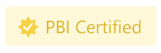

# Certificar um elemento visual do Power BI

Os elementos visuais do Power BI certificados são os elementos visuais do [AppSource](https://appsource.microsoft.com/en-us/marketplace/apps?page=1&product=power-bi-visuals) que cumprem os [requisitos de código](#certification-requirements) da equipa do Microsoft Power BI. Estes elementos visuais são testados para verificar que não acedem a recursos ou serviços externos e que seguem as diretrizes e os padrões de codificação seguros.

Quando um elemento visual do Power BI é certificado, oferece mais funcionalidades. Por exemplo, pode [exportar para o PowerPoint](../../consumer/end-user-powerpoint.md) ou apresentar o elemento visual em e-mails recebidos quando um utilizador [subscreve as páginas de relatório](../../consumer/end-user-subscribe.md).

O processo de certificação é opcional. Os elementos visuais do Power BI que não estão certificados não são necessariamente elementos visuais do Power BI não seguros. Alguns elementos visuais do Power BI não estão certificados porque não cumprem um ou mais [requisitos de certificação](power-bi-custom-visuals-certified.md#certification-requirements). Por exemplo, um elemento visual do Power BI de mapa que liga a um serviço externo ou um elemento visual do Power BI que utiliza bibliotecas comerciais.

> [!NOTE]
> A Microsoft não é responsável pela criação de elementos visuais do Power BI de terceiros. Para verificar a funcionalidade dos elementos visuais de terceiros, contacte o autor do elemento visual diretamente.

## Requisitos de certificação

Para obter o [certificado](#get-a-power-bi-visual-certified) de elemento visual do Power BI, o elemento visual do Power BI deve estar em conformidade com os requisitos listados nesta secção. 

### Requisitos gerais

O elemento visual do Power BI tem de ser aprovado pelo Centro de Parceiros. É recomendado que o elemento visual do Power BI já esteja no [AppSource](https://appsource.microsoft.com/marketplace/apps?page=1&product=power-bi-visuals). Para saber como publicar um elemento visual do Power BI no AppSource, veja [Publicar elementos visuais do Power BI no Centro de Parceiros](office-store.md).

Antes de submeter o elemento visual do Power BI para certificação, confirme que este está em conformidade com as [diretrizes dos elementos visuais do Power BI](guidelines-powerbi-visuals.md).

Ao submeter o elemento visual do Power BI, confirme que o pacote compilado corresponde exatamente ao pacote submetido.

### Requisitos do repositório de código

Embora não seja necessário partilhar publicamente o código no GitHub, o repositório de código deve estar disponível para análise pela equipa do Power BI. A melhor maneira de o fazer, é fornecer o código fonte (JavaScript ou TypeScript) no GitHub.

O repositório deve conter o seguinte:
* Código para apenas um elemento visual do Power BI. Não pode conter código para vários elementos visuais do Power BI ou código não relacionado.
* Um ramo denominado **certificação** (obrigatoriamente em minúsculas). O código fonte neste ramo deve corresponder ao pacote submetido. Este código só pode ser atualizado durante o próximo processo de submissão, caso esteja a submeter novamente o elemento visual do Power BI.

Se o elemento visual do Power BI utilizar pacotes npm privados ou submódulos git, deve fornecer acesso aos repositórios adicionais que contêm este código.

Para compreender o aspeto de um repositório de elementos visuais do Power BI, veja o repositório do GitHub para obter o [gráfico de barras de amostra dos elementos visuais do Power BI](https://github.com/microsoft/PowerBI-visuals-sampleBarChart).

### Requisitos de ficheiros

Utilize a versão mais recente da API para escrever o elemento visual do Power BI.

O repositório deve incluir os seguintes ficheiros:
* **.gitignore** – adicione `node_modules`, `.tmp` e `dist` a este ficheiro. Este código não pode incluir as pastas *node_modules*, *.tmp* ou *dist*.
* **capabilities.json** – se estiver a submeter uma versão mais recente do elemento visual do Power BI com alterações às propriedades neste ficheiro, confirme que estas não danificam os relatórios dos utilizadores existentes.
* **pbiviz.json** 
* **package.json**. O elemento visual tem de ter o seguinte pacote instalado:
   * [“tslint”](https://www.npmjs.com/package/tslint) – versão 5.18.0 ou superior
   * [“typescript”](https://www.npmjs.com/package/typescript) – versão 3.0.0 ou superior
   * [“tslint-microsoftcontrib”](https://www.npmjs.com/package/tslint-microsoft-contrib) – versão 6.2.0 ou superior
   * O ficheiro tem de ter um comando para executar linter – `"lint": "tslint -c tslint.json -p tsconfig.json"`
* **package-lock.json**
* **tsconfig.json**

### Requisitos de comandos

Confirme que os seguintes comandos não devolvem erros.

* `npm install`
* `pbiviz package`
* `npm audit` – não deve devolver nenhum aviso com nível alto ou moderado.
* [TSlint da Microsoft](https://www.npmjs.com/package/tslint-microsoft-contrib) com a [configuração necessária](https://github.com/microsoft/PowerBI-visuals-sampleBarChart/blob/master/tslint.json). Este comando não deve devolver erros lint.

### Requisitos de compilação

Utilize a versão mais recente do [powerbi-visuals-tools](https://www.npmjs.com/package/powerbi-visuals-tools) para escrever o elemento visual do Power BI.

Deve compilar o elemento visual do Power BI com `pbiviz package`. Se estiver a utilizar os scripts criados por si, indique um comando de construção personalizado `npm run package`.

### Requisitos do código fonte

Confirme que seguiu a lista de políticas de [certificação adicional dos elementos visuais do Power BI](https://docs.microsoft.com/legal/marketplace/certification-policies#1200-power-bi-visuals-additional-certification). Se a submissão não seguir estas diretrizes, o e-mail de rejeição do Centro de Parceiros incluirá os números das políticas listados nesta ligação.

Siga os requisitos de código listados abaixo para confirmar que o código está em conformidade com as políticas de certificação do Power BI.  

**Obrigatório**
* Utilize apenas componentes OSS que possam ser revistos publicamente, como bibliotecas TypeScript ou JavaScript públicas.
* O código deve suportar a [API de Eventos de Composição](event-service.md).
* Confirme que o DOM é manipulado em segurança. Utilize a limpeza para a entrada de utilizador ou dados de utilizador, antes de os adicionar ao DOM.
* Utilize este [relatório de exemplo](https://github.com/Microsoft/PowerBI-visuals/raw/gh-pages/assets/reports/large_data.pbix) como um conjunto de dados de teste.

**Não permitido**
* Aceder a recursos ou serviços externos. Por exemplo, nenhum pedido HTTP/S ou WebSocket pode sair do Power BI para quaisquer serviços.
* Com `innerHTML`ou `D3.html(user data or user input)`.
* Os erros ou as exceções de JavaScript na consola do browser para quaisquer dados de entrada.
* Código dinâmico ou arbitrário, como `eval()`, utilização não segura de `settimeout()`, `requestAnimationFrame()`, `setinterval(user input function)` e dados de entrada ou dados de utilizador.
* Projetos ou ficheiros de JavaScript em miniatura.

## Enviar um elemento visual do Power BI para certificação

Pode pedir que o elemento visual do Power BI seja certificado pela equipa do Power BI através do Centro de Parceiros.

>[!TIP]
>O processo de certificação do Power BI pode demorar algum tempo. Se estiver a criar um novo elemento visual do Power BI, recomendamos que o publique através do Centro de Parceiros antes de pedir a certificação do Power BI. Esse procedimento garante que a publicação do elemento visual não sofre atrasos.

Para pedir a certificação do Power BI:

1. Inicie sessão no Centro de Parceiros.
2. Na **página Descrição geral**, escolha o elemento visual do Power BI e vá para a página de configuração do **Produto**.
3. Marque a caixa de verificação **Pedir certificação do Power BI**.
4. Na página **Rever e publicar**, na caixa de texto **Notas da certificação**, forneça uma ligação para o código fonte e as credenciais de acesso necessárias.

### Processo de submissão do repositório privado

Se estiver a utilizar um repositório privado como o GitHub para submeter o elemento visual do Power BI para certificação, siga as instruções nesta secção.
1. Crie uma nova conta para a equipa de validação.
2. Configure a [autenticação de dois fatores](https://help.github.com/github/authenticating-to-github/securing-your-account-with-two-factor-authentication-2fa) para a conta.
3. [Gere um novo conjunto de códigos de recuperação](https://help.github.com/github/authenticating-to-github/configuring-two-factor-authentication-recovery-methods#generating-a-new-set-of-recovery-codes).
4. Ao submeter o elemento visual do Power BI, indique o seguinte:
    * Uma ligação para o repositório
    * As credenciais de início de sessão (incluindo uma palavra-passe)
    * Os códigos de recuperação
    * As permissões só de leitura para a conta ([pbicvsupport](https://github.com/pbicvsupport))

## Destaques dos elementos visuais do Power BI certificados

Assim que um elemento visual do Power BI é certificado, obtém um destaque designado que indica que está certificado.

### Elementos visuais do Power BI certificados no AppSource

* Quando procurar online [Elementos visuais do Power BI no AppSource](https://appsource.microsoft.com/marketplace/apps?product=power-bi-visuals), um pequeno destaque amarelo no cartão do elemento visual indicará que é um elemento visual do Power BI certificado.

    

* Depois de clicar no cartão do elemento visual do Power BI no AppSource, um destaque amarelo intitulado *PBI Certificado* indicará que este elemento visual do Power BI está certificado.

    

### Elementos visuais do Power BI certificados na interface do Power BI

* Quando importar um elemento visual do Power BI a partir do Power BI (Desktop ou serviço), um destaque azul indicará que o elemento visual do Power BI está certificado.

    

* Pode apresentar apenas elementos visuais do Power BI certificados ao selecionar a opção de filtro *Power BI Certificado*.

## Próximos passos

* Se for um programador Web interessado em criar os seus próprios elementos visuais Power BI e adicioná-los ao  [Microsoft AppSource](https://appsource.microsoft.com), comece pelo tutorial  [Desenvolver um elemento visual do Power BI](custom-visual-develop-tutorial.md).

* Para obter mais informações acerca dos elementos visuais, aceda às [Perguntas frequentes sobre os elementos visuais certificados](power-bi-custom-visuals-faq.md#certified-power-bi-visuals).

* [Desenvolver um elemento visual do Power BI](custom-visual-develop-tutorial.md)

* [Lista de reprodução visual do Power BI da Microsoft no YouTube](https://www.youtube.com/playlist?list=PL1N57mwBHtN1vIjfvuBIzZllrmKo-Vz6x)

* [Visuals in Power BI](power-bi-custom-visuals.md) (Elementos visuais no Power BI)

* [Publicar elementos visuais do Power BI no Microsoft AppSource](office-store.md)

* Mais perguntas? [Pergunte à Comunidade do Power BI](https://community.powerbi.com/)