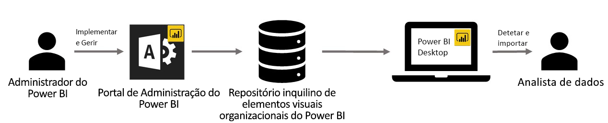

# Elementos visuais organizacionais no Power BI

Pode utilizar elementos visuais do Power BI no Power BI para criar um tipo de elemento visual único adaptado a si. Os elementos visuais do Power BI são criados pelos programadores e, muitas vezes, são criados quando os diversos elementos visuais que estão incluídos no Power BI não satisfazem as necessidades dos mesmos.

Em algumas organizações, os elementos visuais do Power BI são ainda mais importantes – podem ser precisos para transmitir dados específicos ou informações exclusivas para a organização, podem ter requisitos especiais de dados ou podem realçar métodos de negócio privados. Essas organizações precisam de desenvolver elementos visuais do Power BI, de os partilhar com toda a organização e de garantir que são mantidos em bom estado. Os elementos visuais do Power BI permitem às organizações fazer isso mesmo.

A seguinte imagem mostra o processo pelo qual os elementos visuais no Power BI são transmitidos do administrador, passando pelo desenvolvimento e manutenção, até chegarem ao analista de dados.

Os elementos visuais da organização são implementados e geridos pelo administrador do Power BI no Portal de administração. Depois de implementados no repositório organizacional, os utilizadores na organização podem facilmente descobri-los e importar os elementos visuais do Power BI organizacionais para os relatórios diretamente a partir do Power BI Desktop.

Para saber mais sobre como utilizar os elementos visuais do Power BI da organização nos relatórios que criou, veja o artigo: [Saber mais sobre como importar elementos visuais da organização para os seus relatórios](power-bi-custom-visuals.md).

## Administrar os elementos visuais organizacionais do Power BI

Para saber mais sobre como administrar, implementar e gerir os elementos visuais organizacionais do Power BI na sua organização, veja o artigo: [Saiba mais sobre como implementar e gerir elementos visuais organizacionais do Power BI](../../admin/organizational-visuals.md).

> [!WARNING]
> Um elemento visual do Power BI instalado a partir de um ficheiro pode conter código com riscos de privacidade ou segurança. Garanta que confia no autor e na origem do ficheiro visual do Power BI antes de o implementar no repositório da organização.

## Considerações e limitações

Existem várias considerações e limitações que deve ter em consideração.

Administrador:

* Se um elemento visual do Power BI no AppSource ou num ficheiro for eliminado do repositório, todos os relatórios existentes que utilizem o elemento visual eliminado deixarão de ser compostos. A eliminação do repositório é irreversível. Para desativar temporariamente um elemento visual do Power BI no AppSource ou num ficheiro, utilize a funcionalidade “Desativar”.

* Os elementos visuais organizacionais do Power BI não são suportados no servidor de relatórios do Power BI.

Utilizador final:

* Os elementos visuais organizacionais do Power BI são os elementos visuais privados importados do repositório da organização. À semelhança de qualquer elemento visual privado, não podem ser [exportados para o PowerPoint](../../consumer/end-user-powerpoint.md) nem apresentados nos e-mails recebidos quando um utilizador [subscreve páginas de relatórios](../../consumer/end-user-subscribe.md). Apenas os [elementos visuais certificados do Power BI](power-bi-custom-visuals-certified.md) importados diretamente do Marketplace suportam estas funcionalidades.

* Os elementos visuais do Visio, do PowerApps, do Mapbox e do GlobeMap do marketplace do AppSource não são compostos se forem implementados através do repositório da organização.

## Resolução de Problemas

Para obter mais informações sobre as resoluções de problemas, veja [Resolver problemas com os elementos visuais do Power BI](power-bi-custom-visuals-troubleshoot.md).

## PERGUNTAS FREQUENTES

Para obter mais informações e respostas a perguntas, aceda às [Perguntas frequentes sobre os elementos visuais do Power BI](power-bi-custom-visuals-faq.md#organizational-power-bi-visuals).

Mais perguntas? [Experimente a Comunidade do Power BI](https://community.powerbi.com/).