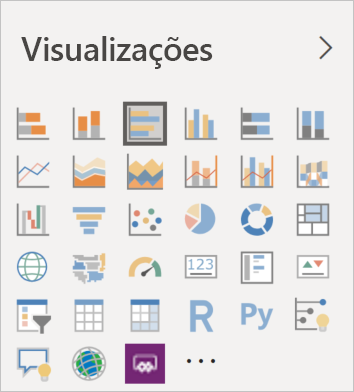

# Visuals in Power BI (Elementos visuais no Power BI)

O Power BI inclui muitos elementos visuais do Power BI prontos a utilizar. Estes elementos visuais estão disponíveis no painel Visualização do [Power BI Desktop](https://powerbi.microsoft.com/desktop/) e [serviço Power BI](https://app.powerbi.com) e podem ser utilizados para criar e editar conteúdos do Power BI.

Estão disponíveis muitos mais elementos visuais do Power BI no Microsoft [AppSource](https://nam06.safelinks.protection.outlook.com/?url=https%3A%2F%2Fappsource.microsoft.com%2Fen-us%2Fmarketplace%2Fapps%3Fpage%3D1%26product%3Dpower-bi-visuals&data=02%7C01%7CKesem.Sharabi%40microsoft.com%7C6d9286afacb3468d4cde08d740b76694%7C72f988bf86f141af91ab2d7cd011db47%7C1%7C0%7C637049028749147718&sdata=igWm0e1vXdgGcbyvngQBrHQVAkahPnxPC1ZhUPntGI8%3D&reserved=0) ou através do Power BI. Estes elementos visuais são criados pela Microsoft e por parceiros da Microsoft e são testados e validados pela equipa de validação do AppSource.

Também pode desenvolver o seu próprio elemento visual do Power BI, para ser utilizado por si, pela sua organização ou por toda a comunidade do Power BI.

## Elementos visuais predefinidos do Power BI

Estes são elementos visuais do Power BI prontos a utilizar disponíveis no painel Visualização no *Power BI Desktop* e *Serviço Power BI*.

Para remover um elemento visual do Power BI do painel Visualização, clique com o botão direito do rato e selecione **Remover**.

Para restaurar os elementos visuais predefinidos do Power BI no painel Visualização, clique em **Importar um elemento visual** e selecione **Restaurar elementos visuais predefinidos**. 

## Elementos visuais do Power BI no AppSource

Os membros da comunidade e a Microsoft contribuíram com elementos visuais do Power BI para o benefício do público geral e publicaram-nos no [AppSource](https://appsource.microsoft.com/marketplace/apps?product=power-bi-visuals). Pode transferir estes elementos visuais e adicioná-los aos seus relatórios do Power BI. A Microsoft testou e aprovou estes elementos visuais do Power BI ao nível da funcionalidade e da qualidade.

### O que é o AppSource?

O [AppSource](https://appsource.microsoft.com/marketplace/apps?product=power-bi-visuals) é o local onde se encontram as aplicações, os suplementos e as extensões para o seu software da Microsoft. O AppSource liga milhões de utilizadores de produtos como o Microsoft 365, Azure, Dynamics 365, Cortana e Power BI a soluções que os ajudam a trabalhar com mais eficácia e mais informações do que nunca.

### Elementos visuais do Power BI certificados

Os elementos visuais do Power BI certificados são os elementos visuais do [AppSource](https://nam06.safelinks.protection.outlook.com/?url=https%3A%2F%2Fappsource.microsoft.com%2Fen-us%2Fmarketplace%2Fapps%3Fpage%3D1%26product%3Dpower-bi-visuals&data=02%7C01%7CKesem.Sharabi%40microsoft.com%7C6d9286afacb3468d4cde08d740b76694%7C72f988bf86f141af91ab2d7cd011db47%7C1%7C0%7C637049028749147718&sdata=igWm0e1vXdgGcbyvngQBrHQVAkahPnxPC1ZhUPntGI8%3D&reserved=0) que cumprem determinados requisitos de código especificados que foram testados e aprovados pela equipa do Microsoft Power BI. Os testes são concebidos para verificar que o elemento visual não acede a recursos ou serviços externos.

Para ver a lista de elementos visuais do Power BI certificados ou para submeter os seus próprios, veja [Elementos visuais do Power BI certificados](power-bi-custom-visuals-certified.md).

### Exemplos de elementos visuais do Power BI

Cada elemento visual do Power BI no AppSource tem dados de exemplo que ilustram como o elemento visual funciona. Para transferir o exemplo, no [AppSource](https://nam06.safelinks.protection.outlook.com/?url=https%3A%2F%2Fappsource.microsoft.com%2Fen-us%2Fmarketplace%2Fapps%3Fpage%3D1%26product%3Dpower-bi-visuals&data=02%7C01%7CKesem.Sharabi%40microsoft.com%7C6d9286afacb3468d4cde08d740b76694%7C72f988bf86f141af91ab2d7cd011db47%7C1%7C0%7C637049028749147718&sdata=igWm0e1vXdgGcbyvngQBrHQVAkahPnxPC1ZhUPntGI8%3D&reserved=0), selecione um elemento visual do Power BI e na secção *Experimente uma amostra*, clique na ligação **relatório de exemplo**.

## Arquivo organizacional

Os administradores do Power BI aprovam e implementam elementos visuais do Power BI na sua organização. Permite que os autores de relatórios descubram, atualizem e utilizem facilmente estes elementos visuais do Power BI. Os administradores podem gerir facilmente estes elementos visuais com ações como atualizar versões, desativar e ativar elementos visuais do Power BI.

Para aceder ao arquivo organizacional, no painel *Visualização*, clique em **Importar um elemento visual personalizado**, selecione **Importar do marketplace** e na parte superior da janela *Elementos visuais do Power BI*, selecione o separador **A minha organização**.

[Leia mais sobre os elementos visuais organizacionais](power-bi-custom-visuals-organization.md).

## Ficheiros de elementos visuais

Os elementos visuais do Power BI são pacotes que incluem código para compor os dados que lhes são enviados. Qualquer pessoa pode criar um elemento visual personalizado e criar um pacote do mesmo como um ficheiro `.pbiviz` único, que depois pode ser importado para um relatório do Power BI.

Para importar um elemento visual do Power BI, no painel *Visualização*, clique em **Importar um elemento visual personalizado** e selecione **Importar do ficheiro**.

Se for programador Web e estiver interessado em criar o seu próprio elemento visual e adicioná-lo ao AppSource, pode saber como [desenvolver um elemento visual do Power BI](custom-visual-develop-tutorial.md) e [publicar um elemento visual do Power BI no AppSource](office-store.md).

> [!WARNING]
> Um elemento visual do Power BI pode conter código com riscos de privacidade ou segurança. Certifique-se de que confia no autor e na origem do elemento visual do Power BI antes de o importar para o seu relatório.

## Próximos passos

* Se for programador, comece com o tutorial [Desenvolver um elemento visual do Power BI](custom-visual-develop-tutorial.md).

* Saiba como um [projeto de elementos visuais do Power BI é estruturado](visual-project-structure.md).

* Explore [diretrizes de elementos visuais do Power BI](guidelines-powerbi-visuals.md).

Mais perguntas? Visite a página [Perguntas frequentes sobre os elementos visuais do Power BI](power-bi-custom-visuals-faq.md) ou a [Comunidade do Power BI](https://community.powerbi.com/).