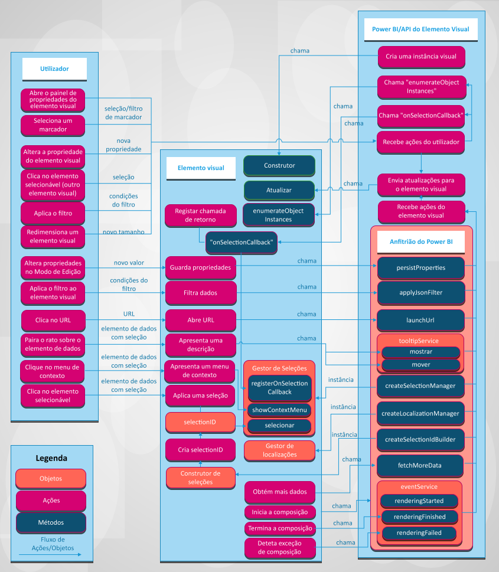

# Visuals in Power BI (Elementos visuais no Power BI)

O artigo descreve como os elementos visuais se integram com o Power BI e como um utilizador pode interagir com um elemento visual no Power BI. 

A figura a seguir ilustra como as ações comuns baseadas em elementos visuais realizadas por um utilizador, como selecionar um marcador, são processadas no Power BI.

## Os elementos visuais recebem atualizações do Power BI

Um elemento visual chama um método `update` para obter atualizações do Power BI. O método `update` contém normalmente a lógica principal do elemento visual e é responsável pela composição do gráfico ou pela visualização dos dados.

As atualizações são ativadas quando o elemento visual chama o método `update`.

## Padrões de ações e atualizações

As ações e as atualizações subsequentes nos elementos visuais do Power BI ocorrem num destes três padrões:

* O utilizador interage com um elemento visual através do Power BI.
* O utilizador interage diretamente com o elemento visual.
* O elemento visual interage com o Power BI.

### O utilizador interage com um elemento visual através do Power BI

* O utilizador abre o painel de propriedades do elemento visual.

    Quando um utilizador abre o painel de propriedades do elemento visual, o Power BI obtém os objetos e as propriedades suportados do ficheiro *capabilities.json* do elemento visual. Para receber os valores reais das propriedades, o Power BI chama o método `enumerateObjectInstances` do elemento visual. O elemento visual devolve os valores reais das propriedades.

    Para obter mais informações, veja [Capacidades e propriedades dos elementos visuais do Power BI](capabilities.md).

* O utilizador [altera uma propriedade do elemento visual](../../visuals/power-bi-visualization-customize-title-background-and-legend.md) no painel formatar.

    Quando um utilizador altera o valor de uma propriedade no painel formatar, o Power BI chama o método `update` do elemento visual. O Power BI passa o novo objeto `options` ao método `update`. Os objetos contêm os novos valores.

    Para obter mais informações, veja [Objetos e propriedades dos elementos visuais do Power BI](objects-properties.md).

* O utilizador redimensiona o elemento visual.

    Quando um utilizador altera o tamanho do elemento visual, o Power BI chama o método `update` com o novo objeto `options`. Os objetos `options` possuem objetos `viewport` aninhados que contêm a nova largura e altura do elemento visual.

* O utilizador aplica um filtro ao nível do elemento visual, da página ou do relatório.

    O Power BI filtra os dados com base nas condições do filtro. O Power BI chama o método `update` do elemento visual para atualizar o elemento visual com os novos dados.

    O elemento visual obtém uma nova atualização dos objetos `options` quando existem novos dados num dos objetos aninhados. A forma como a atualização ocorre depende da configuração do mapeamento da vista de dados do elemento visual.

    Para obter mais informações, veja [Compreender o mapeamento de vista de dados em elementos visuais do Power BI](dataview-mappings.md).

* O utilizador seleciona um ponto de dados noutro elemento visual no relatório.

    Quando um utilizador seleciona um ponto de dados noutro elemento visual do relatório, o Power BI filtra ou realça os pontos de dados selecionados e chama o método `update` do elemento visual. O elemento visual recebe os novos dados filtrados ou obtém os mesmos dados com a matriz dos destaques.

    Para obter mais informações, veja [Realçar pontos de dados em elementos visuais do Power BI](highlight.md).

* O utilizador seleciona um marcador no painel de marcadores do relatório.

    Quando um utilizador seleciona um marcador no painel de marcadores do relatório, pode ocorrer uma de duas ações:

    * O Power BI chama uma função que é passada e registada pelo método `registerOnSelectionCallback`. A função de chamada de retorno obtém as matrizes das seleções do marcador correspondente.

    * O Power BI chama o método `update` com um objeto `filter` correspondente dentro do objeto `options`.

    Em qualquer um dos casos, o elemento visual deve mudar o estado de acordo com as seleções recebidas ou o objeto `filter`.

    Para obter mais informações sobre os marcadores e os filtros, veja [API de Filtros de Elementos Visuais em elementos visuais do Power BI](filter-api.md).

### O utilizador interage diretamente com o elemento visual

* O utilizador paira o rato sobre um elemento de dados.

    Um elemento visual pode apresentar mais informações sobre o ponto de dados através da API de Descrições do Power BI. Quando um utilizador paira o rato sobre um elemento visual, o elemento visual pode lidar com o evento e apresentar dados sobre o elemento de descrição associado. O elemento visual pode apresentar uma descrição padrão ou uma descrição de página de relatório.

    Para obter mais informações, veja [Descrições nos elementos visuais do Power BI](add-tooltips.md).

* O utilizador altera as propriedades do elemento visual. (por exemplo, o utilizador expande a árvore e o elemento visual guarda o estado nas propriedades do elemento visual.)

    Um elemento visual consegue guardar os valores das propriedades através da API do Power BI. Por exemplo, quando um utilizador interage com o elemento visual e o elemento visual precisa de guardar ou atualizar os valores das propriedades, o elemento visual poderá chamar o método `presistProperties`.

* O utilizador seleciona um URL.

    Por predefinição, um elemento visual não pode abrir um URL diretamente. Em alternativa, para abrir um URL num novo separador, o elemento visual pode chamar o método `launchUrl` e passar o URL como parâmetro.

    Para obter mais informações, veja [Criar um URL de iniciação](launch-url.md).

* O utilizador aplica um filtro através do elemento visual.

    Um elemento visual pode chamar o método `applyJsonFilter` e passar as condições para filtrar quanto a dados noutros elementos visuais. Estão disponíveis vários tipos de filtros, incluindo filtros Básicos, Avançados e Cadeia de Identificação.

    Para obter mais informações, veja [API de Filtros de Elementos Visuais em elementos visuais do Power BI](filter-api.md).

* O utilizador seleciona elementos no elemento visual.

    Para obter mais informações sobre as seleções num elemento visual do Power BI, veja [Adicionar interatividade através das seleções de elementos visuais do Power BI](selection-api.md).

### O elemento visual interage com o Power BI

* Um elemento visual pede mais dados do Power BI.

    Um elemento visual processa dados por partes. O método da API `fetchMoreData` pede o próximo fragmento de dados no conjunto de dados.

    Para obter mais informações, veja [Obter mais dados do Power BI](fetch-more-data.md).

* O serviço de eventos é acionado.

    O Power BI consegue exportar um relatório para PDF ou enviar um relatório por e-mail (aplica-se apenas a elementos visuais certificados). Para notificar o Power BI de que a composição está concluída e de que o elemento visual está pronto para ser capturado como PDF ou e-mail, o elemento visual deve chamar a API de Eventos de Composição.

    Para obter mais informações, veja [Exportar relatórios do Power BI para PDF](../../consumer/end-user-pdf.md).

    Para saber mais sobre o serviço de eventos, veja [Eventos de composição nos elementos visuais do Power BI](event-service.md).

## Próximos passos

Está interessado em criar as suas próprias visualizações e adicioná-las ao Microsoft AppSource? Veja estes artigos:

* [Desenvolver um elemento visual do Power BI](./custom-visual-develop-tutorial.md)
* [Publicar elementos visuais do Power BI no Centro de Parceiros](office-store.md)
