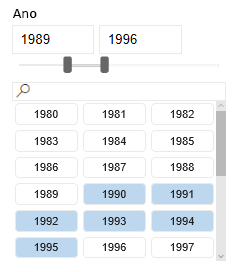
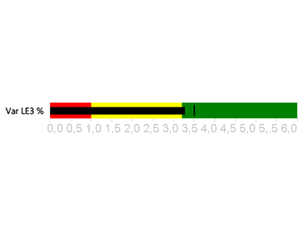
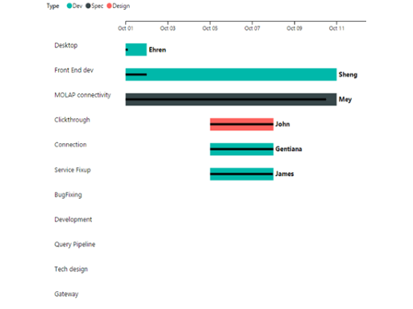
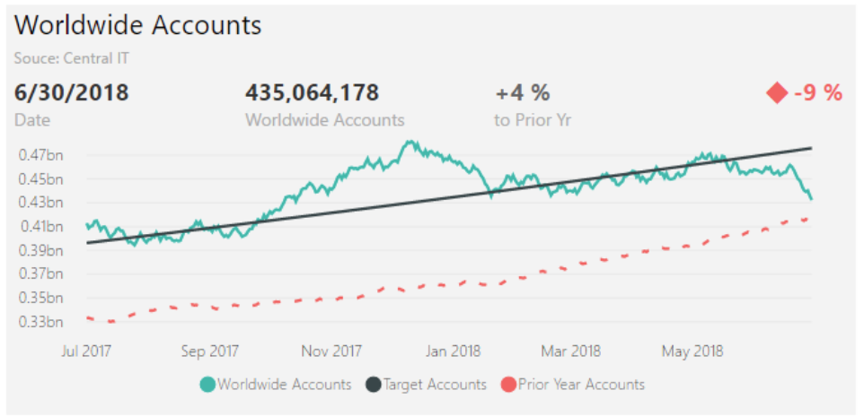
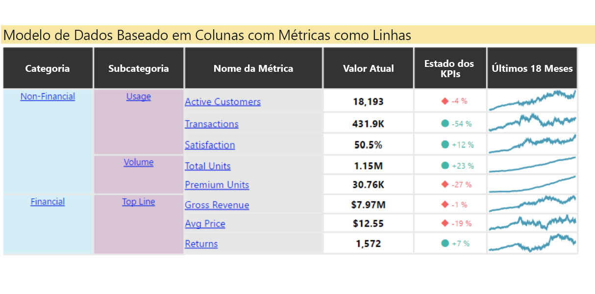
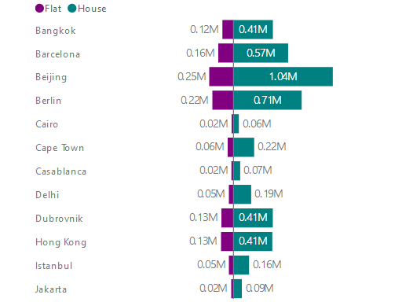
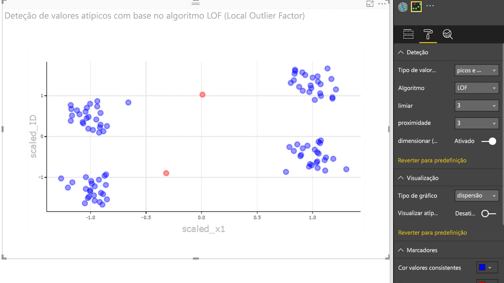

# Exemplos de elementos visuais do Power BI

Pode transferir, utilizar e modificar estes elementos visuais do Power BI a partir do GitHub. Estes exemplos ilustram como lidar com situações comuns ao programar com o Power BI.

## Segmentações

Uma segmentação de dados restringe a parte dos dados apresentada noutras visualizações num relatório. A segmentação de dados é uma de várias formas de filtrar dados no Power BI.

|   |  | |
| ------------- | ------------- | -------------|
| [Segmentação de Teclas](https://github.com/Microsoft/powerbi-visuals-chicletslicer/)   Apresente botões de imagens ou de texto que funcionam como um filtro na tela noutros elementos visuais | [Segmentação de linha cronológica](https://github.com/Microsoft/powerbi-visuals-timeline/)  Seletor de intervalo de datas de gráfico que filtra por data | [Exemplo de segmentação de dados](https://github.com/Microsoft/powerbi-visuals-sampleslicer/)  Demonstra a utilização da API de Filtragem Avançada

## Gráficos

Inspire-se na nossa galeria, incluindo gráficos de barras, gráficos circulares, Balão de Palavras e outros.

|   |  | |
| ------------- | ------------- | -------------|
| [Gráfico Aster](https://github.com/Microsoft/powerbi-visuals-asterplot/)   Uma variante de um gráfico de anel padrão, que utiliza um segundo valor para gerar o ângulo de abertura | [Gráfico de marcadores ](https://github.com/Microsoft/powerbi-visuals-bulletchart/)  Um gráfico de barras com elementos visuais extra para proporcionar contexto útil para fins de controlo | [Cordas](https://github.com/Microsoft/powerbi-visuals-chord/)  Um método gráfico que apresenta as relações entre os dados numa matriz
|  | |  
| [Gráfico de pontos](https://github.com/Microsoft/powerbi-visuals-dotplot/)  Mostra a distribuição de frequências de uma forma visualmente apelativa | [Dual KPI](https://github.com/Microsoft/powerbi-visuals-dualkpi/)  Efficiently visualizes two measures over time, showing their trend on a joint timeline | [Gráfico de Dispersão Avançada](https://github.com/Microsoft/powerbi-visuals-enhancedscatter/)  Melhorias no gráfico de dispersão existente
| | | 
| [Gráfico de Força](https://github.com/Microsoft/powerbi-visuals-forcegraph/)  Diagrama de esquema de forças com um caminho curvo, o que é útil para mostrar ligações entre as entidades | [Gantt](https://github.com/Microsoft/powerbi-visuals-gantt/)  Um gráfico de barras que ilustra uma linha cronológica do projeto ou um agendamento com recursos | [Mapa de Calor de Tabela](https://github.com/Microsoft/powerbi-visuals-heatmap/)  Compare dados fácil e intuitivamente, com recurso a cores numa tabela
|  |  |  
| [Gráfico de histograma](https://github.com/Microsoft/powerbi-visuals-histogram/)  Visualizes the distribution of data over a continuous interval or certain time period | [Gráfico de Linhas e Pontos](https://github.com/Microsoft/powerbi-visuals-linedotchart/)  Um gráfico de linhas animado com pontos animados, que promovem o envolvimento do público com os dados | [Gráfico Mekko](https://github.com/Microsoft/powerbi-visuals-mekkochart/)  Uma mistura de gráfico de colunas 100% empilhadas e de gráfico de barras 100% empilhadas combinados numa única vista
|  |  |  
| [Multi KPI](https://github.com/microsoft/PowerBI-visuals-MultiKPI/)   Uma visualização Multi KPI avançada com um KPI chave, juntamente com múltiplos gráficos sparkline de dados de suporte | [Power KPI](https://github.com/microsoft/PowerBI-visuals-PowerKPI/)  Um Indicador KPI avançado com etiquetas e gráfico multilinhas para as variações, valores e datas atuais | [Matriz do Power KPI](https://github.com/microsoft/PowerBI-visuals-PowerKPIMatrix/)  Monitorize tabelas de indicadores equilibradas e um número ilimitado de métricas e KPIs numa lista compacta e fácil de ler
| |  |  
| [Gráfico de Pontos Temporais](https://github.com/Microsoft/powerbi-visuals-pulsechart/)  Este gráfico de linhas anotado com eventos-chave é perfeito para narrativas com dados| [Gráfico de radar](https://github.com/Microsoft/powerbi-visuals-radarchart/)  Apresenta várias medidas desenhadas sobre um eixo de categorias, útil para comparar atributos | [Gráfico Sankey](https://github.com/Microsoft/powerbi-visuals-sankey/)  Diagrama de fluxo em que a largura da série é proporcional à quantidade do fluxo
|  | | 
| [Gráfico de fluxo](https://github.com/Microsoft/powerbi-visuals-streamgraph/)  Um gráfico de áreas empilhadas com interpolação suave, que frequentemente serve para apresentar os valores ao longo do tempo | [Gráfico circular de vários níveis](https://github.com/Microsoft/powerbi-visuals-sunburst/)  Gráfico de anel de vários níveis para visualizar dados hierárquicos| [Gráfico de tornado](https://github.com/Microsoft/powerbi-visuals-tornado/)  Compare a importância relativa das variáveis entre dois grupos
 | 
 | [Nuvem de Palavras](https://github.com/Microsoft/powerbi-visuals-wordcloud/)  Create a fun visual from frequent text in your data

## WebGL

O WebGL permite que o conteúdo Web utilize uma API baseada no OpenGL ES 2.0 para a composição 2D e 3D numa tela HTML.

| |
| ------------- |
| [Mapa de Globo](https://github.com/Microsoft/powerbi-visuals-globemap/)  Desenhe localizações num mapa 3D interativo

## Visuais R

Estes exemplos demonstram como pode aproveitar o poder analítico e visual dos elementos visuais R e dos scripts R.

| | | |
|------------- |------------- |------------- |------------- |
| [Regras de associação](https://github.com/Microsoft/powerbi-visuals-assorules/)  Descubra relações entre dados, aparentemente, não relacionados com instruções “if-then” | [Clustering](https://github.com/Microsoft/powerbi-visuals-clustering-kmeans/)  Localize grupos semelhantes nos dados com o algoritmo k-means | [Clustering com valores atípicos](https://github.com/microsoft/PowerBI-visuals-dbscan/)  Localize grupos semelhantes e valores atípicos nos dados
|  |  |  
| [Desenho de correlação](https://github.com/Microsoft/powerbi-visuals-corrplot/)  Realça as variáveis mais correlacionadas numa tabela de dados | [Gráfico de árvore de decisões](https://github.com/Microsoft/powerbi-visuals-decision-tree/)  Diagrama esquemático em forma de árvore para determinar a probabilidade estatística com criação de partições recursivas | [Previsões TBATS](https://github.com/Microsoft/powerbi-visuals-forcasting-tbats/)  Previsão de séries temporais para séries que têm várias sazonalidades com o modelo TBATS
|  |  |  
| [Previsão com ARIMA](https://github.com/Microsoft/powerbi-visuals-forcastingarima/)  Preveja valores futuros com base em dados históricos com a Média Móvel Integrada de Regressão Automática (ARIMA) | [Gráfico de funil](https://github.com/Microsoft/powerbi-visuals-funnel/)  Localize valores atípicos nos dados, com um gráfico de funil | [Deteção de valores atípicos](https://github.com/Microsoft/powerbi-visuals-outliers-det/)  Localize valores atípicos nos dados com o método e gráfico adequado
|  |  | 
| [Gráfico de curva polinomial](https://github.com/Microsoft/powerbi-visuals-spline/)  Visualize e compreenda dados irrelevantes | [Gráfico de decomposição de série temporal](https://github.com/Microsoft/powerbi-visuals-timeseriesdecomposition/)  Compreenda os componentes da série temporal com a “decomposição de Tendência e Sazonal com Loess" | [Gráfico de séries temporal e previsão](https://github.com/Microsoft/powerbi-visuals-forcasting-exp/)  Using exponential smoothing model to predict future values based on previously observed values

## Próximos passos

Para começar a criar elementos visuais do Power BI, veja [Programar um elemento visual do cartão circular do Power BI](develop-circle-card.md).
