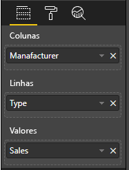

# <a name="add-interactivity-into-visual-by-power-bi-visuals-selections"></a>Adicionar interatividade ao elemento visual através das seleções de elementos visuais do Power BI

O Power BI fornece duas formas de interação entre os elementos visuais – seleção e filtragem. A amostra abaixo demonstra como selecionar qualquer item num elemento visual e como notificar outros elementos visuais no relatório sobre o novo estado de seleção.

O objeto `Selection` corresponde à interface:

```typescript
export interface ISelectionId {
    equals(other: ISelectionId): boolean;
    includes(other: ISelectionId, ignoreHighlight?: boolean): boolean;
    getKey(): string;
    getSelector(): Selector;
    getSelectorsByColumn(): SelectorsByColumn;
    hasIdentity(): boolean;
}
```

## <a name="how-to-use-selectionmanager-to-select-data-points"></a>Como utilizar o SelectionManager para selecionar pontos de dados

O objeto do anfitrião do elemento visual fornece o método para a criação de uma instância do gestor de seleções. O gestor de seleções é responsável por selecionar, limpar a seleção, mostrar o menu de contexto, armazenar as seleções atuais e verificar o estado das seleções. Além disso, o gestor de seleções tem métodos correspondentes para essas ações.

### <a name="create-an-instance-of-the-selection-manager"></a>Criar uma instância do gestor de seleções

Para utilizar o gestor de seleções, precisa de criar a instância do gestor de seleções. Normalmente, os elementos visuais criam uma instância do gestor de seleções no `constructor` do objeto do elemento visual.

```typescript
export class Visual implements IVisual {
    private target: HTMLElement;
    private host: IVisualHost;
    private selectionManager: ISelectionManager;
    // ...
    constructor(options: VisualConstructorOptions) {
        this.host = options.host;
        // ...
        this.selectionManager = this.host.createSelectionManager();
    }
    // ...
}
```

### <a name="create-an-instance-of-the-selection-builder"></a>Criar uma instância do construtor de seleções

Quando a instância do gestor de seleções estiver criada, terá de criar `selections` para cada ponto de dados do elemento visual. O objeto do anfitrião do elemento visual fornece o método `createSelectionIdBuilder` para gerar a seleção para cada ponto de dados. Este método devolve a instância do objeto com `powerbi.visuals.ISelectionIdBuilder` da interface:

```typescript
export interface ISelectionIdBuilder {
    withCategory(categoryColumn: DataViewCategoryColumn, index: number): this;
    withSeries(seriesColumn: DataViewValueColumns, valueColumn: DataViewValueColumn | DataViewValueColumnGroup): this;
    withMeasure(measureId: string): this;
    withMatrixNode(matrixNode: DataViewMatrixNode, levels: DataViewHierarchyLevel[]): this;
    withTable(table: DataViewTable, rowIndex: number): this;
    createSelectionId(): ISelectionId;
}
```

Este objeto tem métodos correspondentes para criar `selections` para diferentes tipos de mapeamentos de vista de dados.

> [!NOTE]
> Os métodos `withTable` e `withMatrixNode` foram introduzidos na API 2.5.0 dos elementos visuais do Power BI.
> Se precisar de utilizar seleções para mapeamentos de vista de dados em matrizes ou tabelas, terá de atualizar a versão da API para a 2.5.0 ou superior.

### <a name="create-selections-for-categorical-data-view-mapping"></a>Criar seleções para mapeamento de vista de dados categóricos

Vamos rever como é que as seleções são representadas no mapeamento de vista de dados categóricos para um conjunto de dados de exemplo:

| Fabricante | Tipo | Valor |
| - | - | - |
| Chrysler | Carro Nacional | 28883 |
| Chrysler | Camião Nacional | 117131 |
| Chrysler | Carro Importado | 0 |
| Chrysler | Camião Importado | 6362 |
| Ford | Carro Nacional | 50032 |
| Ford | Camião Nacional | 122446 |
| Ford | Carro Importado | 0 |
| Ford | Camião Importado | 0 |
| GM | Carro Nacional | 65426 |
| GM | Camião Nacional | 138122 |
| GM | Carro Importado | 197 |
| GM | Camião Importado | 0 |
| Honda | Carro Nacional | 51450 |
| Honda | Camião Nacional | 46115 |
| Honda | Carro Importado | 2932 |
| Honda | Camião Importado | 0 |
| Nissan | Carro Nacional | 51476 |
| Nissan | Camião Nacional | 47343 |
| Nissan | Carro Importado | 5485 |
| Nissan | Camião Importado | 1430 |
| Toyota | Carro Nacional | 55643 |
| Toyota | Camião Nacional | 61227 |
| Toyota | Carro Importado | 20799 |
| Toyota | Camião Importado | 23614 |

O elemento visual utiliza o seguinte mapeamento de vista de dados:

```json
{
    "dataRoles": [
        {
            "displayName": "Columns",
            "name": "columns",
            "kind": "Grouping"
        },
        {
            "displayName": "Rows",
            "name": "rows",
            "kind": "Grouping"
        },
        {
            "displayName": "Values",
            "name": "values",
            "kind": "Measure"
        }
    ],
    "dataViewMappings": [
        {
            "categorical": {
                "categories": {
                    "for": {
                        "in": "columns"
                    }
                },
                "values": {
                    "group": {
                        "by": "rows",
                        "select": [
                            {
                                "for": {
                                    "in": "values"
                                }
                            }
                        ]
                    }
                }
            }
        }
    ]
}
```

Na amostra, `Manufacturer` é `columns` e `Type` é `rows`. Existe uma série criada ao agrupar os valores por `rows` (`Type`).

O elemento visual também deverá ser capaz de segmentar os dados por `Manufacturer` e `Type`.

Por exemplo, quando o utilizador seleciona `Chrysler` por `Manufacturer`, os outros elementos visuais devem mostrar os seguintes dados:

| Fabricante | Tipo | Valor |
| - | - | - |
| **Chrysler** | Carro Nacional | 28883 |
| **Chrysler** | Camião Nacional | 117131 |
| **Chrysler** | Carro Importado | 0 |
| **Chrysler** | Camião Importado | 6362 |

Quando o utilizador seleciona `Import Car` por `Type` (seleciona os dados por série), os outros elementos visuais devem mostrar os seguintes dados:

| Fabricante | Tipo | Valor |
| - | - | - |
| Chrysler | **Carro Importado** | 0 |
| Ford | **Carro Importado** | 0 |
| GM | **Carro Importado** | 197 |
| Honda | **Carro Importado** | 2932 |
| Nissan | **Carro Importado** | 5485 |
| Toyota | **Carro Importado** | 20799 |


É necessário preencher os registos dos dados dos elementos visuais.



Há `Manufacturer` como categoria (colunas), `Type` como série (linhas) e `Value` como `Values` para a série.

> [!NOTE]
> Os `Values` são necessários para a série, porque a vista dos dados correspondentes a mapear o elemento visual espera que os `Values` sejam agrupados pelos dados das `Rows`.

#### <a name="create-selections-for-categories"></a>Criar seleções para categorias

```typescript
// categories
const categories = dataView.categorical.categories;

// create label for 'Manufacturer' column
const p = document.createElement("p") as HTMLParagraphElement;
p.innerText = categories[0].source.displayName.toString();
this.target.appendChild(p);

// get count of category elements
const categoriesCount = categories[0].values.length;

// iterate all categories to generate selection and create button elements to use selections
for (let categoryIndex = 0; categoryIndex < categoriesCount; categoryIndex++) {
    const categoryValue: powerbi.PrimitiveValue = categories[0].values[categoryIndex];

    const categorySelectionId = this.host.createSelectionIdBuilder()
        .withCategory(categories[0], categoryIndex) // we have only one category (only one `Manufacturer` column)
        .createSelectionId();
    this.dataPoints.push({
        value: categoryValue,
        selection: categorySelectionId
    });
    console.log(categorySelectionId);

    // create button element to apply selection on click
    const button = document.createElement("button") as HTMLButtonElement;
    button.value = categoryValue.toString();
    button.innerText = categoryValue.toString();
    button.addEventListener("click", () => {
        // handle click event to apply correspond selection
        this.selectionManager.select(categorySelectionId);
    });
    this.target.appendChild(button);
}
```

No código de exemplo, poderá ver que iterámos todas as categorias. Em cada iteração, chamamos o `createSelectionIdBuilder` para criar a próxima seleção para cada categoria ao chamar o método `withCategory` do construtor de seleções. O método `createSelectionId` é utilizado como um método final para devolver o objeto `selection` gerado.

No método `withCategory`, transmitimos a coluna da `category`, no exemplo o `Manufacturer` e índice do elemento da categoria.

#### <a name="create-selections-for-series"></a>Criar seleções para séries

```typescript
// get groupped values for series
const series: powerbi.DataViewValueColumnGroup[] = dataView.categorical.values.grouped();

// create label for 'Type' column
const p2 = document.createElement("p") as HTMLParagraphElement;
p2.innerText = dataView.categorical.values.source.displayName;
this.target.appendChild(p2);

// iterate all series to generate selection and create button elements to use selections
series.forEach( (ser: powerbi.DataViewValueColumnGroup) => {
    // create selection id for series
    const seriesSelectionId = this.host.createSelectionIdBuilder()
        .withSeries(dataView.categorical.values, ser)
        .createSelectionId();

    this.dataPoints.push({
        value: ser.name,
        selection: seriesSelectionId
    });

    // create button element to apply selection on click
    const button = document.createElement("button") as HTMLButtonElement;
    button.value =ser.name.toString();
    button.innerText = ser.name.toString();
    button.addEventListener("click", () => {
        // handle click event to apply correspond selection
        this.selectionManager.select(seriesSelectionId);
    });
    this.target.appendChild(button);
});
```

### <a name="create-selections-for-table-data-view-mapping"></a>Criar seleções para o mapeamento da vista de dados da tabela

Amostra de mapeamento de vistas de dados da tabela

```json
{
    "dataRoles": [
        {
            "displayName": "Values",
            "name": "values",
            "kind": "GroupingOrMeasure"
        }
    ],
    "dataViewMappings": [
        {
            "table": {
                "rows": {
                    "for": {
                        "in": "values"
                    }
                }
            }
        }
    ]
}
```

Para criar uma seleção para cada fila do mapeamento de vistas de dados da tabela, precisa de chamar o método `withTable` do construtor de seleções.

```typescript
public update(options: VisualUpdateOptions) {
    const dataView = options.dataViews[0];
    dataView.table.rows.forEach((row: DataViewTableRow, rowIndex: number) => {
        this.target.appendChild(rowDiv);
        const selection: ISelectionId = this.host.createSelectionIdBuilder()
            .withTable(dataView.table, rowIndex)
            .createSelectionId();
    }
}
```

O código do elemento visual itera as linhas da tabela e cada linha chama o método de tabela `withTable`. Os parâmetros do método `withTable` são o objeto `table` e o índice da linha da tabela.

### <a name="create-selections-for-matrix-data-view-mapping"></a>Criar seleções para o mapeamento da vista de dados da matriz

```typescript
public update(options: VisualUpdateOptions) {
    const host = this.host;
    const rowLevels: powerbi.DataViewHierarchyLevel[] = dataView.matrix.rows.levels;
    const columnLevels: powerbi.DataViewHierarchyLevel[] = dataView.matrix.rows.levels;

    // iterate rows hierarchy
    nodeWalker(dataView.matrix.rows.root, rowLevels);
    // iterate columns hierarchy
    nodeWalker(dataView.matrix.columns.root, columnLevels);

    function nodeWalker(node: powerbi.DataViewMatrixNode, levels: powerbi.DataViewHierarchyLevel[]) {
        const nodeSelection = host.createSelectionIdBuilder().withMatrixNode(node, levels);

        if (node.children && node.children.length) {
            node.children.forEach(child => {
                nodeWalker(child, levels);
            });
        }
    }
}
```

No exemplo, `nodeWalker` chama de forma recursiva cada nó e nós subordinados.

`nodeWalker` cria o objeto `nodeSelection` em cada chamada. E cada `nodeSelection` representa a `selection` dos nós correspondentes.

## <a name="select-datapoints-to-slice-other-visuals"></a>Selecionar pontos de dados para segmentar outros elementos visuais

Nos códigos de exemplo de seleções para o mapeamento da vista de dados categóricos, viu que criámos um processador de clique para os elementos de botão. O processador chama o método `select` do gestor de seleções e transmite o objeto de seleção.

```typescript
button.addEventListener("click", () => {
    // handle click event to apply correspond selection
    this.selectionManager.select(categorySelectionId);
});
```

A interface do método `select` é

```typescript
interface ISelectionManager {
    // ...
    select(selectionId: ISelectionId | ISelectionId[], multiSelect?: boolean): IPromise<ISelectionId[]>;
    // ...
}
```

Pode ver que `select` aceita a matriz de seleções, o que significa que o elemento visual pode selecionar vários pontos de dados. O segundo parâmetro `multiSelect` é responsável pela seleção múltipla. Se o valor for verdadeiro, o Power BI não limpará o estado da seleção anterior e aplicará a seleção atual. Caso contrário, a seleção anterior será reposta.

Cenário típico da utilização de `multiSelect` ao processar o estado do botão Ctrl no evento de clique.

```typescript
button.addEventListener("click", (mouseEvent) => {
    const multiSelect = (mouseEvent as MouseEvent).ctrlKey;
    this.selectionManager.select(seriesSelectionId, multiSelect);
});
```

## <a name="next-steps"></a>Próximos passos

* [Saiba como utilizar seleções para vincular as propriedades de elementos de dados a pontos de dados](objects-properties.md#objects-selector)

* [Saiba como processar seleções em mudanças de marcadores](bookmarks-support.md#visuals-with-selection)

* [Saiba como adicionar o menu de contexto para pontos de dados de elementos visuais](context-menu.md)

* [Saiba como utilizar o InteractivityUtils para adicionar seleções aos Elementos Visuais do Power BI](utils-interactivity-selections.md)
