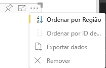

# <a name="sorting-options-for-power-bi-visuals"></a>Opções de ordenação dos elementos visuais do Power BI

Este artigo descreve como é que as opções de *ordenação* especificam o comportamento de ordenação predefinido dos elementos visuais do Power BI. 

A capacidade de ordenação requer um dos seguintes parâmetros.

## <a name="default-sorting"></a>Ordenação predefinida

A opção `default` é a forma mais simples. Permite a ordenação dos dados apresentados na secção "DataMappings". A opção permite a ordenação dos mapas de dados pelo utilizador e especifica a direção da ordenação.

```json
    "sorting": {
        "default": {   }
    }
```



## <a name="implicit-sorting"></a>Ordenação implícita

A ordenação implícita refere-se à ordenação com o parâmetro de matriz `clauses`, que descreve a ordenação para cada função de dados. `implicit` significa que o utilizador do elemento visual não pode alterar a ordem de ordenação. O Power BI não apresenta opções de ordenação no menu do elemento visual. No entanto, o Power BI classifica os dados de acordo com as definições especificadas.

Os parâmetros `clauses` podem conter vários objetos com dois parâmetros:

- `role`: determina `DataMapping` para ordenação
- `direction`: determina a direção da ordenação (1 = Ascendente, 2 = Descendente)

```json
    "sorting": {
        "implicit": {
            "clauses": [
                {
                    "role": "category",
                    "direction": 1
                },
                {
                    "role": "measure",
                    "direction": 2
                }
            ]
        }
    }
```

## <a name="custom-sorting"></a>Ordenação personalizada

A ordenação personalizada significa que a ordenação é gerida pelo programador no código do elemento visual.
