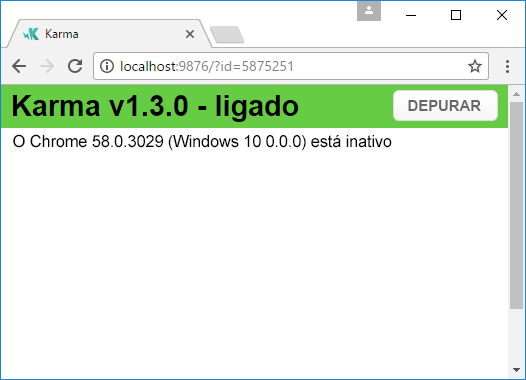
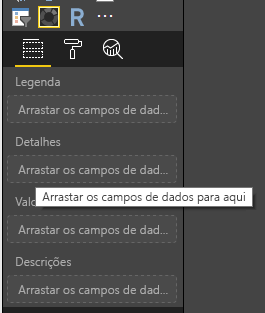
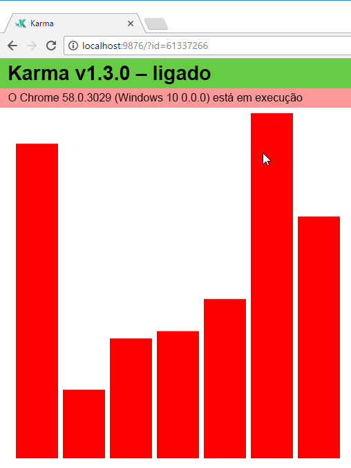
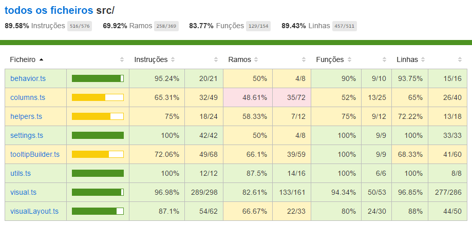

# <a name="tutorial-add-unit-tests-for-power-bi-visual-projects"></a>Tutorial: Adicionar testes de unidades para projetos de elementos visuais do Power BI

Este artigo descreve as noções básicas da escrita de testes de unidades para os elementos visuais do Power BI, incluindo como:

* Configurar a estrutura de teste da execução de testes Karma JavaScript, Jasmine.
* Utilizar o pacote powerbi-visuals-utils-testutils.
* Utilizar simulações e falsificações para ajudar a simplificar os testes de unidades para elementos visuais do Power BI.

## <a name="prerequisites"></a>Pré-requisitos

* Um projeto de elementos visuais do Power BI instalado
* Um ambiente Node.js configurado

## <a name="install-and-configure-the-karma-javascript-test-runner-and-jasmine"></a>Instalar e configurar a execução de testes Karma JavaScript e Jasmine

Adicione as bibliotecas necessárias ao ficheiro *package.json* na secção `devDependencies`:

```json
"@babel/polyfill": "^7.2.5",
"@types/d3": "5.5.0",
"@types/jasmine": "2.5.37",
"@types/jasmine-jquery": "1.5.28",
"@types/jquery": "2.0.41",
"@types/karma": "3.0.0",
"@types/lodash-es": "4.17.1",
"coveralls": "3.0.2",
"istanbul-instrumenter-loader": "^3.0.1",
"jasmine": "2.5.2",
"jasmine-core": "2.5.2",
"jasmine-jquery": "2.1.1",
"jquery": "3.1.1",
"karma": "3.1.1",
"karma-chrome-launcher": "2.2.0",
"karma-coverage": "1.1.2",
"karma-coverage-istanbul-reporter": "^2.0.4",
"karma-jasmine": "2.0.1",
"karma-junit-reporter": "^1.2.0",
"karma-sourcemap-loader": "^0.3.7",
"karma-typescript": "^3.0.13",
"karma-typescript-preprocessor": "0.4.0",
"karma-webpack": "3.0.5",
"puppeteer": "1.17.0",
"style-loader": "0.23.1",
"ts-loader": "5.3.0",
"ts-node": "7.0.1",
"tslint": "^5.12.0",
"webpack": "4.26.0"
```

Para obter mais informações sobre *package.json*, veja a descrição em [npm-package.json](https://docs.npmjs.com/files/package.json).

Guarde o ficheiro *package.json* e, na localização `package.json`, execute o seguinte comando:

```cmd
npm install
```

O gestor de pacotes instala todos os novos pacotes que são adicionados ao *package.json*.

Para executar testes de unidades, configure a execução de testes e a configuração `webpack`.

O seguinte código é um exemplo do ficheiro *test.webpack.config.js*:

```typescript
const path = require('path');
const webpack = require("webpack");

module.exports = {
    devtool: 'source-map',
    mode: 'development',
    optimization : {
        concatenateModules: false,
        minimize: false
    },
    module: {
        rules: [
            {
                test: /\.tsx?$/,
                use: 'ts-loader',
                exclude: /node_modules/
            },
            {
                test: /\.json$/,
                loader: 'json-loader'
            },
            {
                test: /\.tsx?$/i,
                enforce: 'post',
                include: /(src)/,
                exclude: /(node_modules|resources\/js\/vendor)/,
                loader: 'istanbul-instrumenter-loader',
                options: { esModules: true }
            },
            {
                test: /\.less$/,
                use: [
                    {
                        loader: 'style-loader'
                    },
                    {
                        loader: 'css-loader'
                    },
                    {
                        loader: 'less-loader',
                        options: {
                            paths: [path.resolve(__dirname, 'node_modules')]
                        }
                    }
                ]
            }
        ]
    },
    externals: {
        "powerbi-visuals-api": '{}'
    },
    resolve: {
        extensions: ['.tsx', '.ts', '.js', '.css']
    },
    output: {
        path: path.resolve(__dirname, ".tmp/test")
    },
    plugins: [
        new webpack.ProvidePlugin({
            'powerbi-visuals-api': null
        })
    ]
};
```

O seguinte código é um exemplo do ficheiro *karma.conf.ts*:

```typescript
"use strict";

const webpackConfig = require("./test.webpack.config.js");
const tsconfig = require("./test.tsconfig.json");
const path = require("path");

const testRecursivePath = "test/visualTest.ts";
const srcOriginalRecursivePath = "src/**/*.ts";
const coverageFolder = "coverage";

process.env.CHROME_BIN = require("puppeteer").executablePath();

import { Config, ConfigOptions } from "karma";

module.exports = (config: Config) => {
    config.set(<ConfigOptions>{
        mode: "development",
        browserNoActivityTimeout: 100000,
        browsers: ["ChromeHeadless"], // or Chrome to use locally installed Chrome browser
        colors: true,
        frameworks: ["jasmine"],
        reporters: [
            "progress",
            "junit",
            "coverage-istanbul"
        ],
        junitReporter: {
            outputDir: path.join(__dirname, coverageFolder),
            outputFile: "TESTS-report.xml",
            useBrowserName: false
        },
        singleRun: true,
        plugins: [
            "karma-coverage",
            "karma-typescript",
            "karma-webpack",
            "karma-jasmine",
            "karma-sourcemap-loader",
            "karma-chrome-launcher",
            "karma-junit-reporter",
            "karma-coverage-istanbul-reporter"
        ],
        files: [
            "node_modules/jquery/dist/jquery.min.js",
            "node_modules/jasmine-jquery/lib/jasmine-jquery.js",
            {
                pattern: './capabilities.json',
                watched: false,
                served: true,
                included: false
            },
            testRecursivePath,
            {
                pattern: srcOriginalRecursivePath,
                included: false,
                served: true
            }
        ],
        preprocessors: {
            [testRecursivePath]: ["webpack", "coverage"]
        },
        typescriptPreprocessor: {
            options: tsconfig.compilerOptions
        },
        coverageIstanbulReporter: {
            reports: ["html", "lcovonly", "text-summary", "cobertura"],
            dir: path.join(__dirname, coverageFolder),
            'report-config': {
                html: {
                    subdir: 'html-report'
                }
            },
            combineBrowserReports: true,
            fixWebpackSourcePaths: true,
            verbose: false
        },
        coverageReporter: {
            dir: path.join(__dirname, coverageFolder),
            reporters: [
                // reporters not supporting the `file` property
                { type: 'html', subdir: 'html-report' },
                { type: 'lcov', subdir: 'lcov' },
                // reporters supporting the `file` property, use `subdir` to directly
                // output them in the `dir` directory
                { type: 'cobertura', subdir: '.', file: 'cobertura-coverage.xml' },
                { type: 'lcovonly', subdir: '.', file: 'report-lcovonly.txt' },
                { type: 'text-summary', subdir: '.', file: 'text-summary.txt' },
            ]
        },
        mime: {
            "text/x-typescript": ["ts", "tsx"]
        },
        webpack: webpackConfig,
        webpackMiddleware: {
            stats: "errors-only"
        }
    });
};
```

Se for necessário, pode modificar esta configuração.

O código em *karma.conf.js* contém a seguinte variável:

* `recursivePathToTests`: Localiza o código de teste

* `srcRecursivePath`: Localiza o código JavaScript de saída após a compilação

* `srcCssRecursivePath`: Localiza o CSS de saída após compilar menos ficheiros com estilos

* `srcOriginalRecursivePath`: Localiza o código fonte do elemento visual

* `coverageFolder`: Determina onde deve ser criado o relatório de cobertura

O ficheiro de configuração inclui as seguintes propriedades:

* `singleRun: true`: Os testes são executados num sistema de integração contínua (CI) ou podem ser executados uma vez. Pode alterar a definição para *falso* para depurar os testes. O Karma mantém o browser em execução para que possa utilizar a consola para depuração.

* `files: [...]`: Nesta matriz, pode especificar os ficheiros a carregar no browser. Normalmente, há ficheiros de origem, casos de teste, bibliotecas (Jasmine, utilitários de teste). Pode adicionar outros ficheiros à lista, conforme necessário.

* `preprocessors`: Nesta secção, irá configurar ações executadas antes da execução dos testes de unidades. Estas ações efetuam a pré-compilação de TypeScript para JavaScript, a preparação de ficheiros de mapa de origem e a geração de relatórios de cobertura de código. Pode desativar `coverage` ao depurar os testes. A cobertura gera código adicional com vista à verificação do código para a cobertura de teste, o que complica os testes de depuração.

Para obter descrições de todas as configurações do Karma, aceda à página [Ficheiro de Configuração do Karma](https://karma-runner.github.io/1.0/config/configuration-file.html).

Para sua conveniência, pode adicionar um comando de teste em `scripts`:

```json
{
    "scripts": {
        "pbiviz": "pbiviz",
        "start": "pbiviz start",
        "typings":"node node_modules/typings/dist/bin.js i",
        "lint": "tslint -r \"node_modules/tslint-microsoft-contrib\"  \"+(src|test)/**/*.ts\"",
        "pretest": "pbiviz package --resources --no-minify --no-pbiviz --no-plugin",
        "test": "karma start"
    }
    ...
}
```

Agora está pronto para começar a escrever os testes de unidades.

## <a name="check-the-dom-element-of-the-visual"></a>Verificar o elemento DOM do elemento visual

Para testar o elemento visual, crie primeiro uma instância do elemento visual.

### <a name="create-a-visual-instance-builder"></a>Criar um construtor de instâncias de elementos visuais

Adicione um ficheiro *visualBuilder.ts* à pasta *test* com o seguinte código:

```typescript
import {
    VisualBuilderBase
} from "powerbi-visuals-utils-testutils";

import {
    BarChart as VisualClass
} from "../src/visual";

import  powerbi from "powerbi-visuals-api";
import VisualConstructorOptions = powerbi.extensibility.visual.VisualConstructorOptions;

export class BarChartBuilder extends VisualBuilderBase<VisualClass> {
    constructor(width: number, height: number) {
        super(width, height);
    }

    protected build(options: VisualConstructorOptions) {
        return new VisualClass(options);
    }

    public get mainElement() {
        return this.element.children("svg.barChart");
    }
}
```

Há um método `build` para criar uma instância do seu elemento visual. `mainElement` é um método Get que devolve uma instância do elemento DOM (modelo do objeto de documento) "raiz" no elemento visual. O getter é opcional, mas facilita a escrita do teste de unidades.

Agora tem uma compilação de uma instância do elemento visual. Vamos escrever o caso de teste. O caso de teste verifica os elementos SVG que são criados quando o elemento visual é apresentado.

### <a name="create-a-typescript-file-to-write-test-cases"></a>Criar um ficheiro TypeScript para escrever casos de teste

Adicione um ficheiro *visualTest.ts* para os casos de teste com o seguinte código:

```typescript
import powerbi from "powerbi-visuals-api";

import { BarChartBuilder } from "./VisualBuilder";

import {
    BarChart as VisualClass
} from "../src/visual";

import VisualBuilder = powerbi.extensibility.visual.test.BarChartBuilder;

describe("BarChart", () => {
    let visualBuilder: VisualBuilder;
    let dataView: DataView;

    beforeEach(() => {
        visualBuilder = new VisualBuilder(500, 500);
    });

    it("root DOM element is created", () => {
        expect(visualBuilder.mainElement).toBeInDOM();
    });
});
```

São chamados vários métodos:

* [`describe`](https://jasmine.github.io/api/2.6/global.html#describe): descreve um caso de teste. No contexto da estrutura Jasmine, geralmente descreve um conjunto ou grupo de especificações.

* `beforeEach`: É chamado antes de cada chamada do método `it`, que é definido no método [`describe`](https://jasmine.github.io/api/2.6/global.html#beforeEach).

* [`it`](https://jasmine.github.io/api/2.6/global.html#it): define uma única especificação. O método `it` deve conter uma ou mais `expectations`.

* [`expect`](https://jasmine.github.io/api/2.6/global.html#expect): cria uma expectativa para uma especificação. Uma especificação é bem-sucedida se todas as expectativas forem aprovadas sem falhas.

* `toBeInDOM`: Um dos métodos de *correspondência*. Para obter mais informações sobre correspondência, veja [Jasmine Namespace: matchers](https://jasmine.github.io/api/2.6/matchers.html) (Espaço de nomes de Jasmine: correspondência).

Para obter mais informações sobre o Jasmine, veja a página [Jasmine framework documentation](https://jasmine.github.io/) (Documentação da arquitetura do Jasmine).

### <a name="launch-unit-tests"></a>Iniciar testes de unidades

Esse teste verifica se o elemento SVG raiz dos elementos visuais é criado. Para executar o teste de unidades, introduza o seguinte comando na ferramenta de linha de comandos:

```cmd
npm run test
```

`karma.js` executa o caso de teste no browser Chrome.



> [!NOTE]
> Tem de instalar o Google Chrome localmente.

Na janela da linha de comandos, obterá a seguinte saída:

```cmd
> karma start

23 05 2017 12:24:26.842:WARN [watcher]: Pattern "E:/WORKSPACE/PowerBI/PowerBI-visuals-sampleBarChart/data/*.csv" does not match any file.
23 05 2017 12:24:30.836:WARN [karma]: No captured browser, open http://localhost:9876/
23 05 2017 12:24:30.849:INFO [karma]: Karma v1.3.0 server started at http://localhost:9876/
23 05 2017 12:24:30.850:INFO [launcher]: Launching browser Chrome with unlimited concurrency
23 05 2017 12:24:31.059:INFO [launcher]: Starting browser Chrome
23 05 2017 12:24:33.160:INFO [Chrome 58.0.3029 (Windows 10 0.0.0)]: Connected on socket /#2meR6hjXFmsE_fjiAAAA with id 5875251
Chrome 58.0.3029 (Windows 10 0.0.0): Executed 1 of 1 SUCCESS (0.194 secs / 0.011 secs)

=============================== Coverage summary ===============================
Statements   : 27.43% ( 65/237 )
Branches     : 19.84% ( 25/126 )
Functions    : 43.86% ( 25/57 )
Lines        : 20.85% ( 44/211 )
================================================================================
```

### <a name="how-to-add-static-data-for-unit-tests"></a>Como adicionar dados estáticos para testes de unidades

Crie o ficheiro *visualData.ts* na pasta *test* com o seguinte código:

```typescript
import powerbi from "powerbi-visuals-api";
import DataView = powerbi.DataView;

import {
    testDataViewBuilder,
    getRandomNumbers
} from "powerbi-visuals-utils-testutils";

export class SampleBarChartDataBuilder extends TestDataViewBuilder {
    public static CategoryColumn: string = "category";
    public static MeasureColumn: string = "measure";

    public constructor() {
        super();
        ...
    }

    public getDataView(columnNames?: string[]): DataView {
        let dateView: any = this.createCategoricalDataViewBuilder([
            ...
        ],
        [
            ...
        ], columnNames).build();

        // there's client side computed maxValue
        let maxLocal = 0;
        this.valuesMeasure.forEach((item) => {
                if (item > maxLocal) {
                    maxLocal = item;
                }
        });
        (<any>dataView).categorical.values[0].maxLocal = maxLocal;
    }
}
```

A classe `SampleBarChartDataBuilder` expande `TestDataViewBuilder` e implementa o método abstrato `getDataView`.

Quando coloca dados em registos de campos de dados, o Power BI produz um objeto de `dataview` categórico que é baseado nos seus dados.



Nos testes de unidades, não tem as funções nucleares do Power BI para reproduzir os dados. Contudo, tem de mapear os seus dados estáticos ao `dataview` categórico. A classe `TestDataViewBuilder` pode ajudar a mapeá-los.

Para obter mais informações sobre mapeamento de Vista de Dados, veja [DataViewMappings](https://github.com/Microsoft/PowerBI-visuals/blob/master/Capabilities/DataViewMappings.md).

No método `getDataView`, chama o método `createCategoricalDataViewBuilder` com os seus dados.

No ficheiro [capabilities.json](https://github.com/Microsoft/PowerBI-visuals-sampleBarChart/blob/master/capabilities.json#L2) do elemento visual `sampleBarChart`, temos o objeto dataRoles e o objeto dataViewMapping:

```json
"dataRoles": [
    {
        "displayName": "Category Data",
        "name": "category",
        "kind": "Grouping"
    },
    {
        "displayName": "Measure Data",
        "name": "measure",
        "kind": "Measure"
    }
],
"dataViewMappings": [
    {
        "conditions": [
            {
                "category": {
                    "max": 1
                },
                "measure": {
                    "max": 1
                }
            }
        ],
        "categorical": {
            "categories": {
                "for": {
                    "in": "category"
                }
            },
            "values": {
                "select": [
                    {
                        "bind": {
                            "to": "measure"
                        }
                    }
                ]
            }
        }
    }
],
```

Para gerar o mesmo mapeamento, tem de definir os seguintes parâmetros para o método `createCategoricalDataViewBuilder`.

```typescript
([
    {
        source: {
            displayName: "Category",
            queryName: SampleBarChartData.ColumnCategory,
            type: ValueType.fromDescriptor({ text: true }),
            roles: {
                Category: true
            },
        },
        values: this.valuesCategory
    }
],
[
    {
        source: {
            displayName: "Measure",
            isMeasure: true,
            queryName: SampleBarChartData.MeasureColumn,
            type: ValueType.fromDescriptor({ numeric: true }),
            roles: {
                Measure: true
            },
        },
        values: this.valuesMeasure
    },
], columnNames)
```

Em que `this.valuesCategory` é uma matriz de categorias:

```ts
public valuesCategory: string[] = ["Monday", "Tuesday", "Wednesday", "Thursday", "Friday", "Saturday", "Sunday"];
```

E `this.valuesMeasure` é uma matriz de medidas para cada categoria:

```ts
public valuesMeasure: number[] = [742731.43, 162066.43, 283085.78, 300263.49, 376074.57, 814724.34, 570921.34];
```

Agora, pode utilizar a classe `SampleBarChartDataBuilder` no teste de unidades.

A classe `ValueType` é definida no pacote powerbi-visuals-utils-testutils. E o método `createCategoricalDataViewBuilder` necessita da biblioteca `lodash`.

Adicione estes pacotes às dependências.

Em `package.json` na secção `devDependencies`

```json
"lodash-es": "4.17.1",
"powerbi-visuals-utils-testutils": "2.2.0"
```

Chame

```cmd
npm install
```

para instalar a biblioteca `lodash-es`.

Agora pode executar novamente o teste de unidades. Tem de obter a seguinte saída:

```cmd
> karma start

23 05 2017 16:19:54.318:WARN [watcher]: Pattern "E:/WORKSPACE/PowerBI/PowerBI-visuals-sampleBarChart/data/*.csv" does not match any file.
23 05 2017 16:19:58.333:WARN [karma]: No captured browser, open http://localhost:9876/
23 05 2017 16:19:58.346:INFO [karma]: Karma v1.3.0 server started at http://localhost:9876/
23 05 2017 16:19:58.346:INFO [launcher]: Launching browser Chrome with unlimited concurrency
23 05 2017 16:19:58.394:INFO [launcher]: Starting browser Chrome
23 05 2017 16:19:59.873:INFO [Chrome 58.0.3029 (Windows 10 0.0.0)]: Connected on socket /#NcNTAGH9hWfGMCuEAAAA with id 3551106
Chrome 58.0.3029 (Windows 10 0.0.0): Executed 1 of 1 SUCCESS (1.266 secs / 1.052 secs)

=============================== Coverage summary ===============================
Statements   : 56.72% ( 135/238 )
Branches     : 32.54% ( 41/126 )
Functions    : 66.67% ( 38/57 )
Lines        : 52.83% ( 112/212 )
================================================================================
```

O elemento visual é aberto no browser Chrome, conforme mostrado:



O resumo mostra que a cobertura aumentou. Para saber mais sobre a cobertura do código atual, abra `coverage\index.html`.


Ou observe o âmbito da pasta `src`:



No âmbito do ficheiro, pode ver o código fonte. Os utilitários `Coverage` realçam a linha a vermelho, se um determinado código não for executado durante os testes de unidades.


> [!IMPORTANT]
> A cobertura do código não significa que tenha boa cobertura de funcionalidade do elemento visual. Um teste de unidades simples proporcionou mais de 96 por cento da cobertura em `src\visual.ts`.

## <a name="next-steps"></a>Próximos passos

Quando o elemento visual estiver pronto, pode enviá-lo para publicação. Para obter mais informações, veja [Publicar elementos visuais do Power BI no AppSource](../office-store.md).
