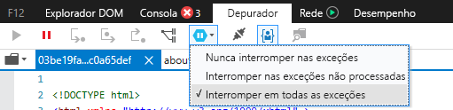
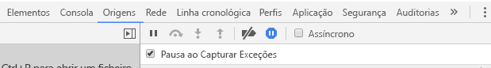

# <a name="how-to-debug-power-bi-visuals"></a>Como depurar elementos visuais do Power BI

Esta página mostra algumas sugestões para depurar enquanto cria o elemento visual. Inclui passos básicos e mostra as diferenças entre as aplicações de front-end padrão e a depuração do elemento visual do Power BI.
Depois de ler o artigo, conseguirá depurar elementos visuais do Power BI com pontos de interrupção, bem como registar e capturar exceções no Chrome e no Microsoft Edge.

## <a name="using-breakpoints"></a>Utilizar pontos de interrupção

Como o JavaScript do elemento visual é totalmente recarregado sempre que o elemento visual é atualizado, quaisquer pontos de interrupção que adicionar serão perdidos quando o elemento visual de depuração for atualizado. Como solução, utilize instruções `debugger` no código. É recomendado desativar o recarregamento automático enquanto utiliza `debugger` no código.

```typescript
public update(options: VisualUpdateOptions) {
    console.log('Visual update', options);
    debugger;
    this.target.innerHTML = `<p>Update count: <em>${(this.updateCount</em></p>`;
}
```


## <a name="showing-exceptions"></a>Mostrar exceções

Ao trabalhar no elemento visual, irá reparar que todos os erros são "consumidos" pelo serviço Power BI. Esta é uma funcionalidade intencional do Power BI para evitar que elementos visuais incorretos tornem toda a aplicação instável.

Como solução, adicione código para capturar e registar as exceções ou defina o depurador para ser interrompido ao capturar exceções.


## <a name="log-exceptions"></a>Registar exceções

Para registar exceções no elemento visual do Power BI, adicione o seguinte código ao elemento visual, para definir um decorador de registo de exceções.

```typescript
export function logExceptions(): MethodDecorator {
    return function (target: Object, propertyKey: string, descriptor: TypedPropertyDescriptor<any>): TypedPropertyDescriptor<any> {
        return {
            value: function () {
                try {
                    return descriptor.value.apply(this, arguments);
                } catch (e) {
                    console.error(e);
                    throw e;
                }
            }
        }
    }
}
```
Em seguida, pode utilizar este decorador em qualquer função para ver o registo de erros.

```typescript
@logExceptions()
public update(options: VisualUpdateOptions) {
```

## <a name="break-on-exceptions"></a>Interromper nas exceções

Também pode definir o browser para ser interrompido ao capturar exceções. Esta definição permite parar a execução de código onde quer que ocorra um erro e depurar a partir daí.

### <a name="edge"></a>Microsoft Edge

1. Abra as ferramentas de programação (F12).
2. Aceda ao **Depurador**.
3. Clique no ícone **interromper nas exceções** (hexágono com um símbolo de pausa).
4. Selecione **Interromper em todas as exceções**.



## <a name="chrome"></a>Chrome

1. Abra as ferramentas de programação (F12).
2. Aceda ao separador **Origens**.
3. Clique no ícone **interromper nas exceções** (sinal de stop com um símbolo de pausa).
4. Selecione a caixa de verificação **Pausa ao Capturar Exceções**.



## <a name="next-steps"></a>Próximos passos
* [Resolver problemas com os elementos visuais do Power BI](power-bi-custom-visuals-troubleshoot.md)
* Para obter mais informações e respostas a perguntas, veja [Perguntas frequentes sobre os elementos visuais do Power BI](power-bi-custom-visuals-faq.md#organizational-power-bi-visuals)
